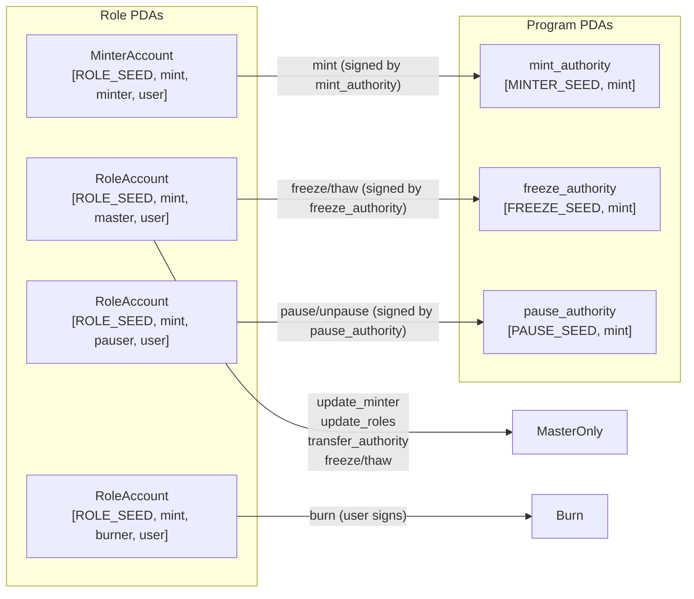

# SSS RBAC instructions and initialize extensions

## Current state

- **Program**: [programs/sss/src/lib.rs](programs/sss/src/lib.rs) exposes only `initialize`.
- **State**: [StablecoinConfig](programs/sss/src/state/config.rs), [MinterAccount](programs/sss/src/state/minter.rs) (seeds `[ROLE_SEED, mint, MINTER_ROLE, user]`), [RoleAccount](programs/sss/src/state/role.rs) (seeds `[ROLE_SEED, mint, ROLE_NAME, user]`). **MasterConfig is removed** — master is a role like the others (RoleAccount at `[ROLE_SEED, mint, MASTER_ROLE, user]`).
- **Constants**: [programs/sss/src/constants.rs](programs/sss/src/constants.rs) — add `MASTER_ROLE`; keep `ROLE_SEED`, `MINTER_SEED` (mint authority PDA), other role names. Remove `MASTER_SEED` (no MasterConfig).
- **Initialize**: [programs/sss/src/instructions/initialize.rs](programs/sss/src/instructions/initialize.rs) currently creates MasterConfig; **change** to create a **master RoleAccount** for the passed `master` pubkey instead, and remove MasterConfig. Mint still uses **mint_authority** = PDA `[MINTER_SEED, mint]`, **freeze_authority: None**, and no Pausable today; plan adds freeze authority PDA and (SSS2) Pausable.

---

## 1. Initialize changes (freeze authority + Pausable)

**Goal**: So that `freeze_account`/`thaw_account` and `pause`/`unpause` work, the mint must have a freeze authority and (for pause) the Pausable extension.

- **Freeze authority PDA**: Add `FREEZE_SEED` (e.g. `b"freeze"`) in [constants.rs](programs/sss/src/constants.rs). In initialize, create an **unchecked** PDA account with seeds `[FREEZE_SEED, mint]` (no account data; used only as signer). Pass `Some(freeze_authority_pda.key())` as `freeze_authority` in `initialize_mint` for **both** SSS1 and SSS2.
- **Pausable (SSS2 only)**: Add `PAUSE_SEED` (e.g. `b"pause"`) in constants. Before `initialize_mint` for SSS2:
  - Include `ExtensionType::Pausable` in the mint extensions list and increase mint account size accordingly.
  - CPI to Token-2022 **Pausable initialize**: mint account, pause authority = PDA `[PAUSE_SEED, mint]`. Use `spl_token_2022::extension::pausable::instruction::initialize(token_program_id, mint, authority)` and `invoke_signed` with the pause PDA (anchor-spl does not expose a Pausable CPI helper; build the instruction from `spl_token_2022::extension::pausable::instruction` and use `invoke_signed` with the pause PDA signer).
- **Initialize accounts**: Add to `Initialize`:
  - `freeze_authority: UncheckedAccount` (PDA `[FREEZE_SEED, mint]`).
  - For SSS2 only: `pause_authority: UncheckedAccount` (PDA `[PAUSE_SEED, mint]`).
- **SSS1**: No Pausable; only add freeze authority. SSS1 mints can be frozen/thawed but not paused at the Token-2022 level.
- **Remove MasterConfig**: Delete [MasterConfig](programs/sss/src/state/config.rs) and its account from initialize. Create a **master role** PDA instead: init RoleAccount at `[ROLE_SEED, mint, MASTER_ROLE, master]` (add `MASTER_ROLE` in constants). No on-program pause state — Token-2022 Pausable extension is the source of truth for pause.

**Reference**: Pausable init must run **before** `initialize_mint` (Solana docs). Order in SSS2: create_account(mint) → metadata pointer init → token_metadata init → **pausable init** → initialize_mint (with freeze_authority = freeze_authority_pda).

---

## 2. Instruction layout and authority checks

- **Master-only**: Signer must have **master role** — RoleAccount PDA exists at `[ROLE_SEED, mint, MASTER_ROLE, signer]`. Same pattern as other roles; no MasterConfig.
- **Role-gated**: Require the role PDA exists for the signer. For **minter**, use **MinterAccount** PDA and quota logic; for burner/pauser/blacklister/seizer/master use **RoleAccount**.
- **Freeze/Thaw**: Require master role (master RoleAccount PDA for signer); CPI with **freeze_authority** PDA as signer (`CpiContext::new_with_signer(..., freeze_authority_seeds)`).
- **Pause/Unpause**: Require **pauser** role; CPI with **pause_authority** PDA as signer. No on-program pause state — Token-2022 Pausable extension is the only source of truth.

---

## 3. Instructions to implement

### 3.1 Mint

- **File**: `programs/sss/src/instructions/mint.rs`.
- **Accounts**: mint, token account (destination), minter_account (MinterAccount PDA for signer), mint_authority (PDA `[MINTER_SEED, mint]`), token_program.
- **Params**: `amount: u64`.
- **Checks**: Signer has MinterAccount PDA; `minter_account.minted + amount <= minter_account.allowance`. Pause is enforced by Token-2022 when Pausable is present (no on-program check).
- **CPI**: `anchor_spl::token_2022::mint_to` with `CpiContext::new_with_signer(token_program, MintTo { mint, to, authority: mint_authority }, &[mint_authority_seeds])`.
- **State**: Increment `minter_account.minted += amount`.

### 3.2 Burn

- **File**: `programs/sss/src/instructions/burn.rs`.
- **Accounts**: mint, token account (source), burner (signer), burner_role (RoleAccount PDA `[ROLE_SEED, mint, BURNER_ROLE, burner]`), token_program.
- **Params**: `amount: u64`.
- **Checks**: Burner role PDA exists. Pause enforced by Token-2022.
- **CPI**: `anchor_spl::token_2022::burn` with authority = burner (user signs). Use `CpiContext::new(token_program, Burn { mint, from, authority: burner })`.

### 3.3 Freeze_account

- **File**: `programs/sss/src/instructions/freeze_account.rs`.
- **Accounts**: mint, token account to freeze (from params `account: Pubkey`), master (signer), master_role (RoleAccount PDA `[ROLE_SEED, mint, MASTER_ROLE, master]`), freeze_authority (PDA `[FREEZE_SEED, mint]`), token_program.
- **Params**: `account: Pubkey` (the token account to freeze).
- **Checks**: Master role PDA exists for signer.
- **CPI**: `anchor_spl::token_2022::freeze_account(CpiContext::new_with_signer(..., FreezeAccount { account, mint, authority: freeze_authority }, &[freeze_authority_seeds]))`.

### 3.4 Thaw_account

- Same as freeze_account but CPI `thaw_account`. File: `programs/sss/src/instructions/thaw_account.rs` 
  ```mermaid
  flowchart LR
    subgraph pdas [Program PDAs]
      MintAuth["mint_authority\n[MINTER_SEED, mint]"]
      FreezeAuth["freeze_authority\n[FREEZE_SEED, mint]"]
      PauseAuth["pause_authority\n[PAUSE_SEED, mint]"]
    end
    subgraph roles [Role PDAs]
      MasterRole["RoleAccount\n[ROLE_SEED, mint, master, user]"]
      MinterRole["MinterAccount\n[ROLE_SEED, mint, minter, user]"]
      BurnerRole["RoleAccount\n[ROLE_SEED, mint, burner, user]"]
      PauserRole["RoleAccount\n[ROLE_SEED, mint, pauser, user]"]
    end
    MasterRole -->|"update_minter\nupdate_roles\ntransfer_authority\nfreeze/thaw"| MasterOnly
    MasterRole -->|"freeze/thaw (signed by freeze_authority)"| FreezeAuth
    MinterRole -->|"mint (signed by mint_authority)"| MintAuth
    BurnerRole -->|"burn (user signs)"| Burn
    PauserRole -->|"pause/unpause (signed by pause_authority)"| PauseAuth
  ```


### 3.5 Pause

- **File**: `programs/sss/src/instructions/pause.rs`.
- **Accounts**: mint, pauser (signer), pauser_role (RoleAccount PDA `[ROLE_SEED, mint, PAUSER_ROLE, pauser]`), pause_authority (PDA `[PAUSE_SEED, mint]`), token_program.
- **Checks**: Pauser role PDA exists; mint has Pausable (SSS2 mints after init change).
- **CPI**: Build Token-2022 Pausable `pause` via `spl_token_2022::extension::pausable::instruction::pause` and `invoke_signed` with pause_authority signer (no anchor_spl wrapper). No on-program pause state.

### 3.6 Unpause

- Same pattern as pause; CPI Pausable `resume` with pause_authority signer.

### 3.7 Update_minter

- **File**: `programs/sss/src/instructions/update_minter.rs`.
- **Accounts**: master (signer), master_role (RoleAccount PDA for master), mint, (optional) existing_minter_account to close (MinterAccount PDA for old minter), new_minter_account (MinterAccount PDA for `new_minter`), system_program.
- **Params**: `new_minter: Pubkey`, `new_allowance: u64` (recommended so the ix is self-contained).
- **Checks**: Master role PDA exists for signer.
- **Logic**: If old minter account passed and exists, close it. Init new MinterAccount at `[ROLE_SEED, mint, MINTER_ROLE, new_minter]` with `allowance = new_allowance`, `minted = 0`. Payer = master.

### 3.8 Update_roles

- **File**: `programs/sss/src/instructions/update_roles.rs`.
- **Params**: `roles: Vec<UpdateRole>`. Define `UpdateRole { role: String, old_key: Option<Pubkey>, new_key: Pubkey }` (and for minter role, add `allowance: u64`).
- **Checks**: Master role PDA exists for signer.
- **Logic**: For each item: if `old_key` is Some, close PDA `[ROLE_SEED, mint, role.as_bytes(), old_key]` (RoleAccount or MinterAccount). Then create PDA for new_key: if role == "minter", init MinterAccount with allowance; else init RoleAccount. Validate `role` against allowed role names (master, minter, burner, pauser, blacklister, seizer).
- **Accounts**: Master, master_role, mint, and remaining_accounts for each (old role PDA, new role PDA) as needed.

### 3.9 Transfer_authority

- **File**: `programs/sss/src/instructions/transfer_authority.rs`.
- **Accounts**: master (signer), master_role (RoleAccount PDA `[ROLE_SEED, mint, MASTER_ROLE, master]`), new_master_role (RoleAccount PDA `[ROLE_SEED, mint, MASTER_ROLE, new_master]`), mint, system_program.
- **Params**: `new_master: Pubkey`.
- **Checks**: Master role PDA exists for signer.
- **Logic**: Close current master's RoleAccount (master_role); init RoleAccount for new_master at new_master_role. No config to update — "who is master" is solely "who has the master role PDA".

---

## 4. Shared helpers and errors

- **Errors**: Add in [error.rs](programs/sss/src/error.rs) as needed (e.g. `RoleNotFound`, `InvalidRole`, `MintNotPausable`).
- **Role validation**: Helper that maps string to `&[u8]` and checks role is one of master, minter, burner, pauser, blacklister, seizer. For "minter" use MinterAccount; others (including master) use RoleAccount.
- **Pause**: No on-program check; Token-2022 Pausable extension enforces pause for mint/burn/transfer when present.

---

## 5. CPI style (direct CpiContext)

- Use **anchor_spl** CPI functions that take `CpiContext` where they exist: `mint_to`, `burn`, `freeze_account`, `thaw_account` (all in `anchor_spl::token_2022`; token_interface re-exports from token_2022). Use `CpiContext::new` or `CpiContext::new_with_signer` with the appropriate account structs (MintTo, Burn, FreezeAccount, ThawAccount).
- For **Pausable** pause/resume, anchor-spl has no wrapper; use `spl_token_2022::extension::pausable::instruction::pause`/`resume` and `program::invoke_signed` with the pause_authority PDA.

---

## 6. Lib and module wiring

- In [programs/sss/src/instructions/mod.rs](programs/sss/src/instructions/mod.rs): add `pub mod mint; pub mod burn; pub mod freeze_account; pub mod thaw_account; pub mod pause; pub mod unpause; pub mod update_minter; pub mod update_roles; pub mod transfer_authority;` and re-export the structs/handlers.
- In [programs/sss/src/lib.rs](programs/sss/src/lib.rs): add one `pub fn` per instruction and delegate to the corresponding handler.

---

## 7. Optional: IDL and tests

- Add/expand tests in `tests/sss.ts` for each new instruction (mint with quota, burn, freeze/thaw, pause/unpause, update_minter, update_roles, transfer_authority).
- Update [tests/helpers/pda.ts](tests/helpers/pda.ts) for any new PDAs (freeze_authority, pause_authority) and role helpers.

---

## 8. Diagram (authority flow)




---

## 9. Dependency note

- **spl-token-2022**: Ensure version in use (e.g. 8.x) exposes `extension::pausable::instruction`. Your Cargo.lock shows spl-token-2022 8.0.1; anchor-spl 0.32.1 depends on it, so the Pausable instruction builders should be available via `spl_token_2022::extension::pausable::instruction`.

---

## 10. Summary checklist


| Item               | Action                                                                                                                                                                                                         |
| ------------------ | -------------------------------------------------------------------------------------------------------------------------------------------------------------------------------------------------------------- |
| State              | **Remove MasterConfig** from [state/config.rs](programs/sss/src/state/config.rs) and state/mod.rs                                                                                                              |
| Constants          | Add `FREEZE_SEED`, `PAUSE_SEED`, `MASTER_ROLE`; remove `MASTER_SEED`                                                                                                                                           |
| Initialize         | Remove master_config; create master **RoleAccount** at [ROLE_SEED, mint, MASTER_ROLE, master]; add freeze_authority PDA; for SSS2 add Pausable + pause_authority PDA; pass freeze_authority to initialize_mint |
| mint               | New module; minter role + quota; CPI mint_to with mint_authority signer                                                                                                                                        |
| burn               | New module; burner role; CPI burn with user signer                                                                                                                                                             |
| freeze_account     | New module; master **role**; CPI freeze_account with freeze_authority signer                                                                                                                                   |
| thaw_account       | New module; master **role**; CPI thaw_account with freeze_authority signer                                                                                                                                     |
| pause              | New module; pauser role; invoke_signed Pausable pause with pause_authority signer                                                                                                                              |
| unpause            | New module; pauser role; invoke_signed Pausable resume                                                                                                                                                         |
| update_minter      | New module; master **role**; close old MinterAccount (optional), init new one                                                                                                                                  |
| update_roles       | New module; master **role**; close old role PDAs, init new (include master in allowed roles)                                                                                                                   |
| transfer_authority | New module; master **role**; close current master RoleAccount, init RoleAccount for new_master                                                                                                                 |
| lib.rs + mod.rs    | Wire all instructions and exports                                                                                                                                                                              |


