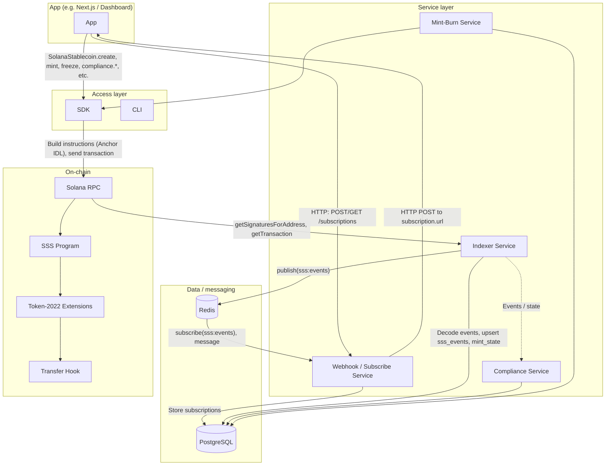
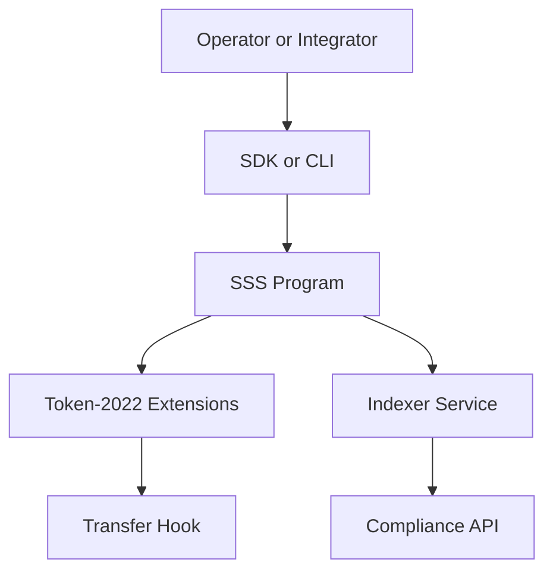

# Architecture

## Layer Model

- **On-chain layer**: `programs/sss` and `programs/transfer_hook`.
- **Access layer**: `sdk` and `cli`.
- **Service layer**: `services/indexer`, `services/compliance`, `services/mint-burn`, `services/webhook`.
- **Ops/testing layer**: Anchor tests, CLI tests, SDK tests, Trident fuzzing.

## Program, SDK, Services, and App — Relationship Overview

The system has four main parts: the **Solana program** (on-chain), the **SDK** (client library), backend **services** (indexer, webhook/subscribe, compliance, mint-burn), and the **App** (e.g. Next.js dashboard). The App uses the **SDK** to perform on-chain actions (mint, burn, freeze, compliance, etc.) by sending **program instructions** via Solana RPC. Separately, the App talks to the **webhook (subscribe) service** to register subscriptions; that service uses **Redis** as a pub/sub bus to receive event notifications published by the **indexer**, then delivers them to the App’s callback URLs.

### End-to-end flows (detailed)

1. **App → SDK → Program (on-chain actions)**  
   The App uses the SDK (e.g. `@stbr/sss-token`). The SDK builds **program instructions** from the Anchor IDL (`programs.methods.mintTokens(...).accountsStrict(...)` etc.), signs and sends transactions via **Solana RPC**. The **SSS program** (and Token-2022 / transfer-hook) execute on-chain and emit events in logs / CPI.

2. **App → Webhook (subscribe) service (subscriptions)**  
   The App talks to the **webhook service** over HTTP: create/update/list subscriptions (`POST/GET /subscriptions`), optional filters (`eventTypes`, `mintFilter`), and a callback `url`. The webhook service stores these in **PostgreSQL**.

3. **Indexer → Redis (event notifications)**  
   The **indexer** polls Solana for transactions targeting the SSS program, decodes events (from logs or CPI), persists them in **PostgreSQL** (`sss_events`, `mint_state`), then **publishes** each processed event to the Redis channel **`sss:events`** (payload: `eventId`, `eventType`, `mint`, `slot`, `signature`, `payload`).

4. **Webhook service ↔ Redis (subscribe) → App (notifications)**  
   The **webhook service** **subscribes** to the same Redis channel `sss:events`. When a message is received, it finds matching subscriptions (by `eventType` and `mintFilter`), creates delivery records, and the **dispatcher** sends **HTTP POST** requests to each subscription’s `url` (e.g. the App’s callback endpoint). Thus the App receives **notifications** for on-chain events without polling.

### Summary table

| From       | To            | Mechanism |
|-----------|----------------|-----------|
| App       | Webhook service| HTTP API (subscriptions, deliveries) |
| App       | SDK            | In-process calls (create, mint, freeze, compliance, etc.) |
| SDK       | Program        | Solana RPC (transactions built from program instructions) |
| Indexer   | Redis          | Publish to channel `sss:events` |
| Webhook   | Redis          | Subscribe to `sss:events` |
| Webhook   | App            | HTTP POST to subscription callback URLs |

## Data Flows (original)

1. Operator or integrator submits instruction via SDK/CLI.
2. SSS program validates role/account constraints and writes state.
3. Token-2022 extension logic enforces freeze/pause/delegate behavior.
4. Optional transfer-hook program validates blacklist constraints on transfer.
5. Indexer and compliance services decode events and build audit-facing APIs.

## Security Model

- **Role-gated admin actions** via PDAs (`master`, `minter`, `burner`, `pauser`, `blacklister`, `seizer`).
- **Preset-driven capability boundary**:
  - SSS-1: no compliance-only operations.
  - SSS-2: compliance and enforcement operations enabled.
- **Token-2022 extensions** back critical controls (`Pausable`, `PermanentDelegate`, transfer-hook).
- **Auditability** through emitted events decoded by backend services.
