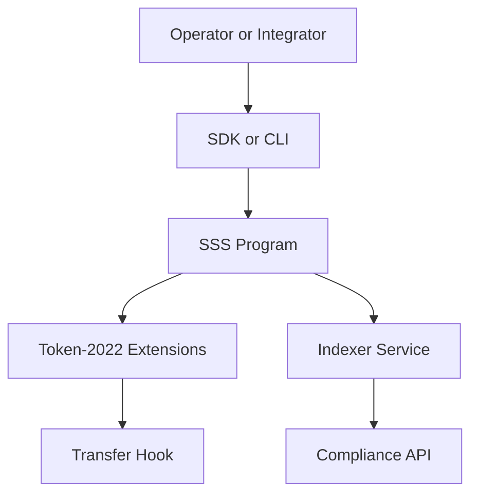

# Architecture

## Layer Model

- **On-chain layer**: `programs/sss` and `programs/transfer_hook`.
- **Access layer**: `sdk` and `cli`.
- **Service layer**: `services/indexer`, `services/compliance`, `services/mint-burn`, `services/webhook`.
- **Ops/testing layer**: Anchor tests, CLI tests, SDK tests, Trident fuzzing.

## Data Flows

1. Operator or integrator submits instruction via SDK/CLI.
2. SSS program validates role/account constraints and writes state.
3. Token-2022 extension logic enforces freeze/pause/delegate behavior.
4. Optional transfer-hook program validates blacklist constraints on transfer.
5. Indexer and compliance services decode events and build audit-facing APIs.

## Security Model

- **Role-gated admin actions** via PDAs (`master`, `minter`, `burner`, `pauser`, `blacklister`, `seizer`).
- **Preset-driven capability boundary**:
  - SSS-1: no compliance-only operations.
  - SSS-2: compliance and enforcement operations enabled.
- **Token-2022 extensions** back critical controls (`Pausable`, `PermanentDelegate`, transfer-hook).
- **Auditability** through emitted events decoded by backend services.
