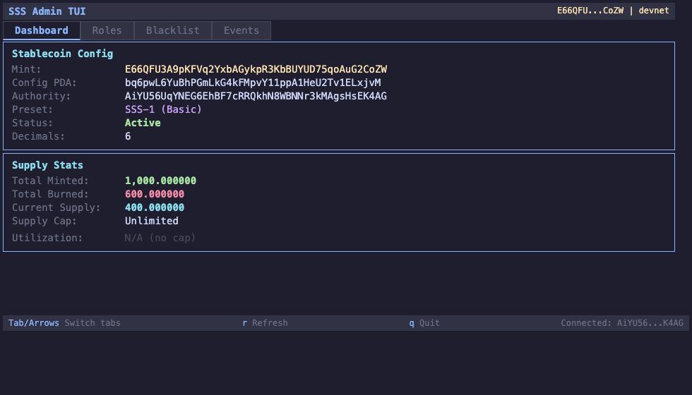
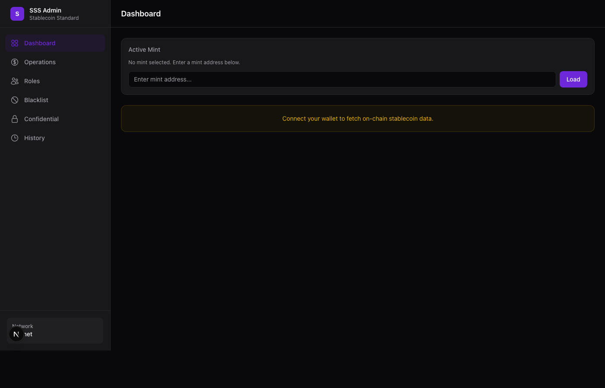
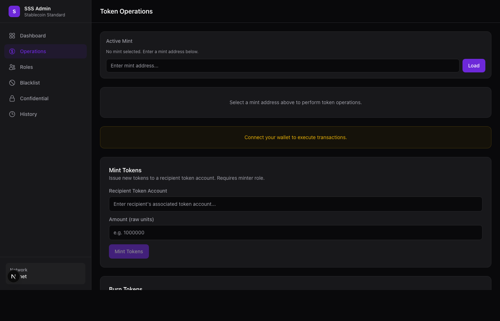
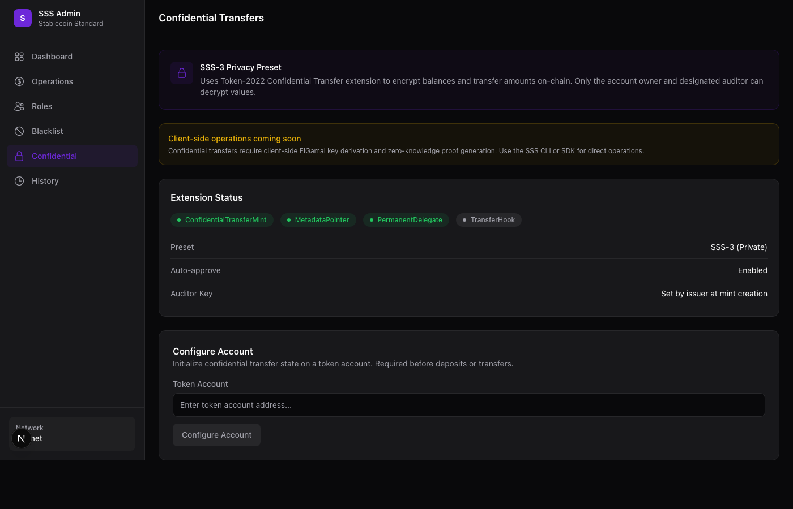

<div align="center">

<pre>
███████╗███████╗███████╗
██╔════╝██╔════╝██╔════╝
███████╗███████╗███████╗
╚════██║╚════██║╚════██║
███████║███████║███████║
╚══════╝╚══════╝╚══════╝
</pre>

# Solana Stablecoin Standard

**Production-grade framework for issuing regulated stablecoins on Solana with Token-2022**

*3 presets · 7 roles · Transfer hook blacklists · Confidential transfers · Oracle supply caps · Per-minter quotas · Full toolchain*

[](https://github.com/solanabr/solana-stablecoin-standard/actions/workflows/ci.yml)
[](LICENSE)
[](https://www.anchor-lang.com/)
[](https://spl.solana.com/token-2022)
[](#-test-suite)
[](#-devnet-deployment)

</div>

---

## Table of Contents

- [Architecture](#-architecture)
- [Preset Comparison](#-preset-comparison)
- [Quick Start](#-quick-start)
- [Features](#-features)
- [Devnet Deployment](#-devnet-deployment)
- [Test Suite](#-test-suite)
- [Project Structure](#-project-structure)
- [Documentation](#-documentation)
- [Known Limitations](#-known-limitations)
- [Contributing](#-contributing)
- [License](#-license)

---

## Architecture

<div align="center">

```
                    ┌───────────────────────┐
                    │      Your App         │
                    │  (Frontend / Backend) │
                    └───────────┬───────────┘
                                │
                    ┌───────────▼───────────┐
                    │    @stbr/sss-token    │
                    │    TypeScript SDK     │
                    └──┬────────┬────────┬──┘
                       │        │        │
              ┌────────▼──┐ ┌──▼────┐ ┌─▼─────────┐
              │   SSS-1   │ │ SSS-2 │ │   SSS-3    │
              │  Minimal  │ │Comply │ │  Private   │
              └────┬──────┘ └──┬────┘ └──┬─────────┘
                   │           │         │
             ┌─────▼─────┐    │    ┌────▼──────────┐
             │  sss-core  │   │    │   sss-core     │
             │  (Anchor)  │   │    │ + Confidential │
             └────────────┘   │    │   Transfers    │
                              │    └───────────────┘
                       ┌──────▼──────┐
                       │  sss-core   │
                       │ + transfer  │
                       │    hook     │
                       └─────────────┘
```

**Three-layer composable design:**

| Layer | Description |
|-------|-------------|
| **Layer 3 — Presets** | SSS-1 (Minimal), SSS-2 (Compliant), SSS-3 (Private) |
| **Layer 2 — Modules** | Compliance (hooks + blacklist) · Privacy (confidential transfers) |
| **Layer 1 — Base SDK** | SolanaStablecoin class · Instruction builders · PDA derivers · Oracle |
| **On-chain** | `sss-core` + `sss-transfer-hook` (Anchor programs on Token-2022) |

</div>

---

## Preset Comparison

| Feature | SSS-1 (Minimal) | SSS-2 (Compliant) | SSS-3 (Private) |
|---------|:---:|:---:|:---:|
| Mint / Burn | ✅ | ✅ | ✅ |
| Freeze / Thaw | ✅ | ✅ | ✅ |
| Pause / Unpause | ✅ | ✅ | ✅ |
| Seize (permanent delegate) | ✅ | ✅ | ✅ |
| Role-based access (7 roles) | ✅ | ✅ | ✅ |
| On-chain metadata | ✅ | ✅ | ✅ |
| Supply cap + per-minter quotas | ✅ | ✅ | ✅ |
| Transfer hook (blacklist) | — | ✅ | — |
| Default frozen accounts | — | ✅ | — |
| Confidential transfers | — | — | ✅ |
| Auditor key (regulatory) | — | — | ✅ |
| **Use case** | *Internal tokens, DAO treasuries* | *Regulated stablecoins (USDC-class)* | *Privacy-preserving currencies* |

---

## Quick Start

### Prerequisites

- [Rust](https://rustup.rs/) 1.75+ · [Solana CLI](https://docs.solanalabs.com/cli/install) 1.18+ · [Anchor](https://www.anchor-lang.com/docs/installation) 0.32+ · [Node.js](https://nodejs.org/) 20+ with pnpm

### Build & Test

```bash
git clone https://github.com/solanabr/solana-stablecoin-standard.git
cd solana-stablecoin-standard
pnpm install

anchor build          # Build Anchor programs
anchor test           # 97 integration tests
pnpm test:sdk         # 90 SDK unit tests
cargo test            # 16 Rust unit + fuzz tests
```

### TypeScript SDK

```typescript
import { SolanaStablecoin, Presets } from "@stbr/sss-token";
import { AnchorProvider } from "@coral-xyz/anchor";

const provider = AnchorProvider.env();

// Create an SSS-2 compliant stablecoin
const stable = await SolanaStablecoin.create(provider, {
  preset: Presets.SSS_2,
  name: "My Stablecoin",
  symbol: "MUSD",
  decimals: 6,
});

// Or create with custom extensions (preset inferred automatically)
const custom = await SolanaStablecoin.create(provider, {
  name: "Custom Stable",
  symbol: "CUSD",
  extensions: { permanentDelegate: true, transferHook: false },
});

// Token operations
await stable.roles.grant(minterWallet.publicKey, "minter");
await stable.mint({ recipient: recipientTokenAccount, amount: 1_000_000n });
const supply = await stable.getTotalSupply();

// Compliance (SSS-2)
await stable.compliance.blacklistAdd(address, "Sanctions match");
await stable.compliance.seize(frozenAccount, treasury, amount);
```

### CLI

```bash
cargo build --release --bin sss-token

sss-token init --preset sss-2 --name "Regulated USD" --symbol "rUSD" --decimals 6
sss-token mint --mint <MINT> --to <TOKEN_ACCOUNT> --amount 1000000
sss-token status --mint <MINT>
sss-token supply --mint <MINT>
sss-token blacklist add --mint <MINT> --address <ADDR> --reason "OFAC match"
sss-token minters list --mint <MINT>
sss-token holders --mint <MINT> --min-balance 1000
sss-token audit-log --mint <MINT> --action mint
```

### Docker (Backend)

```bash
# Configure environment
cp backend/.env.example .env
# Edit .env with your RPC URL, keypair path, and API key

docker compose up    # Backend with health check at :3000/health
```

---

## Features

### On-Chain Programs

| Program | Description | Program ID |
|---------|-------------|------------|
| **sss-core** | Universal stablecoin management — roles, supply caps, pause, seize | `Corep3pXJzUGaqpw2xzWQi4q63cn1STABiCDMJhMECB` |
| **sss-transfer-hook** | Token-2022 transfer hook — blacklist enforcement per transfer | `hookXMsC9txN6T8hyS9GCyubBL4nvp9XPWg5wW3z3pH` |

**StablecoinConfig** stores per-mint: name, symbol, uri, decimals, preset, supply_cap, total_minted, total_burned, is_paused, enable_permanent_delegate, enable_transfer_hook, default_account_frozen.

### Role System (7 roles, PDA-per-role-per-address)

| Role | ID | Permissions |
|------|:---:|------------|
| Admin | 0 | Grant/revoke roles, update config, transfer authority |
| Minter | 1 | Mint tokens (with optional per-minter quota) |
| Freezer | 2 | Freeze/thaw token accounts |
| Pauser | 3 | Pause/unpause all operations |
| Burner | 4 | Burn tokens from any account (via permanent delegate) |
| Blacklister | 5 | Add/remove addresses from transfer blacklist |
| Seizer | 6 | Seize tokens from any account to treasury |

### TypeScript SDK (`@stbr/sss-token`)

- **57 exports** — SolanaStablecoin class (SSS alias), Presets constant, 16 instruction builders, 3 PDA derivers, 3 preset creators, oracle functions, error codes, type maps
- Preset-based **and** custom extensions creation via unified `create()` API
- Full token lifecycle — mint, burn, freeze, thaw, pause, unpause, seize
- Compliance namespace — `compliance.blacklistAdd()`, `compliance.seize()`, `getTotalSupply()`
- Confidential transfer support for SSS-3 (deposit, apply pending)
- Typed error handling with Anchor error mapping

### Rust CLI (`sss-token`)

- **20 subcommands** covering all stablecoin operations
- `init --preset` or `init --custom config.toml` for reproducible deployments
- `minters list/add/remove` — dedicated minter management
- `holders`, `audit-log`, `status`, `supply` — monitoring and auditing
- Environment variable support for RPC URL and keypair

### Backend Services (Express, Docker-ready)

- **REST API** for all stablecoin operations with API key auth + rate limiting (30 req/min)
- **Event listener** — WebSocket subscription to both programs, parses on-chain events
- **Webhook service** — configurable notifications with exponential backoff retry
- **Compliance service** — sanctions screening integration point, audit trail
- **Health check** — `GET /health` with Solana connection status
- **Structured logging** — Winston with configurable levels
- **Docker** — multi-stage build, non-root user, healthcheck, `docker compose up`

### Bonus Features

| Feature | Description |
|---------|-------------|
| **SSS-3 Private Stablecoin** | Token-2022 ConfidentialTransfer + auditor key + scoped allowlists (documented as PoC) |
| **Oracle Integration** | Pyth price feeds for USD-denominated supply caps (`parsePythPrice`, `usdToTokenAmount`) |
| **Interactive Admin TUI** | ratatui terminal dashboard for real-time monitoring |
| **Example Frontend** | Next.js 15 scaffold for stablecoin creation and management |

#### TUI Dashboard (ratatui)

Real-time terminal dashboard for monitoring stablecoin config, supply stats, roles, and events.



```bash
cargo run --bin sss-tui <MINT_ADDRESS> --rpc-url https://api.devnet.solana.com
```

#### Frontend Admin Panel (Next.js 15)

Web-based admin interface with wallet integration for all stablecoin operations.

| Dashboard | Operations | Confidential Transfers |
|:-:|:-:|:-:|
|  |  |  |

```bash
cd frontend && pnpm dev    # http://localhost:3000
```

---

## Devnet Deployment

Both programs deployed and verified on devnet with 22 example transactions across all 3 presets.

| Program | Address | Status |
|---------|---------|--------|
| sss-core | `Corep3pXJzUGaqpw2xzWQi4q63cn1STABiCDMJhMECB` | Deployed |
| sss-transfer-hook | `hookXMsC9txN6T8hyS9GCyubBL4nvp9XPWg5wW3z3pH` | Deployed |

Full deployment proof with real transaction signatures in [`deployments/devnet-proof.json`](deployments/devnet-proof.json):

- **SSS-1**: 8 txs (init, grant minter, mint, burn, freeze, thaw, pause, unpause)
- **SSS-2**: 11 txs (init, grant roles, thaw, mint, burn, blacklist add/remove, pause, unpause)
- **SSS-3**: 3 txs (confidential operations)

---

## Test Suite

**203 tests, all passing.**

| Suite | Count | What's Covered |
|-------|:-----:|----------------|
| Integration (`anchor test`) | 97 | All 14 instruction paths, error cases, role boundaries, oracle caps |
| SDK unit (`vitest`) | 90 | PDA derivation, errors, types, oracle, barrel exports, client class |
| Rust unit + fuzz (`cargo test`) | 16 | Config logic, supply arithmetic, role escalation, pause bypass |
| **Total** | **203** | |

SDK unit test breakdown: `pda.test.ts` (13) · `errors.test.ts` (12) · `types.test.ts` (7) · `oracle.test.ts` (14) · `exports.test.ts` (39) · `client.test.ts` (5)

---

## Project Structure

```
solana-stablecoin-standard/
  programs/
    sss-core/                # Core stablecoin program (Anchor)
    sss-transfer-hook/       # Transfer hook program (Anchor)
  sdk/                       # TypeScript SDK (@stbr/sss-token)
  cli/                       # Rust CLI (sss-token)
  backend/                   # Express REST API + event listener + webhooks
  tui/                       # ratatui terminal UI
  frontend/                  # Next.js 15 frontend
  tests/                     # Integration tests
  trident-tests/             # Property-based fuzz tests (proptest)
  deployments/               # Devnet deployment proof
  docs/                      # Documentation (10 files)
```

---

## Documentation

| Document | Description |
|----------|-------------|
| [Architecture](docs/ARCHITECTURE.md) | 3-layer model, PDA derivation, data flows, security model |
| [SDK Reference](docs/SDK.md) | Presets, custom configs, custom extensions, TypeScript API |
| [CLI Reference](docs/CLI.md) | All 20 subcommands with examples |
| [API Reference](docs/API.md) | Backend REST endpoints, auth, rate limiting |
| [SSS-1 Spec](docs/SSS-1.md) | Minimal preset — internal tokens, DAO treasuries |
| [SSS-2 Spec](docs/SSS-2.md) | Compliant preset — regulated stablecoins |
| [SSS-3 Spec](docs/SSS-3.md) | Private preset — confidential transfers + auditor key |
| [Operations](docs/OPERATIONS.md) | Operator runbook, emergency procedures |
| [Security](docs/SECURITY.md) | Threat model, access control matrix |
| [Compliance](docs/COMPLIANCE.md) | Regulatory considerations, audit trail format |

---

## Known Limitations

### SSS-2: Seize via permanent delegate

The `seize` instruction uses Token-2022's `TransferChecked` CPI with the config PDA as permanent delegate. On SSS-2 mints, the transfer hook requires extra accounts (blacklist PDA, hook program) that cannot be forwarded through the `TransferChecked` CPI. This is a Token-2022 design constraint.

**Workaround:** Freeze + admin-coordinated manual transfer flow. Affects SSS-2 only — SSS-1 and SSS-3 seize works correctly.

### Admin role revocation

The `LastAdmin` protection prevents self-revocation (which would brick the config). However, Admin A can revoke Admin B's role even if B is the only other admin. By design — counting total admins on-chain would add complexity. Recommended: maintain 2+ admins, use a multisig for the primary admin key.

---

## Contributing

Contributions welcome. Please:

1. Fork the repository
2. Create a feature branch (`feat/your-feature`)
3. Write tests for new functionality
4. Ensure all 203 tests pass (`anchor test && pnpm test:sdk && cargo test`)
5. Submit a pull request

---

## License

MIT — see [LICENSE](LICENSE).
