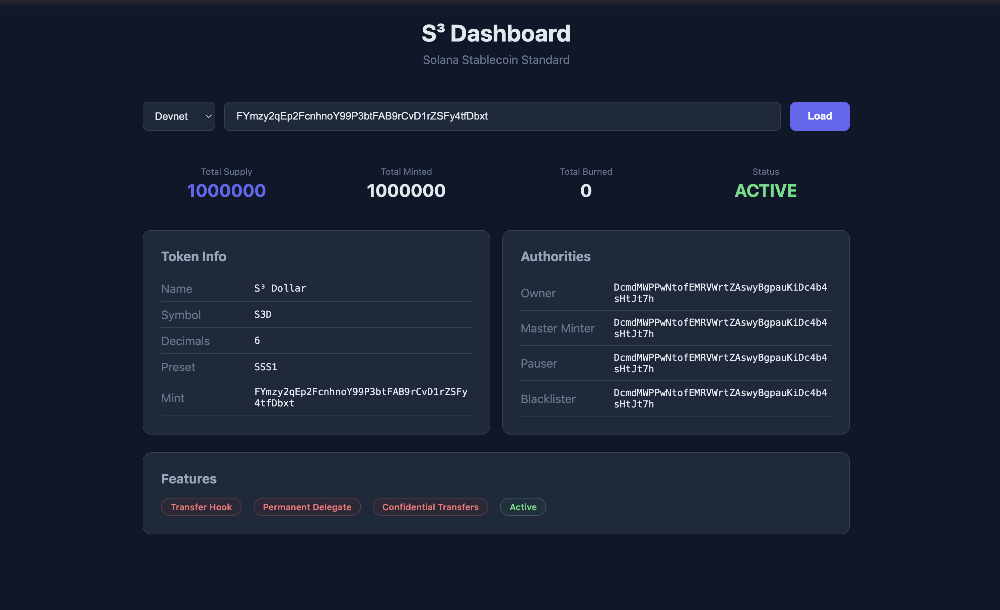
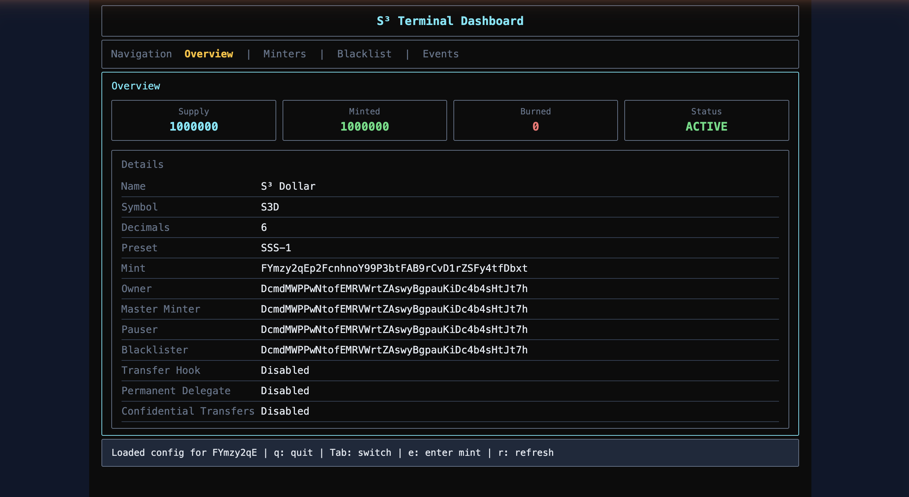

# S³ — Solana Stablecoin Standard

A comprehensive, modular stablecoin framework built on Solana's Token-2022 program with three preset tiers designed for different compliance and privacy requirements.





## Presets

| Preset | Description | Extensions |
|--------|-------------|------------|
| **S³-1** | Minimal | Metadata |
| **S³-2** | Compliant | Metadata + PermanentDelegate + TransferHook |
| **S³-3** | Private | Metadata + PermanentDelegate + ConfidentialTransfers |

## Deployed Programs (Devnet)

| Program | Address |
|---------|---------|
| **Stablecoin** | `SSSW3EixhrbB6yYpTdKmH2nCReqsA1VJqJkhwvcdzLA` |
| **Transfer Hook** | `Fi6N4Z2Xm47dRmLoDRcVAvoiQ1UnT2WcuzvwjXvcB8mu` |

## Features

- Configurable presets with automatic Token-2022 extension setup
- Per-minter allowance-based minting
- Global pause/unpause
- Individual account freeze/thaw
- Per-address blacklisting with transfer hook enforcement (S³-2)
- Asset seizure via permanent delegate (S³-2)
- Confidential transfers with auditor support (S³-3)
- Two-step ownership transfer
- Role-based access control
- Full on-chain audit trail via events

## Quick Start

### Prerequisites

- [Rust](https://rustup.rs/) (1.75+)
- [Solana CLI](https://docs.solanalabs.com/cli/install) (1.18+)
- [Anchor CLI](https://www.anchor-lang.com/docs/installation) (0.31.1)
- [Node.js](https://nodejs.org/) (18+)
- [Yarn](https://yarnpkg.com/)

### Clone and Build

```bash
# Clone the repository
git clone https://github.com/Alfaxad/solana-stablecoin-standard.git
cd solana-stablecoin-standard

# Install dependencies
yarn install

# Build the programs
anchor build

# Run tests (19 integration tests)
anchor test
```

### Deploy to Devnet

```bash
# Configure Solana CLI for devnet
solana config set --url devnet

# Airdrop SOL for deployment
solana airdrop 5

# Deploy both programs
anchor deploy --provider.cluster devnet
```

### Run the Dashboard

```bash
# Install dashboard dependencies
cd app && npm install

# Start the Next.js dev server
npm run dev
```

Then open [http://localhost:3000](http://localhost:3000) and enter a mint address to inspect.

### Run the TUI

```bash
cd modules/tui
cargo run
```

### Run the CLI

```bash
cd clients/cli && npm install && npm run build

# Initialize an S³-2 stablecoin
npx sss-token init --preset sss-2 --name "MyUSD" --symbol "MUSD" --decimals 6

# Mint tokens
npx sss-token mint <recipient> 1000000 --mint <mint-address>

# View configuration
npx sss-token info --mint <mint-address>
```

## Project Structure

```
programs/
  stablecoin/              # Main stablecoin program (Anchor)
  transfer-hook/           # Transfer hook for S³-2 compliance
clients/
  js/                      # TypeScript SDK
  cli/                     # CLI tool
tests/                     # Integration tests (19 tests)
app/                       # Next.js web dashboard
modules/
  backend/                 # Indexer (Express + BullMQ + PostgreSQL)
  oracle/                  # Switchboard price feed & depeg monitor
  tui/                     # Ratatui terminal dashboard
trident-tests/             # Fuzz tests (Trident / Honggfuzz)
docs/                      # Documentation
scripts/                   # Devnet test scripts
```

## SDK Usage

```typescript
import { SolanaStablecoin, Presets } from "@stbr/sss-sdk";

const { stablecoin } = await SolanaStablecoin.create(program, {
  preset: Presets.SSS_2,
  name: "MyUSD",
  symbol: "MUSD",
  decimals: 6,
  authority: ownerKeypair,
  masterMinter: masterMinterPubkey,
  pauser: pauserPubkey,
  blacklister: blacklisterPubkey,
});

await stablecoin.mintTo({ recipient, amount: 1_000_000n, minter });
```

## Documentation

- [Architecture](docs/ARCHITECTURE.md)
- [S³-1 Preset](docs/SSS-1.md)
- [S³-2 Preset](docs/SSS-2.md)
- [S³-3 Preset](docs/SSS-3.md)
- [SDK Reference](docs/SDK.md)
- [API Reference](docs/API.md)
- [Operations Guide](docs/OPERATIONS.md)
- [Compliance Guide](docs/COMPLIANCE.md)
- [Deployment](docs/DEPLOYMENT.md)

## License

MIT
