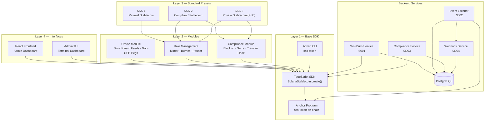

# Solana Stablecoin Standard (SSS)

> Open-source SDK and production-ready standards for stablecoin issuers on Solana.

Built by [Superteam Brazil](https://superteam.fun/). Inspired by [OpenZeppelin](https://github.com/OpenZeppelin/openzeppelin-contracts) — the SDK is the library, the standards (SSS-1, SSS-2) are what get adopted.

---

## Overview

The SSS is a three-layer system:

```
Layer 4 — Interfaces         Frontend Dashboard   Admin TUI   CLI
Layer 3 — Standard Presets   SSS-1 (Minimal)   SSS-2 (Compliant)   SSS-3 (Private, PoC)
Layer 2 — Modules            Compliance module  Oracle module  Privacy module (PoC)
Layer 1 — Base SDK           Token creation, roles, mint/burn/freeze
```

Think of it like OpenZeppelin: you pick a standard (SSS-1 or SSS-2), the SDK deploys it, and your team operates it via CLI or TypeScript.

---

## Quick Start

### Prerequisites

- Rust + Cargo
- Solana CLI >= 1.18
- Anchor >= 0.30.1
- Node.js >= 20

### Install

```bash
git clone https://github.com/solanabr/solana-stablecoin-standard
cd solana-stablecoin-standard
npm install
anchor build
```

### Deploy a Minimal Stablecoin (SSS-1)

```bash
# Initialize with SSS-1 preset
sss-token init --preset sss-1 --name "My Stablecoin" --symbol "MYUSD" --decimals 6

# Add a minter
sss-token minters add <MINTER_ADDRESS>

# Mint tokens
sss-token mint <RECIPIENT_ADDRESS> 1000000

# Check status
sss-token status
```

### Deploy a Compliant Stablecoin (SSS-2)

```bash
# Initialize with SSS-2 preset (adds permanent delegate + transfer hook)
sss-token init --preset sss-2 --name "Regulated USD" --symbol "RUSD" --decimals 6

# SSS-2 compliance operations
sss-token blacklist add <ADDRESS> --reason "OFAC match"
sss-token seize <ADDRESS> --to <TREASURY_ADDRESS>
```

### Custom Configuration

```toml
# config.toml
name = "My Custom Token"
symbol = "CUST"
decimals = 6
permanent_delegate = true
transfer_hook = false
default_account_frozen = false
```

```bash
sss-token init --custom config.toml
```

### TypeScript SDK

```typescript
import { SolanaStablecoin, Preset } from "@stbr/sss-token";

// SSS-1
const stable = await SolanaStablecoin.create({
  connection,
  preset: Preset.SSS_1,
  name: "My Stablecoin",
  symbol: "MYUSD",
  decimals: 6,
  authority: adminKeypair,
});

// SSS-2
const compliant = await SolanaStablecoin.create({
  connection,
  preset: Preset.SSS_2,
  name: "Regulated USD",
  symbol: "RUSD",
  decimals: 6,
  authority: adminKeypair,
});

// Operations
await stable.mintTokens({ recipient, amount: 1_000_000n, minter });
await compliant.compliance.blacklistAdd(address, "Sanctions match");
await compliant.compliance.seize(frozenAccount, treasury);
const supply = await stable.getTotalSupply();
```

---

## Preset Comparison

| Feature | SSS-1 Minimal | SSS-2 Compliant |
|---|---|---|
| Token-2022 Mint | ✓ | ✓ |
| Metadata | ✓ | ✓ |
| Freeze Authority | ✓ | ✓ |
| Role Management | ✓ | ✓ |
| Pause/Unpause | ✓ | ✓ |
| Per-Minter Quotas | ✓ | ✓ |
| Permanent Delegate | — | ✓ |
| Transfer Hook | — | ✓ |
| Blacklist Enforcement | — | ✓ |
| Token Seizure | — | ✓ |
| Audit Trail | — | ✓ |
| Use Case | Internal tokens, DAO treasuries | USDC/USDT-class regulated tokens |

---

## Devnet Deployment

Both programs are deployed and verified on Solana Devnet:

| Program | Program ID | Explorer |
|---|---|---|
| **sss-token** | `6NMdvUa2n4WSLPx9yz7V9edFx9VQqWr5KUDZQGPK3GDL` | [View](https://explorer.solana.com/address/6NMdvUa2n4WSLPx9yz7V9edFx9VQqWr5KUDZQGPK3GDL?cluster=devnet) |
| **transfer-hook** | `C6psRvWLQ4PyiRcx7KZw5giAhNFtTMLn2foBaToJ36V` | [View](https://explorer.solana.com/address/C6psRvWLQ4PyiRcx7KZw5giAhNFtTMLn2foBaToJ36V?cluster=devnet) |

| Item | Value |
|---|---|
| **Network** | Devnet |
| **Anchor Version** | 0.32.1 |

> Deploy your own instance: `anchor deploy --provider.cluster devnet`

---

## Architecture



See [ARCHITECTURE.md](./docs/ARCHITECTURE.md) for the full layer model, PDA layout, and security model.

---

## Bonus Features

### 🖥️ Frontend Admin Dashboard

A full React + TypeScript admin UI built with Vite, featuring wallet adapter integration, dark theme, and all SDK operations:

```bash
cd frontend
npm install
npm run dev     # http://localhost:5173
```

**Pages**: Dashboard with stats · Create Stablecoin (SSS-1/SSS-2/Custom) · Manage (pause, minters, roles) · Mint & Burn · Compliance (freeze/thaw/blacklist/seize) · Holders (search, CSV export) · Activity log

### 🔒 SSS-3 Private Stablecoin (Proof of Concept)

Confidential transfers + scoped allowlists using Token-2022's `ConfidentialTransferMint` extension with ElGamal encryption.

- Auditor key can decrypt all amounts for regulatory compliance
- KYC-gated allowlist for confidential transfer participation
- See [SSS-3.md](./docs/SSS-3.md) for the full specification

### 🔮 Oracle Integration Module

Switchboard V2 oracle feeds for non-USD pegs (EUR, BRL, CPI-indexed). The oracle module is separate from the core program — it enforces exchange rates during mint/redeem.

```
oracle_gated_mint(100 EUR) → reads EUR/USD feed → mints 108 tokens
```

See [oracle/README.md](./oracle/README.md) for supported feeds and architecture.

### 📊 Interactive Admin TUI

Terminal-based dashboard (blessed + blessed-contrib) for real-time monitoring:

```bash
cd tui
npm install
npx tsx src/index.ts --cluster devnet --mint <MINT_ADDRESS>
```

Features: supply chart, event log, operations panel (mint/burn/pause/freeze), holders table, auto-refresh + WebSocket subscriptions.

---

## Documentation

- [ARCHITECTURE.md](./docs/ARCHITECTURE.md) — Layer model, PDA layout, security model
- [SDK.md](./docs/SDK.md) — TypeScript SDK reference
- [OPERATIONS.md](./docs/OPERATIONS.md) — Operator runbook
- [SSS-1.md](./docs/SSS-1.md) — Minimal stablecoin standard spec
- [SSS-2.md](./docs/SSS-2.md) — Compliant stablecoin standard spec
- [SSS-3.md](./docs/SSS-3.md) — Private stablecoin standard spec (PoC)
- [COMPLIANCE.md](./docs/COMPLIANCE.md) — Regulatory considerations
- [API.md](./docs/API.md) — Backend service API reference

---

## Repository Structure

```
solana-stablecoin-standard/
├── programs/
│   ├── sss-token/          # Main Anchor program (SSS-1 + SSS-2)
│   ├── transfer-hook/      # SSS-2 transfer hook program
│   └── sss-3-private/      # SSS-3 confidential transfer PoC
├── oracle/                 # Switchboard oracle integration module
├── sdk/                    # @stbr/sss-token TypeScript SDK
├── cli/                    # sss-token CLI
├── frontend/               # React admin dashboard (Vite + TypeScript)
├── tui/                    # Interactive terminal admin UI (blessed)
├── services/
│   ├── mint-burn/          # Fiat-to-stablecoin lifecycle service
│   ├── event-listener/     # On-chain event indexer
│   ├── compliance/         # SSS-2 compliance service
│   └── webhook/            # Event notification service
├── tests/
│   ├── unit/               # SDK unit tests
│   └── integration/        # Full preset flow tests
└── docs/                   # All documentation
```

---

## Running Backend Services

```bash
# Copy and configure
cp .env.example .env
# Edit .env: set RPC_URL, SSS_MINT, KEYPAIR_PATH

# Start all services
docker compose up -d

# View logs
docker compose logs -f

# Health checks
curl http://localhost:3001/health   # mint-burn
curl http://localhost:3002/health   # event-listener
curl http://localhost:3003/health   # compliance (SSS-2)
curl http://localhost:3004/health   # webhook
```

---

## License

MIT — see [LICENSE](./LICENSE).