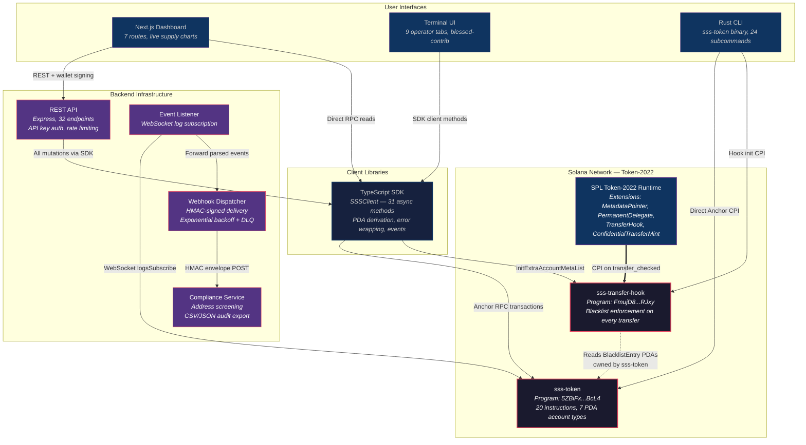
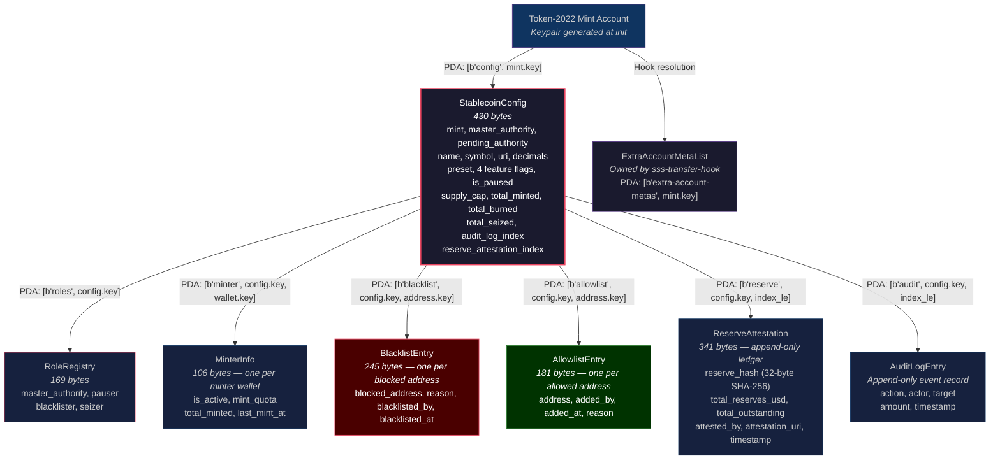
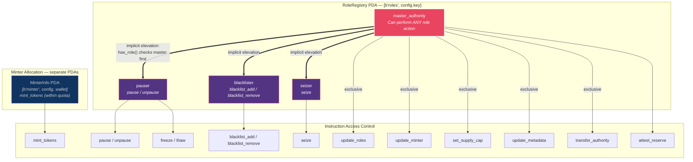
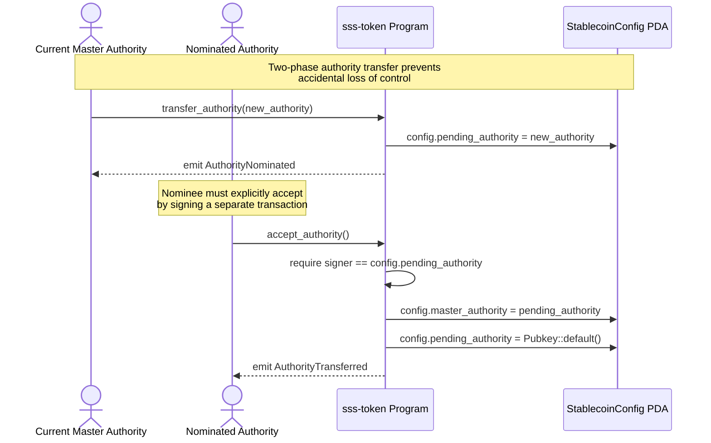
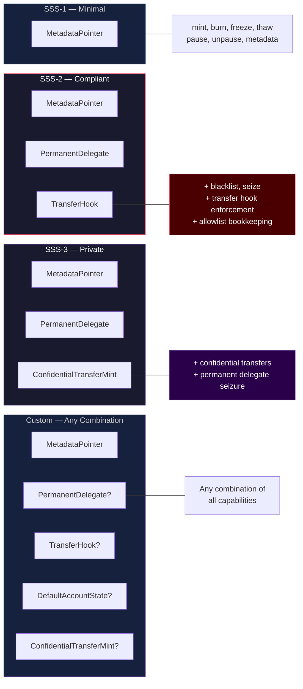
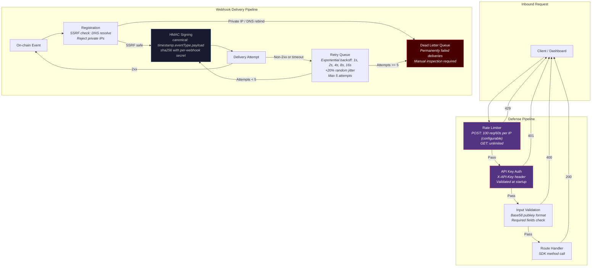

# Solana Stablecoin Standard (SSS)

<p align="center">
  <a href="https://stablecoinstandard.dev"><strong>stablecoinstandard.dev</strong></a> &nbsp;|&nbsp;
  <a href="https://docs.stablecoinstandard.dev"><strong>Documentation</strong></a> &nbsp;|&nbsp;
  <a href="https://www.npmjs.com/package/solana-stablecoin-standard"><strong>npm</strong></a> &nbsp;|&nbsp;
  <a href="https://crates.io/crates/sss-token"><strong>crates.io</strong></a>
</p>

A modular, compliance-ready stablecoin framework for Solana using Token-2022.

SSS provides a complete on-chain toolkit for issuing and managing stablecoins, from minimal single-authority tokens to fully compliant assets with transfer restrictions, blacklists, asset seizure, and GENIUS Act reserve attestations. The framework ships as two Anchor programs, a TypeScript SDK, a Rust CLI, and a Node.js interactive TUI dashboard.

<p align="center">
  
</p>

---

## Architecture

SSS is composed of two on-chain Anchor programs that work together:

| Program | Program ID | Purpose |
|---------|-----------|---------|
| **sss-token** | [`5ZBiFxX4ggWfNR5VhAQDRZauG6CvG84puS4SQiH8BcL4`](https://explorer.solana.com/address/5ZBiFxX4ggWfNR5VhAQDRZauG6CvG84puS4SQiH8BcL4?cluster=devnet) | Core stablecoin logic: mint, burn, freeze, thaw, pause, blacklist, seize, reserve attestation, role management |
| **sss-transfer-hook** | [`FmujD82V5FB6Nus7mbEV2a7cp5HG32gsiHykmtNSRJxy`](https://explorer.solana.com/address/FmujD82V5FB6Nus7mbEV2a7cp5HG32gsiHykmtNSRJxy?cluster=devnet) | Transfer hook program invoked by Token-2022 on every transfer to enforce blacklist restrictions (SSS-2 only) |

Both programs are built on **Solana Token-2022** extensions and use PDA-based state management with role-based access control.

## Technical Architecture

<details>
<summary><strong>System Architecture</strong></summary>



The system operates in four tiers. On-chain, `sss-token` owns all stablecoin state and instruction logic while `sss-transfer-hook` is invoked by the Token-2022 runtime on every `transfer_checked` call to enforce blacklist restrictions. Client-side, the TypeScript SDK wraps all program interactions into an ergonomic `SSSClient` class, while the Rust CLI communicates directly via Anchor CPI. The backend layer provides authenticated REST endpoints, real-time event ingestion via WebSocket, and HMAC-signed webhook delivery with exponential backoff and a dead letter queue.

</details>

<details>
<summary><strong>On-Chain Account Model</strong></summary>



Every account is a PDA derived from the `StablecoinConfig` address, which itself is derived from the mint public key. This creates a single root of trust: given only the mint address, every associated account can be deterministically located. The `ExtraAccountMetaList` PDA is the exception — it is owned by the transfer hook program and resolved by Token-2022 at transfer time.

```mermaid
sequenceDiagram
    actor Operator
    participant Dashboard as Next.js Dashboard
    participant SDK as SSSClient
    participant Token as sss-token Program
    participant Config as StablecoinConfig PDA
    participant MinterPDA as MinterInfo PDA
    participant Blacklist as BlacklistEntry PDA
    participant T22 as Token-2022

    Operator->>Dashboard: Click "Mint 1,000,000 USDS"
    Dashboard->>SDK: client.mint(mint, recipientAta, amount)

    Note over SDK: Auto-derives required PDAs
    SDK->>SDK: configPda = findProgramAddress([b"config", mint])
    SDK->>SDK: minterInfoPda = findProgramAddress([b"minter", config, wallet])
    SDK->>SDK: blacklistPda = findProgramAddress([b"blacklist", config, recipientOwner])

    SDK->>Token: Submit mintTokens(amount) transaction

    rect rgb(60, 30, 30)
        Note over Token: Gate 1 — Amount Validation
        Token->>Token: require amount > 0
    end

    rect rgb(60, 30, 30)
        Note over Token: Gate 2 — Pause Check
        Token->>Config: Load config
        Token->>Token: require !config.is_paused
    end

    rect rgb(60, 30, 30)
        Note over Token,Blacklist: Gate 3 — Mandatory Blacklist Check
        Token->>Token: require_blacklist_enabled(config)?
        alt SSS-2/SSS-3: Blacklist enabled
            Token->>Blacklist: Check data_is_empty()
            Note over Blacklist: PDA seeds derived from on-chain<br/>recipient_token_account.owner<br/>— cannot be spoofed by caller
            alt BlacklistEntry exists
                Token--xOperator: REJECT — RecipientBlacklisted
            end
        else SSS-1: Blacklist disabled
            Note over Token: Account required but check skipped
        end
    end

    rect rgb(60, 30, 30)
        Note over Token,MinterPDA: Gate 4 — Minter Authorization
        Token->>MinterPDA: Load minter_info
        Token->>Token: require is_active == true
        Token->>Token: require can_mint(amount)
        Note over MinterPDA: quota == 0 → unlimited<br/>quota > 0 → remaining = quota - total_minted
    end

    rect rgb(60, 30, 30)
        Note over Token,Config: Gate 5 — Supply Cap
        alt supply_cap > 0
            Token->>Token: new_supply = current_supply + amount
            Token->>Token: require new_supply <= supply_cap
        end
    end

    rect rgb(30, 70, 40)
        Note over Token,T22: All gates passed — Execute CPI
        Token->>T22: mint_to(mint, recipient_ata, authority=config_pda, amount)
        Note over Token: Signer seeds: [b"config", mint.key, &[bump]]
        T22-->>Token: Tokens credited
    end

    Token->>MinterPDA: total_minted += amount
    Token->>Config: total_minted += amount

    Token-->>SDK: emit TokensMinted event
    SDK-->>Dashboard: Update supply charts
    Dashboard-->>Operator: "1,000,000 USDS minted successfully"
```

</details>

<details>
<summary><strong>Mint Operation — Compliance Gate Sequence</strong></summary>



Five compliance gates are evaluated in order — any failure short-circuits with the corresponding `SssError` variant. The mandatory blacklist check at Gate 3 is the critical security invariant: the `recipientBlacklist` account cannot be omitted from the transaction and its PDA seeds are derived from on-chain token account data, preventing callers from substituting a clean wallet address.

```mermaid
sequenceDiagram
    actor Sender
    participant T22 as Token-2022 Runtime
    participant Meta as ExtraAccountMetaList PDA
    participant Hook as sss-transfer-hook
    participant SrcBL as Source BlacklistEntry PDA
    participant DstBL as Dest BlacklistEntry PDA

    Sender->>T22: transfer_checked(src_ata, mint, dst_ata, authority, amount, decimals)

    Note over T22: Token-2022 reads TransferHook extension<br/>from mint account data

    T22->>T22: Validate balance, mint match, decimals
    T22->>Meta: Load ExtraAccountMetaList<br/>PDA: [b"extra-account-metas", mint.key]

    Note over T22: Dynamically resolve 4 extra accounts

    rect rgb(40, 40, 60)
        T22->>T22: idx 5: sss-token program ID (literal)
        T22->>T22: idx 6: StablecoinConfig PDA<br/>find_program_address([b"config", mint.key], sss_token)
        T22->>T22: idx 7: Source BlacklistEntry PDA<br/>find_program_address([b"blacklist", config.key,<br/>src_ata.data[32..64]], sss_token)
        T22->>T22: idx 8: Dest BlacklistEntry PDA<br/>find_program_address([b"blacklist", config.key,<br/>dst_ata.data[32..64]], sss_token)
        Note over T22: Owner read from token account data at<br/>byte offset 32 — NOT from the signer.<br/>Prevents delegate bypass attacks.
    end

    T22->>Hook: CPI invoke transfer_hook(9 accounts)

    Hook->>Hook: Validate Config PDA derivation and ownership

    alt Config invalid or not SSS mint
        Hook-->>T22: Ok() — allow by default
    end

    alt authority == config_pda (privileged operation)
        Note over Hook: Seize operation uses config PDA as<br/>transfer authority to bypass hook
        Hook-->>T22: Ok() — privileged bypass
    end

    Hook->>SrcBL: Check: owner == sss_token AND !data_is_empty()?
    alt Source is blacklisted
        Hook--xT22: Err — SourceBlacklisted
        T22--xSender: Transaction failed
    end

    Hook->>DstBL: Check: owner == sss_token AND !data_is_empty()?
    alt Destination is blacklisted
        Hook--xT22: Err — DestinationBlacklisted
        T22--xSender: Transaction failed
    end

    Hook-->>T22: Ok() — transfer ALLOWED
    T22-->>Sender: Transfer complete
```

</details>

<details>
<summary><strong>Transfer Hook — Blacklist Enforcement Pipeline</strong></summary>



On every Token-2022 `transfer_checked` call for an SSS-2 mint, the runtime invokes the transfer hook with dynamically resolved accounts. The hook reads source and destination owner addresses directly from token account data at byte offset 32, not from the transaction signer — preventing delegate bypass attacks.

```mermaid
sequenceDiagram
    actor Seizer as Seizer (Role::Seizer)
    participant Token as sss-token Program
    participant T22 as Token-2022
    participant Victim as Blacklisted Token Account
    participant Treasury as Treasury Token Account

    Note over Seizer,Treasury: The victim is blacklisted — transfer_checked would trigger<br/>the hook which would REJECT on SourceBlacklisted.<br/>Seizure uses a 4-step burn-and-remint pattern instead.

    Seizer->>Token: seize(amount, victim_ata, treasury_ata)

    rect rgb(70, 50, 20)
        Note over Token: Step 1 — Thaw victim account
        Token->>T22: CPI thaw_account(victim_ata, mint, authority=config_pda)
        Note over T22: Config PDA is freeze_authority via PermanentDelegate<br/>No user consent needed
    end

    rect rgb(70, 30, 30)
        Note over Token: Step 2 — Burn victim's tokens
        Token->>T22: CPI burn(victim_ata, mint, authority=config_pda, amount)
        Note over T22: Config PDA is permanent_delegate<br/>Can burn from ANY account without owner signature
    end

    rect rgb(30, 70, 40)
        Note over Token: Step 3 — Mint same amount to treasury
        Token->>T22: CPI mint_to(mint, treasury_ata, authority=config_pda, amount)
        Note over T22: Config PDA is mint_authority<br/>Net supply unchanged — burn + mint cancel out
    end

    rect rgb(70, 50, 20)
        Note over Token: Step 4 — Re-freeze victim account
        Token->>T22: CPI freeze_account(victim_ata, mint, authority=config_pda)
        Note over T22: Account returns to frozen state<br/>BlacklistEntry PDA still exists
    end

    Token->>Token: config.total_seized += amount
    Note over Token: total_minted and total_burned are NOT updated —<br/>seizure is tracked separately for audit transparency

    Token-->>Seizer: emit TokensSeized { config, from, amount, seized_by, timestamp }
```

</details>

<details>
<summary><strong>Seizure Mechanism</strong></summary>



Seizure deliberately avoids `transfer_checked` because the transfer hook would reject the transaction. Instead, it uses a burn-and-remint pattern through four CPIs in a single atomic transaction. The `StablecoinConfig` PDA serves triple duty as mint authority, freeze authority, and permanent delegate.

</details>

<details>
<summary><strong>Authority Governance — Role Model and Transfer Flow</strong></summary>





The governance model separates duties into four roles stored in a single `RoleRegistry` PDA, plus per-wallet `MinterInfo` PDAs for minting authorization. The `master_authority` implicitly inherits all subordinate role capabilities through the `has_role()` check. Authority transfer uses a two-phase nominate-accept pattern to prevent accidental assignment to an incorrect or inaccessible address.

</details>

<details>
<summary><strong>Preset Comparison — Token-2022 Extension Matrix</strong></summary>



| Capability | SSS-1 | SSS-2 | SSS-3 | Custom |
|---|:---:|:---:|:---:|:---:|
| Mint / Burn / Freeze / Thaw | Yes | Yes | Yes | Yes |
| Pause / Unpause | Yes | Yes | Yes | Yes |
| Metadata Management | Yes | Yes | Yes | Yes |
| Blacklist / Seize | No | Yes | Yes | Optional |
| Transfer Hook Enforcement | No | Yes | No | Optional |
| Confidential Transfers | No | No | Yes | Optional |
| Default Account Frozen | No | No | No | Optional |
| Permanent Delegate | No | Yes | Yes | Optional |

</details>

<details>
<summary><strong>Backend Defense-in-Depth</strong></summary>



The backend enforces defense-in-depth at three levels: rate limiting before authentication prevents credential-stuffing attacks, API key validation gates all mutations, and input validation rejects malformed addresses before any RPC call. The webhook delivery pipeline performs SSRF protection on every delivery attempt (not just registration) by resolving the target hostname and rejecting private IP ranges, preventing DNS rebinding attacks.

</details>

## Presets

SSS ships four preset modes defined directly in the SDK and on-chain initialization logic: `sss1`, `sss2`, `sss3`, and `custom`. The preset selected at initialization fixes the mint's Token-2022 extension set and immutable feature flags for the life of that asset. In the current codebase, all three built-in presets leave `default_account_frozen` disabled by default; the only path that enables default-frozen accounts is the `custom` preset with explicit flags.

| Preset | Permanent Delegate | Transfer Hook | Default Account Frozen | Confidential Transfers | Operational Profile |
|---|:---:|:---:|:---:|:---:|---|
| `SSS-1` | No | No | No | No | Minimal Token-2022 stablecoin with metadata, minting, burning, freeze/thaw, pause/unpause, minter quotas, role assignment, and reserve attestations. |
| `SSS-2` | Yes | Yes | No | No | Compliance-focused profile with blacklist entries, seizure support, and transfer-time blacklist enforcement through the hook program. |
| `SSS-3` | Yes | No | No | Yes | Private-transfer profile with confidential transfer mint support and permanent delegate authority, but without transfer-hook enforcement. |
| `Custom` | Caller-defined | Caller-defined | Caller-defined | Caller-defined | Advanced mode that requires all four feature flags to be supplied explicitly at initialization. |

SSS-2 is the only built-in preset that enables transfer-hook enforcement. After the mint is created, the hook program's `initialize_extra_account_meta_list` path must also be executed so Token-2022 can resolve the additional accounts required on each transfer. The Rust CLI's `init` flow performs that second step automatically when the hook is enabled, and the backend `POST /api/stablecoin/initialize` route does the same.

SSS-3 should be described precisely. The preset enables `PermanentDelegate` and `ConfidentialTransferMint`, but not the transfer hook. The codebase does test blacklist entry creation on SSS-3 because blacklist gating follows `enable_permanent_delegate`; however, transfer-time blacklist enforcement remains exclusive to hook-enabled mints. Likewise, allowlist entry management is implemented in the program, SDK, CLI, and event model, but the current transfer hook checks blacklist PDAs only and does not evaluate allowlist PDAs.

For a detailed comparison, see [docs/presets.md](docs/presets.md).

## Quick Start

The workspace is organized around Anchor 0.31.1, Token-2022, Node.js 18+, and Solana CLI 2.x. A standard development flow builds the programs, compiles the Rust CLI, runs the Anchor suites, and then exercises the service layer separately.

```bash
anchor build
cargo build -p sss-cli
anchor test
```

If your local toolchain fails on `blake3` because of an `edition = "2024"` parse error, pin the dependency once and rebuild.

```bash
cargo update -p blake3 --precise 1.5.5
anchor build
```

The default `anchor test` path covers the on-chain and SDK integration suites. The broader repository test surface extends beyond Anchor into dedicated Jest and Trident suites, and the current repository contains the following counts.

| Suite | Cases |
|---|---:|
| `tests/sss-1.test.ts` | 16 |
| `tests/sss-2.test.ts` | 12 |
| `tests/sss-3.test.ts` | 9 |
| `tests/sdk-integration.test.ts` | 23 |
| Anchor and SDK subtotal | 60 |
| `tests/cli/cli-commands.test.ts` | 87 |
| `tests/dashboard-api/dashboard-api.test.ts` | 73 |
| `backend/src/tests/api.test.ts` | 4 |
| `backend/src/tests/compliance-service.test.ts` | 12 |
| `backend/src/tests/webhook-service.test.ts` | 36 |
| Backend service subtotal | 52 |
| `tests/tui` active Jest surface | 289 |
| `tests/docker/docker-compose.test.ts` | 112 |
| `trident-tests` Rust tests | 79 |
| `tests/e2e-devnet.ts` scripted devnet checks | 20 steps |

The Docker topology is a six-service stack that brings up the API, event listener, webhook worker, compliance service, frontend, and documentation site on one bridge network. All POST routes in the API, webhook service, and compliance service are authenticated with a Bearer token when `API_KEY` is set.

```bash
export API_KEY=your-secret-key
docker compose up --build
```

| Service | Published Port | Function |
|---|---:|---|
| `api` | 3000 | Express API for stablecoin operations, health, and supply/holder/audit reads |
| `event-listener` | none | WebSocket log subscriber for `sss-token`, with JSONL persistence and webhook forwarding |
| `webhook-service` | 3001 | HMAC-signed event delivery with retries and dead-letter queue |
| `compliance-service` | 3002 | Screening and export service for sanctions and risk checks |
| `frontend` | 3003 | Next.js management dashboard |
| `docs` | 3004 | Docusaurus documentation site |
| `sss-docs` | 3004 | Docusaurus documentation site |

All POST endpoints require `Authorization: Bearer <API_KEY>` header. GET endpoints are public.

### Build the CLI

```bash
cargo build -p sss-cli
```

The binary is output to `target/debug/sss` (or `target/release/sss` with `--release`).

## Project Structure

The repository is split cleanly between on-chain programs, client libraries, operational tooling, and service infrastructure. The counts below reflect the present source tree.

| Path | Scope |
|---|---|
| `programs/sss-token` | Core Anchor program with 20 public instruction entrypoints, 7 account types, 19 Anchor events, and 35 custom error variants. |
| `programs/sss-transfer-hook` | Transfer-hook program with `initialize_extra_account_meta_list`, the runtime `transfer_hook` handler, and Anchor fallback routing for Token-2022 dispatch. |
| `sdk` | TypeScript package exporting 27 runtime symbols and 43 type exports, including the client, PDAs, constants, presets, errors, events, and oracle utilities. |
| `cli` | Rust crate `sss-cli` whose installed binary is `sss-token`; it exposes 24 top-level subcommands and 26 executable leaf command paths. |
| `tui` | Interactive Node.js operator terminal built on `blessed` and `blessed-contrib`, with read-only and signing modes. |
| `app` | Next.js frontend for the public site and dashboard-oriented management views. |
| `backend` | Express API layer with 22 stablecoin endpoints under `/api/stablecoin`, plus separate compliance and webhook services. |
| `tests` | Anchor suites, SDK integration, CLI contract tests, dashboard API tests, TUI tests, Docker integration tests, and the devnet end-to-end script. |
| `trident-tests` | Rust fuzz and property-oriented test workspace for protocol invariants and instruction behavior. |
| `docs` | Eight repository-local reference documents covering architecture, presets, specifications, compliance, operations, and API behavior. |
| `docs-site` | Twenty Docusaurus content pages spanning onboarding, architecture, guides, SDK reference, and the LLM guide. |
| `examples` | Four runnable TypeScript examples: basic setup, mint and burn, compliance flow, and reserve attestation. |
| `scripts` | Deployment and helper scripts, including the devnet deployment workflow. |

## Features

The core protocol surface is broader than the earlier README suggested. `sss-token` currently exposes 20 instruction entrypoints: `initialize`, `mint_tokens`, `burn_tokens`, `freeze_account`, `thaw_account`, `pause`, `unpause`, `update_roles`, `update_minter`, `transfer_authority`, `nominate_authority`, `accept_authority`, `blacklist_add`, `blacklist_remove`, `allowlist_add`, `allowlist_remove`, `seize`, `set_supply_cap`, `update_metadata`, and `attest_reserve`. The companion hook program adds the one-time `initialize_extra_account_meta_list` setup path and the runtime `transfer_hook` handler that Token-2022 invokes on transfer.

| Domain | Implemented Surface |
|---|---|
| Issuance and supply control | Minting through per-minter quotas, burning, total minted and burned counters, current-supply derivation, and an explicit `set_supply_cap` instruction enforced during minting. |
| Operational controls | Freeze, thaw, pause, and unpause flows, with the master authority inheriting subordinate role powers. |
| Governance | Immediate dual-signature authority transfer, two-step nomination and acceptance, and targeted role reassignment for pauser, blacklister, and seizer. |
| Compliance | Blacklist entry creation and removal, seizure via burn-and-remint semantics, reserve attestations, and transfer-time blacklist enforcement through the hook program on SSS-2 mints. |
| Metadata and configuration | Embedded Token-2022 metadata at initialization and post-deployment updates through `update_metadata`. |
| State model | `StablecoinConfig`, `RoleRegistry`, `MinterInfo`, `BlacklistEntry`, `AllowlistEntry`, `ReserveAttestation`, and `AuditLogEntry`. |
| Event surface | 19 Anchor event types, SDK event parsing helpers, an event-listener service, and JSONL persistence for off-chain audit ingestion. |
| Service layer | 22 stablecoin API endpoints, 5 webhook-service endpoints, and 5 compliance-service endpoints, each with health reporting and operational metadata. |

The role model is explicit and compact. The on-chain `RoleRegistry` tracks four roles: `MasterAuthority`, `Pauser`, `Blacklister`, and `Seizer`. Minters are modeled separately as `MinterInfo` accounts with activation flags, quotas, minted totals, and timestamps. `update_roles` is intentionally unable to rotate the master authority; that path must use either `transfer_authority` or the `nominate_authority` / `accept_authority` sequence.

## SDK

The published TypeScript package is `solana-stablecoin-standard`. It is not a thin wrapper around a single client class; it exports the full operational surface needed to initialize assets, derive PDAs, execute privileged flows, parse events, map program errors, and work with reserve-attestation data.

```bash
npm install solana-stablecoin-standard
```

| Export Group | Surface |
|---|---|
| Client | `SSSClient` and `SSSClientOptions` |
| Constants | `SSS_TOKEN_PROGRAM_ID`, `SSS_TRANSFER_HOOK_PROGRAM_ID`, `TOKEN_2022_PROGRAM_ID`, `ASSOCIATED_TOKEN_PROGRAM_ID`, `SEEDS` |
| PDA helpers | `getConfigPda`, `getRoleRegistryPda`, `getMinterInfoPda`, `getBlacklistPda`, `getAllowlistPda`, `getReserveAttestationPda`, `getExtraAccountMetaListPda` |
| Types and enums | `StablecoinPreset`, `Role`, plus the account and instruction parameter interfaces exported from `sdk/src/types.ts` |
| Errors | `SSSError`, `SSS_TOKEN_ERRORS`, `TRANSFER_HOOK_ERRORS`, and `SSSErrorInfo` |
| Events | `createEventParser`, `parseTransactionEvents`, the `SSSEvent` union, and 19 event interfaces |
| Presets | `PRESET_CONFIGS`, `getPresetAnchorEnum`, `buildInitializeParams`, `PresetConfig`, `CustomFeatureFlags` |
| Oracle utilities | `OracleModule`, `KNOWN_FEEDS`, `DEFAULT_CPI_CONFIG`, `BRAZIL_IPCA_CONFIG`, and the related data types |

`SSSClient` itself includes 7 PDA helper instance methods, 6 on-chain fetchers, 21 transaction-building and execution methods, supply and holder query helpers, and ATA utilities. The client also accepts custom token and hook program IDs, which is important for issuers deploying their own addresses rather than pointing at the public devnet programs.

## CLI

The Rust operator interface is distributed as the `sss-cli` crate and builds a binary named `sss-token`. That naming matters operationally: local builds produce `target/debug/sss-token`, and `cargo install --path cli` installs `sss-token`, not `sss`.

```bash
cargo install --path cli
sss-token --help
```

The CLI exposes 24 top-level subcommands and 26 executable leaf paths once nested actions are counted. It covers a broader administrative surface than the current REST API.

| Command Family | Commands |
|---|---|
| Initialization and configuration | `init`, `update-metadata`, `set-supply-cap`, `info`, `status`, `supply` |
| Supply operations | `mint`, `burn`, `minter`, `minters list`, `holders` |
| Operational controls | `freeze`, `thaw`, `pause`, `unpause` |
| Compliance and attestations | `blacklist add`, `blacklist remove`, `allowlist add`, `allowlist remove`, `seize`, `attest`, `audit-log` |
| Governance | `roles`, `nominate`, `accept-authority`, `transfer-authority` |

The `init` path deserves special attention because it also handles hook-enabled initialization. When an asset is created with SSS-2 or a custom transfer-hook-enabled profile, the CLI builds the mint initialization and hook metadata setup into one operational flow so the asset is usable without a second manual RPC sequence.

## Documentation

The repository carries both source-level markdown references and a Docusaurus documentation site. The local `docs` directory currently contains eight authored reference documents, while `docs-site/docs` contains twenty structured pages for the published site.

| Documentation Surface | Coverage |
|---|---|
| `docs/architecture.md` | Program architecture and on-chain model |
| `docs/presets.md` | Preset matrix and configuration behavior |
| `docs/SSS-1.md`, `docs/SSS-2.md`, `docs/SSS-3.md` | Preset-specific specifications |
| `docs/COMPLIANCE.md` | Compliance and regulatory framing |
| `docs/OPERATIONS.md` | Operating guidance and deployment considerations |
| `docs/API.md` | REST API behavior |
| `docs-site/docs/intro.md`, `installation.md`, `quickstart.md` | Site onboarding |
| `docs-site/docs/architecture/*` | Architecture overview, compliance, and instruction documentation |
| `docs-site/docs/guides/*` | Roles, mint and burn, blacklist, attestations, and transfer-hook workflows |
| `docs-site/docs/sdk/*` | SDK client, constants, errors, events, oracle, PDA, preset, and type references |
| `docs-site/docs/llm/agent-guide.md` | Repository guide for agent and automation workflows |

## Devnet Deployment

Both programs are configured for public Solana devnet deployment under the IDs already declared in the repository source and SDK constants.

| Program | Program ID |
|---|---|
| `sss-token` | `5ZBiFxX4ggWfNR5VhAQDRZauG6CvG84puS4SQiH8BcL4` |
| `sss-transfer-hook` | `FmujD82V5FB6Nus7mbEV2a7cp5HG32gsiHykmtNSRJxy` |

The repository includes `scripts/deploy-devnet.sh`, a six-stage helper that switches the Solana CLI to devnet, checks wallet balance, builds when needed, deploys both programs with Anchor, and then attempts an example initialization flow.

```bash
./scripts/deploy-devnet.sh
```

The automated devnet validation path is `tests/e2e-devnet.ts`. It is a 20-step scripted exercise against a fresh SSS-2 mint that walks through initialization, hook setup, minter provisioning, mint, burn, freeze, thaw, pause, unpause, role updates, blacklist add and remove, seizure, reserve attestation, and final state reads.

```bash
npx ts-node tests/e2e-devnet.ts
```

## Institutional Readiness

SSS is designed for regulated stablecoin issuers operating under compliance frameworks such as the GENIUS Act. The architecture supports Squads v4 multisig governance, Fireblocks and Anchorage custody integration, real-time OFAC blacklist enforcement at the protocol level via the transfer hook, immutable on-chain reserve attestations with supply derived from chain state, and a defense-in-depth backend with HMAC envelope signing, SSRF protection, exponential retry with dead letter queues, and startup-validated API authentication. The SDK accepts custom program IDs for institutional deployments and performs all token arithmetic in string-based decimal to eliminate floating point precision loss. Full security audit reports from SolShield AI, FuzzingLabs Sol-azy, and OtterSec Solana Verify are available upon request.

## Production Authority Governance

Authority management is richer than a simple single-key transfer. The program supports two distinct control paths: immediate rotation through `transfer_authority`, which requires signatures from both the current and incoming authority, and staged rotation through `nominate_authority` followed by `accept_authority`, which records a pending authority on chain and requires the nominee to accept explicitly.

| Governance Action | Current Instruction Path |
|---|---|
| Immediate master-authority transfer | `transfer_authority` |
| Two-step master-authority transfer | `nominate_authority` then `accept_authority` |
| Pauser, blacklister, and seizer reassignment | `update_roles` |
| Minter activation and quota changes | `update_minter` |

`update_roles` does not and should not change the master authority. Production operators should therefore separate long-lived governance from day-to-day execution. At minimum, the deployer wallet should not remain the permanent holder of `master_authority`, `pauser`, `blacklister`, `seizer`, and active minter privileges simultaneously. The code is best operated with dedicated operational keys or an external governance layer such as a Squads v4 multisig that can satisfy the signer requirements and provide approval, logging, and incident controls outside the program itself.

## Build Notes

| Topic | Note |
|---|---|
| Anchor and SPL versions | The workspace is built around Anchor 0.31.1, and the programs use `anchor-spl` with the `token_2022` feature flag. |
| `blake3` compatibility | Older Cargo toolchains can fail on `blake3` editions metadata; pinning `blake3` to `1.5.5` remains the documented workaround. |
| Transfer-hook coupling | `sss-transfer-hook` embeds the `sss-token` program ID as a compile-time constant. Changing the token program ID for another deployment requires rebuilding and redeploying the hook program as well. |
| SSS-2 initialization | Hook-enabled mints require `initialize_extra_account_meta_list` after mint creation. The CLI and backend initialization flow handle this automatically when transfer hook is enabled. |
| CLI binary name | `cargo build -p sss-cli` produces `target/debug/sss-token`. Any scripts or operator notes referring to `sss` are stale. |
| REST API startup | The API server exits when `API_KEY` is absent, and the POST surface is rate-limited independently of GET traffic. |

## License

Apache-2.0
