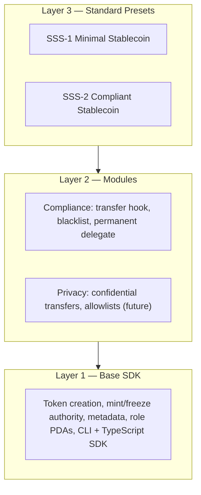

# Solana Stablecoin Standard (SSS)

Open-source standards and SDK for stablecoins on Solana — production-ready templates that institutions and builders can fork, customize, and deploy.

[](docs/TESTING.md)
[](docs/DEVNET.md)

## Table of Contents

- [Overview](#overview)
- [SSS presets](#sss-presets)
- [Program IDs](#program-ids)
- [Installation](#installation)
- [Quick start](#quick-start)
- [Using the TypeScript SDK](#using-the-typescript-sdk)
- [CLI](#cli)
- [Features](#features)
- [Architecture](#architecture)
- [Core instructions](#core-instructions)
- [Error codes](#error-codes)
- [Security](#security)
- [Testing](#testing)
- [Project structure](#project-structure)
- [Backend](#backend)
- [Documentation](#documentation)
- [Contributing](#contributing)
- [Verification (submission checklist)](#verification-submission-checklist)
- [Resources](#resources)
- [License](#license)

## Overview

**SSS-1 (Minimal Stablecoin):** Mint authority, freeze authority, and metadata. Suited for internal tokens, DAO treasuries, and ecosystem settlement. **SSS-2 (Compliant Stablecoin):** SSS-1 plus permanent delegate, transfer hook, and blacklist enforcement — for regulated, USDC/USDT-class tokens with on-chain blacklist and seizure.

## SSS presets

| Feature                    | SSS-1 | SSS-2 |
|---------------------------|-------|-------|
| Mint / burn / freeze      | Yes   | Yes   |
| Metadata                  | Yes   | Yes   |
| Permanent delegate        | No    | Yes   |
| Transfer hook (blacklist) | No    | Yes   |
| Default account frozen   | No    | Yes   |
| Blacklist / seize        | No    | Yes   |

## Program IDs

| Program            | Address (devnet) |
|--------------------|------------------|
| SSS Token (sss-1)  | `47TNsKC1iJvLTKYRMbfYjrod4a56YE1f4qv73hZkdWUZ` |
| Transfer Hook (sss-2) | `8DMsf39fGWfcrWVjfyEq8fqZf5YcTvVPGgdJr8s2S8Nc` |

Details: [Devnet](docs/DEVNET.md).

## Installation

```bash
git clone <this-repo>
cd solana-stablecoin-standard
pnpm install
anchor build
pnpm run build:sdk
```

Full runbook: [Deploy](docs/DEPLOY_PROGRAM.md).

## Quick start

```bash
# Build and run tests
anchor build
pnpm run build:sdk
pnpm run test:sdk          # SDK unit tests
anchor test                # Integration tests (requires local validator)
```

### Spin up SSS-1 in ~10 minutes

Use a local validator or devnet. From repo root:

```bash
anchor build && pnpm run build:sdk
solana config set --url devnet   # or leave default for localnet
solana airdrop 2                 # if devnet
pnpm run cli init --preset sss-1 -n "My USD" -s MUSD --uri "https://example.com"
# Copy the printed Mint address, then:
pnpm run cli -m <MINT> mint <YOUR_PUBKEY> 1000000
pnpm run cli -m <MINT> burn 500000
```

Optional: freeze/thaw with `pnpm run cli -m <MINT> freeze <OWNER_PUBKEY>` and `thaw <OWNER_PUBKEY>`. See [Operations](docs/OPERATIONS.md).

### Spin up SSS-2 with blacklist and audit

After init with `--preset sss-2`, grant blacklister/seizer roles, then use blacklist and (optionally) view audit via backend:

```bash
pnpm run cli init --preset sss-2 -n "Regulated USD" -s RUSD --uri ""
# Grant roles (see OPERATIONS), then:
pnpm run cli -m <MINT> blacklist add <ADDRESS> --reason "OFAC match"
# Start backend (docker compose up or pnpm run backend), then:
BACKEND_URL=http://localhost:3000 pnpm run cli -m <MINT> audit-log
```

**Blessed examples:** [1-basic-sss1.ts](examples/1-basic-sss1.ts), [2-sss2-compliant.ts](examples/2-sss2-compliant.ts), [3-custom-config.ts](examples/3-custom-config.ts). See [SDK](docs/SDK.md#blessed-examples).

## Using the TypeScript SDK

```typescript
import { Connection, Keypair } from "@solana/web3.js";
import { SolanaStablecoin, getProgram } from "@stbr/sss-token";
import { AnchorProvider, Wallet } from "@coral-xyz/anchor";

const connection = new Connection("https://api.devnet.solana.com");
const wallet = Keypair.fromSecretKey(/* ... */);
const provider = new AnchorProvider(connection, new Wallet(wallet), {});

const stable = await SolanaStablecoin.create(connection, {
  preset: "SSS_2",
  name: "My USD",
  symbol: "MYUSD",
  uri: "https://example.com/metadata.json",
  decimals: 6,
}, wallet);
const program = getProgram(provider);
const loaded = await SolanaStablecoin.load(program, stable.mintAddress);
await loaded.mint(wallet.publicKey, {
  recipient: recipientPubkey,
  amount: 1_000_000n,
  minter: wallet.publicKey,
});
```

Full reference: [SDK](docs/SDK.md).

## CLI

Build: `pnpm run build:sdk` then `pnpm run cli`. All non-init commands require `-m <MINT>`.

```bash
pnpm run cli init --preset sss-1 -n "My Token" -s TKN --uri "https://..."
pnpm run cli -m <MINT> mint <RECIPIENT> <AMOUNT>
pnpm run cli -m <MINT> burn <AMOUNT>
pnpm run cli -m <MINT> freeze <ADDRESS>
pnpm run cli -m <MINT> thaw <ADDRESS>
pnpm run cli -m <MINT> pause
pnpm run cli -m <MINT> unpause
pnpm run cli -m <MINT> blacklist add <ADDRESS> --reason "OFAC"
pnpm run cli -m <MINT> seize <SOURCE_ATA> --to <DEST_ATA>
BACKEND_URL=http://localhost:3000 pnpm run cli -m <MINT> audit-log
```

Full reference: [CLI](docs/CLI.md).

## Features

| Feature                                  | Supported |
|------------------------------------------|-----------|
| Presets (SSS-1, SSS-2)                   | Yes       |
| Roles (minter, burner, pauser, blacklister, seizer) | Yes |
| Supply cap                               | Yes       |
| Oracle (Pyth)                            | Yes       |
| Admin TUI                                | Yes       |
| Admin frontend                           | Yes       |

## Architecture

Three layers: Base SDK (token creation, role PDAs, CLI + TypeScript), Modules (compliance: transfer hook, blacklist, permanent delegate), and Presets (SSS-1 minimal, SSS-2 compliant).



Details: [Architecture](docs/ARCH.md).

## Core instructions

| Instruction        | Who signs   |
|--------------------|-------------|
| initialize_stablecoin | authority   |
| mint_tokens        | minter      |
| burn_tokens        | burner      |
| freeze_account / thaw_account | pauser or freezer |
| pause / unpause    | pauser      |
| update_roles       | authority   |
| update_minter      | authority   |
| add_to_blacklist / remove_from_blacklist | blacklister (SSS-2) |
| seize              | seizer (SSS-2) |

See [Spec](docs/SPEC.md) for full instruction list.

## Error codes

| Code | Name                |
|------|---------------------|
| 6000 | Unauthorized        |
| 6001 | Paused              |
| 6002 | ComplianceNotEnabled|
| 6005 | QuotaExceeded       |
| 6006 | ZeroAmount          |
| 6014 | SupplyCapExceeded   |

See [Spec](docs/SPEC.md) for error codes and failure modes.

## Security

- **RBAC:** All privileged operations require the correct role PDA and signer.
- **PDA validation:** Seeds and account constraints enforced; CPI uses program IDs.
- **Supply cap:** Mint validates cap before CPI.
- **Compliance gating:** Blacklist and seize fail with `ComplianceNotEnabled` on non-SSS-2.

**Audited:** [audits/FINAL_AUDIT.md](audits/FINAL_AUDIT.md) (Exo Technologies). Reproducibility: [audits/SCOPE.md](audits/SCOPE.md).  
Details: [SECURITY](docs/SECURITY.md).

## Testing

```bash
anchor build && pnpm run build:sdk && pnpm run test:sdk && anchor test
```

Backend: `docker compose up` then `curl http://localhost:3000/health`.

Full guide: [Testing](docs/TESTING.md).

## Project structure

```
programs/sss-1      # Anchor program (core + SSS-2 compliance)
programs/sss-2      # Transfer hook program (Token-2022)
sdk/core            # TypeScript SDK (@stbr/sss-token)
packages/cli        # Admin CLI (sss-token)
packages/tui        # Admin TUI (backend client)
backend/            # Mint/burn API, indexer, compliance
tests/              # Integration tests
docs/               # Architecture, spec, operations, API
audits/             # FINAL_AUDIT, SCOPE, SECURITY_AUDIT_1–6
examples/           # TypeScript examples
```

## Backend

Mint/burn API, event indexer, and compliance module (audit trail, blacklist). Run: `docker compose up` or `pnpm run backend`. See [API](docs/API.md).

## Documentation

- **Architecture:** [ARCH](docs/ARCH.md), [ARCHITECTURE](docs/ARCHITECTURE.md)
- **Spec & deploy:** [Spec](docs/SPEC.md), [Deploy](docs/DEPLOY_PROGRAM.md)
- **Integration & ops:** [Integration](docs/INTEGRATION.md), [Operations](docs/OPERATIONS.md)
- **API & compliance:** [API](docs/API.md), [Compliance](docs/COMPLIANCE.md)
- **Testing & SDK:** [Testing](docs/TESTING.md), [SDK](docs/SDK.md)
- **Standards:** [SSS-1](docs/SSS-1.md), [SSS-2](docs/SSS-2.md)
- **Devnet & examples:** [Devnet](docs/DEVNET.md), [Examples](examples/README.md)
- **CLI & security:** [CLI](docs/CLI.md), [SECURITY](docs/SECURITY.md)
- **Audits:** [audits/](audits/)

## Contributing

Before contributing: ensure the build passes, tests pass, and documentation is updated. See [Verification (submission checklist)](#verification-submission-checklist) for commands.

## Verification (submission checklist)

Before submitting a PR or for local verification:

1. **Build and test**
   ```bash
   anchor build && pnpm run build:sdk && pnpm run test:sdk && anchor test
   ```
2. **Backend**
   ```bash
   docker compose up
   ```
   In another terminal: `curl http://localhost:3000/health`
3. **Devnet proof (optional)**  
   Run `anchor test --provider.cluster devnet --skip-build --skip-deploy` and refresh the example transaction table in [DEVNET](docs/DEVNET.md) with fresh Explorer links if desired.

## Resources

- [Solana Documentation](https://docs.solana.com/)
- [Anchor Framework](https://www.anchor-lang.com/)
- [SPL Token-2022](https://spl.solana.com/token-2022)
- [Solana Explorer](https://explorer.solana.com/)
- [Exo Technologies — AI Audits](https://ai-audits.exotechnologies.xyz)

## License

MIT
