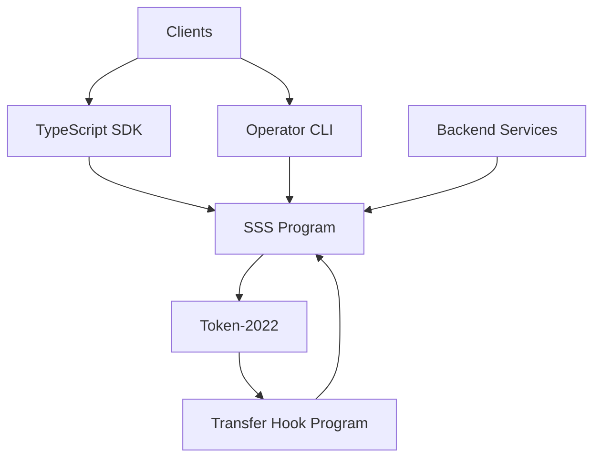

# Solana Stablecoin Standard

Solana Stablecoin Standard (SSS) provides a Token-2022 based stablecoin framework with two presets:

- **SSS-1**: minimal issuance and admin controls.
- **SSS-2**: compliance-focused controls (pause, blacklist, seize, transfer-hook integrations).

## Overview

This repository contains:

- On-chain programs (`programs/sss`, `programs/transfer_hook`).
- SDK (`sdk`) for TypeScript integrators.
- Operator CLI (`cli`) for day-2 actions.
- Backend services (`services/*`) for indexing, compliance, and automation.
- Test and fuzzing layers (`tests`, `cli/tests`, `sdk/src/*.test.ts`, `trident-tests`).

## Quick Start

```bash
yarn install
anchor build
yarn test:anchor
yarn test:sdk
cargo test -p sss-token --test cli_tests
```

For fuzzing:

```bash
yarn fuzz:trident
```

## Preset Comparison

| Capability | SSS-1 | SSS-2 |
|---|---|---|
| Mint / Burn | Yes | Yes |
| Freeze / Thaw | Yes | Yes |
| Pause / Unpause | No | Yes |
| Blacklist | No | Yes |
| Seize | No | Yes |
| Transfer Hook Support | No | Yes |

## Architecture Diagram



## Test Matrix

- `yarn test:anchor`: on-chain instruction and integration tests.
- `yarn test:sdk`: SDK unit/usage tests.
- `yarn test:cli`: CLI integration tests.
- `yarn fuzz:trident`: Trident fuzz campaigns and invariants.
