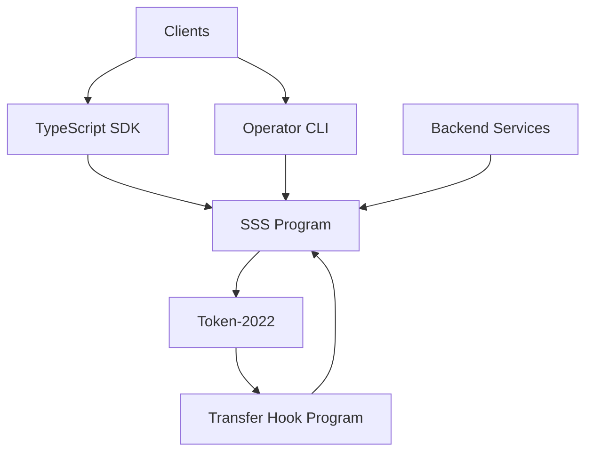

# Solana Stablecoin Standard

Solana Stablecoin Standard (SSS) provides a Token-2022 based stablecoin framework with two presets:

- **SSS-1**: minimal issuance and admin controls.
- **SSS-2**: compliance-focused controls (pause, blacklist, seize, transfer-hook integrations).

## Overview

This repository contains:

- On-chain programs (`programs/sss`, `programs/transfer_hook`).
- SDK (`sdk`) for TypeScript integrators.
- Operator CLI (`cli`) for day-2 actions.
- Backend services (`services/*`) for indexing, compliance, and automation.
- Test and fuzzing layers (`tests`, `cli/tests`, `sdk/src/*.test.ts`, `trident-tests`).

## Quick Start

```bash
yarn install
anchor build
yarn test:anchor
yarn test:sdk
cargo test -p sss-token --test cli_tests
```

For fuzzing:

```bash
yarn fuzz:trident
```

## Deploy and run (play with the full stack)

Use this flow to run a local chain, deploy the on-chain programs, start the backend services, and run the dashboard app.

### Prerequisites

- [Node.js](https://nodejs.org/) (v18+) and [Yarn](https://yarnpkg.com/)
- [Rust](https://rustup.rs/) and [Anchor](https://www.anchor-lang.com/docs/installation)
- [Solana CLI](https://docs.solana.com/cli/install-solana-cli-tools) (for keypair and RPC)
- [Docker](https://docs.docker.com/get-docker/) (for Postgres, Redis, and services)

### 1. Start the local chain

```bash
surfpool start
```

The local RPC will be at `http://localhost:8899`.

### 2. Deploy the program

From the repo root:

```bash
yarn install
anchor build
anchor deploy --provider.cluster localnet
```

Ensure Solana CLI is configured for localhost (e.g. `solana config set --url http://localhost:8899`).

### 3. Create a mint

You must create a new stablecoin mint using the CLI:

```bash
sss-token init --preset sss-1
```

Use the mint public key printed by this command for the services and app configuration below.

### 4. Configure and start the services

The `services/*/.env.example` files use `RPC_URL=http://localhost:8899`. Copy them and set the mint:

```bash
cp services/indexer/.env.example services/indexer/.env
cp services/mint-burn/.env.example services/mint-burn/.env
cp services/webhook/.env.example services/webhook/.env
cp services/compliance/.env.example services/compliance/.env
```

Edit each `services/*/\.env` and set `MINT_PUBKEY` to the mint from `sss-token init --preset sss-1`.

Start Postgres, Redis, and all backend services with Docker:

```bash
yarn services:up
```

This brings up:

- Postgres on `localhost:5432`, Redis on `localhost:6379`
- Indexer on `http://localhost:3001`
- Mint-burn on `http://localhost:3002`
- Webhook on `http://localhost:3003`
- Compliance on `http://localhost:3004`

To stop: `yarn services:down`.

### 5. Start the app

In the `app` directory, create `.env.local` with:

```bash
# app/.env.local
NEXT_PUBLIC_RPC_URL=http://localhost:8899
NEXT_PUBLIC_STABLECOIN_MINT=<mint-public-key-from-sss-token-init>
NEXT_PUBLIC_WEBHOOK_API_URL=http://localhost:3003
```

If the app runs on the host and services in Docker, set the callback URL so the webhook service can reach the app:

- **Mac/Windows:** `NEXT_PUBLIC_WEBHOOK_CALLBACK_URL=http://host.docker.internal:3000/api/webhook`

Then start the Next.js app:

```bash
yarn workspace app dev
```

Open [http://localhost:3000](http://localhost:3000) to use the dashboard: connect your wallet (local), view the stablecoin, mint/burn (if you have roles), and optionally create a webhook subscription so the Notification center receives on-chain event callbacks.

## Preset Comparison

| Capability | SSS-1 | SSS-2 |
|---|---|---|
| Mint / Burn | Yes | Yes |
| Freeze / Thaw | Yes | Yes |
| Pause / Unpause | Yes | Yes |
| Blacklist | No | Yes |
| Seize | No | Yes |
| Transfer Hook Support | No | Yes |

## Architecture Diagram



## Test Matrix

- `yarn test:anchor`: on-chain instruction and integration tests.
- `yarn test:sdk`: SDK unit/usage tests.
- `yarn test:cli`: CLI integration tests.
- `yarn fuzz:trident`: Trident fuzz campaigns and invariants.
