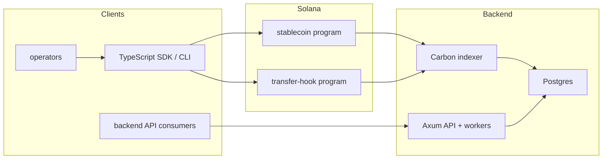

# Solana Stablecoin Standard

Solana Stablecoin Standard is a Token-2022 stablecoin stack with two preset operating modes:

- `SSS-1`: minimal issuer controls for mint, burn, pause, and freeze.
- `SSS-2`: compliance-oriented controls that add blacklist, seizure, permanent delegate, and transfer-hook enforcement.

The repository includes onchain programs, a TypeScript SDK, a Rust backend, and local plus devnet test coverage.

## Overview

### Repository layout

- `programs/stablecoin`: core Anchor program for mint lifecycle, roles, quotas, pause, freeze, blacklist, and seize.
- `programs/transfer-hook`: Token-2022 transfer-hook program used by `SSS-2`.
- `sdk/client`: handwritten TypeScript client for preset creation and operator workflows.
- `sdk/generated-kit` and `sdk/generated-web3js`: generated bindings from Anchor IDLs.
- `backend/crates/api`: Axum API for indexed data, operation requests, webhooks, and audit exports.
- `backend/crates/indexer`: Carbon-based indexer that projects onchain events into Postgres.
- `tests/litesvm`: local program tests.
- `tests/devnet`: end-to-end preset and SDK coverage against deployed programs.

### What the presets mean

`SSS-1` is intended for issuers who need mint, burn, pause, and freeze without always-on compliance gating at transfer time.

`SSS-2` is intended for issuers who need blacklist-backed transfer control. It enables the Token-2022 permanent delegate extension, installs a transfer hook, and can start accounts frozen by default.

## Quick Start

### Prerequisites

- Rust toolchain
- Anchor CLI
- Node.js and Yarn 1.x
- Solana CLI
- Postgres if you want to run the backend stack

### Build the workspace

```bash
yarn install
yarn build
yarn verify
```

`yarn build` runs TypeScript build, Rust workspace checks, SDK generation, and `anchor build`.

### Run local program tests

```bash
cargo test -p sss_litesvm_tests
```

### Run devnet integration tests

Fund `~/.config/solana/id.json`, deploy the programs, then run:

```bash
yarn test:devnet:deploy
yarn test:devnet
```

Target a single flow when needed:

```bash
yarn test:devnet --grep "SSS-1 devnet flow"
yarn test:devnet --grep "SSS-2 devnet flow"
```

### Run the backend API

```bash
export DATABASE_URL=postgres://localhost/sss_backend
cargo run -p sss-api
```

### Run the indexer

```bash
export DATABASE_URL=postgres://localhost/sss_backend
export SOLANA_RPC_URL=https://api.devnet.solana.com
cargo run -p sss-indexer
```

### Run the backend with Docker

Create a deployment env file, fill in the Solana settings, then boot the stack:

```bash
cp .env.docker.example .env.docker
docker compose --env-file .env.docker up --build
```

The Compose stack starts:

- `postgres` on `localhost:${POSTGRES_PORT:-5432}`
- `api` on `http://localhost:${API_PORT:-8080}`
- `indexer` on the internal Docker network

Useful checks:

```bash
docker compose --env-file .env.docker config
curl http://localhost:8080/healthz
curl http://localhost:8080/readyz
```

## Preset Comparison

| Capability | SSS-1 | SSS-2 |
| --- | --- | --- |
| Mint with quota enforcement | Yes | Yes |
| Burn | Yes | Yes |
| Pause and unpause | Yes | Yes |
| Freeze and thaw token accounts | Yes | Yes |
| Permanent delegate extension | No | Yes |
| Transfer-hook enforcement | No | Yes |
| Default account frozen | No by default | Yes by default |
| Blacklist add and remove | No | Yes |
| Seize from blacklisted frozen account | No | Yes |
| Transfer-time blacklist rejection | No | Yes |

Preset flags come from [`sdk/client/src/presets.ts`](/Users/pratik/development/work/solana-stablecoin-standard/sdk/client/src/presets.ts).

## Architecture Diagram



## Documentation

- [ARCHITECTURE.md](/Users/pratik/development/work/solana-stablecoin-standard/ARCHITECTURE.md)
- [SDK.md](/Users/pratik/development/work/solana-stablecoin-standard/SDK.md)
- [OPERATIONS.md](/Users/pratik/development/work/solana-stablecoin-standard/OPERATIONS.md)
- [SSS-1.md](/Users/pratik/development/work/solana-stablecoin-standard/SSS-1.md)
- [SSS-2.md](/Users/pratik/development/work/solana-stablecoin-standard/SSS-2.md)
- [COMPLIANCE.md](/Users/pratik/development/work/solana-stablecoin-standard/COMPLIANCE.md)
- [API.md](/Users/pratik/development/work/solana-stablecoin-standard/API.md)


DATABASE_URL="postgres://pratik@127.0.0.1:5432/sss_backend" \
SSS_RUN_WORKERS=1 \
SSS_AUTHORITY_KEYPAIR=~/.config/solana/id.json \
SOLANA_RPC_URL="https://devnet.helius-rpc.com/?api-key=ff17a075-ee9d-4796-b9d5-3d0a054f017c" \
SSS_STABLECOIN_PROGRAM_ID=C7k7FTRLGLB5FJS7hWrpjqRiwmj5Px9DzMQUeouAxJ9r \
cargo run -p sss-api


DATABASE_URL="postgres://pratik@127.0.0.1:5432/sss_backend" \
SOLANA_RPC_URL="https://devnet.helius-rpc.com/?api-key=ff17a075-ee9d-4796-b9d5-3d0a054f017c" \
SSS_STABLECOIN_PROGRAM_ID=C7k7FTRLGLB5FJS7hWrpjqRiwmj5Px9DzMQUeouAxJ9r \
SSS_TRANSFER_HOOK_PROGRAM_ID=YYTBExpcbtVYTGNmbgcAr7SzEGWfLtByYUrcfzvUz8p \
cargo run -p sss-indexer