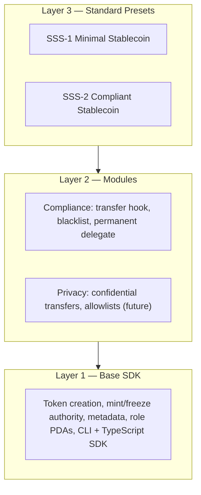

# Solana Stablecoin Standard (SSS)

[](docs/TESTING.md)
[](docs/DEVNET.md)

**License:** MIT · **Anchor:** 0.31.1 · **Solana Token-2022:** spl-token-2022 6.0.0

## Table of Contents

- [Architecture](#architecture)
- [Preset Comparison](#preset-comparison)
- [Quick Start](#quick-start)
- [Features](#features)
- [Repository Layout](#repository-layout)
- [Backend](#backend)
- [Documentation](#documentation)
- [Contributing](#contributing)
- [Verification (submission checklist)](#verification-submission-checklist)
- [License](#license)

Open-source standards and SDK for stablecoins on Solana — production-ready templates that institutions and builders can fork, customize, and deploy.

## Overview

- **SSS-1 (Minimal Stablecoin):** Mint authority + freeze authority + metadata. Suited for internal tokens, DAO treasuries, ecosystem settlement.
- **SSS-2 (Compliant Stablecoin):** SSS-1 + permanent delegate + transfer hook + blacklist enforcement. For regulated, USDC/USDT-class tokens with on-chain blacklist and seizure.

## Architecture

Three layers (bounty-aligned):



- **Layer 1 (Base SDK):** Token creation with mint/freeze authority and metadata; issuers choose extensions. Role management program. CLI + TypeScript SDK.
- **Layer 2 (Modules):** Compliance (transfer hook, blacklist PDAs, permanent delegate). Privacy (confidential transfers, allowlists) optional/future.
- **Layer 3 (Presets):** SSS-1 (minimal) and SSS-2 (compliant) — opinionated combinations documented as standards.

## Quick Start

```bash
# Build programs and SDK
anchor build
pnpm run build:sdk

# Run tests
pnpm run test:sdk          # SDK unit tests
anchor test               # Integration tests (requires local validator)
```

### Spin up SSS-1 in ~10 minutes

Use a local validator or devnet. From repo root:

```bash
anchor build && pnpm run build:sdk
solana config set --url devnet   # or leave default for localnet
solana airdrop 2                 # if devnet
pnpm run cli init --preset sss-1 -n "My USD" -s MUSD --uri "https://example.com"
# Copy the printed Mint address, then:
pnpm run cli -m <MINT> mint <YOUR_PUBKEY> 1000000
pnpm run cli -m <MINT> burn 500000
```

Optional: freeze/thaw with `pnpm run cli -m <MINT> freeze <OWNER_PUBKEY>` and `thaw <OWNER_PUBKEY>`. See [docs/OPERATIONS.md](docs/OPERATIONS.md).

### Spin up SSS-2 with blacklist and audit

After init with `--preset sss-2`, grant blacklister/seizer roles, then use blacklist and (optionally) view audit via backend:

```bash
pnpm run cli init --preset sss-2 -n "Regulated USD" -s RUSD --uri ""
# Grant roles (see OPERATIONS), then:
pnpm run cli -m <MINT> blacklist add <ADDRESS> --reason "OFAC match"
# Start backend (docker compose up or pnpm run backend), then:
BACKEND_URL=http://localhost:3000 pnpm run cli -m <MINT> audit-log
```

**Blessed examples:** Three canonical flows — [examples/1-basic-sss1.ts](examples/1-basic-sss1.ts) (SSS-1 init + mint + freeze/thaw + burn), [examples/2-sss2-compliant.ts](examples/2-sss2-compliant.ts) (SSS-2 + blacklist + seize), [examples/3-custom-config.ts](examples/3-custom-config.ts) (custom extensions). See [SDK](docs/SDK.md#blessed-examples).

### Using the TypeScript SDK

```typescript
import { Connection, Keypair } from "@solana/web3.js";
import { SolanaStablecoin, Presets, getProgram } from "@stbr/sss-token";
import { AnchorProvider, Wallet } from "@coral-xyz/anchor";

const connection = new Connection("https://api.devnet.solana.com");
const wallet = Keypair.fromSecretKey(/* ... */);
const provider = new AnchorProvider(connection, new Wallet(wallet), {});

// Create SSS-2 stablecoin
const stable = await SolanaStablecoin.create(connection, {
  preset: "SSS_2",
  name: "My USD",
  symbol: "MYUSD",
  uri: "https://example.com/metadata.json",
  decimals: 6,
}, wallet);
console.log("Mint:", stable.mintAddress.toBase58());

const program = getProgram(provider);
const loaded = await SolanaStablecoin.load(program, stable.mintAddress);
await loaded.mint(wallet.publicKey, {
  recipient: recipientPubkey,
  amount: 1_000_000n,
  minter: wallet.publicKey,
});

await stable.compliance.blacklistAdd(wallet.publicKey, addressPubkey, "Sanctions match");
await stable.compliance.seize(wallet.publicKey, sourceTokenAccount, treasuryTokenAccount);
```

### CLI

Build the CLI from repo root: `pnpm run build:sdk` then `cd packages/cli && pnpm run build` (or use `pnpm run cli` after building). All non-init commands require `-m <MINT>`.

```bash
# Init: choose preset or custom config
pnpm run cli init --preset sss-1 -n "My Token" -s TKN --uri "https://..."
pnpm run cli init --preset sss-2 -n "Regulated USD" -s RUSD --uri "https://..."
pnpm run cli init --custom config.toml -n "Custom" -s CUSD --uri "https://..."

# Operations
pnpm run cli -m <MINT> mint <RECIPIENT> <AMOUNT>
pnpm run cli -m <MINT> burn <AMOUNT>
pnpm run cli -m <MINT> freeze <ADDRESS>
pnpm run cli -m <MINT> thaw <ADDRESS>
pnpm run cli -m <MINT> pause
pnpm run cli -m <MINT> unpause
pnpm run cli -m <MINT> status
pnpm run cli -m <MINT> supply

# SSS-2 compliance
pnpm run cli -m <MINT> blacklist add <ADDRESS> --reason "OFAC match"
pnpm run cli -m <MINT> blacklist remove <ADDRESS>
pnpm run cli -m <MINT> seize <SOURCE_TOKEN_ACCOUNT> --to <TREASURY_TOKEN_ACCOUNT>

# Management
pnpm run cli -m <MINT> minters list
pnpm run cli -m <MINT> minters add <ADDRESS> --quota <AMOUNT>
pnpm run cli -m <MINT> minters remove <ADDRESS>
pnpm run cli -m <MINT> holders
pnpm run cli -m <MINT> holders --min-balance <AMOUNT>
BACKEND_URL=http://localhost:3000 pnpm run cli -m <MINT> audit-log
BACKEND_URL=http://localhost:3000 pnpm run cli -m <MINT> audit-log --action mint
```

Full operator runbook: [Operations](docs/OPERATIONS.md).

## Preset Comparison

| Feature                    | SSS-1 | SSS-2 |
|---------------------------|-------|-------|
| Mint / burn / freeze      | Yes   | Yes   |
| Metadata                  | Yes   | Yes   |
| Permanent delegate        | No    | Yes   |
| Transfer hook (blacklist) | No    | Yes   |
| Default account frozen    | No    | Yes   |
| Blacklist / seize         | No    | Yes   |

## Features

| Feature                                  | Supported |
|------------------------------------------|-----------|
| Presets (SSS-1, SSS-2)                   | Yes       |
| Roles (minter, burner, pauser, blacklister, seizer) | Yes |
| Supply cap                               | Yes       |
| Oracle (Pyth)                            | Yes       |
| Admin TUI                                | Yes       |
| Admin frontend                           | Yes       |

## Repository Layout

- `programs/sss-1` — Anchor program (core + SSS-2 compliance instructions)
- `programs/sss-2` — Transfer hook program (Token-2022)
- `sdk/core` — TypeScript SDK (`@stbr/sss-token`)
- `packages/cli` — Admin CLI (`sss-token`)
- `packages/tui` — Admin TUI (Ink) for status, mint, burn, freeze/thaw, pause, blacklist, seize (backend client)
- `backend/` — Mint/burn API, event indexer, compliance (audit, blacklist)
- `tests/` — Integration tests
- `docs/` — Architecture, SDK, operations, standards

## Backend

The backend provides a mint/burn API, event indexer, and compliance module (audit trail, blacklist management). **Backend:** `docker compose up` or `pnpm run start:backend`; for local run without Docker use `pnpm run backend` (after `pnpm install` and building the SDK). See [API](docs/API.md) for endpoints. **Admin TUI:** `BACKEND_URL=http://localhost:3000 pnpm run tui` (build `packages/tui` first); see [API](docs/API.md#admin-tui).

**Devnet deployment proof:** Program IDs and example transactions are in [DEVNET](docs/DEVNET.md).

## Security & audits

The on-chain program has been audited. See **[audits/FINAL_AUDIT.md](audits/FINAL_AUDIT.md)** for scope, methodology, security findings, and recommendation. Reproducibility: [audits/SCOPE.md](audits/SCOPE.md). *AI Audits by Exo Technologies.*

## Documentation

- [Architecture](docs/ARCH.md) — High-level architecture, system diagram, account map, data flows
- [Spec](docs/SPEC.md) — On-chain program specification (accounts, instructions, failure modes)
- [Deploy](docs/DEPLOY_PROGRAM.md) — SSS deployment runbook (prerequisites, keypairs, upgrade script, deploy, verify)
- [Integration](docs/INTEGRATION.md) — How to integrate: SDK (create/load, mint, burn), backend vs SDK, CLI, env vars, minimal flow
- [Operations](docs/OPERATIONS.md) — Operator runbook (mint, burn, freeze, thaw, blacklist, seize)
- [API](docs/API.md) — Backend API reference and error taxonomy
- [Compliance](docs/COMPLIANCE.md) — Regulatory considerations, audit trail
- [Testing](docs/TESTING.md) — Run all tests (SDK, backend, integration); copy-paste commands
- [Architecture](docs/ARCHITECTURE.md) — Layer model, data flows, security
- [SDK](docs/SDK.md) — Presets, custom config, TypeScript API
- [SSS-1](docs/SSS-1.md) — Minimal stablecoin spec
- [SSS-2](docs/SSS-2.md) — Compliant stablecoin spec
- [Devnet](docs/DEVNET.md) — Deployment and example transactions
- [Examples](examples/README.md) — Step-by-step TypeScript examples
- [Audits](audits/) — FINAL_AUDIT.md, SCOPE.md, SECURITY_AUDIT_1–6.md

## Contributing

Before contributing: ensure the build passes, tests pass, and documentation is updated. See [Verification (submission checklist)](#verification-submission-checklist) for commands.

## Verification (submission checklist)

Before submitting a PR or for local verification:

1. **Build and test**
   ```bash
   anchor build && pnpm run build:sdk && pnpm run test:sdk && anchor test
   ```
2. **Backend**
   ```bash
   docker compose up
   ```
   In another terminal: `curl http://localhost:3000/health`
3. **Devnet proof (optional)**  
   Run `anchor test --provider.cluster devnet --skip-build --skip-deploy` and refresh the example transaction table in [DEVNET](docs/DEVNET.md) with fresh Explorer links if desired.

## License

MIT
