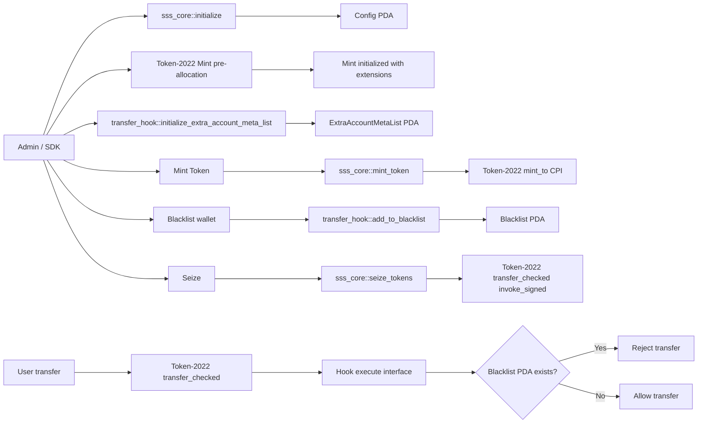

# ARCHITECTURE

## SSS-2 Data Flow (Mermaid)



## PDA Layout (ASCII)

```text
[sss_core]
  config PDA = PDA("config", sss_core_program_id)
  mock_oracle PDA = PDA("mock_oracle", sss_core_program_id)

[transfer_hook]
  blacklist PDA = PDA("blacklist", wallet_pubkey, transfer_hook_program_id)
  extra_meta PDA = PDA("extra-account-metas", mint_pubkey, transfer_hook_program_id)
```

## Design Notes
- No CPI-time reallocation is used. Accounts for mint/extensions are pre-allocated client-side.
- Transfer Hook account list is deterministic through `ExtraAccountMetaList`.
