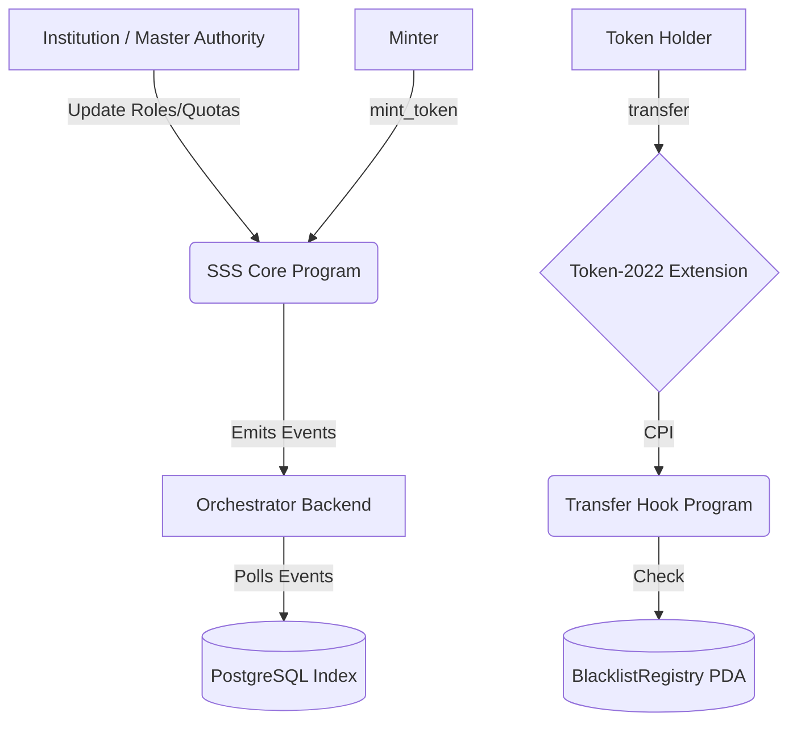
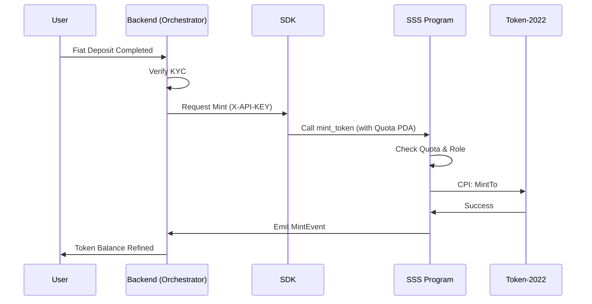
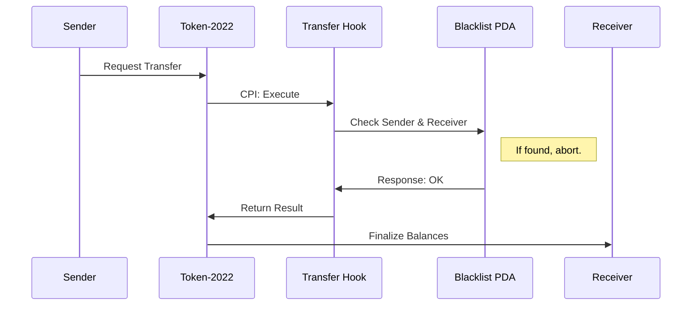

# SSS System Architecture

## 1. Layered Architecture

The Solana Stablecoin Standard is designed with a strict separation of concerns across 3 primary layers.

| Layer | Component | Function |
| :--- | :--- | :--- |
| **Layer 1: Base SDK** | `@stbr/sss-token` | Core logic, transaction building, and PDA derivation. |
| **Layer 2: Standard Modules** | `programs/sss` / `programs/transfer_hook` | On-chain enforcement, monetary invariants, RBAC. |
| **Layer 3: Operations & Presets** | `cli`, `services`, `apps/frontend` | High-level orchestration, monitoring, and compliance workflows. |

## 2. High-Level Interaction Diagram

## 3. Core Component Interaction

### On-Chain Programs
- **SSS Core**: The central registry. Holds configuration and roles.
- **Transfer Hook**: The compliance interceptor. It is invoked on every transfer to verify sanctions status.

### TypeScript SDK (`sdk/`)
Abstraction layer that prevents developers from manually deriving PDA seeds.
- `SolanaStablecoin.load()`: Hydrates a stablecoin object with RPC and Program handlers.
- `SolanaStablecoin.mint()`: Builds the complex transaction involving compute unit limits and multi-registry accounts.

### Backend Infrastructure (`services/`)
- **Indexer**: Uses Anchor `EventParser` to stream real-time data into PostgreSQL.
- **Orchestrator**: Acts as the bridge for Fiat-to-SSS flows, ensuring KYC/AML before triggering the SDK.

## 4. Mint/Burn Lifecycle Flow

## 5. Compliance Transfer Flow

