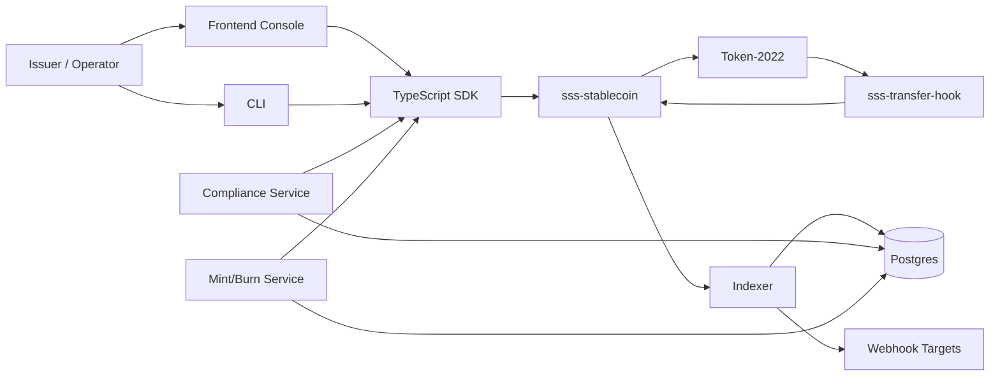

# Architecture

## Layer model

1. **On-chain control plane** (`programs/sss-stablecoin`): RBAC, quotas, compliance records, mint/freeze/pause/seize.
2. **On-chain transfer enforcement** (`programs/sss-transfer-hook`): transfer-time blacklist and pause checks.
3. **SDK/CLI** (`sdk/core`, `sdk/cli`): issuer/admin operations and lockfile-driven workflows.
4. **Backend services** (`backend/`): automated mint/burn, indexing, webhook and compliance APIs.
5. **Frontend** (`frontend/`): issuer console for creation, operations, compliance, and monitoring.

## Architecture diagram

## Data model

- `StablecoinConfig` PDA: global config + role addresses + feature flags.
- `StablecoinConfig` PDA also stores on-chain metadata fields: `name`, `symbol`, `uri`.
- `MinterRole` PDA (seeded by config + authority): quota and window tracking.
- `ComplianceRecord` PDA (seeded by mint + wallet): O(1) blacklist status.
- Transfer-hook `ExtraAccountMetaList` PDA per mint.

## Key data flows

1. **Creation flow**
   - direct program tests may call `initialize` and `finalize_creation`
   - canonical SDK flow creates the mint first, sets Token-2022 extensions, then calls `initialize_existing_mint`
   - on-chain metadata is stored in the config PDA, and the mint metadata pointer is set to that PDA
2. **Mint flow**
   - caller must match an active minter role
   - quota window is checked and updated
   - recipient compliance rules are enforced when enabled
   - Token-2022 mint CPI executes
3. **Transfer flow**
   - Token-2022 invokes `sss-transfer-hook`
   - hook loads config and compliance records
   - paused or blacklisted transfers are rejected before completion
4. **Seize flow**
   - authority must hold seizer role
   - blacklist requirement is checked unless explicitly overridden
   - permanent delegate path moves funds to treasury
5. **Indexing flow**
   - backend indexer listens to logs/signatures
   - events are normalized into Postgres
   - webhooks are retried from persisted event state

## Security model

- No single super-key: master + explicit operational roles.
- Strong feature gating: SSS-2 instructions fail cleanly when compliance disabled.
- Deterministic PDA addressing for auditability and O(1) lookup.
- Structured events emitted for all sensitive operations.
- Metadata is not stored as mutable off-chain-only UI state; it is persisted on-chain in config.

## Security modes

- **SSS-1**
  - issuer-grade operations only
  - reactive controls through freeze/thaw and pause
- **SSS-2**
  - proactive transfer-time blacklist enforcement
  - permanent-delegate seizure path
  - explicit blacklister and seizer roles
