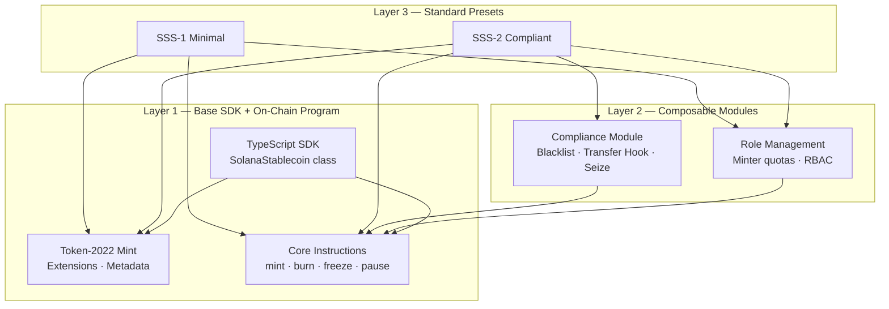
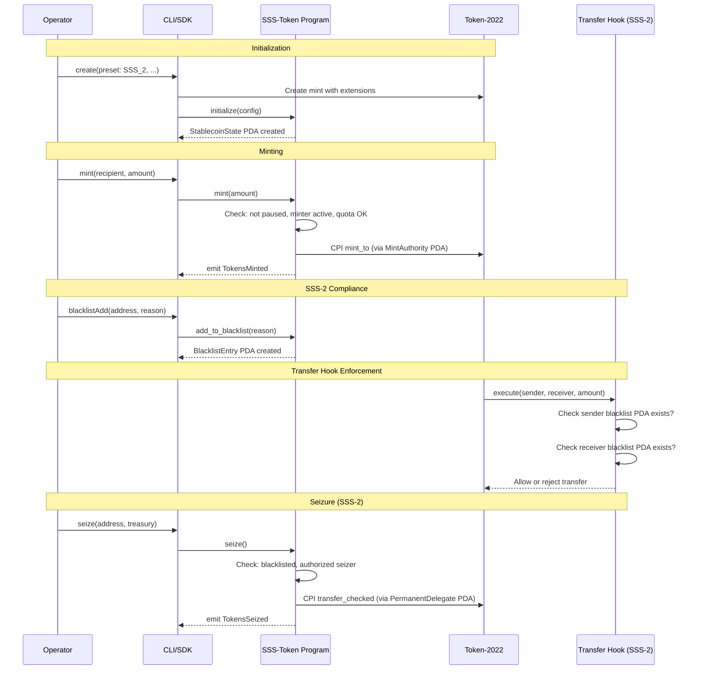
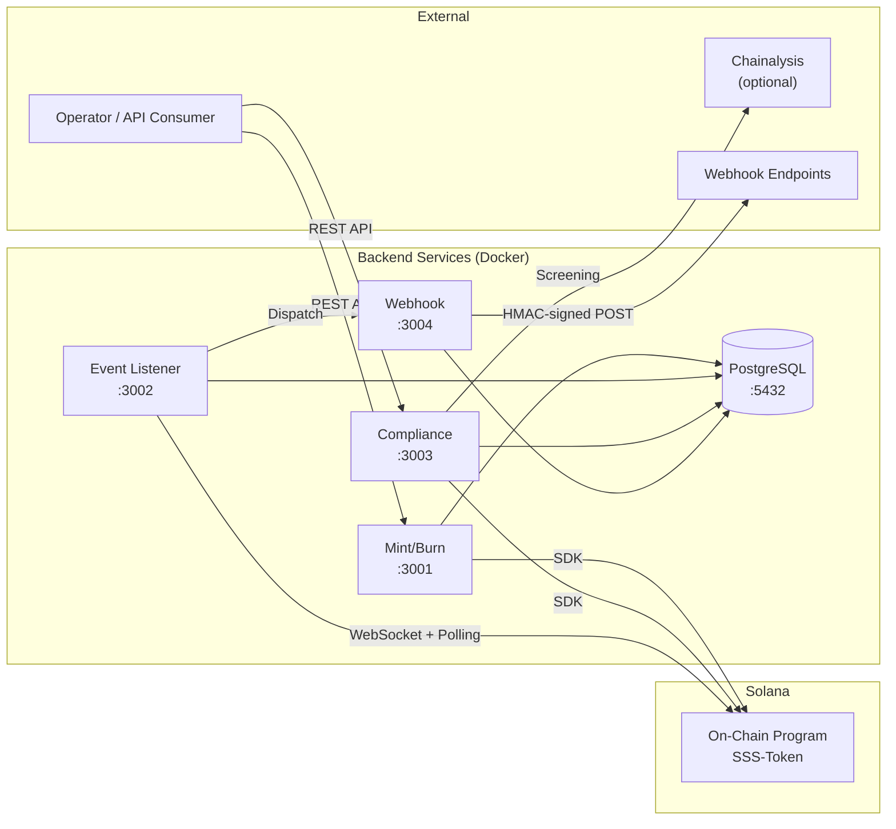

# Architecture

> Detailed architecture reference for the Solana Stablecoin Standard (SSS).

---

## Three-Layer Model

The SSS follows a clean three-layer architecture where each layer builds on the one below it.



### Layer 1 — Base SDK

The foundation. Provides:
- Token-2022 mint creation with configurable extensions
- Core instructions: `initialize`, `mint`, `burn`, `freeze_account`, `thaw_account`, `pause`, `unpause`
- Role management: `update_roles`, `add_minter`, `remove_minter`
- Authority transfer: `propose_authority`, `accept_authority`
- TypeScript SDK (`SolanaStablecoin` class) and Admin CLI (`sss-token`)

### Layer 2 — Composable Modules

Optional capabilities that extend Layer 1:
- **Compliance Module** — Blacklist PDAs, transfer hook enforcement, permanent delegate seizure. Independently testable. Only active when `compliance_enabled = true`.
- **Role Management** — Per-minter quotas, multi-role RBAC (master, minter, burner, pauser, blacklister, seizer).

### Layer 3 — Standard Presets

Opinionated combinations of L1 + L2:
- **SSS-1 (Minimal)** — L1 only. Mint + freeze + roles. For internal tokens, DAO treasuries, ecosystem settlement.
- **SSS-2 (Compliant)** — L1 + compliance module. Permanent delegate + transfer hook + blacklist. For regulated tokens (USDC/USDT-class).

---

## On-Chain Program Architecture

A single Anchor program (`sss-token`) supports both presets via initialization parameters. The program ID is `6NMdvUa2n4WSLPx9yz7V9edFx9VQqWr5KUDZQGPK3GDL`.

### PDA Layout

```
┌─────────────────────────────────────────────────────────────┐
│ StablecoinState PDA                                         │
│   Seeds: ["stablecoin", mint_pubkey]                        │
│   Stores: config flags, roles, supply counters              │
├─────────────────────────────────────────────────────────────┤
│ MintAuthority PDA                                           │
│   Seeds: ["mint_authority", state_pubkey]                   │
│   CPI signer for SPL Token-2022 mint operations             │
├─────────────────────────────────────────────────────────────┤
│ FreezeAuthority PDA                                         │
│   Seeds: ["freeze_authority", state_pubkey]                 │
│   CPI signer for SPL Token-2022 freeze/thaw operations      │
├─────────────────────────────────────────────────────────────┤
│ PermanentDelegate PDA (SSS-2 only)                          │
│   Seeds: ["permanent_delegate", state_pubkey]               │
│   Acts as Token-2022 permanent delegate for seizure          │
├─────────────────────────────────────────────────────────────┤
│ MinterInfo PDA (per minter)                                 │
│   Seeds: ["minter", state_pubkey, minter_pubkey]            │
│   Stores: quota, minted_this_epoch, active flag             │
├─────────────────────────────────────────────────────────────┤
│ BlacklistEntry PDA (SSS-2, per address)                     │
│   Seeds: ["blacklist", state_pubkey, target_pubkey]         │
│   Stores: reason, timestamp, added_by, active flag          │
│   Existence = blacklisted (used by transfer hook)            │
└─────────────────────────────────────────────────────────────┘
```

### Instruction Flow



---

## Token-2022 Extensions

| Extension | SSS-1 | SSS-2 | Purpose |
|---|---|---|---|
| MetadataPointer | ✓ | ✓ | Token metadata stored in mint account |
| MintCloseAuthority | ✓ | ✓ | Allow closing empty mints |
| DefaultAccountState | Optional | Optional | Freeze new accounts by default |
| PermanentDelegate | — | ✓ | Universal delegate for seizure |
| TransferHook | — | ✓ | On-transfer blacklist enforcement |

Extensions are set at mint creation time and are immutable. The SDK handles extension allocation via `createMintWithExtensions()`.

---

## Role-Based Access Control

```
┌──────────────────────────────────────────────────────────┐
│                    Master Authority                       │
│   Can: everything. Transfers via 2-step propose/accept.  │
├──────────────────────────────────────────────────────────┤
│  Minter           │  Each minter has a MinterInfo PDA    │
│  (per-address)    │  with quota tracking.                │
│                   │  Can: mint (within quota)             │
├───────────────────├──────────────────────────────────────│
│  Burner           │  Can: burn tokens                    │
├───────────────────├──────────────────────────────────────│
│  Pauser           │  Can: pause/unpause, freeze/thaw     │
├───────────────────├──────────────────────────────────────│
│  Blacklister      │  SSS-2 only                          │
│                   │  Can: add/remove from blacklist,      │
│                   │       freeze/thaw                     │
├───────────────────├──────────────────────────────────────│
│  Seizer           │  SSS-2 only                          │
│                   │  Can: seize tokens from blacklisted   │
└──────────────────────────────────────────────────────────┘
```

- **No single key controls everything** — roles are separated by design.
- Master authority transfer is a two-step process (`propose` → `accept`) to prevent accidental lockouts.
- SSS-2 roles (blacklister, seizer) are silently ignored in `update_roles` if compliance is not enabled.

---

## Security Model

### Feature Gating

SSS-2 instructions fail gracefully if the compliance module wasn't enabled during initialization:

| Instruction | Guard |
|---|---|
| `add_to_blacklist` | `require!(state.compliance_enabled)` |
| `remove_from_blacklist` | `require!(state.compliance_enabled)` |
| `seize` | `constraint = state.compliance_enabled` + `constraint = state.permanent_delegate_enabled` |

This means you cannot retroactively enable compliance on an SSS-1 token — it must be configured at initialization.

### PDA Security

All accounts use program-derived addresses with deterministic seeds:
- State, minter, and blacklist accounts are verified by Anchor's `seeds` + `bump` constraints.
- PDA signers (mint_authority, freeze_authority, permanent_delegate) use `CpiContext::new_with_signer` for cross-program invocations.
- No raw keypair signing — all authority is delegated to PDAs.

### Audit Trail

Every state-changing instruction emits an Anchor event:
- `StablecoinInitialized`, `TokensMinted`, `TokensBurned`
- `AccountFrozen`, `AccountThawed`, `ProtocolPaused`, `ProtocolUnpaused`
- `MinterUpdated`, `RolesUpdated`, `AuthorityProposed`, `AuthorityTransferred`
- `AddressBlacklisted`, `AddressUnblacklisted`, `TokensSeized` (SSS-2)

Events are indexed by the Event Listener service and stored in PostgreSQL for off-chain querying and webhook notification.

---

## Backend Services Architecture



### Service Responsibilities

| Service | Port | Purpose |
|---|---|---|
| **Mint/Burn** | 3001 | Fiat-to-stablecoin lifecycle: request → verify → execute → log |
| **Event Listener** | 3002 | WebSocket + polling indexer. Stores events, notifies webhook service |
| **Compliance** | 3003 | SSS-2: blacklist CRUD, seizure, Chainalysis integration, audit export |
| **Webhook** | 3004 | Configurable notifications with HMAC signing and exponential backoff retry |

### Data Flow

1. **Mint request** → Mint/Burn service validates → calls SDK `mint()` → on-chain execution → DB audit log
2. **On-chain event** → Event Listener captures via WebSocket/polling → stores in `onchain_events` → dispatches to Webhook service
3. **Webhook delivery** → Webhook service queues → HMAC-signs payload → delivers with retry (max 5 attempts, exponential backoff)
4. **Compliance action** → Compliance service validates → optional Chainalysis screening → SDK call → DB audit trail

### Database Schema

All services share a PostgreSQL instance with these core tables:
- `mint_requests` / `burn_requests` — Lifecycle tracking (pending → verified → executed/failed)
- `onchain_events` — Indexed chain events with deduplication
- `indexer_state` — Last processed slot/signature per mint
- `blacklist_actions` / `seize_actions` — Compliance action history
- `audit_log` — Unified audit trail across all operations
- `webhook_endpoints` / `webhook_deliveries` — Webhook config and delivery tracking

---

## SDK Architecture

```typescript
SolanaStablecoin
├── create(options)          // Initialize new stablecoin
├── load(connection, mint)   // Reconnect to existing
├── mint(options)            // Core: mint tokens
├── burn(from, amount)       // Core: burn tokens
├── freeze(account)          // Core: freeze account
├── thaw(account)            // Core: thaw account
├── pause() / unpause()      // Core: protocol pause
├── addMinter() / removeMinter()  // Role mgmt
├── updateRoles()            // Role mgmt
├── proposeAuthority() / acceptAuthority()  // Authority transfer
├── getState() / getTotalSupply() / getMintInfo()  // Read-only
└── compliance: ComplianceModule
    ├── blacklistAdd(address, reason)   // SSS-2
    ├── blacklistRemove(address)        // SSS-2
    ├── isBlacklisted(address)          // SSS-2
    └── seize(from, treasury)           // SSS-2
```

The `ComplianceModule` throws immediately (client-side, before hitting the network) if called on an SSS-1 instance, providing fast feedback without wasting transactions.

---

## Directory Structure

```
solana-stablecoin-standard/
├── programs/
│   ├── sss-token/           # Main Anchor program
│   │   └── src/
│   │       ├── lib.rs        # Entrypoint + instruction dispatch
│   │       ├── state.rs      # Account structs + StablecoinConfig
│   │       ├── errors.rs     # SssError enum
│   │       ├── events.rs     # Anchor events
│   │       └── instructions/ # One file per instruction group
│   └── transfer-hook/       # SSS-2 transfer hook program
├── sdk/src/
│   ├── index.ts             # SolanaStablecoin + ComplianceModule
│   ├── presets/index.ts     # SSS-1/SSS-2 preset configs
│   └── utils/index.ts       # PDA derivation + mint creation helpers
├── cli/src/
│   ├── index.ts             # Commander CLI commands
│   └── config.ts            # Config file + env resolution
├── services/
│   ├── mint-burn/           # Express REST → SDK → chain
│   ├── event-listener/      # WebSocket + polling indexer
│   ├── compliance/          # SSS-2 compliance service
│   ├── webhook/             # Notification delivery with retry
│   └── db/init.sql          # Shared PostgreSQL schema
├── tests/
│   ├── unit/                # SDK preset + PDA tests
│   └── integration/         # Full SSS-1 + SSS-2 flow tests
└── docs/                    # Specs + guides
```
