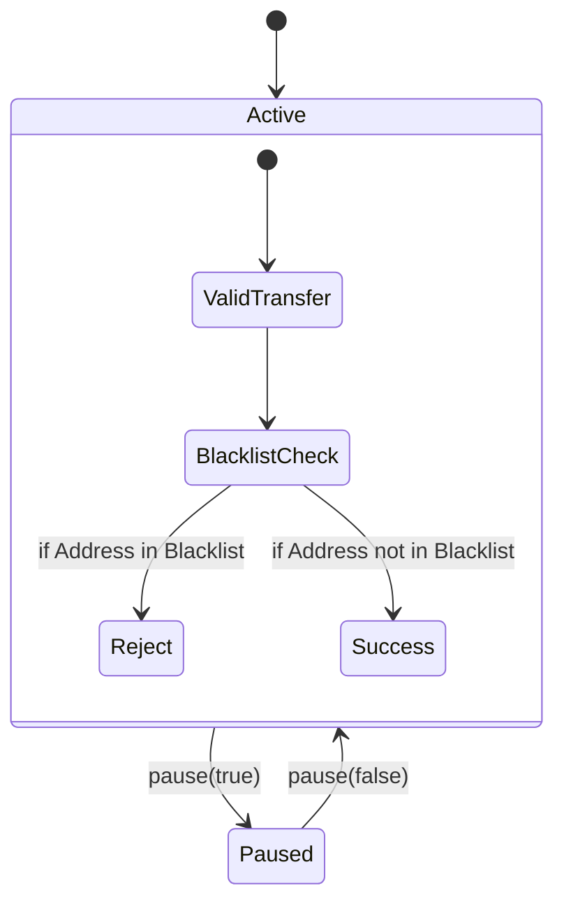

# SSS On-Chain Programs

The core of the Solana Stablecoin Standard, implemented as safe, modular Anchor programs.

## 📦 Programs

### 1. SSS Core (`programs/sss`)
The central authority and state registry. 
- **Roles**: Manages Master, Minter, Burner, Pauser, Blacklister, and Seizer roles.
- **Quotas**: Enforces mint limits per minter.
- **Invariants**: Enforces supply conservation and RBAC.

### 2. Transfer Hook (`programs/transfer_hook`)
Intercepts all `spl-token-2022` transfers to enforce compliance.
- **Logic**: Reads the `BlacklistRegistry` PDA from the Core program.
- **Result**: Atomic rejection of transfers involving sanctioned addresses.

## 🔐 Security Invariants



## 🛠️ Build & Test

```bash
anchor build
anchor test
```

## 📍 PDAs (Seeds)
- **Config**: `[b"config", mint_pubkey]`
- **Role**: `[b"role", config_pubkey, user_pubkey]`
- **Quota**: `[b"quota", config_pubkey, minter_pubkey]`
- **Blacklist**: `[b"blacklist", config_pubkey, user_pubkey]`
