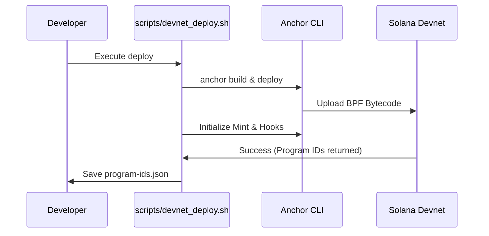

# SSS Operational Scripts

A collection of utility scripts for deployment, testing, and devnet verification.

## 📄 Scripts

- `devnet_deploy.sh`: Orchestrates a full SSS cluster deployment to Solana Devnet.
- `local_validator.sh`: Spins up a pre-configured local validator with Token-2022 and SSS programs pre-loaded.
- `faucet_airdrop.sh`: Utility to airdrop SOL and mock collateral to test accounts.

## 🚢 Deployment Flow



## 🛠️ Usage
```bash
./scripts/devnet_deploy.sh
```
*Note: Ensure your `solana config` is set to devnet before running.*
