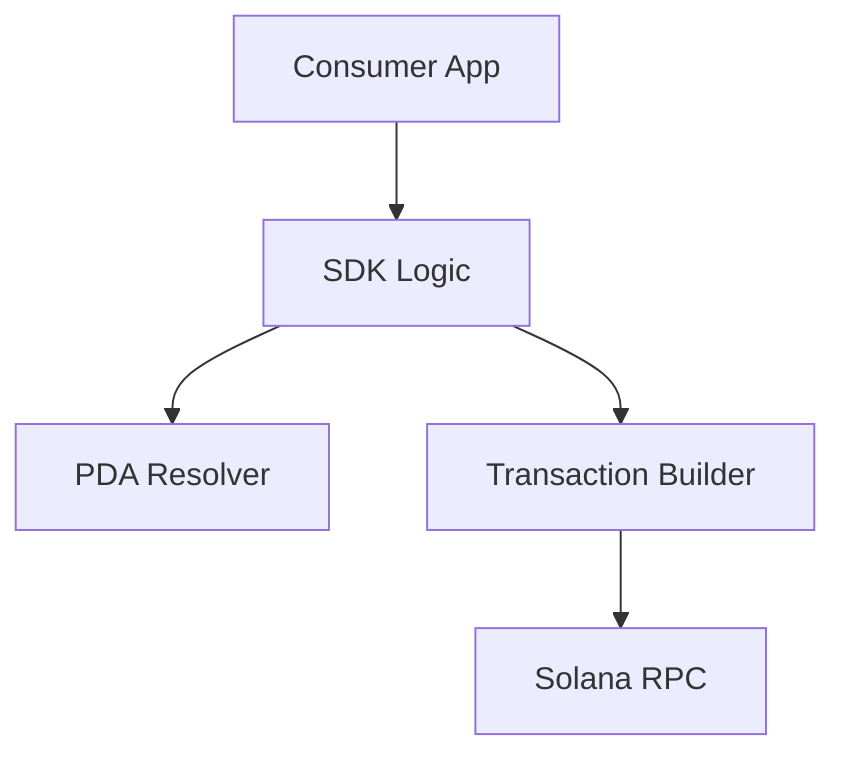

# SSS TypeScript SDK

The official library for interacting with the Solana Stablecoin Standard.

## 📦 Installation
```bash
npm install @stbr/sss-token
```

## 🚀 Usage

### Loading a Stablecoin
```typescript
import { SolanaStablecoin } from "@stbr/sss-token";

const stable = await SolanaStablecoin.load(connection, programId, mintPubkey);
```

### Executing Compliance
```typescript
await stable.compliance.blacklistAdd(address, "compliance_alert");
await stable.compliance.seize(address, treasury, amount);
```

### Monetary Controls
```typescript
await stable.mint(recipient, 1000);
await stable.admin.updateQuota(minter, 5000000);
```

## 🛠️ Architecture

The SDK handles:
1. **PDA Derivation**: Automatic seed mapping for all registries.
2. **Instruction Composition**: Atomic bundling of Compute Budget + SSS Instructions.
3. **Type Safety**: Full TypeScript support for Anchor events and error codes.


