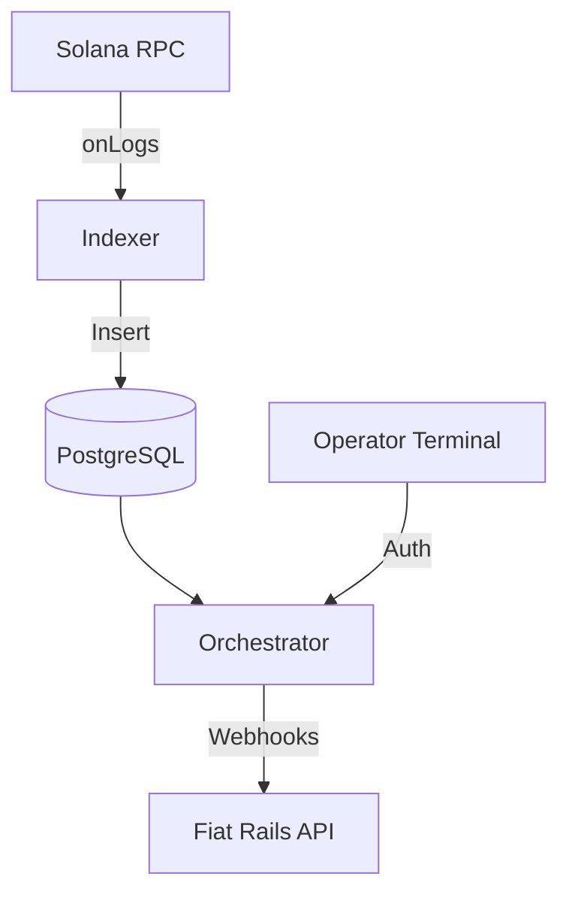

# SSS Backend Services

A set of Docker-composed microservices providing persistence, orchestration, and audit capabilities for the stablecoin lifecycle.

## 📦 Services

### 1. Indexer (`services/indexer`)
- **Role**: Real-time blockchain event listener.
- **Commitment**: Finalized (Reorg resilient).
- **Output**: Persists `Mint`, `Burn`, `Blacklist`, and `Seize` events to PostgreSQL.

### 2. Orchestrator (`services/orchestrator`)
- **Role**: Fiat-to-SSS bridge coordinator.
- **Security**: Guarded by `X-API-KEY`.
- **Reliability**: Implements a persistent task queue in PostgreSQL with `SELECT FOR UPDATE SKIP LOCKED` for atomic webhook delivery.

### 3. Compliance API (`services/compliance`)
- **Role**: High-level REST abstraction for compliance operations.
- **Endpoints**: `/api/compliance/freeze`, `/api/compliance/blacklist`.

## 🏗️ Architecture



## 🚀 Running the Services
```bash
docker compose up --build
```

## 📊 Database Schema
The database (`sss`) contains:
- `stablecoin_events`: Canonical audit trail.
- `webhook_queue`: Fault-tolerant delivery system.
