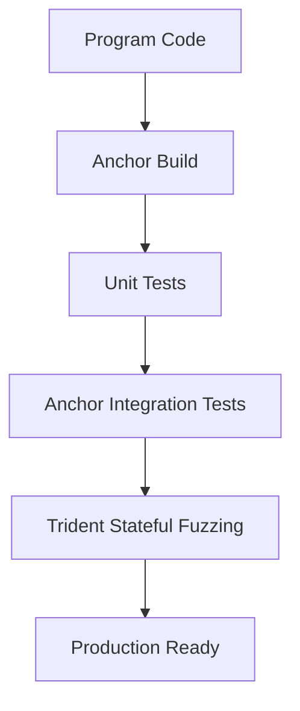

# SSS Verification Suite

The SSS protocol implements a multi-tier testing strategy to ensure monetary integrity and compliance enforcement.

## 🧪 Testing Tiers

### 1. Integration Tests (`tests/sss.ts`)
- **Framework**: Mocha/Chai via Anchor.
- **Coverage**: Full lifecycle testing (Init $\to$ Mint $\to$ Blacklist $\to$ Seize).
- **Safety**: Includes negative tests for role bypass and quota exhaustion.

### 2. Fuzz Testing (`tests/trident`)
- **Framework**: Trident (Rust-based stateful fuzzer).
- **Focus**: Invariant verification across randomized operation sequences.
- **Target**: Proving `Supply == sum(Balances)` under duress.

## 🏗️ Verification Flow



## 🛠️ Running Tests

### Standard Tests
```bash
anchor test
```

### Fuzz Tests
```bash
cd tests/trident
cargo trident fuzz run
```

## 🛡️ Key Verified Invariants
1. **Supply Conservation**: Mint/Burn entropy must be zero-sum.
2. **Quota Barrier**: Minter cannot exceed pre-assigned PDA quota.
3. **Hook Atomicity**: Blacklisted users cannot exit the system via transfer.
