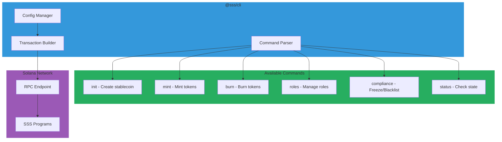
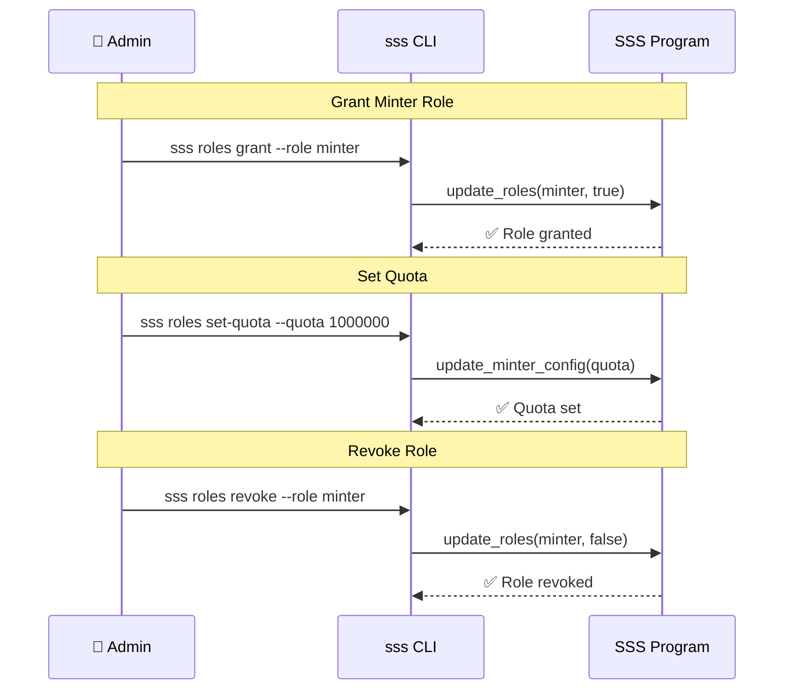
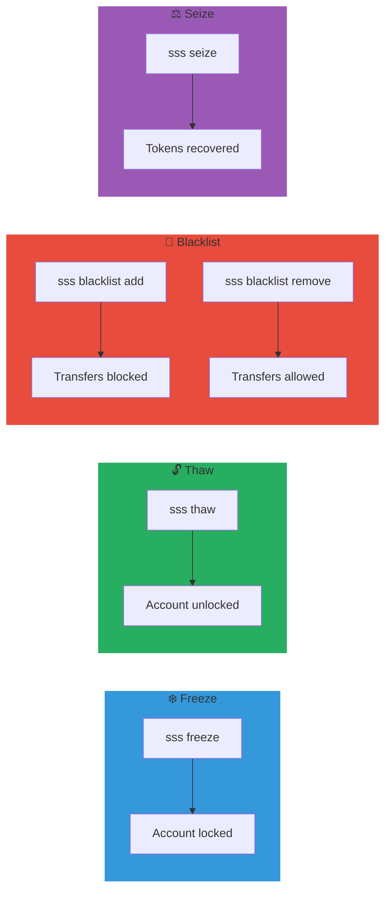

# CLI Reference

The SSS CLI provides command-line access to all stablecoin operations.

## CLI Architecture



## Installation

```bash
# Install globally
npm install -g @sss/cli

# Or use npx
npx @sss/cli --help
```

## Configuration

### Set RPC URL

```bash
# Use devnet
sss config set --rpc https://api.devnet.solana.com

# Use mainnet
sss config set --rpc https://api.mainnet-beta.solana.com
```

### Set Keypair

```bash
# Use default Solana keypair
sss config set --keypair ~/.config/solana/id.json

# Use custom keypair
sss config set --keypair /path/to/keypair.json
```

### View Config

```bash
sss config show
```

## Commands

### Initialize Stablecoin

```bash
sss init \
  --name "My Stablecoin" \
  --symbol "MUSD" \
  --decimals 6 \
  --preset sss2 \
  --supply-cap 1000000000 \
  --backing-type fiat \
  --banking-rail swift \
  --uri "https://example.com/metadata.json"
```

**Options:**

| Option | Description | Required |
|--------|-------------|----------|
| `--name` | Token name | ✅ |
| `--symbol` | Token symbol | ✅ |
| `--decimals` | Decimal places (default: 6) | ❌ |
| `--preset` | sss1, sss2, or sss3 | ✅ |
| `--supply-cap` | Max supply (0 = unlimited) | ❌ |
| `--backing-type` | fiat, commodity, crypto, treasury, mixed | ✅ |
| `--banking-rail` | swift, sepa, fedwire, wire, ach, none | ✅ |
| `--uri` | Metadata URI | ❌ |

### Mint Tokens

```bash
sss mint \
  --config <CONFIG_PDA> \
  --amount 1000000000 \
  --recipient <RECIPIENT_PUBKEY>
```

### Burn Tokens

```bash
sss burn \
  --config <CONFIG_PDA> \
  --amount 500000000 \
  --token-account <TOKEN_ACCOUNT>
```

### Role Management

### CLI Role Management Flow



```bash
# Grant minter role
sss roles grant \
  --config <CONFIG_PDA> \
  --target <USER_PUBKEY> \
  --role minter

# Revoke role
sss roles revoke \
  --config <CONFIG_PDA> \
  --target <USER_PUBKEY> \
  --role minter

# Set minter quota
sss roles set-quota \
  --config <CONFIG_PDA> \
  --minter <MINTER_PUBKEY> \
  --quota 1000000000000
```

### Compliance Operations

### CLI Compliance Workflow



```bash
# Freeze account
sss freeze \
  --config <CONFIG_PDA> \
  --address <ACCOUNT_PUBKEY>

# Thaw account
sss thaw \
  --config <CONFIG_PDA> \
  --address <ACCOUNT_PUBKEY>

# Add to blacklist
sss blacklist add \
  --config <CONFIG_PDA> \
  --address <ADDRESS_PUBKEY> \
  --reason "Compliance violation"

# Remove from blacklist
sss blacklist remove \
  --config <CONFIG_PDA> \
  --address <ADDRESS_PUBKEY>

# Seize tokens
sss seize \
  --config <CONFIG_PDA> \
  --address <ADDRESS_PUBKEY> \
  --amount 1000000000
```

### Pause/Unpause

```bash
# Emergency pause
sss pause --config <CONFIG_PDA>

# Resume operations
sss unpause --config <CONFIG_PDA>
```

### Authority Transfer

```bash
# Nominate new authority
sss authority nominate \
  --config <CONFIG_PDA> \
  --new-authority <NEW_AUTHORITY_PUBKEY>

# Accept authority (run by new authority)
sss authority accept \
  --config <CONFIG_PDA>

# Cancel nomination
sss authority cancel \
  --config <CONFIG_PDA>
```

### Oracle Configuration

```bash
# Configure oracle
sss oracle configure \
  --config <CONFIG_PDA> \
  --price-feed <PYTH_PRICE_ACCOUNT> \
  --max-staleness 300 \
  --max-deviation 100 \
  --target-price 1000000

# Enable/disable oracle
sss oracle toggle \
  --config <CONFIG_PDA> \
  --enabled true
```

### Banking Operations

```bash
# Create mint request
sss banking mint-request \
  --config <CONFIG_PDA> \
  --depositor <DEPOSITOR_PUBKEY> \
  --recipient <RECIPIENT_PUBKEY> \
  --amount 10000000000 \
  --fiat-amount 10000 \
  --reference "WIRE-REF-001"

# Confirm and mint
sss banking confirm \
  --config <CONFIG_PDA> \
  --request <REQUEST_PDA>

# Create redemption
sss banking redeem \
  --config <CONFIG_PDA> \
  --amount 5000000000 \
  --iban "DE89370400440532013000"
```

### Query Commands

```bash
# Show stablecoin info
sss info --config <CONFIG_PDA>

# Show roles for user
sss roles show \
  --config <CONFIG_PDA> \
  --user <USER_PUBKEY>

# Check blacklist status
sss blacklist check \
  --config <CONFIG_PDA> \
  --address <ADDRESS_PUBKEY>

# Show supply stats
sss supply --config <CONFIG_PDA>
```

## Output Formats

```bash
# JSON output
sss info --config <CONFIG_PDA> --output json

# Table output (default)
sss info --config <CONFIG_PDA> --output table

# Minimal output
sss info --config <CONFIG_PDA> --output minimal
```

## Environment Variables

| Variable | Description |
|----------|-------------|
| `SSS_RPC_URL` | Solana RPC endpoint |
| `SSS_KEYPAIR` | Path to keypair file |
| `SSS_CONFIG` | Default config PDA |
| `SSS_PROGRAM_ID` | SSS token program ID |

## Examples

### Complete Workflow

```bash
# 1. Initialize stablecoin
sss init \
  --name "Test USD" \
  --symbol "TUSD" \
  --preset sss2 \
  --backing-type fiat \
  --banking-rail swift

# Output: Config PDA: 5xyz...

# 2. Grant minter role
sss roles grant \
  --config 5xyz... \
  --target 7abc... \
  --role minter

# 3. Set minter quota
sss roles set-quota \
  --config 5xyz... \
  --minter 7abc... \
  --quota 1000000000000

# 4. Mint tokens
sss mint \
  --config 5xyz... \
  --amount 1000000000 \
  --recipient 9def...

# 5. Check supply
sss supply --config 5xyz...
```

## Error Handling

Common errors and solutions:

| Error | Cause | Solution |
|-------|-------|----------|
| `QuotaExceeded` | Minter quota reached | Wait for epoch reset or increase quota |
| `SupplyCapExceeded` | Supply cap reached | Burn tokens or increase cap |
| `Unauthorized` | Missing role | Grant required role |
| `Paused` | Stablecoin is paused | Unpause first |
| `Blacklisted` | Address is blacklisted | Remove from blacklist |

## Next Steps

- [SDK Guide](./sdk-guide.md) - Programmatic access
- [Operations](../operations/operations.md) - Day-to-day operations
- [FAQ](../reference/faq.md) - Common questions
