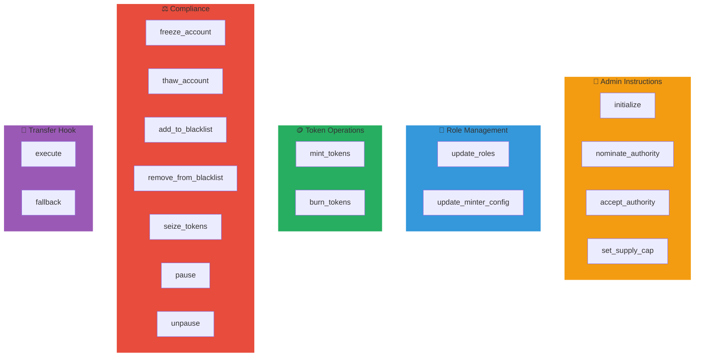
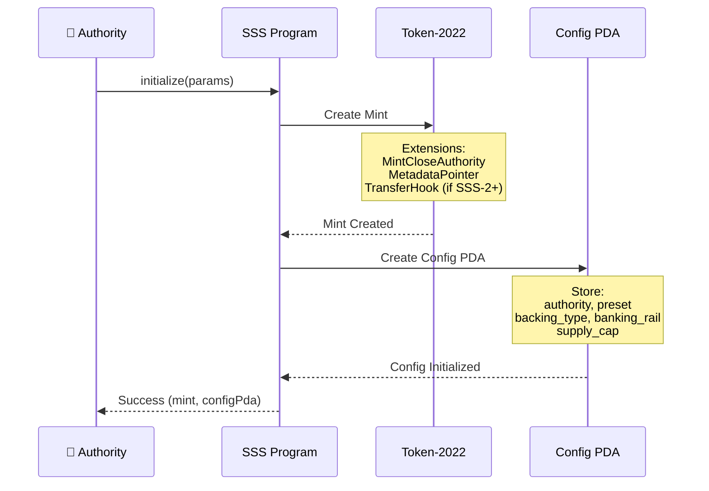
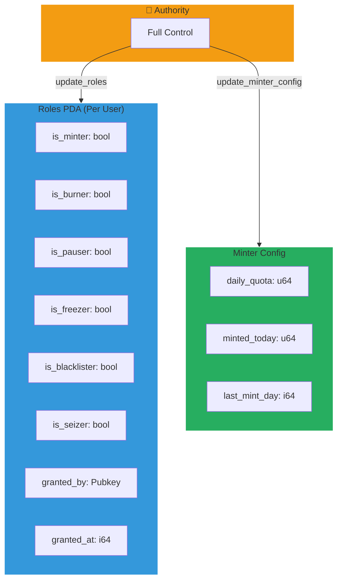
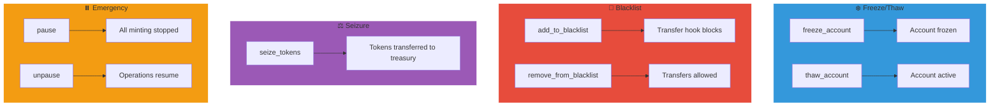

# API Reference

Complete documentation for all Solana Stablecoin Standard instructions.

## Instruction Categories



## Program IDs

| Network | Program | Address |
|---------|---------|---------|
| **Devnet** | sss-token | `2L6rZHyqhJ9VJqXhbgW7vyP3uerrw7Vzpp3qtqAq1FZj` |
| **Devnet** | sss-transfer-hook | `E3pPcPAU4Un7WMaHyMnG6L3SJ8dNu4gjZGU6ExqvhRzS` |
| **Mainnet** | sss-token | TBD |
| **Mainnet** | sss-transfer-hook | TBD |

### configure_oracle

Configures oracle validation settings for price-sensitive operations.

Typical parameters include:

- `price_feed`: oracle account public key
- `max_staleness_seconds`: maximum acceptable feed age
- `max_deviation_bps`: allowable deviation threshold
- `target_price`: expected reference price

Use this instruction before enabling oracle-dependent minting controls.

---

## Admin Instructions

### Initialize Flow



### initialize

Creates a new stablecoin with Token-2022 extensions.

**Accounts:**

| Account | Type | Description |
|---------|------|-------------|
| `authority` | Signer | Initial authority (pays for account creation) |
| `config` | PDA | Stablecoin configuration account |
| `mint` | PDA | Token mint account |
| `system_program` | Program | System program |
| `token_program` | Program | Token-2022 program |

**Arguments:**

| Argument | Type | Description |
|----------|------|-------------|
| `name` | String | Token name (max 32 chars) |
| `symbol` | String | Token symbol (max 10 chars) |
| `decimals` | u8 | Token decimals (typically 6) |
| `preset` | Preset | SSS-1, SSS-2, or SSS-3 |
| `supply_cap` | u64 | Maximum supply (0 = unlimited) |
| `backing_type` | BackingType | Asset backing type |
| `banking_rail` | BankingRail | Primary banking rail |
| `uri` | String | Metadata URI |
| `hook_program_id` | `Option<Pubkey>` | Transfer hook program (SSS-2+) |

**Example:**

```typescript
const { mint, configPda } = await client.initialize({
  name: 'USD Stablecoin',
  symbol: 'USDS',
  decimals: 6,
  preset: Preset.Sss2,
  supplyCap: 1_000_000_000_000_000n,
  backingType: BackingType.Fiat,
  bankingRail: BankingRail.Swift,
  uri: 'https://example.com/metadata.json',
});
```

---

### nominate_authority

### Two-Step Authority Transfer

```mermaid
sequenceDiagram
    participant Current as 👤 Current Authority
    participant Program as SSS Program
    participant Config as Config PDA
    participant New as 👤 New Authority
    
    rect rgb(40, 40, 80)
        Note over Current,New: Step 1: Nomination
        Current->>Program: nominate_authority(new_authority)
        Program->>Config: Set pending_authority
        Config-->>Current: ✅ Nominated
    end
    
    rect rgb(40, 80, 40)
        Note over Current,New: Step 2: Acceptance
        New->>Program: accept_authority()
        Program->>Config: Verify pending_authority
        Program->>Config: Update authority
        Program->>Config: Clear pending_authority
        Config-->>New: ✅ Authority transferred
    end
```



Nominates a new authority (first step of two-step transfer).

**Accounts:**

| Account | Type | Description |
|---------|------|-------------|
| `authority` | Signer | Current authority |
| `config` | PDA | Stablecoin configuration |
| `mint` | Account | Token mint |

**Arguments:**

| Argument | Type | Description |
|----------|------|-------------|
| `new_authority` | Pubkey | Address to nominate |

**Example:**

```typescript
await client.nominateAuthority({
  newAuthority: newAuthorityPubkey,
  config: configPda,
});
```

---

### accept_authority

Accepts authority nomination (second step of two-step transfer).

**Accounts:**

| Account | Type | Description |
|---------|------|-------------|
| `new_authority` | Signer | Nominated authority |
| `config` | PDA | Stablecoin configuration |
| `mint` | Account | Token mint |

**Example:**

```typescript
// Called by the new authority
await client.acceptAuthority({
  config: configPda,
});
```

---

### set_supply_cap

Updates the maximum token supply.

**Accounts:**

| Account | Type | Description |
|---------|------|-------------|
| `authority` | Signer | Current authority |
| `config` | PDA | Stablecoin configuration |
| `mint` | Account | Token mint |

**Arguments:**

| Argument | Type | Description |
|----------|------|-------------|
| `new_cap` | u64 | New supply cap (0 = unlimited) |

**Example:**

```typescript
await client.setSupplyCap({
  newCap: 2_000_000_000_000_000n, // 2B tokens
  config: configPda,
});
```

---

## Role Management

### Role System Architecture



### update_roles

Grants or revokes a role for a user.

**Accounts:**

| Account | Type | Description |
|---------|------|-------------|
| `authority` | Signer | Current authority |
| `config` | PDA | Stablecoin configuration |
| `mint` | Account | Token mint |
| `roles` | PDA | RolesConfig account |
| `system_program` | Program | System program |

**Arguments:**

| Argument | Type | Description |
|----------|------|-------------|
| `target` | Pubkey | User to grant/revoke role |
| `role` | u8 | Role type (0-5) |
| `active` | bool | Grant (true) or revoke (false) |

**Role Types:**

| Value | Role |
|-------|------|
| 0 | Minter |
| 1 | Burner |
| 2 | Pauser |
| 3 | Freezer |
| 4 | Blacklister |
| 5 | Seizer |

**Example:**

```typescript
await client.updateRoles({
  target: minterPubkey,
  role: Role.Minter,
  active: true,
  config: configPda,
});
```

---

### update_minter_config

Sets minting quota for a minter.

**Arguments:**

| Argument | Type | Description |
|----------|------|-------------|
| `minter` | Pubkey | Minter address |
| `quota` | u64 | Daily quota (resets every 24h) |

**Example:**

```typescript
await client.updateMinterConfig({
  minter: minterPubkey,
  quota: 1_000_000_000_000n, // 1M tokens/day
  config: configPda,
});
```

---

## Minting Operations

### Mint & Burn Flow

```mermaid
sequenceDiagram
    participant Minter as 🪙 Minter
    participant Program as SSS Program
    participant Config as Config PDA
    participant Token22 as Token-2022
    participant ATA as Recipient ATA
    
    rect rgb(40, 80, 40)
        Note over Minter,ATA: Mint Flow
        Minter->>Program: mint_tokens(amount)
        Program->>Config: Verify minter role
        Program->>Config: Check quota
        Program->>Config: Check supply cap
        Program->>Token22: MintTo
        Token22->>ATA: Tokens credited
        Program->>Config: Update minted_today
        Program-->>Minter: ✅ Success
    end
    
    rect rgb(80, 40, 40)
        Note over Minter,ATA: Burn Flow
        Minter->>Program: burn_tokens(amount)
        Program->>Config: Verify burner role
        Program->>Token22: Burn
        Token22->>Token22: Supply decreased
        Program->>Config: Update total_burned
        Program-->>Minter: ✅ Success
    end
```



### mint_tokens

Mints new tokens to a recipient.

**Accounts:**

| Account | Type | Description |
|---------|------|-------------|
| `minter` | Signer | Authorized minter |
| `config` | PDA | Stablecoin configuration |
| `mint` | Account | Token mint |
| `roles` | PDA | Minter's RolesConfig |
| `to` | TokenAccount | Recipient token account |
| `token_program` | Program | Token-2022 program |

**Arguments:**

| Argument | Type | Description |
|----------|------|-------------|
| `amount` | u64 | Amount to mint |

**Example:**

```typescript
await client.mintTokens({
  amount: 1_000_000_000n, // 1000 tokens
  recipient: recipientPubkey,
  config: configPda,
});
```

---

### burn_tokens

Burns tokens from the minter's account.

**Arguments:**

| Argument | Type | Description |
|----------|------|-------------|
| `amount` | u64 | Amount to burn |

**Example:**

```typescript
await client.burnTokens({
  amount: 500_000_000n,
  config: configPda,
});
```

---

### mint_with_oracle

Mints tokens with Pyth oracle price validation.

**Accounts:**

| Account | Type | Description |
|---------|------|-------------|
| `minter` | Signer | Authorized minter |
| `config` | PDA | Stablecoin configuration |
| `mint` | Account | Token mint |
| `roles` | PDA | Minter's RolesConfig |
| `oracle_config` | PDA | Oracle configuration |
| `price_feed` | Account | Pyth price feed account |
| `to` | TokenAccount | Recipient token account |
| `token_program` | Program | Token-2022 program |

**Arguments:**

| Argument | Type | Description |
|----------|------|-------------|
| `amount` | u64 | Amount to mint |

**Example:**

```typescript
await client.mintWithOracle({
  amount: 1_000_000_000n,
  recipient: recipientPubkey,
  config: configPda,
  priceFeed: pythUsdPriceFeed,
});
```

---

## Compliance Operations

### Compliance Operations Flow



### freeze_account

Freezes a token account, preventing transfers.

**Example:**

```typescript
await client.freezeAccount({
  address: suspiciousAccount,
  config: configPda,
});
```

---

### thaw_account

Unfreezes a previously frozen account.

**Example:**

```typescript
await client.thawAccount({
  address: clearedAccount,
  config: configPda,
});
```

---

### add_to_blacklist

Adds an address to the blacklist. (SSS-2+ only)

**Example:**

```typescript
await client.addToBlacklist({
  address: badActor,
  config: configPda,
});
```

---

### remove_from_blacklist

Removes an address from the blacklist.

**Example:**

```typescript
await client.removeFromBlacklist({
  address: clearedAddress,
  config: configPda,
});
```

---

### seize

Seizes tokens from an account. (SSS-2+ only)

**Arguments:**

| Argument | Type | Description |
|----------|------|-------------|
| `amount` | u64 | Amount to seize |

**Example:**

```typescript
await client.seize({
  address: badActor,
  amount: 1_000_000_000n,
  config: configPda,
});
```

---

### pause

Pauses all minting operations.

**Example:**

```typescript
await client.pause({
  config: configPda,
});
```

---

### unpause

Resumes operations after pause.

**Example:**

```typescript
await client.unpause({
  config: configPda,
});
```

---

## Banking Rails

### create_mint_request

Creates a mint request after bank deposit.

**Arguments:**

| Argument | Type | Description |
|----------|------|-------------|
| `amount` | u64 | Stablecoin amount |
| `fiat_amount` | u64 | Fiat amount (smallest unit) |
| `fiat_currency` | FiatCurrency | USD, EUR, etc. |
| `reference_id` | [u8; 32] | Bank wire reference |

**Example:**

```typescript
await client.createMintRequest({
  depositor: customerPubkey,
  recipient: customerPubkey,
  amount: 10_000_000_000n, // 10,000 tokens
  fiatAmount: 10000_00n, // $10,000.00
  fiatCurrency: FiatCurrency.Usd,
  referenceId: wireReference,
  config: configPda,
});
```

---

### confirm_and_mint

Confirms bank deposit and mints tokens.

**Example:**

```typescript
await client.confirmAndMint({
  requestPda: mintRequestPda,
  config: configPda,
});
```

---

### create_redemption

Burns tokens and creates redemption request.

**Arguments:**

| Argument | Type | Description |
|----------|------|-------------|
| `amount` | u64 | Amount to redeem |
| `bank_account_hash` | [u8; 32] | Hash of bank details |

**Example:**

```typescript
await client.createRedemption({
  amount: 5_000_000_000n,
  bankAccountHash: hashedBankDetails,
  config: configPda,
});
```

---

### complete_redemption

Marks redemption as completed after wire transfer.

**Arguments:**

| Argument | Type | Description |
|----------|------|-------------|
| `wire_reference` | [u8; 32] | Outgoing wire reference |

**Example:**

```typescript
await client.completeRedemption({
  requestPda: redemptionRequestPda,
  wireReference: outgoingWireRef,
  config: configPda,
});
```

---

## Oracle Configuration

### configure_oracle

Configures Pyth oracle for price validation.

**Arguments:**

| Argument | Type | Description |
|----------|------|-------------|
| `price_feed` | Pubkey | Pyth price feed account |
| `max_staleness_seconds` | u64 | Max price age |
| `max_deviation_bps` | u16 | Max price deviation |
| `target_price` | i64 | Expected price (e.g., $1.00) |

**Example:**

```typescript
await client.configureOracle({
  priceFeed: pythUsdcPriceFeed,
  maxStalenessSeconds: 60,
  maxDeviationBps: 200, // 2%
  targetPrice: 100_000_000n, // $1.00 with 8 decimals
  config: configPda,
});
```

---

### toggle_oracle

Enables or disables oracle validation.

**Arguments:**

| Argument | Type | Description |
|----------|------|-------------|
| `enabled` | bool | Enable/disable |

**Example:**

```typescript
await client.toggleOracle({
  enabled: true,
  config: configPda,
});
```

---

## Reserve Attestation

### submit_attestation

Submits proof-of-reserves attestation.

**Arguments:**

| Argument | Type | Description |
|----------|------|-------------|
| `total_reserves` | u64 | Total reserve value |
| `valid_for_seconds` | i64 | Attestation validity period |
| `ipfs_hash` | [u8; 32] | IPFS hash of audit report |

**Example:**

```typescript
await client.submitAttestation({
  totalReserves: 100_000_000_000_000n,
  validForSeconds: 86400, // 24 hours
  ipfsHash: auditReportHash,
  config: configPda,
});
```

---

## Error Codes

| Code | Name | Description |
|------|------|-------------|
| 6000 | Paused | Protocol is paused |
| 6001 | Unauthorized | Not authorized for operation |
| 6002 | SupplyCapExceeded | Supply cap would be exceeded |
| 6003 | QuotaExceeded | Minter quota exceeded |
| 6004 | Blacklisted | Address is blacklisted |
| 6005 | FeatureNotEnabled | Feature not available for preset |
| 6006 | NameTooLong | Name exceeds 32 characters |
| 6007 | SymbolTooLong | Symbol exceeds 10 characters |
| 6008 | InvalidAmount | Amount is zero or invalid |
| 6009 | NotMinter | Signer is not a minter |
| 6010 | NotFreezer | Signer is not a freezer |
| 6011 | OraclePriceStale | Oracle price is stale |
| 6012 | PriceDeviationExceeded | Price deviation too high |

---

Next: [SDK Guide](./sdk-guide.md) - TypeScript SDK documentation
