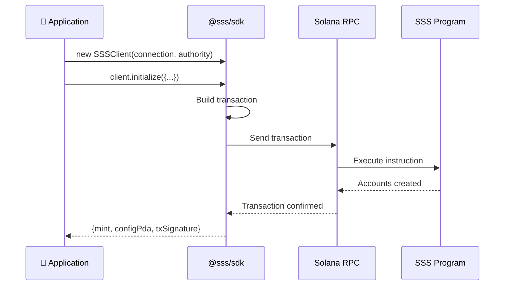
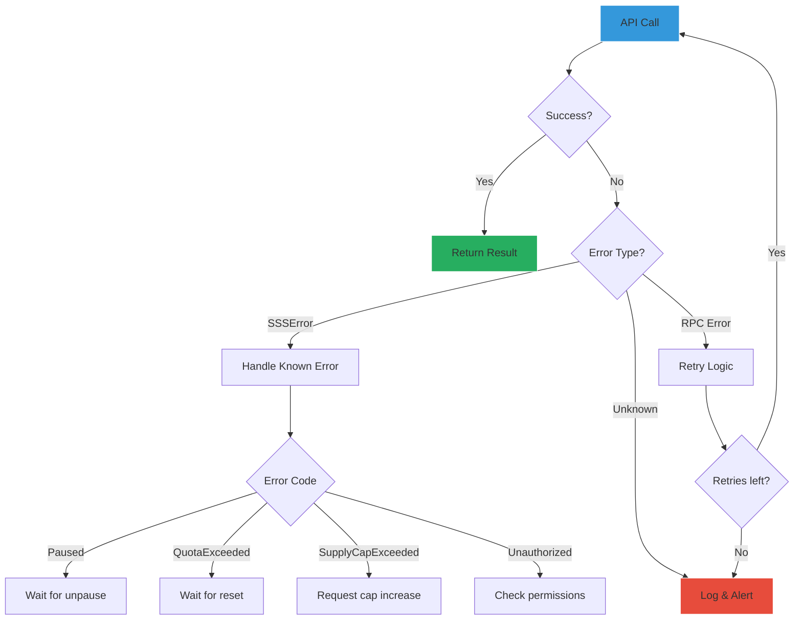
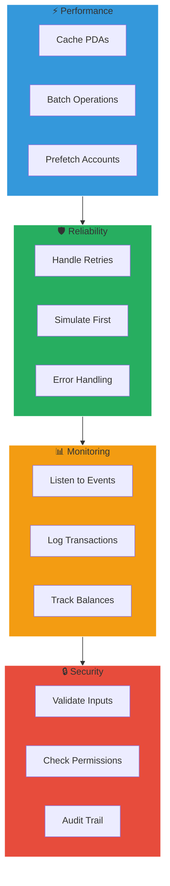

# SDK Guide

Complete guide to using the `@sss/sdk` TypeScript SDK.

## SDK Architecture

```mermaid
flowchart TB
    subgraph Application["Your Application"]
        A[TypeScript Code]
    end
    
    subgraph SDK["@sss/sdk"]
        B[SSSClient]
        C[PDA Derivation]
        D[Transaction Builders]
        E[Type Definitions]
    end
    
    subgraph Solana["Solana Network"]
        F[Connection]
        G[Token-2022]
        H[SSS Programs]
    end
    
    A --> B
    B --> C
    B --> D
    B --> E
    D --> F
    F --> G
    F --> H
    
    style Application fill:#1a1a2e,stroke:#4ecdc4
    style SDK fill:#2d3748,stroke:#f39c12
    style Solana fill:#1a1a2e,stroke:#9b59b6
```



## Installation

```bash
npm install @sss/sdk
```

## Quick Start



```typescript
import { Connection, Keypair } from '@solana/web3.js';
import { SSSClient, Preset, BackingType, BankingRail } from '@sss/sdk';

// Initialize connection
const connection = new Connection('https://api.devnet.solana.com', 'confirmed');

// Load authority keypair
const authority = Keypair.fromSecretKey(/* your key */);

// Create client
const client = new SSSClient(connection, authority.publicKey);
```

## SSSClient API

### Constructor

```typescript
const client = new SSSClient(
  connection: Connection,
  authority: PublicKey,
  options?: {
    programId?: PublicKey,
    hookProgramId?: PublicKey,
  }
);
```

### PDA Derivation

```mermaid
flowchart TB
    subgraph PDAs["Program Derived Addresses"]
        A[Mint Address]
        B[Config PDA<br/>seeds: config + mint]
        C[Roles PDA<br/>seeds: roles + config + user]
        D[Blacklist PDA<br/>seeds: blacklist + config + address]
        E[Oracle PDA<br/>seeds: oracle + config]
        F[Extra Metas PDA<br/>seeds: extra-account-metas + mint]
    end
    
    A --> B
    B --> C
    B --> D
    B --> E
    A --> F
    
    style PDAs fill:#1a1a2e,stroke:#4ecdc4
```



```typescript
// Get config PDA
const configPda = client.getConfigPda(mint);

// Get roles PDA
const rolesPda = client.getRolesPda(configPda, user);

// Get blacklist PDA
const blacklistPda = client.getBlacklistPda(configPda, address);

// Get oracle PDA
const oraclePda = client.getOraclePda(configPda);
```

## Type Definitions

### Type Hierarchy

```mermaid
flowchart TB
    subgraph Enums["Core Enums"]
        P[Preset<br/>Sss1 | Sss2 | Sss3]
        BT[BackingType<br/>Fiat | Gold | Crypto | ...]
        BR[BankingRail<br/>Swift | Ach | Sepa | ...]
        R[Role<br/>Minter | Burner | ...]
        FC[FiatCurrency<br/>Usd | Eur | Gbp | ...]
    end
    
    subgraph Init["Initialize Params"]
        I[InitializeParams]
        I --> P
        I --> BT
        I --> BR
    end
    
    subgraph Roles["Role Management"]
        RP[RoleParams]
        RP --> R
    end
    
    style Enums fill:#1a1a2e,stroke:#4ecdc4
    style Init fill:#2d3748,stroke:#f39c12
    style Roles fill:#2d3748,stroke:#9b59b6
```

### Preset

```typescript
enum Preset {
  Sss1 = 0,  // Basic
  Sss2 = 1,  // Full compliance
  Sss3 = 2,  // Privacy
}
```

### BackingType

```typescript
enum BackingType {
  Fiat = 0,
  Gold = 1,
  Crypto = 2,
  Commodity = 3,
  RealEstate = 4,
  MultiAsset = 5,
  Algorithmic = 6,
}
```

### BankingRail

```typescript
enum BankingRail {
  Swift = 0,
  Ach = 1,
  Sepa = 2,
  Fedwire = 3,
  Fps = 4,
  Pix = 5,
  Upi = 6,
  None = 7,
}
```

### FiatCurrency

```typescript
enum FiatCurrency {
  Usd = 0,
  Eur = 1,
  Gbp = 2,
  Jpy = 3,
  Chf = 4,
  Cad = 5,
  Aud = 6,
  Cny = 7,
}
```

### Role

```typescript
enum Role {
  Minter = 0,
  Burner = 1,
  Pauser = 2,
  Freezer = 3,
  Blacklister = 4,
  Seizer = 5,
}
```

## Usage Examples

### Initialize a Stablecoin

```typescript
const { mint, configPda, txSignature } = await client.initialize({
  name: 'My USD',
  symbol: 'MUSD',
  decimals: 6,
  preset: Preset.Sss2,
  supplyCap: 1_000_000_000_000_000n,
  backingType: BackingType.Fiat,
  bankingRail: BankingRail.Swift,
  uri: 'https://example.com/metadata.json',
  hookProgramId: HOOK_PROGRAM_ID,
});
```

### Role Management

```typescript
// Grant minter role
await client.updateRoles({
  target: minterPubkey,
  role: Role.Minter,
  active: true,
  config: configPda,
});

// Set minting quota
await client.updateMinterConfig({
  minter: minterPubkey,
  quota: 1_000_000_000_000n, // 1M tokens/day
  config: configPda,
});

// Revoke role
await client.updateRoles({
  target: minterPubkey,
  role: Role.Minter,
  active: false,
  config: configPda,
});
```

### Minting and Burning

```typescript
// Mint tokens
await client.mintTokens({
  amount: 1_000_000_000n,
  recipient: recipientPubkey,
  config: configPda,
});

// Burn tokens
await client.burnTokens({
  amount: 500_000_000n,
  config: configPda,
});
```

### Compliance Operations

```typescript
// Freeze account
await client.freezeAccount({
  address: suspiciousAccount,
  config: configPda,
});

// Thaw account
await client.thawAccount({
  address: clearedAccount,
  config: configPda,
});

// Blacklist (SSS-2+)
await client.addToBlacklist({
  address: badActor,
  config: configPda,
});

// Remove from blacklist
await client.removeFromBlacklist({
  address: clearedAddress,
  config: configPda,
});

// Seize tokens (SSS-2+)
await client.seize({
  address: badActor,
  amount: 1_000_000_000n,
  config: configPda,
});

// Pause/Unpause
await client.pause({ config: configPda });
await client.unpause({ config: configPda });
```

### Authority Transfer

```typescript
// Step 1: Nominate new authority
await client.nominateAuthority({
  newAuthority: newAuthorityPubkey,
  config: configPda,
});

// Step 2: New authority accepts (called by new authority)
const newClient = new SSSClient(connection, newAuthorityPubkey);
await newClient.acceptAuthority({
  config: configPda,
});
```

### Banking Rails

```typescript
// Create mint request after receiving bank wire
const { requestPda } = await client.createMintRequest({
  depositor: customerPubkey,
  recipient: customerPubkey,
  amount: 10_000_000_000n,
  fiatAmount: 10000_00n,
  fiatCurrency: FiatCurrency.Usd,
  referenceId: wireReference, // 32-byte reference
  config: configPda,
});

// Confirm and mint after bank verification
await client.confirmAndMint({
  requestPda,
  config: configPda,
});

// Create redemption request
const { redemptionPda } = await client.createRedemption({
  amount: 5_000_000_000n,
  bankAccountHash: hashedBankDetails, // 32-byte hash
  config: configPda,
});

// Complete redemption after wire sent
await client.completeRedemption({
  requestPda: redemptionPda,
  wireReference: outgoingWireRef,
  config: configPda,
});
```

### Oracle Configuration

```typescript
// Configure Pyth oracle
await client.configureOracle({
  priceFeed: pythUsdcPriceFeed,
  maxStalenessSeconds: 60,
  maxDeviationBps: 200, // 2%
  targetPrice: 100_000_000n, // $1.00 with 8 decimals
  config: configPda,
});

// Toggle oracle validation
await client.toggleOracle({
  enabled: true,
  config: configPda,
});

// Mint with oracle validation
await client.mintWithOracle({
  amount: 1_000_000_000n,
  recipient: recipientPubkey,
  config: configPda,
  priceFeed: pythPriceFeed,
});
```

### Reserve Attestation

```typescript
await client.submitAttestation({
  totalReserves: 100_000_000_000_000n,
  validForSeconds: 86400,
  ipfsHash: auditReportHash,
  config: configPda,
});
```

## Fetching State

### Get Configuration

```typescript
const config = await client.getConfig(configPda);

console.log('Name:', config.name);
console.log('Symbol:', config.symbol);
console.log('Authority:', config.authority.toBase58());
console.log('Supply:', config.totalMinted - config.totalBurned);
console.log('Supply Cap:', config.supplyCap);
console.log('Is Paused:', config.isPaused);
```

### Get Roles

```typescript
const roles = await client.getRoles(rolesPda);

console.log('Is Minter:', roles.isMinter);
console.log('Mint Quota:', roles.mintQuota);
console.log('Minted This Epoch:', roles.mintedThisEpoch);
```

### Get Blacklist Entry

```typescript
const entry = await client.getBlacklistEntry(blacklistPda);

console.log('Is Blacklisted:', entry.isBlacklisted);
console.log('Blacklisted By:', entry.blacklistedBy.toBase58());
console.log('Blacklisted At:', new Date(entry.blacklistedAt * 1000));
```

### Get Balance

```typescript
const balance = await client.getBalance(userPubkey, mint);
console.log('Balance:', balance / 1_000_000n, 'tokens');
```

## Error Handling

### Error Flow



```typescript
import { SSSError, ErrorCode } from '@sss/sdk';

try {
  await client.mintTokens({ ... });
} catch (error) {
  if (error instanceof SSSError) {
    switch (error.code) {
      case ErrorCode.Paused:
        console.log('Protocol is paused');
        break;
      case ErrorCode.QuotaExceeded:
        console.log('Minting quota exceeded');
        break;
      case ErrorCode.SupplyCapExceeded:
        console.log('Supply cap would be exceeded');
        break;
      default:
        console.log('Error:', error.message);
    }
  }
}
```

## Transaction Helpers

### Build Transaction

```typescript
const tx = await client.buildTransaction([
  client.mintTokensIx({ amount: 1000n, recipient }),
  client.freezeAccountIx({ address: otherAccount }),
]);

// Sign and send
const signature = await sendAndConfirmTransaction(connection, tx, [authority]);
```

### Simulate Transaction

```typescript
const result = await client.simulate(tx);
console.log('Compute Units:', result.unitsConsumed);
console.log('Logs:', result.logs);
```

## Best Practices

### SDK Best Practices Flow



### 1. Cache PDAs

```typescript
// Derive once and reuse
const configPda = client.getConfigPda(mint);
const rolesPda = client.getRolesPda(configPda, minter);

// Use throughout your app
await client.mintTokens({ ..., config: configPda });
```

### 2. Handle Retries

```typescript
import { retry } from '@sss/sdk/utils';

await retry(
  () => client.mintTokens({ amount, recipient, config }),
  { maxRetries: 3, delayMs: 1000 }
);
```

### 3. Batch Operations

```typescript
// Batch multiple operations
const tx = new Transaction()
  .add(await client.updateRolesIx({ target: user1, role: Role.Minter, active: true }))
  .add(await client.updateRolesIx({ target: user2, role: Role.Freezer, active: true }))
  .add(await client.updateRolesIx({ target: user3, role: Role.Blacklister, active: true }));

await sendAndConfirmTransaction(connection, tx, [authority]);
```

### 4. Listen to Events

```typescript
// Subscribe to program logs
const subscriptionId = connection.onLogs(
  SSS_PROGRAM_ID,
  (logs) => {
    console.log('Transaction:', logs.signature);
    console.log('Logs:', logs.logs);
  },
  'confirmed'
);

// Unsubscribe
await connection.removeOnLogsListener(subscriptionId);
```

---

Next: [Compliance Guide](../operations/compliance.md) - Regulatory compliance features
