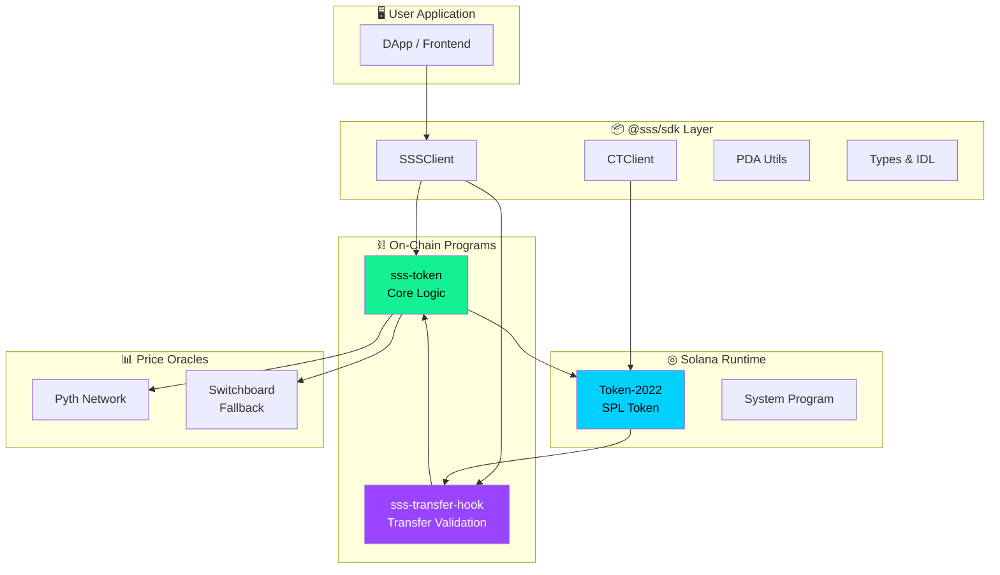
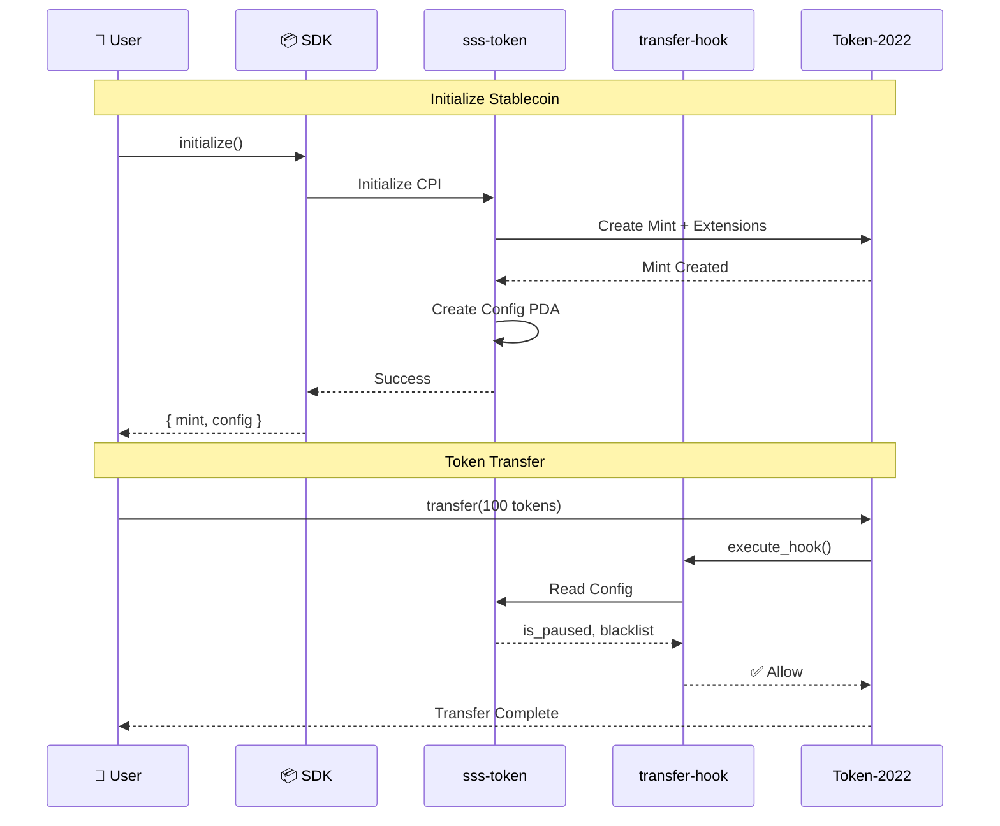
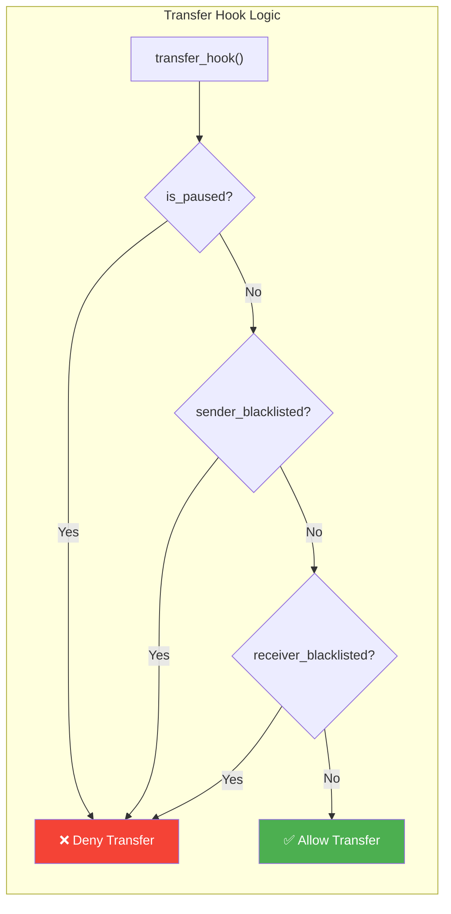

# Architecture

This document provides a comprehensive overview of the Solana Stablecoin Standard architecture, including state machines, data flows, and PDA layouts.

## System Overview

The SSS framework consists of two on-chain programs that work together with Token-2022:



## Program Interaction Flow



## Program Architecture

### sss-token Program

The core program manages stablecoin configuration, roles, compliance, and mint operations.

#### Instruction Groups

| Group | Instructions | Purpose |
|-------|-------------|---------|
| **Admin** | `initialize`, `set_supply_cap`, `nominate_authority`, `accept_authority` | Stablecoin configuration |
| **Roles** | `update_roles`, `update_minter_config` | RBAC management |
| **Minting** | `mint_tokens`, `burn_tokens`, `mint_with_oracle` | Supply management |
| **Compliance** | `freeze_account`, `thaw_account`, `add_to_blacklist`, `remove_from_blacklist`, `seize`, `pause`, `unpause` | Regulatory controls |
| **Banking** | `create_mint_request`, `confirm_and_mint`, `create_redemption`, `complete_redemption` | Fiat rails |
| **Attestation** | `submit_attestation` | Reserve proof |
| **Oracle** | `configure_oracle`, `toggle_oracle` | Price validation |

### sss-transfer-hook Program



## State Accounts

### StablecoinConfig PDA

**Seeds**: `["config", mint.key()]`

```rust
pub struct StablecoinConfig {
    pub authority: Pubkey,
    pub pending_authority: Option<Pubkey>,  // Two-step transfer
    pub mint: Pubkey,
    pub preset: Preset,
    pub name: String,
    pub symbol: String,
    pub decimals: u8,
    pub is_paused: bool,
    pub supply_cap: u64,
    pub total_minted: u64,
    pub total_burned: u64,
    pub backing_type: BackingType,
    pub banking_rail: BankingRail,
    pub reserve_account: Option<Pubkey>,
    pub oracle: Option<Pubkey>,
    pub created_at: i64,
    pub last_updated: i64,
    pub bump: u8,
}
```

### RolesConfig PDA

**Seeds**: `["roles", config.key(), user.key()]`

```rust
pub struct RolesConfig {
    pub stablecoin: Pubkey,
    pub target: Pubkey,
    pub is_minter: bool,
    pub is_burner: bool,
    pub is_pauser: bool,
    pub is_freezer: bool,
    pub is_blacklister: bool,
    pub is_seizer: bool,
    pub mint_quota: u64,
    pub minted_this_epoch: u64,
    pub epoch_start: i64,
    pub granted_by: Pubkey,
    pub granted_at: i64,
    pub last_action_at: i64,
    pub active: bool,
    pub bump: u8,
}
```

### BlacklistEntry PDA

**Seeds**: `["blacklist", config.key(), address.key()]`

```rust
pub struct BlacklistEntry {
    pub stablecoin: Pubkey,
    pub address: Pubkey,
    pub is_blacklisted: bool,
    pub reason: [u8; 32],
    pub blacklisted_by: Pubkey,
    pub blacklisted_at: i64,
    pub removed_by: Option<Pubkey>,
    pub removed_at: Option<i64>,
    pub bump: u8,
}
```

### OracleConfig PDA

**Seeds**: `["oracle", config.key()]`

```rust
pub struct OracleConfig {
    pub stablecoin: Pubkey,
    pub price_feed: Pubkey,          // Pyth price account
    pub max_staleness_seconds: u64,
    pub max_deviation_bps: u16,
    pub enabled: bool,
    pub target_price: i64,
    pub last_validated_price: i64,
    pub last_validated_at: i64,
    pub bump: u8,
}
```

## PDA Derivation

```typescript
// TypeScript PDA derivation examples
import { PublicKey } from '@solana/web3.js';

const SSS_PROGRAM_ID = new PublicKey('2L6rZHyqhJ9VJqXhbgW7vyP3uerrw7Vzpp3qtqAq1FZj');

// StablecoinConfig
const [configPda] = PublicKey.findProgramAddressSync(
  [Buffer.from("config"), mint.toBuffer()],
  SSS_PROGRAM_ID
);

// RolesConfig
const [rolesPda] = PublicKey.findProgramAddressSync(
  [Buffer.from("roles"), configPda.toBuffer(), user.toBuffer()],
  SSS_PROGRAM_ID
);

// BlacklistEntry
const [blacklistPda] = PublicKey.findProgramAddressSync(
  [Buffer.from("blacklist"), configPda.toBuffer(), address.toBuffer()],
  SSS_PROGRAM_ID
);

// OracleConfig
const [oraclePda] = PublicKey.findProgramAddressSync(
  [Buffer.from("oracle"), configPda.toBuffer()],
  SSS_PROGRAM_ID
);
```

## State Machines

### Stablecoin Lifecycle

```
                    ┌─────────────┐
                    │ Uninitialized│
                    └──────┬──────┘
                           │ initialize()
                           ▼
                    ┌─────────────┐
           ┌───────►│   Active    │◄───────┐
           │        └──────┬──────┘        │
           │               │ pause()        │ unpause()
           │               ▼               │
           │        ┌─────────────┐        │
           │        │   Paused    │────────┘
           │        └─────────────┘
           │
           └───────────────────────────────
```

### Mint Request Workflow

```
┌─────────────┐    create_mint_request()    ┌─────────────┐
│   Initial   │────────────────────────────►│   Pending   │
└─────────────┘                             └──────┬──────┘
                                                   │
                                                   │ confirm_and_mint()
                                                   ▼
                                            ┌─────────────┐
                                            │   Minted    │
                                            │  (tokens    │
                                            │   issued)   │
                                            └─────────────┘
```

### Two-Step Authority Transfer

```
┌─────────────────┐  nominate_authority()  ┌─────────────────┐
│ Current Owner   │───────────────────────►│ Pending Transfer│
│ authority = A   │                        │ pending = B     │
└─────────────────┘                        └────────┬────────┘
                                                    │
                                                    │ accept_authority()
                                                    │ (called by B)
                                                    ▼
                                           ┌─────────────────┐
                                           │  New Owner      │
                                           │  authority = B  │
                                           │  pending = None │
                                           └─────────────────┘
```

## Security Architecture

### Access Control Matrix

| Action | Authority | Minter | Freezer | Blacklister | Pauser |
|--------|:---------:|:------:|:-------:|:-----------:|:------:|
| `initialize` | ✅ | ❌ | ❌ | ❌ | ❌ |
| `update_roles` | ✅ | ❌ | ❌ | ❌ | ❌ |
| `mint_tokens` | ❌ | ✅ | ❌ | ❌ | ❌ |
| `burn_tokens` | ❌ | ✅ | ❌ | ❌ | ❌ |
| `freeze_account` | ❌ | ❌ | ✅ | ❌ | ❌ |
| `add_to_blacklist` | ❌ | ❌ | ❌ | ✅ | ❌ |
| `pause` | ✅ | ❌ | ❌ | ❌ | ✅ |
| `seize` | ❌ | ❌ | ❌ | ❌ | ❌* |

*Seize requires `is_seizer` role.

### Role Escalation Prevention

The system prevents role escalation attacks:

- Users cannot grant themselves roles
- Users cannot grant roles higher than their own
- Only the authority can grant admin-level permissions
- Role changes are logged with `granted_by` and `granted_at`

## Token-2022 Extensions

### Extension Configuration by Preset

| Extension | SSS-1 | SSS-2 | SSS-3 |
|-----------|:-----:|:-----:|:-----:|
| MetadataPointer | ✅ | ✅ | ✅ |
| MintCloseAuthority | ✅ | ✅ | ✅ |
| PermanentDelegate | ✅ | ✅ | ✅ |
| TransferHook | ❌ | ✅ | ✅ |
| ConfidentialTransferMint | ❌ | ❌ | ✅ |

### Extension Purposes

- **MetadataPointer**: On-chain token metadata (name, symbol, URI)
- **MintCloseAuthority**: Allows closing mint if supply reaches zero
- **PermanentDelegate**: Authority can transfer/burn from any account (compliance seizure)
- **TransferHook**: Custom transfer logic (blacklist checks)
- **ConfidentialTransferMint**: ZK proof-based private transfers

## Performance Considerations

### Compute Unit Budget

| Instruction | Approx CUs | Notes |
|-------------|------------|-------|
| `initialize` | ~150,000 | Creates multiple accounts |
| `mint_tokens` | ~50,000 | Token-2022 CPI |
| `transfer` (with hook) | ~80,000 | Extra hook execution |
| `add_to_blacklist` | ~30,000 | PDA creation |
| `mint_with_oracle` | ~100,000 | Pyth price parsing |

### Optimization Strategies

1. **Batch operations**: Use remaining accounts for multi-address blacklisting
2. **PDA caching**: Cache derived PDAs client-side
3. **Parallel transactions**: Independent operations can be batched
4. **Preflight simulation**: Simulate before sending to save failed TX fees

## Network Architecture

### Devnet Deployment

```
┌────────────────────────────────────────────────────────────────┐
│                        Solana Devnet                           │
├────────────────────────────────────────────────────────────────┤
│  sss-token: 2L6rZHyqhJ9VJqXhbgW7vyP3uerrw7Vzpp3qtqAq1FZj       │
│  sss-transfer-hook: E3pPcPAU4Un7WMaHyMnG6L3SJ8dNu4gjZGU6ExqvhRzS│
│  Token-2022: TokenzQdBNbLqP5VEhdkAS6EPFLC1PHnBqCXEpPxuEb       │
└────────────────────────────────────────────────────────────────┘
```

---

Next: [Presets](../presets/sss-1.md) - Learn about the three configuration presets
