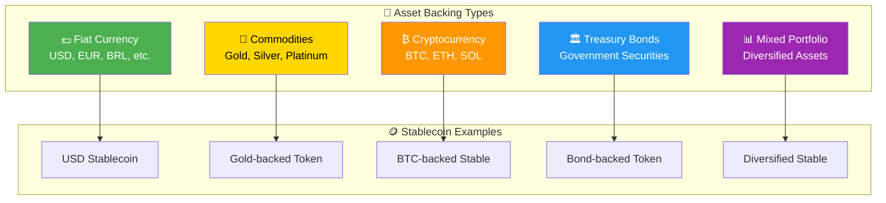
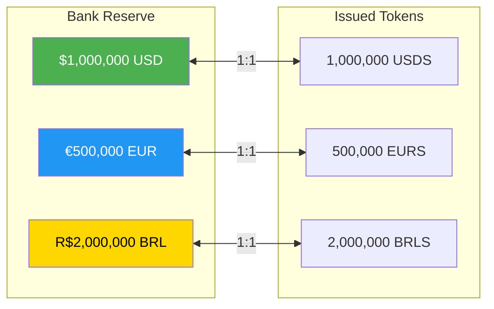
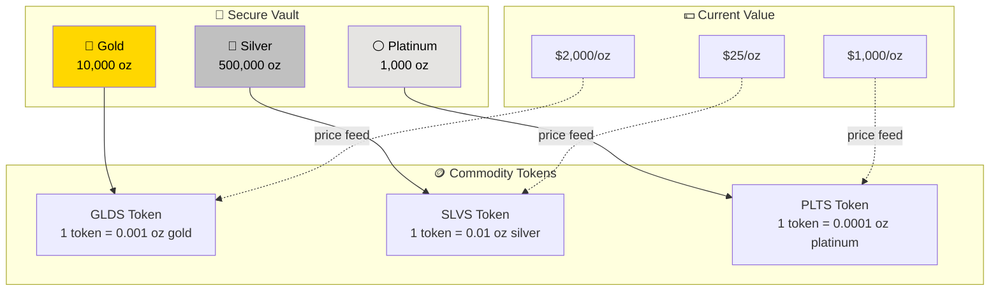
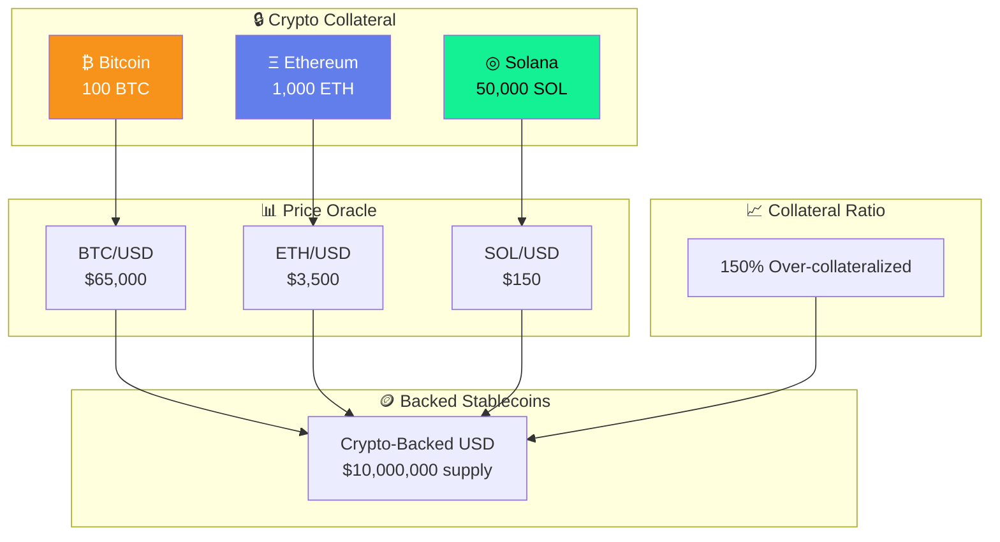
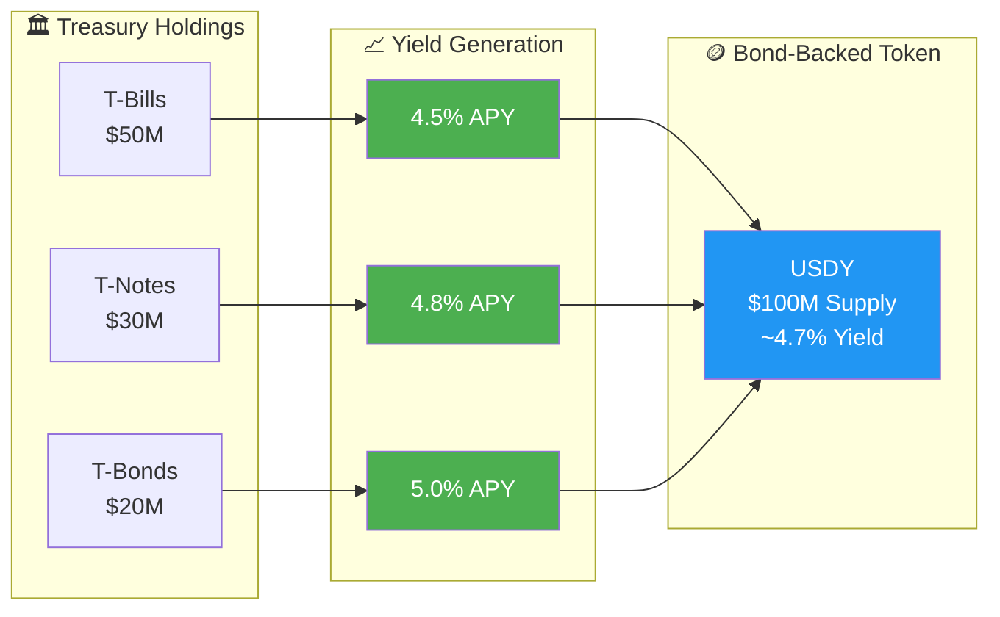
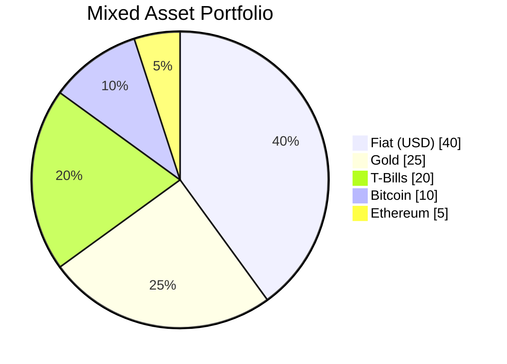
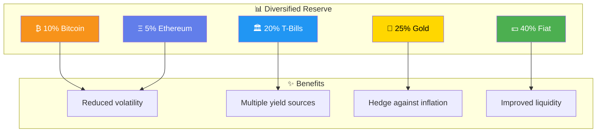
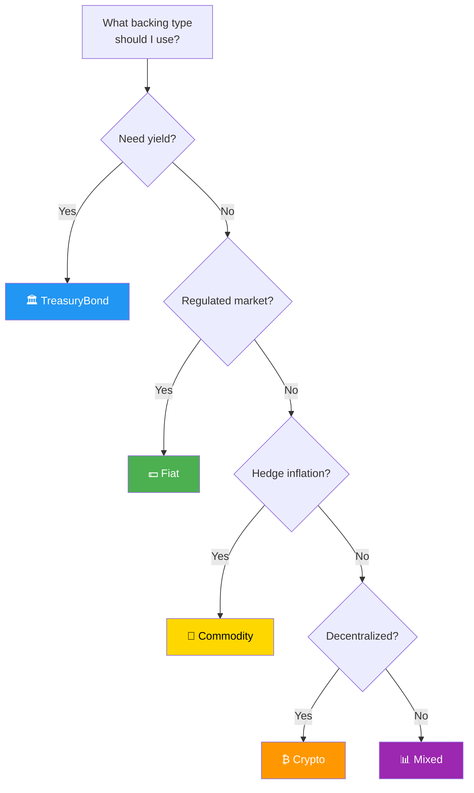
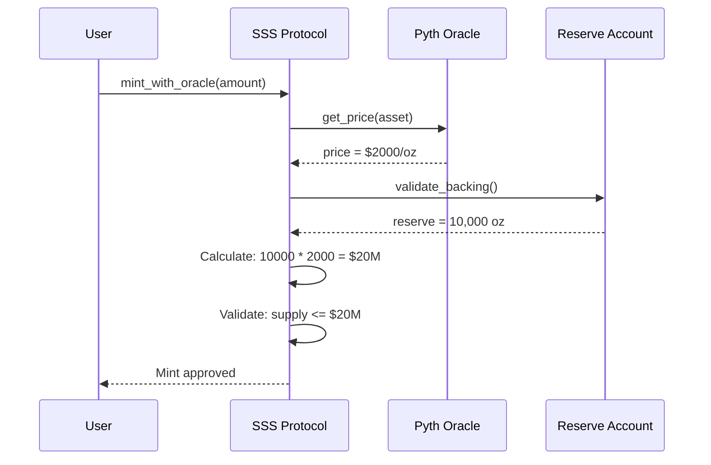

# Multi-Asset Backing

SSS supports multiple asset backing types, enabling the creation of various stablecoin configurations from traditional fiat-backed to innovative commodity and mixed-asset backed tokens.

## Overview



## BackingType Enum

The `BackingType` enum is defined in the on-chain program:

```rust
#[derive(AnchorSerialize, AnchorDeserialize, Clone, Copy, PartialEq, Eq)]
pub enum BackingType {
    /// Backed by fiat currency reserves (USD, EUR, BRL)
    Fiat,
    
    /// Backed by physical commodities (gold, silver, platinum)
    Commodity,
    
    /// Backed by cryptocurrency collateral (BTC, ETH, SOL)
    Crypto,
    
    /// Backed by government treasury bonds
    TreasuryBond,
    
    /// Backed by a mix of multiple asset types
    Mixed,
}
```

## Backing Types Explained

### 💵 Fiat Currency Backing

Traditional stablecoin model where tokens are backed 1:1 by fiat currency reserves held in bank accounts.



**Use Cases:**
- Traditional stablecoins (USDC, USDT style)
- Regional currency tokens
- Cross-border payment tokens

**Example:**
```typescript
const { mint, config } = await client.initialize({
  name: 'USD Stablecoin',
  symbol: 'USDS',
  decimals: 6,
  preset: Preset.Sss2,
  backingType: BackingType.Fiat,
  bankingRail: BankingRail.Swift,
});
```

---

### 🥇 Commodity Backing

Tokens backed by physical commodities stored in secure vaults. Each token represents fractional ownership of the underlying commodity.



**Supported Commodities:**
| Commodity | Symbol | Standard Unit | Oracle |
|-----------|--------|---------------|--------|
| Gold | XAU | Troy Ounce | Pyth |
| Silver | XAG | Troy Ounce | Pyth |
| Platinum | XPT | Troy Ounce | Pyth |
| Palladium | XPD | Troy Ounce | Pyth |

**Example - Gold-Backed Token:**
```typescript
const { mint, config } = await client.initialize({
  name: 'Digital Gold',
  symbol: 'DGLD',
  decimals: 8,  // More decimals for fractional gold
  preset: Preset.Sss2,
  backingType: BackingType.Commodity,
  bankingRail: BankingRail.None,  // Physical delivery
  uri: 'https://vault.example.com/gold/metadata.json',
});

// Configure oracle for gold price
await client.configureOracle({
  priceFeed: PYTH_GOLD_PRICE_FEED,
  maxStalenessSecs: 300,
  maxDeviationBps: 100,  // 1% max deviation
  targetPrice: 2000_00000000,  // $2000.00 in 8 decimals
});
```

**Reserve Attestation for Commodities:**
```typescript
// Submit monthly reserve attestation
await client.submitAttestation({
  config: configPda,
  reserveAmount: 10_000_00000000n,  // 10,000 oz
  attestationUri: 'https://auditor.example.com/gold-audit-2024-03.pdf',
  auditor: auditorPubkey,
});
```

---

### ₿ Cryptocurrency Backing

Tokens backed by cryptocurrency collateral, similar to DAI's model but with configurable collateralization ratios.



**Collateral Configuration:**
```typescript
const { mint, config } = await client.initialize({
  name: 'Crypto-Backed USD',
  symbol: 'CUSD',
  decimals: 6,
  preset: Preset.Sss2,
  backingType: BackingType.Crypto,
  bankingRail: BankingRail.None,
});

// Configure with over-collateralization
await client.configureOracle({
  priceFeed: PYTH_BTC_USD,
  maxStalenessSecs: 60,  // Faster updates for volatile assets
  maxDeviationBps: 200,  // 2% max deviation
  targetPrice: 1_000000,  // $1.00 peg
});
```

---

### 🏛️ Treasury Bond Backing

Tokens backed by government securities, enabling yield-bearing stablecoins.



**Yield Distribution:**
```typescript
const { mint, config } = await client.initialize({
  name: 'Yield USD',
  symbol: 'USDY',
  decimals: 6,
  preset: Preset.Sss2,
  backingType: BackingType.TreasuryBond,
  bankingRail: BankingRail.Fedwire,  // US Treasury settlement
});

// Yield is distributed through rebasing or reward mechanism
```

---

### 📊 Mixed Asset Backing

Diversified backing with multiple asset types for reduced risk and enhanced stability.





**Example:**
```typescript
const { mint, config } = await client.initialize({
  name: 'Diversified Stable',
  symbol: 'DSTB',
  decimals: 6,
  preset: Preset.Sss2,
  backingType: BackingType.Mixed,
  bankingRail: BankingRail.Swift,
  uri: 'https://reserve.example.com/portfolio.json',
});

// Multiple attestations for each asset class
await client.submitAttestation({
  config: configPda,
  reserveAmount: 40_000_000_000000n,  // $40M fiat
  attestationUri: 'ipfs://Qm.../fiat-audit.pdf',
  auditor: fiatAuditor,
});
```

## Backing Type Selection Guide



| Criteria | Fiat | Commodity | Crypto | Treasury | Mixed |
|----------|:----:|:---------:|:------:|:--------:|:-----:|
| **Stability** | ⭐⭐⭐⭐⭐ | ⭐⭐⭐⭐ | ⭐⭐⭐ | ⭐⭐⭐⭐⭐ | ⭐⭐⭐⭐ |
| **Yield** | ⭐ | ⭐ | ⭐⭐ | ⭐⭐⭐⭐⭐ | ⭐⭐⭐ |
| **Decentralization** | ⭐⭐ | ⭐⭐ | ⭐⭐⭐⭐⭐ | ⭐⭐ | ⭐⭐⭐ |
| **Inflation Hedge** | ⭐ | ⭐⭐⭐⭐⭐ | ⭐⭐⭐ | ⭐⭐ | ⭐⭐⭐⭐ |
| **Regulatory Clarity** | ⭐⭐⭐⭐⭐ | ⭐⭐⭐⭐ | ⭐⭐ | ⭐⭐⭐⭐⭐ | ⭐⭐⭐ |

## Integration with Oracles

Each backing type can be validated using price oracles:



## Next Steps

- [Banking Rails](./banking-rails) - Learn about fiat integration
- [Reserve Attestations](../operations/compliance.md#attestations) - Proof of reserves
- [Oracle Configuration](../api-reference/instructions.md#configure_oracle) - Price feed setup
