# Banking Rails Integration

SSS provides comprehensive banking rails integration for seamless fiat on/off ramps, supporting major global payment networks.

## Overview

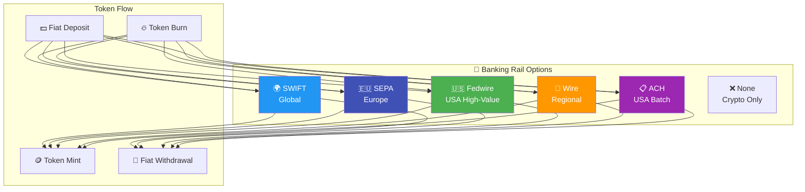

## BankingRail Enum

The `BankingRail` enum is defined in the on-chain program:

```rust
#[derive(AnchorSerialize, AnchorDeserialize, Clone, Copy, PartialEq, Eq)]
pub enum BankingRail {
    /// No banking integration (crypto-only)
    None,
    
    /// SWIFT international wire transfers
    Swift,
    
    /// Single Euro Payments Area (EU transfers)
    Sepa,
    
    /// Federal Reserve Wire Network (US high-value)
    Fedwire,
    
    /// Standard bank wire transfer
    Wire,
    
    /// Automated Clearing House (US batch)
    Ach,
}
```

## Banking Rails Comparison

| Rail | Network | Settlement | Fees | Min Amount | Max Amount |
|------|---------|------------|------|------------|------------|
| **SWIFT** | Global | 1-5 days | $15-50 | $100 | Unlimited |
| **SEPA** | EU/EEA | 1-2 days | €0-1 | €0.01 | €999,999 |
| **Fedwire** | USA | Same day | $25-30 | $1,000 | Unlimited |
| **Wire** | Regional | 1-3 days | $10-35 | $100 | Varies |
| **ACH** | USA | 2-3 days | $0-1 | $0.01 | $100,000 |

## Mint Request Flow

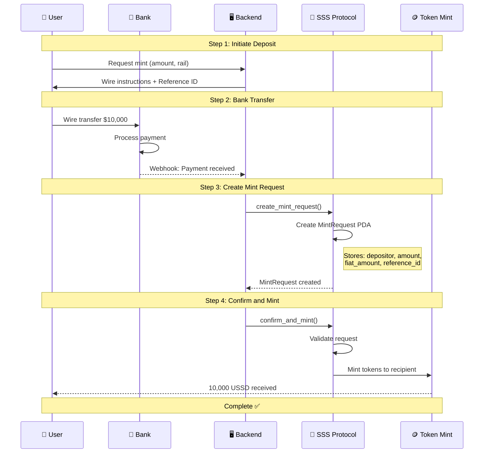

## Redemption Flow

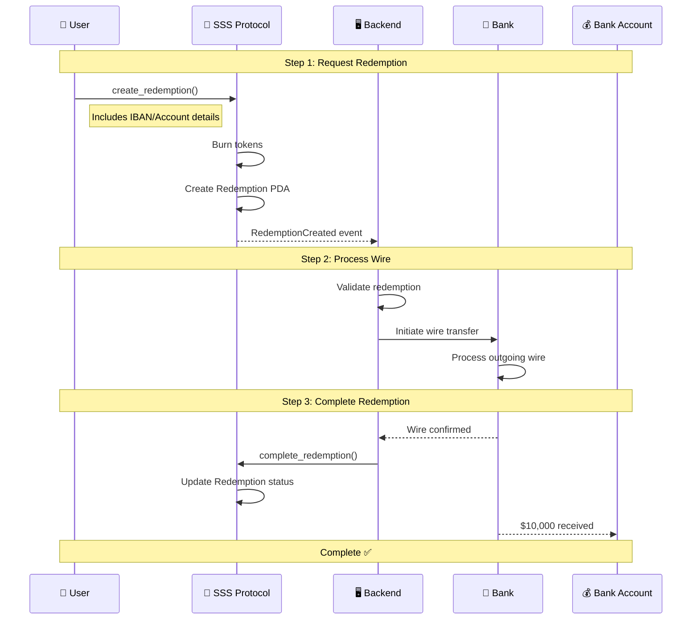

## 🌍 SWIFT Integration

SWIFT (Society for Worldwide Interbank Financial Telecommunication) enables global transfers.

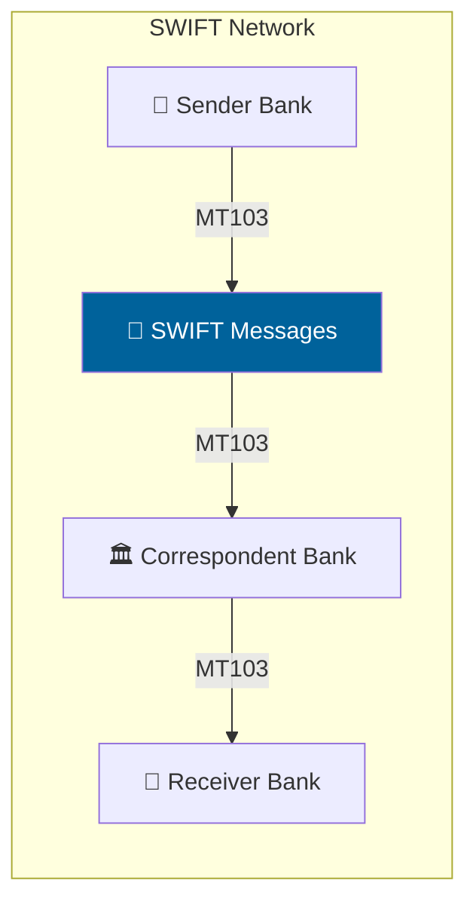

**Configuration:**
```typescript
const { mint, config } = await client.initialize({
  name: 'Global USD',
  symbol: 'GUSD',
  decimals: 6,
  preset: Preset.Sss2,
  backingType: BackingType.Fiat,
  bankingRail: BankingRail.Swift,
});

// Create mint request with SWIFT details
await client.createMintRequest({
  depositor: userPubkey,
  recipient: userTokenAccount,
  amount: 10_000_000000n,
  fiatAmount: 10000_00n,  // $10,000.00 in cents
  fiatCurrency: FiatCurrency.Usd,
  referenceId: 'SWIFT-REF-2024-001',
  bankReference: 'MT103-20240315-ABCDUS33',
});
```

**Wire Instructions:**
```json
{
  "beneficiary": "SSS Treasury LLC",
  "accountNumber": "1234567890",
  "swiftCode": "SSSBUS33XXX",
  "bankName": "SSS Partner Bank",
  "bankAddress": "123 Finance Street, New York, NY 10001",
  "reference": "SSS-MINT-{userId}-{timestamp}"
}
```

---

## 🇪🇺 SEPA Integration

SEPA (Single Euro Payments Area) enables fast, low-cost EUR transfers across Europe.

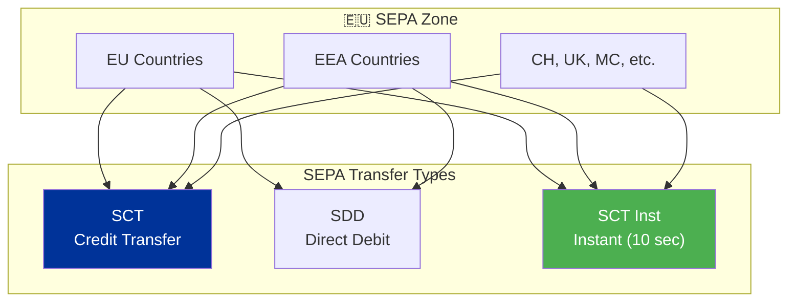

**Configuration:**
```typescript
const { mint, config } = await client.initialize({
  name: 'Euro Stablecoin',
  symbol: 'EURS',
  decimals: 6,
  preset: Preset.Sss2,
  backingType: BackingType.Fiat,
  bankingRail: BankingRail.Sepa,
});

// Create redemption with IBAN
await client.createRedemption({
  amount: 5_000_000000n,
  fiatCurrency: FiatCurrency.Eur,
  iban: 'DE89370400440532013000',
  bic: 'COBADEFFXXX',
  beneficiaryName: 'John Doe',
});
```

---

## 🇺🇸 Fedwire Integration

Fedwire is the Federal Reserve's real-time gross settlement system for high-value USD transfers.

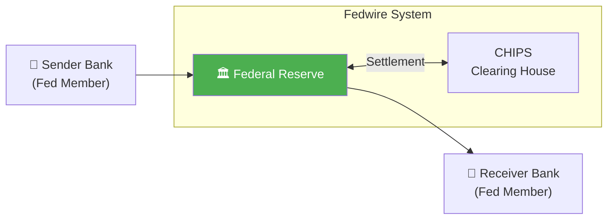

**Use Cases:**
- High-value institutional transfers ($1M+)
- Same-day settlement requirements
- Treasury operations
- Corporate payroll

**Configuration:**
```typescript
const { mint, config } = await client.initialize({
  name: 'Institutional USD',
  symbol: 'IUSD',
  decimals: 6,
  preset: Preset.Sss2,
  backingType: BackingType.TreasuryBond,
  bankingRail: BankingRail.Fedwire,
});
```

---

## 📋 ACH Integration

ACH (Automated Clearing House) handles batch processing for lower-value, high-volume transfers.

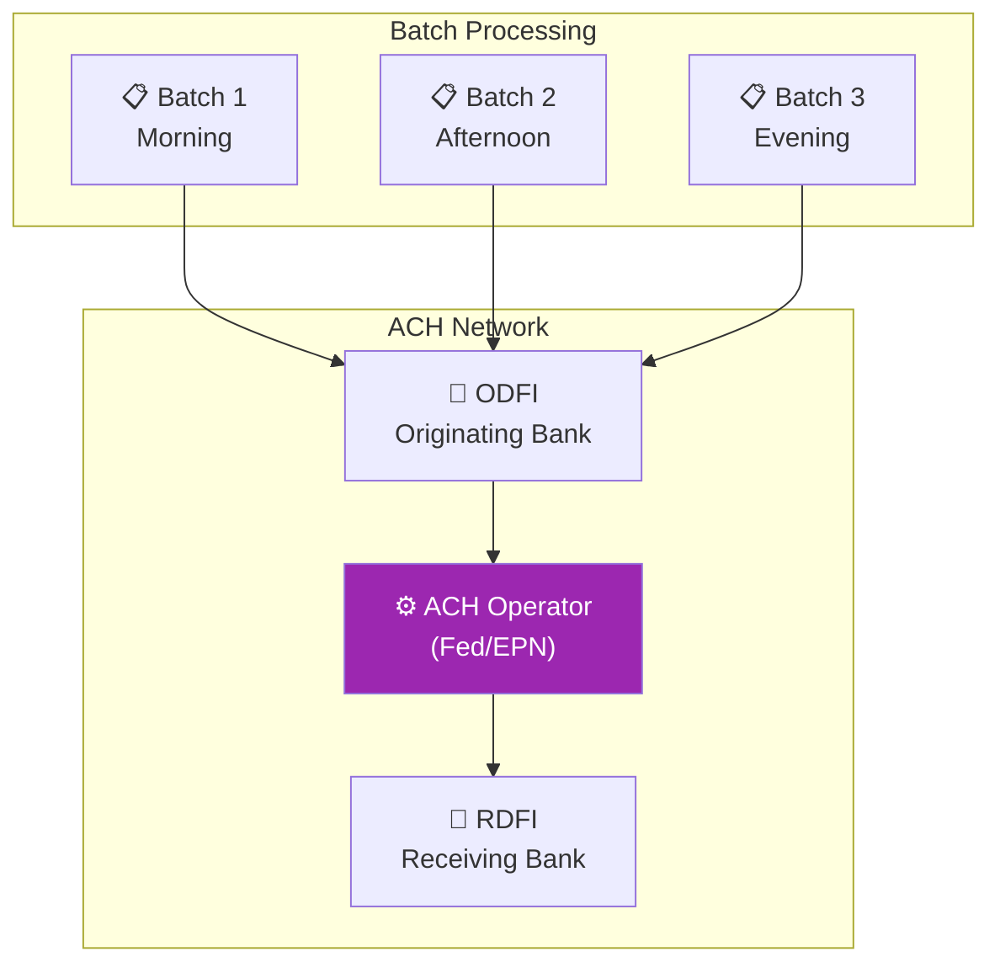

**Configuration:**
```typescript
const { mint, config } = await client.initialize({
  name: 'Retail USD',
  symbol: 'RUSD',
  decimals: 6,
  preset: Preset.Sss2,
  backingType: BackingType.Fiat,
  bankingRail: BankingRail.Ach,
});

// ACH redemption
await client.createRedemption({
  amount: 500_000000n,
  fiatCurrency: FiatCurrency.Usd,
  routingNumber: '021000021',
  accountNumber: '1234567890',
  accountType: AccountType.Checking,
  beneficiaryName: 'Jane Smith',
});
```

---

## MintRequest PDA Structure

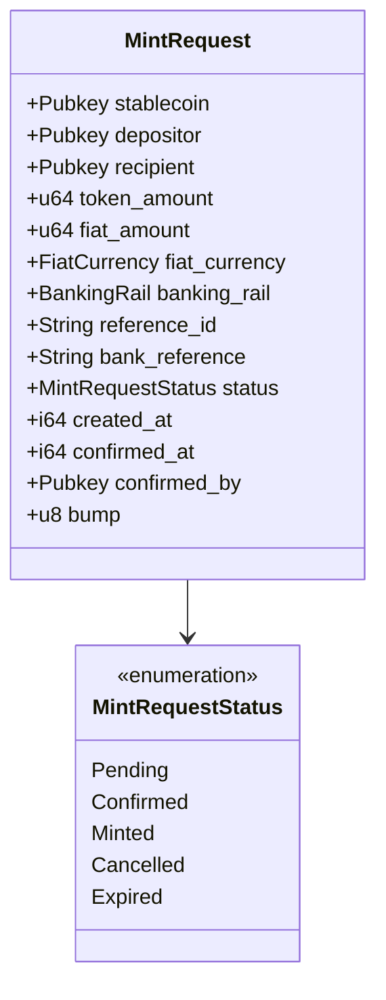

**PDA Seeds:**
```rust
seeds = [
    b"mint_request",
    config.key().as_ref(),
    reference_id.as_bytes(),
]
```

## RedemptionRequest PDA Structure

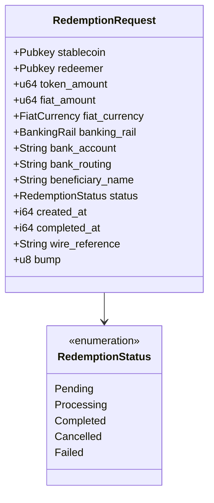

## Banking Rail Selection Guide

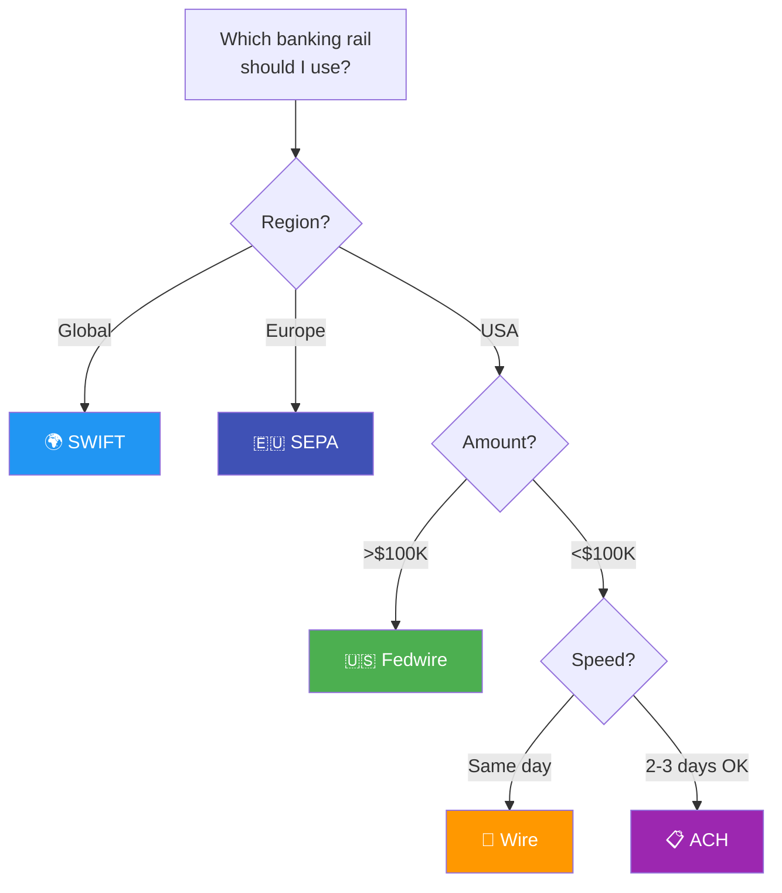

## Compliance Considerations

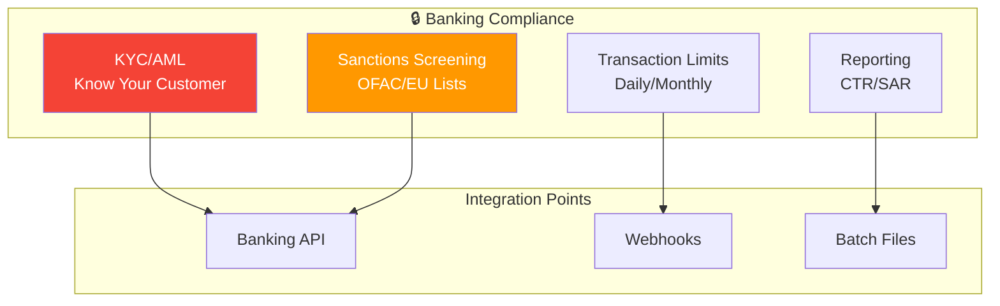

## Next Steps

- [Asset Backing](./asset-backing) - Configure backing types
- [Reserve Attestations](../operations/compliance.md#attestations) - Proof of reserves
- [SDK Guide](../api-reference/sdk-guide) - Full SDK documentation
