# Enterprise Security

SSS implements comprehensive security measures designed for institutional-grade stablecoin deployments.

## Security Architecture Overview

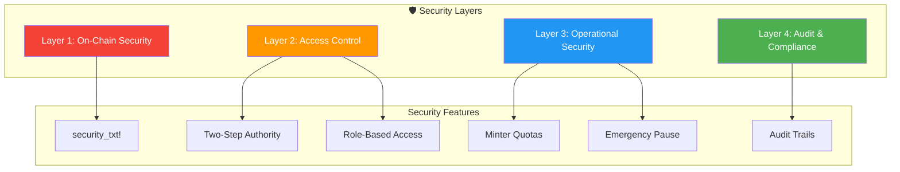

## 🛡️ security_txt! Macro

The `security_txt!` macro embeds standardized security contact information directly on-chain, following the [security.txt](https://securitytxt.org/) standard.

### Purpose

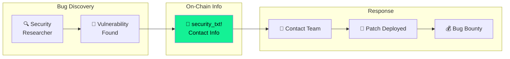

### Implementation

```rust
use solana_security_txt::security_txt;

security_txt! {
    // Required fields
    name: "Solana Stablecoin Standard",
    project_url: "https://sss.solana.com",
    contacts: "email:security@sss.solana.com,discord:sss-security",
    policy: "https://sss.solana.com/security",
    
    // Optional fields
    preferred_languages: "en",
    source_code: "https://github.com/solanabr/solana-stablecoin-standard",
    source_revision: env!("GIT_SHA"),
    encryption: "https://sss.solana.com/pgp-key.txt",
    auditors: "OtterSec, Neodyme",
    acknowledgements: "https://sss.solana.com/hall-of-fame"
}
```

### Fields Explained

| Field | Description | Example |
|-------|-------------|---------|
| `name` | Project name | "Solana Stablecoin Standard" |
| `project_url` | Main website | "https://sss.solana.com" |
| `contacts` | Security contacts | "email:security@sss.solana.com" |
| `policy` | Security policy URL | "https://sss.solana.com/security" |
| `preferred_languages` | Languages for reports | "en,pt" |
| `source_code` | Source repository | GitHub URL |
| `auditors` | Security auditors | "OtterSec, Neodyme" |
| `acknowledgements` | Hall of fame | Researcher credits |

---

## 🔑 Two-Step Authority Transfer

Prevents accidental or hostile takeover of stablecoin authority through a nominate-accept pattern.

### Flow Diagram

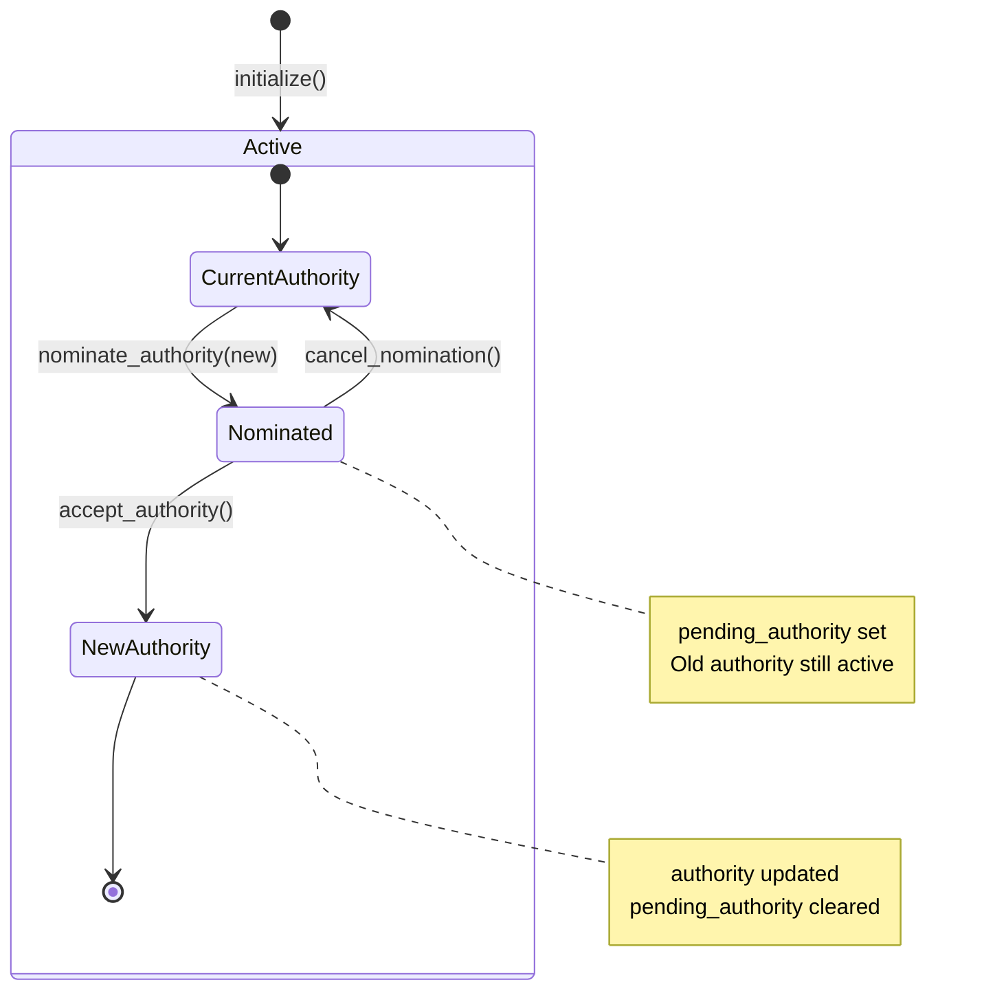

### Sequence Diagram

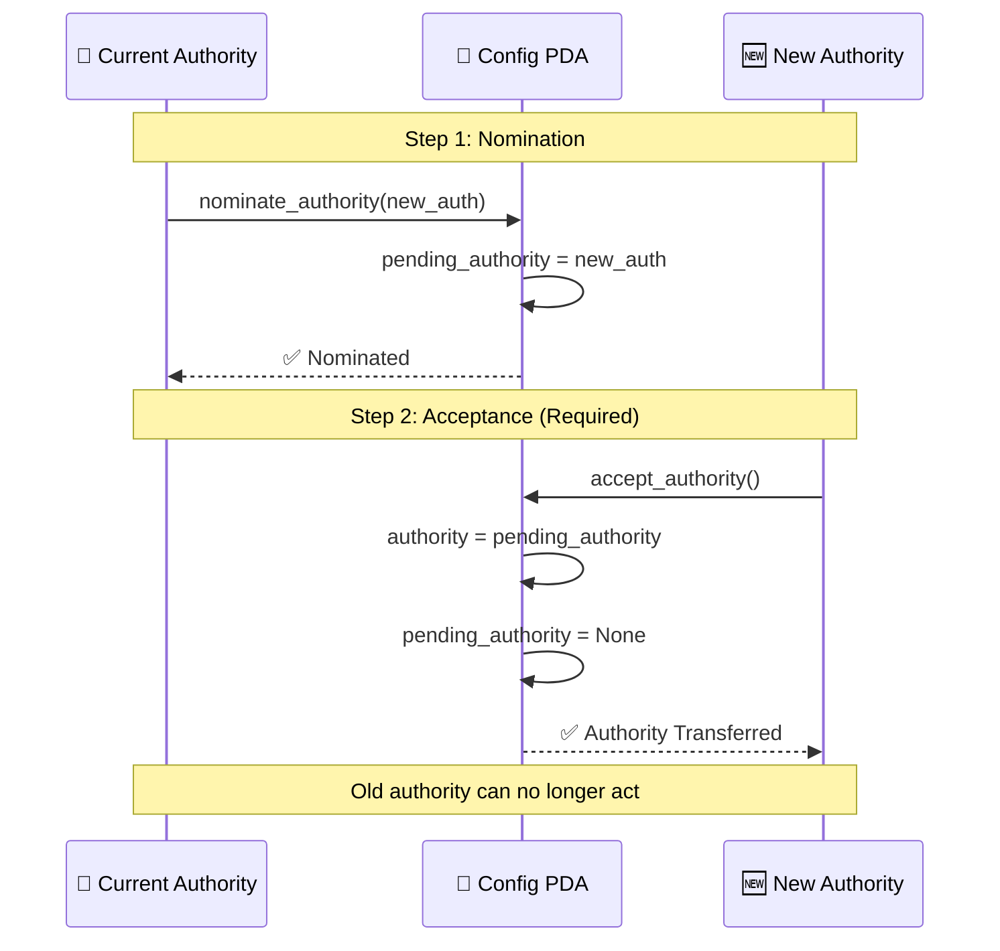

### Implementation

```typescript
// Step 1: Current authority nominates new authority
await client.nominateAuthority({
  newAuthority: newAuthorityPubkey,
  config: configPda,
});

console.log('New authority nominated. They must accept.');

// Step 2: New authority accepts (signed by new authority)
const newClient = new SSSClient(connection, newAuthority.publicKey);
await newClient.acceptAuthority({
  config: configPda,
});

console.log('Authority transfer complete!');
```

### Security Benefits

| Threat | Protection |
|--------|------------|
| **Private key theft** | Attacker can't immediately take over |
| **Social engineering** | Requires action from two parties |
| **Insider threat** | Creates audit trail of transfer |
| **Accidental transfer** | Easy to cancel before acceptance |

---

## 👥 Role-Based Access Control (RBAC)

Fine-grained permissions system with complete audit trails.

### Role Hierarchy

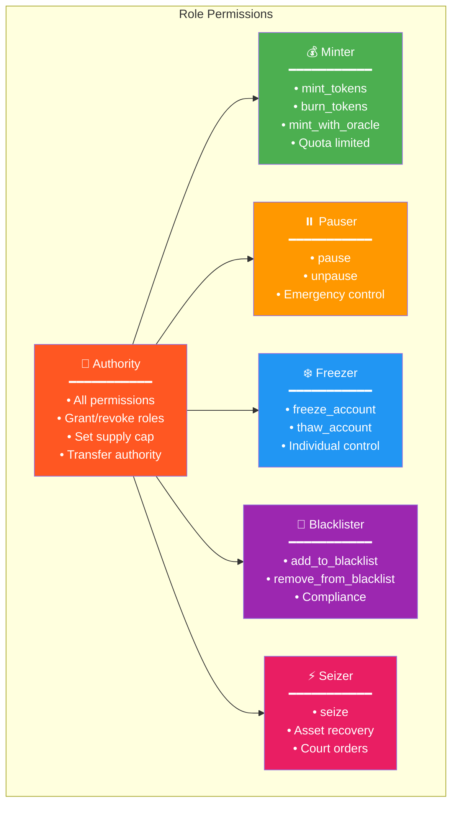

### RolesConfig PDA

```rust
pub struct RolesConfig {
    pub stablecoin: Pubkey,
    pub target: Pubkey,
    
    // Role flags
    pub is_minter: bool,
    pub is_burner: bool,
    pub is_pauser: bool,
    pub is_freezer: bool,
    pub is_blacklister: bool,
    pub is_seizer: bool,
    
    // Minter limits
    pub mint_quota: u64,
    pub minted_this_epoch: u64,
    pub epoch_start: i64,
    
    // Audit fields ✨
    pub granted_by: Pubkey,    // Who granted this role
    pub granted_at: i64,       // When it was granted
    pub last_action_at: i64,   // Last role action
    
    pub active: bool,
    pub bump: u8,
}
```

### Audit Trail Benefits

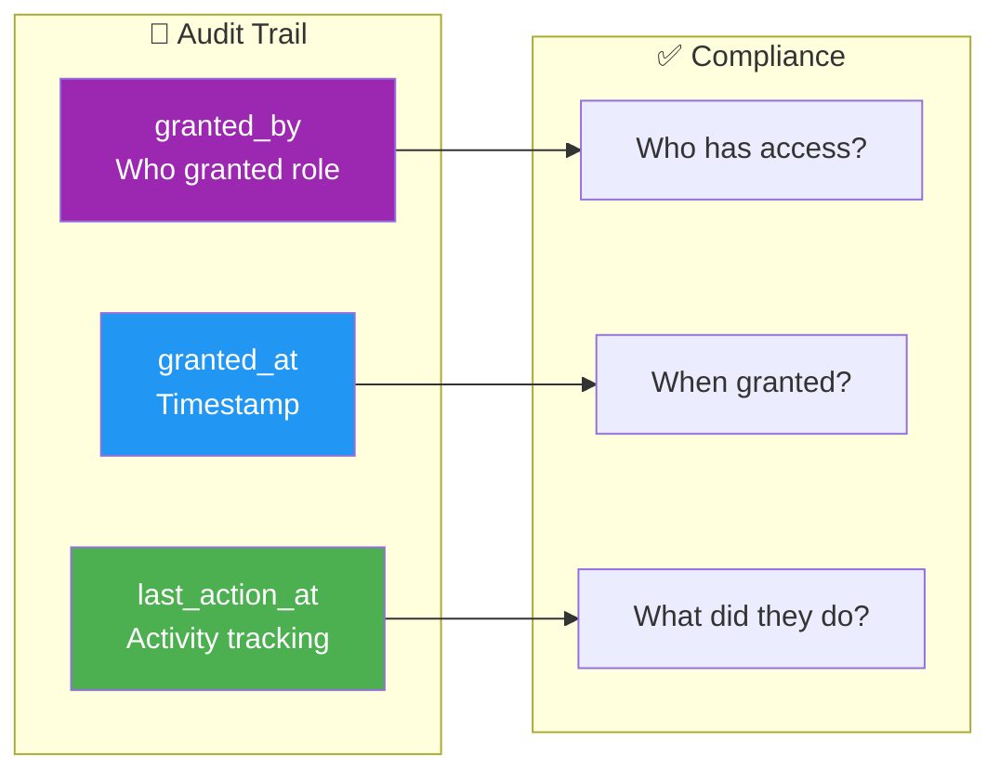

---

## 📊 Minter Quotas

Epoch-based minting limits to control supply risk.

### Quota Flow

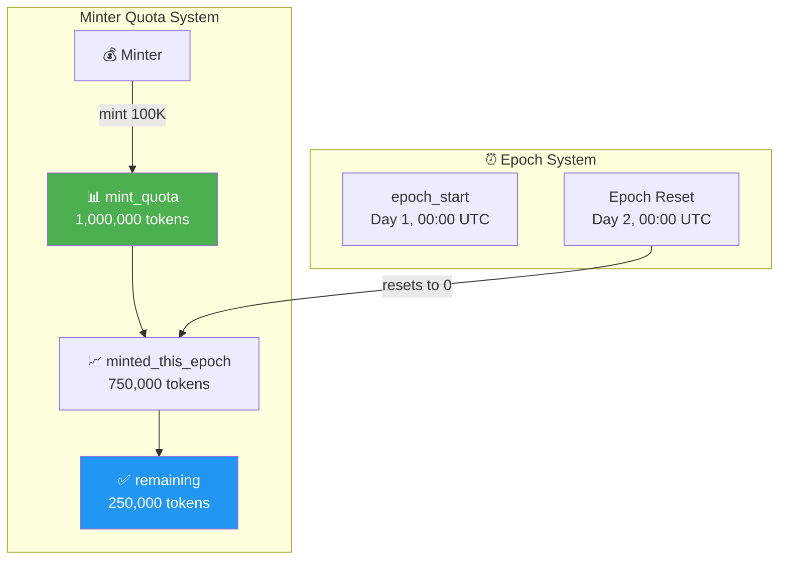

### Implementation

```typescript
// Set minter quota
await client.updateMinterConfig({
  minter: minterPubkey,
  quota: 1_000_000_000000n,  // 1M tokens per epoch
  epochDuration: 86400,       // 24 hours
  config: configPda,
});

// Minting respects quota
await client.mintTokens({
  amount: 100_000_000000n,
  recipient: recipientPubkey,
  config: configPda,
});
// Remaining quota: 900,000 tokens
```

### Quota Exceeded

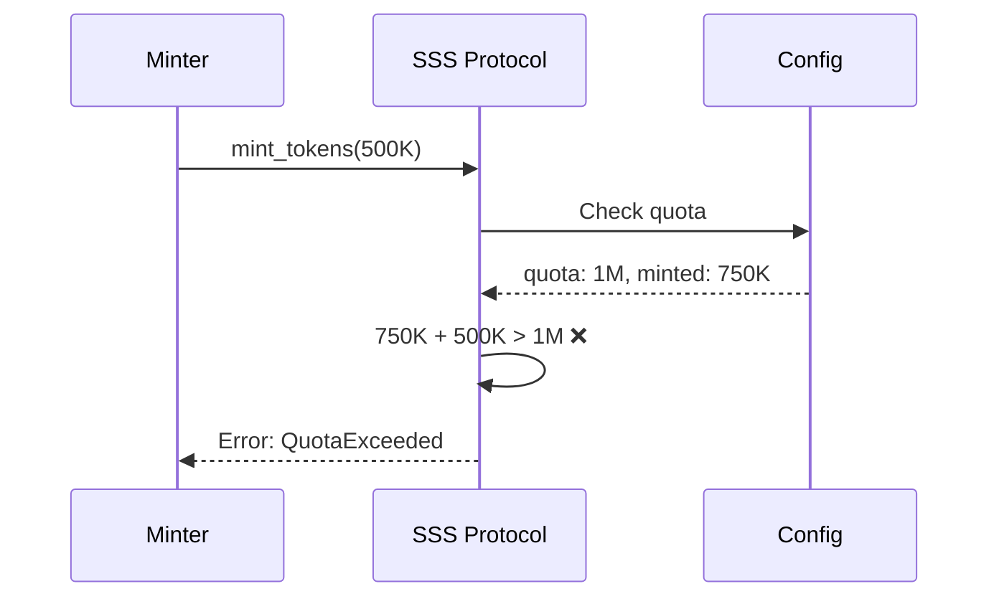

---

## ⏸️ Emergency Pause

Global pause mechanism for emergency response.

### Pause Flow

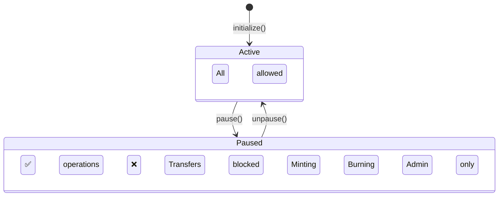

### What Gets Paused?

| Operation | Paused State |
|-----------|:------------:|
| `transfer` | ❌ Blocked |
| `mint_tokens` | ❌ Blocked |
| `burn_tokens` | ❌ Blocked |
| `freeze_account` | ✅ Allowed |
| `thaw_account` | ✅ Allowed |
| `add_to_blacklist` | ✅ Allowed |
| `seize` | ✅ Allowed |
| `unpause` | ✅ Allowed |

---

## 🔒 Transfer Hook Security

The transfer hook provides an additional security layer:

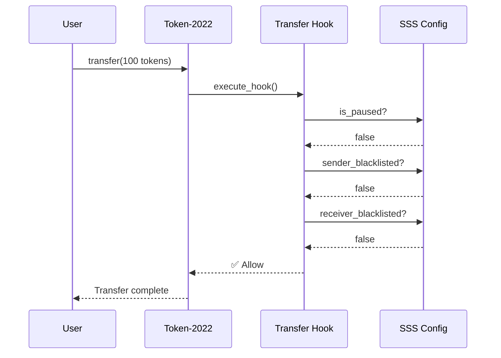

### Fallback Handler

```rust
/// Fallback handler for TransferHook interface dispatch
pub fn fallback<'info>(
    program_id: &Pubkey,
    accounts: &'info [AccountInfo<'info>],
    data: &[u8],
) -> Result<()> {
    let instruction = TransferHookInstruction::unpack(data)?;
    
    match instruction {
        TransferHookInstruction::Execute { amount } => {
            __private::__global::transfer_hook(program_id, accounts, amount)
        }
        _ => Err(ProgramError::InvalidInstructionData.into()),
    }
}
```

---

## Security Checklist

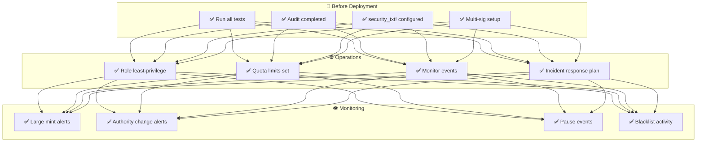

## Best Practices

| Category | Recommendation |
|----------|----------------|
| **Authority** | Use multi-sig wallet |
| **Roles** | Grant minimum necessary permissions |
| **Quotas** | Set conservative daily limits |
| **Monitoring** | Alert on all admin operations |
| **Incident Response** | Have pause procedure documented |
| **Key Management** | Use hardware wallets |
| **Audits** | Regular security reviews |

## Next Steps

- [Architecture](./architecture.md) - Full system design
- [Operations](../operations/operations.md) - Deployment guide
- [Compliance](../operations/compliance.md) - Regulatory considerations
