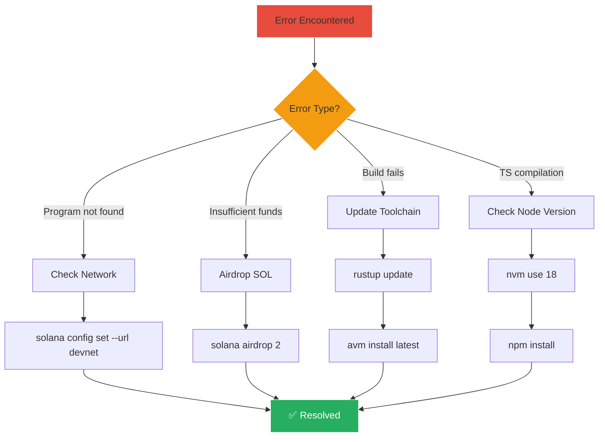

# Installation

This guide covers everything you need to set up your development environment for building with the Solana Stablecoin Standard.

## Setup Overview

```mermaid
flowchart LR
    subgraph Prerequisites["📦 Prerequisites"]
        A[Rust 1.70+]
        B[Solana CLI 1.18+]
        C[Anchor 0.31+]
        D[Node.js 18+]
    end
    
    subgraph Install["🔧 Installation"]
        E[Install SDK]
        F[Clone Repo]
        G[Build Programs]
    end
    
    subgraph Configure["⚙️ Configuration"]
        H[Setup Wallet]
        I[Configure Network]
        J[Verify Setup]
    end
    
    A --> E
    B --> E
    C --> E
    D --> E
    E --> F --> G --> H --> I --> J
    
    J -->|Ready| K[🚀 Start Building]
    
    style Prerequisites fill:#1a1a2e,stroke:#4ecdc4
    style Install fill:#1a1a2e,stroke:#f39c12
    style Configure fill:#1a1a2e,stroke:#9b59b6
    style K fill:#27ae60,stroke:#fff,color:#fff
```



## Prerequisites

Before you begin, make sure you have the following installed:

- **Rust** (1.70+): [rustup.rs](https://rustup.rs/)
- **Solana CLI** (1.18+): [Install Solana](https://docs.solana.com/cli/install-solana-cli-tools)
- **Anchor** (0.31+): [Install Anchor](https://www.anchor-lang.com/docs/installation)
- **Node.js** (18+): [nodejs.org](https://nodejs.org/)

## Quick Setup (macOS/Linux)

```bash
# Install Rust
curl --proto '=https' --tlsv1.2 -sSf https://sh.rustup.rs | sh

# Install Solana
sh -c "$(curl -sSfL https://release.solana.com/v1.18.18/install)"

# Install Anchor
cargo install --git https://github.com/coral-xyz/anchor avm --force
avm install latest
avm use latest

# Verify installations
solana --version
anchor --version
```

## Install the SDK

```bash
# npm
npm install @sss/sdk

# yarn
yarn add @sss/sdk

# pnpm
pnpm add @sss/sdk
```

## Clone the Repository

```bash
git clone https://github.com/solanabr/solana-stablecoin-standard.git
cd solana-stablecoin-standard

# Install dependencies
npm install

# Build the programs
anchor build
```

## Configure Solana CLI

```bash
# Switch to devnet
solana config set --url devnet

# Create a new wallet (for development)
solana-keygen new -o ~/.config/solana/devnet.json
solana config set --keypair ~/.config/solana/devnet.json

# Airdrop some SOL
solana airdrop 2
```

## Program IDs

The SSS programs are already deployed to devnet:

| Program | Address |
|---------|---------|
| **sss-token** | `2L6rZHyqhJ9VJqXhbgW7vyP3uerrw7Vzpp3qtqAq1FZj` |
| **sss-transfer-hook** | `E3pPcPAU4Un7WMaHyMnG6L3SJ8dNu4gjZGU6ExqvhRzS` |

## Verify Installation

Run the test suite to verify everything is working:

```bash
# Run all tests
anchor test

# Run with verbose output
anchor test -- --verbose
```

Expected output:
```
Running 292 tests...
✓ initializes stablecoin with SSS-1 preset
✓ initializes stablecoin with SSS-2 preset
...
All 292 tests passed!
```

## Project Structure

```mermaid
flowchart TB
    subgraph Root["📁 solana-stablecoin-standard"]
        subgraph Programs["programs/"]
            P1["sss-token/<br/>Core stablecoin program"]
            P2["sss-transfer-hook/<br/>Transfer hook program"]
        end
        
        subgraph Packages["packages/"]
            K1["sdk/<br/>@sss/sdk TypeScript SDK"]
            K2["cli/<br/>@sss/cli Command line tool"]
        end
        
        subgraph Tests["tests/"]
            T1["Integration tests"]
            T2["trident-tests/<br/>Fuzz tests"]
        end
        
        subgraph Docs["docs/"]
            D1["Documentation"]
        end
    end
    
    P1 -->|"exports"| K1
    P2 -->|"hooks"| P1
    K1 -->|"used by"| K2
    T1 -->|"tests"| P1
    T1 -->|"tests"| P2
    
    style Root fill:#1a1a2e,stroke:#4ecdc4
    style Programs fill:#2d3748,stroke:#f39c12
    style Packages fill:#2d3748,stroke:#9b59b6
    style Tests fill:#2d3748,stroke:#3498db
    style Docs fill:#2d3748,stroke:#27ae60
```



```
solana-stablecoin-standard/
├── programs/
│   ├── sss-token/           # Core stablecoin program
│   │   └── src/
│   │       ├── lib.rs       # Entry point
│   │       ├── state.rs     # Account definitions
│   │       ├── errors.rs    # Error codes
│   │       └── instructions/
│   └── sss-transfer-hook/   # Transfer hook program
├── packages/
│   ├── sdk/                 # TypeScript SDK (@sss/sdk)
│   └── cli/                 # CLI tool (@sss/cli)
├── tests/                   # Integration tests
├── trident-tests/           # Fuzz tests
└── docs/                    # Documentation
```

## Environment Variables

For SDK usage, you can set these environment variables:

```bash
# .env
SOLANA_RPC_URL=https://api.devnet.solana.com
SSS_TOKEN_PROGRAM_ID=2L6rZHyqhJ9VJqXhbgW7vyP3uerrw7Vzpp3qtqAq1FZj
SSS_HOOK_PROGRAM_ID=E3pPcPAU4Un7WMaHyMnG6L3SJ8dNu4gjZGU6ExqvhRzS
```

## IDE Setup

### VS Code

Install recommended extensions:

```json
// .vscode/extensions.json
{
  "recommendations": [
    "rust-lang.rust-analyzer",
    "tamasfe.even-better-toml",
    "serayuzgur.crates",
    "JuanBlanco.solidity"
  ]
}
```

### Rust Analyzer Settings

```json
// .vscode/settings.json
{
  "rust-analyzer.cargo.features": ["idl-build"],
  "rust-analyzer.check.command": "clippy"
}
```

## Troubleshooting

### Troubleshooting Flow



### Common Issues

**1. "Program not found" error**

Make sure you're on devnet:
```bash
solana config set --url devnet
```

**2. "Insufficient funds" error**

Airdrop more SOL:
```bash
solana airdrop 2
```

**3. Anchor build fails**

Update your toolchain:
```bash
rustup update
avm install latest && avm use latest
```

**4. TypeScript compilation errors**

Make sure you have the correct Node.js version:
```bash
nvm use 18
npm install
```

---

Next: [Quick Start](./quickstart.md) - Create your first stablecoin!
