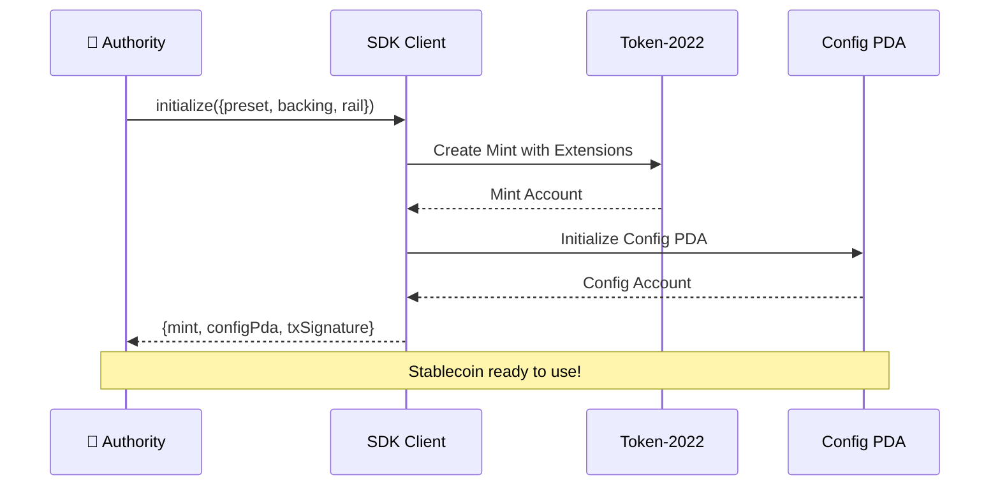
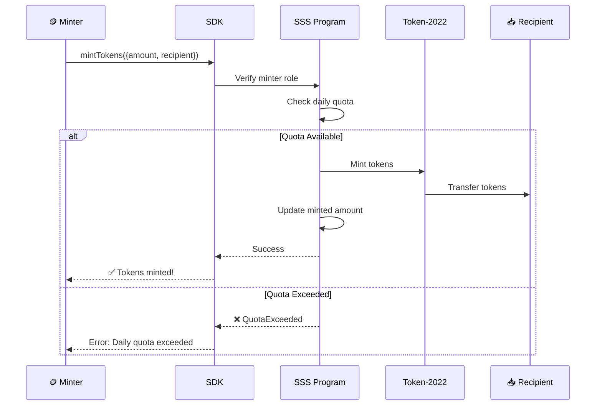
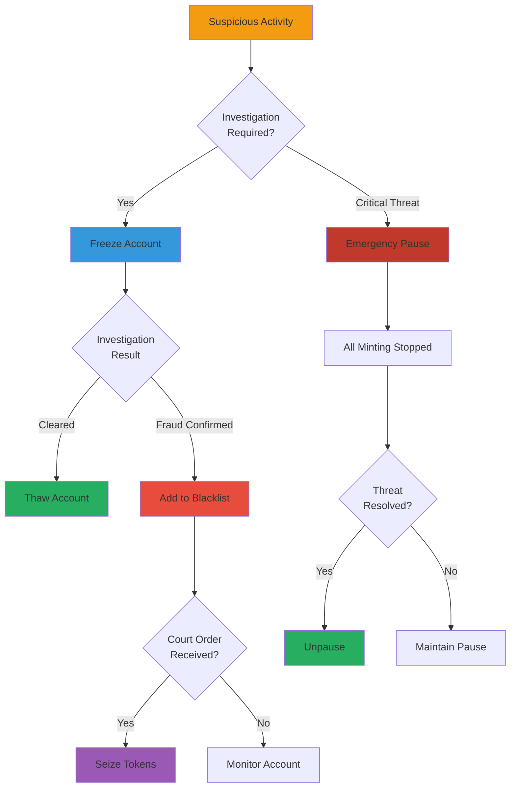

# Quick Start

Create and manage your first stablecoin in just 5 minutes!

## Quick Start Flow

```mermaid
flowchart LR
    subgraph Step1["1️⃣ Initialize"]
        A[Create SDK Client]
    end
    
    subgraph Step2["2️⃣ Create"]
        B[Initialize Stablecoin]
    end
    
    subgraph Step3["3️⃣ Configure"]
        C[Set Up Roles]
        D[Add Minter]
    end
    
    subgraph Step4["4️⃣ Mint"]
        E[Mint Tokens]
    end
    
    subgraph Step5["5️⃣ Manage"]
        F[Compliance Ops]
    end
    
    A --> B --> C --> D --> E --> F
    
    style Step1 fill:#1a1a2e,stroke:#3498db
    style Step2 fill:#1a1a2e,stroke:#9b59b6
    style Step3 fill:#1a1a2e,stroke:#f39c12
    style Step4 fill:#1a1a2e,stroke:#27ae60
    style Step5 fill:#1a1a2e,stroke:#e74c3c
```



## 1. Initialize SDK

```typescript
import { Connection, Keypair } from '@solana/web3.js';
import { SSSClient, Preset, BackingType, BankingRail } from '@sss/sdk';

// Connect to devnet
const connection = new Connection('https://api.devnet.solana.com', 'confirmed');

// Load your authority keypair
const authority = Keypair.fromSecretKey(/* your secret key */);

// Create client
const client = new SSSClient(connection, authority.publicKey);
```

## 2. Create a Stablecoin

### Stablecoin Initialization Flow



```typescript
// Initialize a new USD-backed stablecoin
const { mint, configPda, txSignature } = await client.initialize({
  name: 'My USD Stablecoin',
  symbol: 'MUSD',
  decimals: 6,
  preset: Preset.Sss2,           // Full compliance features
  supplyCap: 1_000_000_000_000_000n, // 1 billion tokens
  backingType: BackingType.Fiat,
  bankingRail: BankingRail.Swift,
  uri: 'https://example.com/metadata.json',
});

console.log('Stablecoin created!');
console.log('Mint:', mint.toBase58());
console.log('Config:', configPda.toBase58());
console.log('Tx:', txSignature);
```

## 3. Set Up Roles

### Role Management Architecture

```mermaid
flowchart TB
    subgraph Authority["👑 Authority"]
        A[Full Admin Access]
    end
    
    subgraph Roles["Assignable Roles"]
        M[🪙 Minter]
        B[🔥 Burner]
        F[❄️ Freezer]
        BL[🚫 Blacklister]
        P[⏸️ Pauser]
        S[⚖️ Seizer]
    end
    
    subgraph Permissions["Capabilities"]
        M --> M1[Mint tokens up to quota]
        B --> B1[Burn tokens]
        F --> F1[Freeze/Thaw accounts]
        BL --> BL1[Add/Remove blacklist]
        P --> P1[Pause/Unpause protocol]
        S --> S1[Seize tokens by court order]
    end
    
    A -->|grants| M
    A -->|grants| B
    A -->|grants| F
    A -->|grants| BL
    A -->|grants| P
    A -->|grants| S
    
    style Authority fill:#f39c12,stroke:#fff
    style Roles fill:#1a1a2e,stroke:#4ecdc4
```



Grant minting permissions to a minter address:

```typescript
// Add a minter with a 1M daily quota
await client.updateRoles({
  target: minterPubkey,
  role: Role.Minter,
  active: true,
  config: configPda,
});

await client.updateMinterConfig({
  minter: minterPubkey,
  quota: 1_000_000_000_000n, // 1M tokens per day
  config: configPda,
});

console.log('Minter role granted!');
```

## 4. Mint Tokens

### Minting Flow with Quota Check



Mint tokens to a recipient:

```typescript
// Mint 1000 tokens
await client.mintTokens({
  amount: 1_000_000_000n, // 1000 tokens (6 decimals)
  recipient: recipientPubkey,
  config: configPda,
});

console.log('Tokens minted!');
```

## 5. Compliance Operations

### Compliance Decision Tree



### Freeze an Account

```typescript
await client.freezeAccount({
  address: suspiciousAccount,
  config: configPda,
});
```

### Blacklist an Address

```typescript
await client.addToBlacklist({
  address: badActor,
  config: configPda,
});

// This address can no longer receive transfers!
```

### Pause the Stablecoin

```typescript
// Emergency pause - stops all minting
await client.pause({ config: configPda });

// Resume operations
await client.unpause({ config: configPda });
```

## Full Example

### Complete Stablecoin Lifecycle

```mermaid
flowchart LR
    subgraph Setup["🔧 Setup"]
        A[Connect] --> B[Load Keys]
    end
    
    subgraph Create["🏗️ Create"]
        C[Initialize] --> D[Configure]
    end
    
    subgraph Operate["💰 Operate"]
        E[Mint] --> F[Transfer]
        F --> G[Check Balance]
    end
    
    B --> C
    D --> E
    
    style Setup fill:#1a1a2e,stroke:#3498db
    style Create fill:#1a1a2e,stroke:#9b59b6
    style Operate fill:#1a1a2e,stroke:#27ae60
```



```typescript
import { Connection, Keypair } from '@solana/web3.js';
import { 
  SSSClient, 
  Preset, 
  BackingType, 
  BankingRail,
  Role 
} from '@sss/sdk';

async function main() {
  // Setup
  const connection = new Connection('https://api.devnet.solana.com', 'confirmed');
  const authority = Keypair.generate(); // Use your own keypair
  const client = new SSSClient(connection, authority.publicKey);

  // Airdrop for testing
  await connection.requestAirdrop(authority.publicKey, 2 * 1e9);

  // 1. Create stablecoin
  const { mint, configPda } = await client.initialize({
    name: 'Test USD',
    symbol: 'TUSD',
    decimals: 6,
    preset: Preset.Sss2,
    supplyCap: 0n, // Unlimited
    backingType: BackingType.Fiat,
    bankingRail: BankingRail.Ach,
    uri: '',
  });

  console.log('✅ Stablecoin created:', mint.toBase58());

  // 2. Mint some tokens
  const recipient = Keypair.generate();
  await client.mintTokens({
    amount: 1_000_000_000n,
    recipient: recipient.publicKey,
    config: configPda,
  });

  console.log('✅ Minted 1000 tokens');

  // 3. Check balance
  const balance = await client.getBalance(recipient.publicKey, mint);
  console.log('Balance:', balance / 1_000_000n, 'TUSD');
}

main().catch(console.error);
```

## CLI Quick Start

You can also use the CLI:

```bash
# Install CLI
npm install -g @sss/cli

# Initialize a new stablecoin
sss init --name "My USD" --symbol MUSD --preset sss-2

# Mint tokens
sss mint --amount 1000 --recipient <ADDRESS>

# Check status
sss status
```

## What's Next?

- [Architecture](../core-concepts/architecture.md) - Understand the system design
- [Presets](../presets/sss-1.md) - Learn about SSS-1, SSS-2, and SSS-3
- [API Reference](../api-reference/instructions.md) - Complete instruction docs
- [Compliance](../operations/compliance.md) - Regulatory features

---

:::tip Testnet Faucet
Need devnet SOL? Use `solana airdrop 2` or visit the [Solana Faucet](https://faucet.solana.com/).
:::
