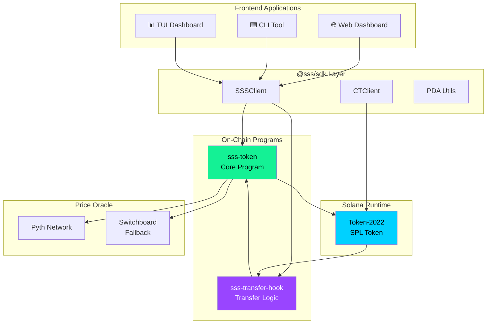
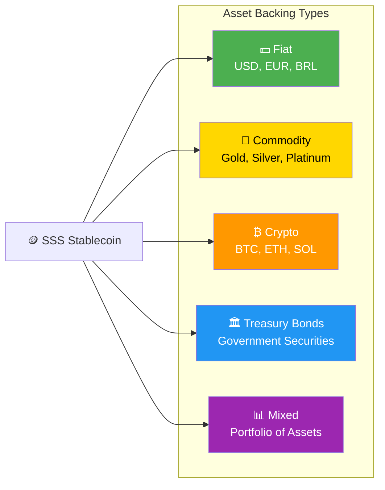
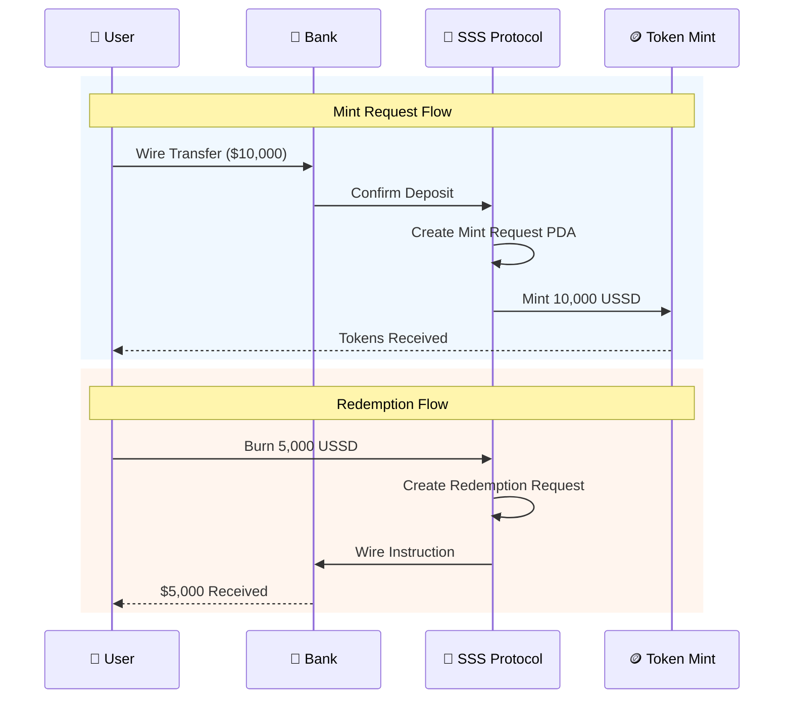
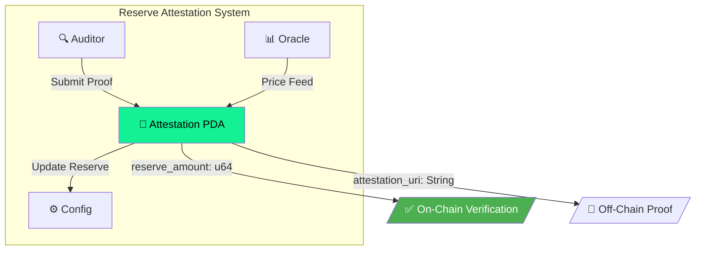
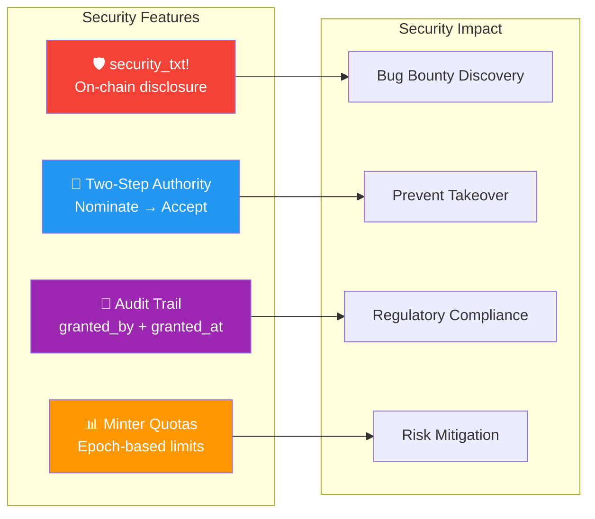
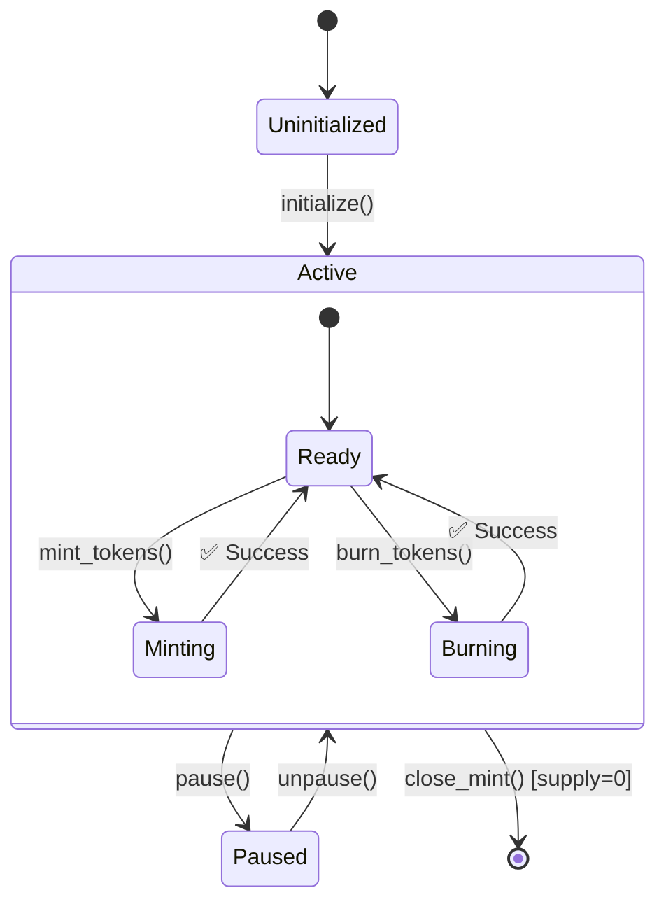
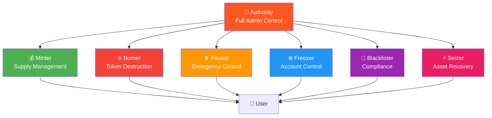

# Solana Stablecoin Standard

<div className="hero-banner">

**SSS** is the most comprehensive, production-ready SDK for creating regulated stablecoins on Solana using Token-2022.

</div>

## 🎯 What is SSS?

SSS (Solana Stablecoin Standard) provides a complete framework for building **institutional-grade stablecoins** with:

- **Three preset standards** (SSS-1, SSS-2, SSS-3) covering minimal to privacy-preserving configurations
- **Full compliance toolkit** with blacklisting, seizure, and role-based access control
- **Multi-asset backing** support for Fiat, Gold, Silver, Crypto, Treasury Bonds, and Mixed assets
- **Banking rails integration** with SWIFT, SEPA, Fedwire, Wire, and ACH support
- **Enterprise security** with two-step authority transfer, supply caps, and comprehensive audit trails

## 🏗️ System Architecture



## 📋 Preset Comparison

| Feature | SSS-1 | SSS-2 | SSS-3 |
|---------|:-----:|:-----:|:-----:|
| **Mint/Burn** | ✅ | ✅ | ✅ |
| **Freeze/Thaw** | ✅ | ✅ | ✅ |
| **Pause/Unpause** | ✅ | ✅ | ✅ |
| **Supply Caps** | ✅ | ✅ | ✅ |
| **Metadata** | ✅ | ✅ | ✅ |
| **Permanent Delegate** | ✅ | ✅ | ✅ |
| **Transfer Hook** | ❌ | ✅ | ✅ |
| **Blacklist** | ❌ | ✅ | ✅ |
| **Seize** | ❌ | ✅ | ✅ |
| **Confidential Transfer** | ❌ | ❌ | ✅ |

## 🚀 Quick Start

```bash
# Install the SDK
npm install @sss/sdk
```

```typescript
import { SSSClient, Preset, BackingType, BankingRail } from '@sss/sdk';

const client = new SSSClient(connection, authority);

// Create a gold-backed stablecoin with SWIFT banking
const { mint, config } = await client.initialize({
  name: 'Digital Gold Dollar',
  symbol: 'DGLD',
  decimals: 6,
  preset: Preset.Sss2,
  backingType: BackingType.Commodity,  // Gold backing
  bankingRail: BankingRail.Swift,      // SWIFT integration
  supplyCap: 1_000_000_000_000_000n,
});
```

## 🎁 Unique Differentiators

Unlike other implementations, SSS includes exclusive features that set it apart:

### 💰 Multi-Asset Backing Types



| Backing Type | Description | Use Case |
|--------------|-------------|----------|
| **Fiat** | Traditional bank reserves (USD, EUR, BRL) | USDC/USDT-style stablecoins |
| **Commodity** | Gold, silver, platinum reserves | Precious metal-backed tokens (PAXG) |
| **Crypto** | BTC, ETH, SOL collateral | Crypto-collateralized stables (DAI) |
| **TreasuryBond** | Government securities | Yield-bearing stablecoins |
| **Mixed** | Portfolio of multiple assets | Diversified reserve stables |

### 🏦 Banking Rails Integration



| Banking Rail | Network | Settlement | Use Case |
|--------------|---------|------------|----------|
| **SWIFT** | Global | 1-5 days | International transfers |
| **SEPA** | Europe | 1-2 days | EU zone transfers |
| **Fedwire** | USA | Same day | US domestic high-value |
| **Wire** | Regional | 1-3 days | Standard bank wire |
| **ACH** | USA | 2-3 days | US batch processing |

### 📋 Reserve Attestations



### 🔐 Enterprise Security



## 🔄 Token Lifecycle



## 📊 Role-Based Access Control



## 🏆 Why Choose SSS?

| Feature | SSS | USDC | USDT | PYUSD |
|---------|:---:|:----:|:----:|:-----:|
| Open Source | ✅ | ❌ | ❌ | ❌ |
| Self-Custody | ✅ | ❌ | ❌ | ❌ |
| Multi-Asset Backing | ✅ | ❌ | ❌ | ❌ |
| Confidential Transfers | ✅ | ❌ | ❌ | ❌ |
| On-Chain Attestations | ✅ | ❌ | ❌ | ❌ |
| Custom Banking Rails | ✅ | ❌ | ❌ | ❌ |
| Transfer Hooks | ✅ | ⚠️ | ⚠️ | ⚠️ |
| security_txt! | ✅ | ❌ | ❌ | ❌ |

## 📚 Documentation Structure

### Getting Started
- [Quick Start](./getting-started/quickstart) - Create your first stablecoin in 5 minutes
- [Installation](./getting-started/installation) - Full installation guide

### Core Concepts
- [Architecture](./core-concepts/architecture) - System design deep dive
- [Asset Backing](./core-concepts/asset-backing) - Multi-asset support
- [Banking Rails](./core-concepts/banking-rails) - Fiat integration
- [Security](./core-concepts/security) - Enterprise security features

### Standards
- [SSS-1: Basic](./presets/sss-1) - Minimal compliance
- [SSS-2: Compliant](./presets/sss-2) - Full compliance with hooks
- [SSS-3: Private](./presets/sss-3) - Confidential transfers

### Reference
- [SDK Guide](./api-reference/sdk-guide) - TypeScript SDK usage
- [Instructions](./api-reference/instructions) - All program instructions
- [Visual Diagrams](./reference/diagrams) - Mermaid diagrams library

## 🔗 Quick Links

- 📦 [GitHub Repository](https://github.com/solanabr/solana-stablecoin-standard)
- 📚 [npm Package](https://www.npmjs.com/package/@sss/sdk)
- 🔍 [Devnet Explorer](https://explorer.solana.com/?cluster=devnet)
- 💬 [Discord Community](https://discord.gg/solana)

---

:::tip Ready to Build?
Jump to [Quick Start](./getting-started/quickstart) to create your first stablecoin in 5 minutes!
:::
