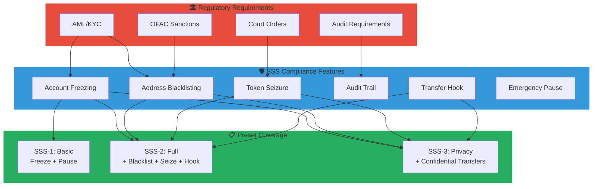
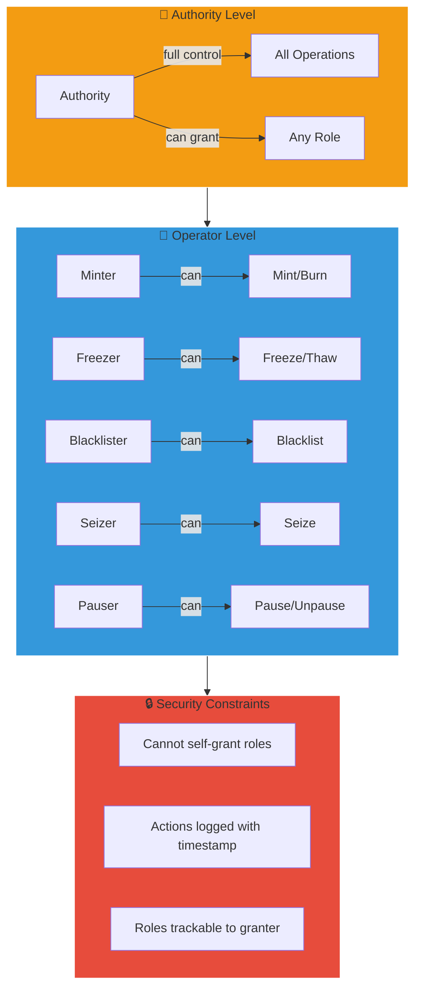
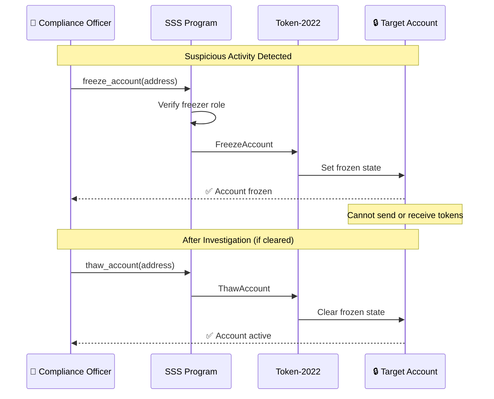
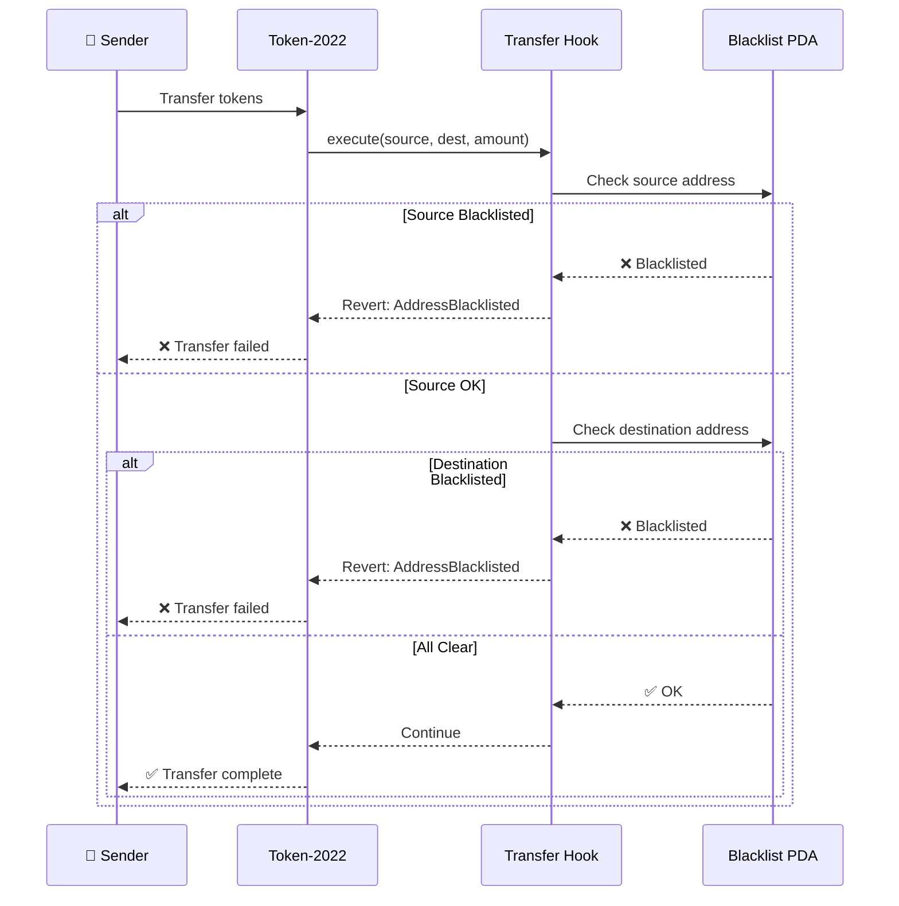
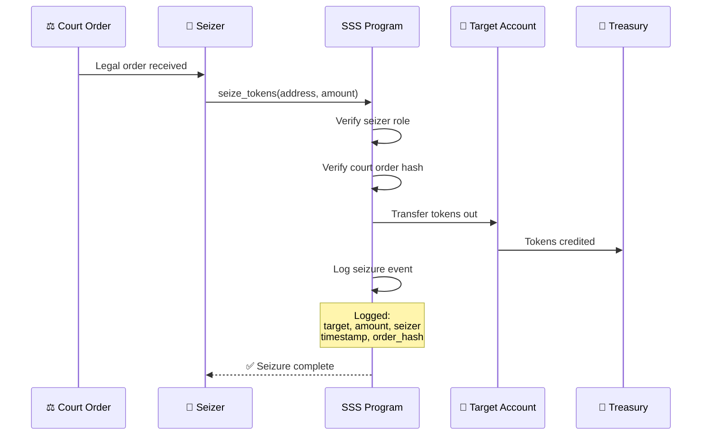
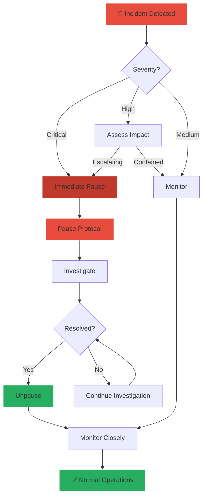

# Compliance Guide

This guide covers the regulatory compliance features built into the Solana Stablecoin Standard.

## Compliance Architecture



## Overview

SSS provides comprehensive compliance tools for regulated stablecoins:

| Feature | SSS-1 | SSS-2 | SSS-3 |
|---------|:-----:|:-----:|:-----:|
| Freeze/Thaw | ✅ | ✅ | ✅ |
| Pause | ✅ | ✅ | ✅ |
| Blacklist | ❌ | ✅ | ✅ |
| Seize | ❌ | ✅ | ✅ |
| Audit Trail | ✅ | ✅ | ✅ |
| Transfer Hook | ❌ | ✅ | ✅ |

## Role-Based Access Control

### RBAC Architecture



### Available Roles

| Role | Capabilities |
|------|--------------|
| **Authority** | Full admin access, role management |
| **Minter** | Mint and burn tokens |
| **Freezer** | Freeze and thaw accounts |
| **Blacklister** | Add/remove from blacklist |
| **Seizer** | Seize tokens from accounts |
| **Pauser** | Pause and unpause protocol |

### Role Assignment

```typescript
// Grant compliance officer multiple roles
await client.updateRoles({
  target: complianceOfficer,
  role: Role.Freezer,
  active: true,
  config: configPda,
});

await client.updateRoles({
  target: complianceOfficer,
  role: Role.Blacklister,
  active: true,
  config: configPda,
});
```

### Role Escalation Prevention

The system prevents unauthorized role escalation:

- Only authority can grant admin-level permissions
- Users cannot grant themselves roles
- All role changes are logged with `granted_by` and `granted_at`

## Account Freezing

### Freeze Flow



Freezing prevents an account from sending or receiving tokens.

### When to Freeze

- Suspicious activity detected
- Pending investigation
- Court order compliance
- Regulatory hold

### Implementation

```typescript
// Freeze account
await client.freezeAccount({
  address: suspiciousAccount,
  config: configPda,
});

// Check if frozen
const isFrozen = await client.isAccountFrozen(suspiciousAccount, mint);

// Thaw after investigation
await client.thawAccount({
  address: clearedAccount,
  config: configPda,
});
```

## Blacklisting (SSS-2+)

### Blacklist Enforcement via Transfer Hook



Blacklisting permanently blocks an address from transfers.

### When to Blacklist

- OFAC/sanctions list match
- Confirmed fraud
- Court order
- AML/KYC failure

### Implementation

```typescript
// Add to blacklist
await client.addToBlacklist({
  address: badActor,
  config: configPda,
});

// Transfer hook automatically blocks:
// - Transfers TO badActor
// - Transfers FROM badActor

// Remove if cleared
await client.removeFromBlacklist({
  address: clearedAddress,
  config: configPda,
});
```

### Blacklist Audit Trail

```typescript
const entry = await client.getBlacklistEntry(blacklistPda);

// Audit information stored on-chain:
// - address: blacklisted wallet
// - is_blacklisted: current status
// - reason: 32-byte reason code
// - blacklisted_by: compliance officer pubkey
// - blacklisted_at: timestamp
// - removed_by: who removed (if applicable)
// - removed_at: removal timestamp (if applicable)
```

## Token Seizure (SSS-2+)

### Seizure Flow



Seize tokens from accounts in compliance with legal orders.

### When to Seize

- Court-ordered asset recovery
- Fraud recovery
- AML remediation

### Implementation

```typescript
// Seize all tokens from bad actor
const balance = await client.getBalance(badActor, mint);

await client.seize({
  address: badActor,
  amount: balance,
  config: configPda,
});

// Tokens are burned (removed from circulation)
// Or transferred to treasury based on implementation
```

### Seizure Logging

All seizures are logged on-chain with:
- Seized address
- Amount seized
- Seizer's pubkey
- Timestamp

## Emergency Pause

### Emergency Response Flow



Pause all minting operations in emergencies.

### When to Pause

- Security incident
- Market manipulation detected
- Regulatory directive
- Technical issues

### Implementation

```typescript
// Emergency pause
await client.pause({
  config: configPda,
});

// Check status
const config = await client.getConfig(configPda);
console.log('Is Paused:', config.isPaused);

// Resume after resolution
await client.unpause({
  config: configPda,
});
```

### Pause Behavior

When paused:
- ✅ Transfers still work (via Token-2022)
- ❌ New minting blocked
- ❌ New redemptions blocked
- ✅ Freeze/thaw operations work
- ✅ Blacklist operations work

## Minting Controls

### Supply Caps

Set hard limits on total supply:

```typescript
// Initialize with cap
await client.initialize({
  ...params,
  supplyCap: 1_000_000_000_000_000n, // 1B tokens max
});

// Update cap (increase only recommended)
await client.setSupplyCap({
  newCap: 2_000_000_000_000_000n,
  config: configPda,
});
```

### Minter Quotas

Limit individual minters:

```typescript
// Set daily quota
await client.updateMinterConfig({
  minter: minterPubkey,
  quota: 10_000_000_000_000n, // 10M tokens/day
  config: configPda,
});
```

Quotas reset automatically every 24 hours.

## Two-Step Authority Transfer

Prevents accidental authority transfers:

```typescript
// Step 1: Current authority nominates
await client.nominateAuthority({
  newAuthority: newAuthorityPubkey,
  config: configPda,
});

// Step 2: New authority must accept
const newClient = new SSSClient(connection, newAuthorityPubkey);
await newClient.acceptAuthority({
  config: configPda,
});

// If new authority doesn't accept, nomination can be cancelled
```

## Audit Trail

All compliance actions are logged on-chain:

### RolesConfig Audit Fields

```rust
pub struct RolesConfig {
    pub granted_by: Pubkey,     // Who granted the role
    pub granted_at: i64,        // When granted
    pub last_action_at: i64,    // Last action timestamp
    pub active: bool,           // Current status
}
```

### BlacklistEntry Audit Fields

```rust
pub struct BlacklistEntry {
    pub blacklisted_by: Pubkey,   // Who blacklisted
    pub blacklisted_at: i64,      // When blacklisted
    pub removed_by: Option<Pubkey>, // Who removed
    pub removed_at: Option<i64>,  // When removed
    pub reason: [u8; 32],         // Reason code
}
```

### Querying History

```typescript
// Get all blacklist entries for analysis
const entries = await client.getAllBlacklistEntries(configPda);

for (const entry of entries) {
  console.log(`Address: ${entry.address.toBase58()}`);
  console.log(`Status: ${entry.isBlacklisted ? 'Active' : 'Removed'}`);
  console.log(`Blacklisted by: ${entry.blacklistedBy.toBase58()}`);
  console.log(`Date: ${new Date(entry.blacklistedAt * 1000)}`);
}
```

## Reserve Attestation

Provide proof of reserves for transparency:

```typescript
// Submit attestation (typically from oracle/auditor)
await client.submitAttestation({
  totalReserves: 100_000_000_000_000n, // $100M
  validForSeconds: 86400, // Valid for 24 hours
  ipfsHash: auditReportHash, // Link to full audit
  config: configPda,
});

// Check attestation
const attestation = await client.getReserveAttestation(configPda);
console.log('Reserves:', attestation.totalReserves);
console.log('Supply:', attestation.totalSupply);
console.log('Backing Ratio:', attestation.backingRatio / 100, '%');
console.log('Valid Until:', new Date(attestation.validUntil * 1000));
```

## Best Practices

### 1. Separation of Duties

```typescript
// Different people for different roles
await client.updateRoles({ target: cfo, role: Role.Minter, active: true });
await client.updateRoles({ target: compliance, role: Role.Freezer, active: true });
await client.updateRoles({ target: legal, role: Role.Seizer, active: true });
```

### 2. Regular Audits

- Review role assignments monthly
- Check blacklist for stale entries
- Verify minting quotas are appropriate
- Confirm reserve attestations are current

### 3. Emergency Procedures

Document and practice:
1. Who can pause? (multiple pausers recommended)
2. Escalation path for seizure requests
3. Communication plan for pause events
4. Recovery procedures

### 4. Compliance Monitoring

```typescript
// Set up alerts for compliance events
const subscriptionId = connection.onLogs(
  SSS_PROGRAM_ID,
  (logs) => {
    if (logs.logs.some(l => l.includes('blacklist'))) {
      sendAlert('Blacklist operation detected');
    }
    if (logs.logs.some(l => l.includes('seize'))) {
      sendAlert('Seizure operation detected');
    }
  }
);
```

## Regulatory Considerations

### Travel Rule

SSS doesn't implement travel rule directly, but:
- Use banking rails with reference IDs
- Store sender/recipient info off-chain
- Link on-chain TXs to off-chain records

### KYC/AML

Implement at the application layer:
- Verify users before creating accounts
- Link wallets to verified identities off-chain
- Use blacklist for flagged addresses

### Reporting

Export data for regulatory reports:
- All minting transactions
- All burning transactions
- Blacklist additions/removals
- Role changes
- Reserve attestations

## Attestations

Reserve attestations provide off-chain evidence that backs on-chain supply and policy claims.

Recommended attestation package:

- Attestation timestamp and reporting period
- Total reserves by asset class
- External auditor reference URI
- Reconciliation against on-chain minted and burned totals

---

Next: [Operations Guide](./operations.md) - Deployment and operational procedures
