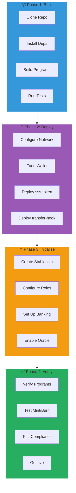
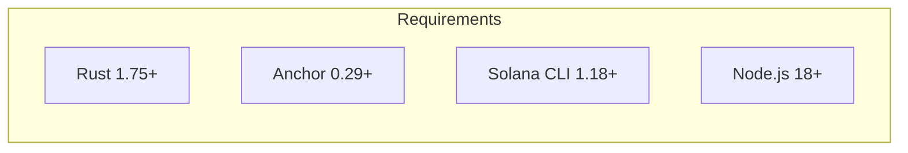
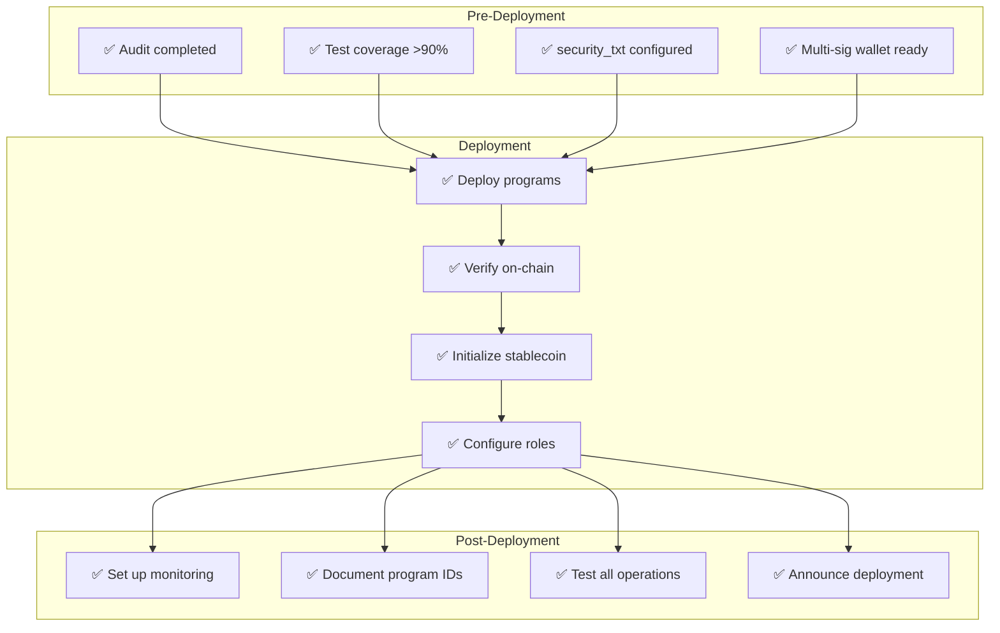
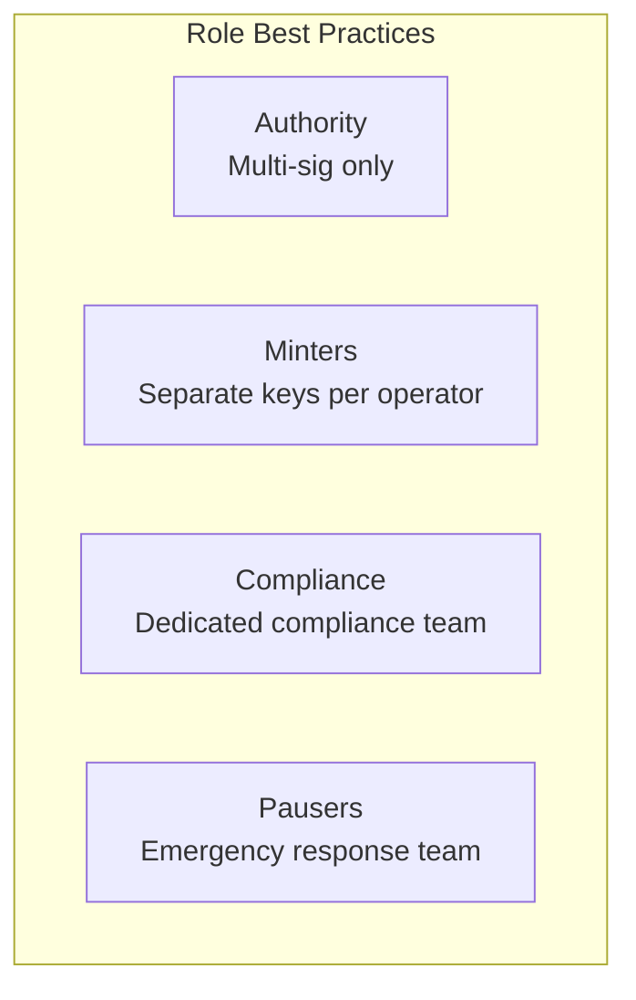

# Deployment Guide

This guide covers deploying SSS programs and creating production stablecoins.

## Deployment Overview



## Prerequisites



- **Rust**: 1.75 or higher
- **Anchor**: 0.29.0 or higher
- **Solana CLI**: 1.18.0 or higher
- **Node.js**: 18.0 or higher

## Program Deployment

### 1. Build Programs

```bash
# Clone repository
git clone https://github.com/solanabr/solana-stablecoin-standard
cd solana-stablecoin-standard

# Install dependencies
npm install

# Build Anchor programs
anchor build
```

### 2. Configure Network

```bash
# For devnet
solana config set --url devnet

# For mainnet
solana config set --url mainnet-beta

# Check configuration
solana config get
```

### 3. Deploy Programs

```bash
# Deploy sss-token program
anchor deploy --program-name sss-token

# Deploy sss-transfer-hook program
anchor deploy --program-name sss-transfer-hook
```

:::caution Mainnet Deployment
Mainnet deployment requires significant SOL for rent (~4-5 SOL per program). Ensure your wallet is funded.
:::

### 4. Verify Deployment

```bash
# Check program is deployed
solana program show <PROGRAM_ID>

# Verify program data
anchor verify <PROGRAM_ID>
```

## Stablecoin Initialization

### Using SDK

```typescript
import { Connection, Keypair } from '@solana/web3.js';
import { SSSClient, Preset, BackingType, BankingRail } from '@sss/sdk';

// Connect to network
const connection = new Connection('https://api.mainnet-beta.solana.com', 'confirmed');

// Load authority keypair
const authority = Keypair.fromSecretKey(/* your secret key */);

// Create client
const client = new SSSClient(connection, authority.publicKey);

// Initialize stablecoin
const { mint, configPda, signature } = await client.initialize({
  name: 'USD Stablecoin',
  symbol: 'USDS',
  decimals: 6,
  preset: Preset.Sss2,
  supplyCap: 1_000_000_000_000_000n, // 1 billion
  backingType: BackingType.Fiat,
  bankingRail: BankingRail.Swift,
  uri: 'https://example.com/metadata.json',
  hookProgramId: TRANSFER_HOOK_PROGRAM_ID,
});

console.log('Stablecoin deployed!');
console.log('Mint:', mint.toBase58());
console.log('Config:', configPda.toBase58());
```

### Using CLI

```bash
# Initialize with CLI
sss init \
  --name "USD Stablecoin" \
  --symbol "USDS" \
  --decimals 6 \
  --preset sss2 \
  --supply-cap 1000000000 \
  --backing-type fiat \
  --banking-rail swift \
  --uri "https://example.com/metadata.json"
```

## Deployment Checklist



## Security Considerations

### Multi-Signature Setup

For production, use a multi-sig wallet as the authority:

```typescript
// Use Squads multi-sig as authority
const { mint, configPda } = await client.initialize({
  // ... config
  authority: squadsMultisigPda, // Multi-sig authority
});
```

### Role Assignment



Assign minimal permissions:

```typescript
// Grant minter role with quota
await client.updateRoles({
  target: minterPubkey,
  role: Role.Minter,
  active: true,
});

await client.updateMinterConfig({
  minter: minterPubkey,
  quota: 100_000_000000n, // Conservative daily limit
});
```

## Environment Configuration

### Development

```env
# .env.development
SOLANA_RPC_URL=https://api.devnet.solana.com
SSS_TOKEN_PROGRAM_ID=<devnet-program-id>
SSS_HOOK_PROGRAM_ID=<devnet-hook-id>
```

### Production

```env
# .env.production
SOLANA_RPC_URL=https://api.mainnet-beta.solana.com
SSS_TOKEN_PROGRAM_ID=<mainnet-program-id>
SSS_HOOK_PROGRAM_ID=<mainnet-hook-id>
```

## Monitoring Setup

### Event Logging

```typescript
// Subscribe to program events
const subscriptionId = connection.onProgramAccountChange(
  SSS_PROGRAM_ID,
  (accountInfo, context) => {
    // Handle account changes
    console.log('Account updated:', accountInfo);
  },
  'confirmed'
);
```

### Alerting

Set up alerts for:
- Large mint/burn operations
- Authority changes
- Pause events
- Blacklist additions
- Quota approaching limits

## Devnet vs Mainnet

| Aspect | Devnet | Mainnet |
|--------|--------|---------|
| **SOL Cost** | Free (airdrop) | Real SOL |
| **Program Deploy** | ~2 SOL | ~4-5 SOL |
| **Persistence** | May reset | Permanent |
| **Oracles** | Test feeds | Production feeds |
| **Use Case** | Testing | Production |

## Upgrade Path

SSS programs can be upgraded if deployed as upgradeable:

```bash
# Deploy as upgradeable (default)
anchor deploy --program-name sss-token

# Upgrade existing program
anchor upgrade target/deploy/sss_token.so --program-id <PROGRAM_ID>
```

:::warning Authority Control
Only the upgrade authority can upgrade programs. Consider transferring upgrade authority to a DAO or multi-sig for production.
:::

## Next Steps

- [Operations](./operations.md) - Day-to-day operations
- [Compliance](./compliance.md) - Regulatory setup
- [SDK Guide](../api-reference/sdk-guide.md) - Full SDK documentation

