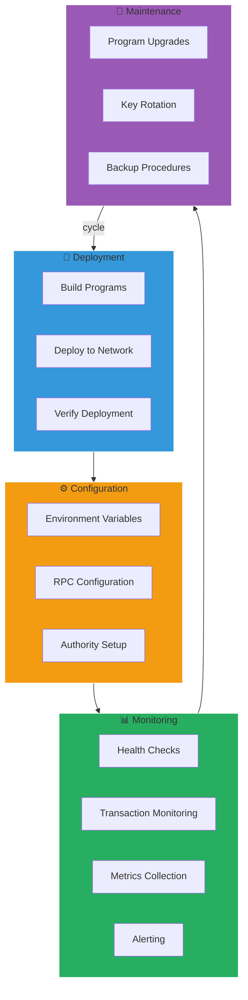
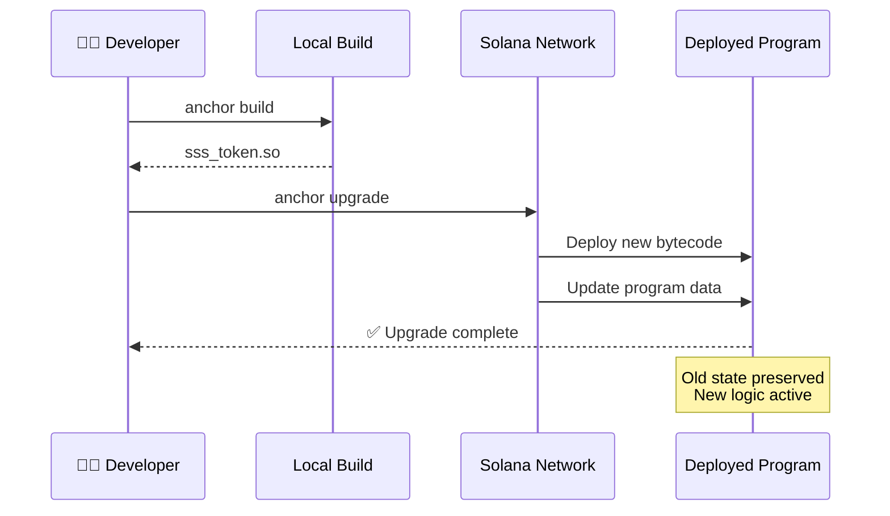
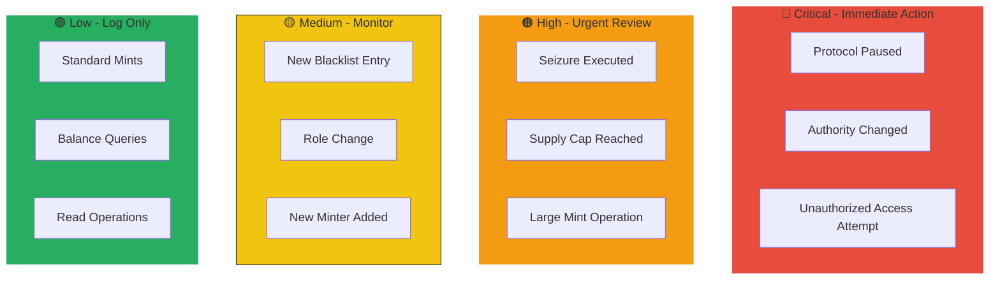
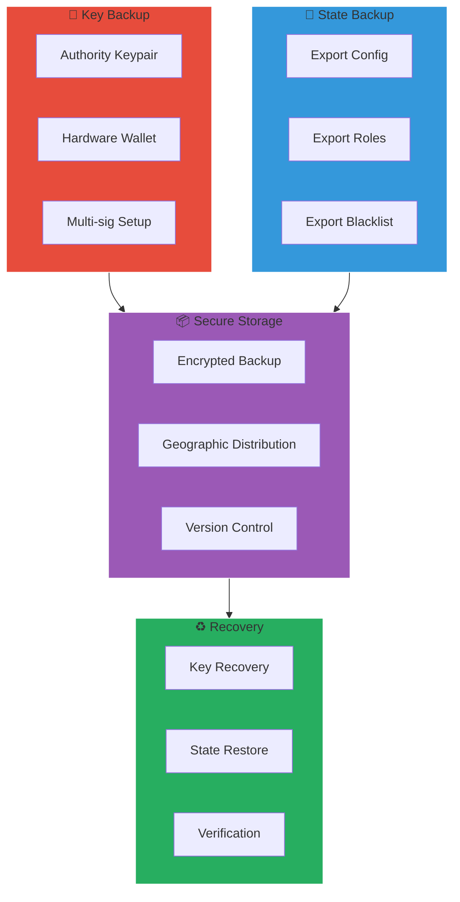

# Operations Guide

This guide covers deployment, monitoring, and operational procedures for SSS.

## Operations Overview



## Deployment

### Devnet Deployment

The programs are already deployed to devnet:

| Program | Address |
|---------|---------|
| sss-token | `2L6rZHyqhJ9VJqXhbgW7vyP3uerrw7Vzpp3qtqAq1FZj` |
| sss-transfer-hook | `E3pPcPAU4Un7WMaHyMnG6L3SJ8dNu4gjZGU6ExqvhRzS` |

### Deploy Your Own

```bash
# Build programs
anchor build

# Deploy to devnet
anchor deploy --provider.cluster devnet

# Deploy to mainnet (requires funded wallet)
anchor deploy --provider.cluster mainnet-beta
```

### Program Upgrade

### Upgrade Flow



SSS programs are upgradeable by default:

```bash
# Upgrade program
anchor upgrade target/deploy/sss_token.so \
  --program-id 2L6rZHyqhJ9VJqXhbgW7vyP3uerrw7Vzpp3qtqAq1FZj \
  --provider.cluster devnet
```

To make immutable:

```bash
solana program set-upgrade-authority \
  2L6rZHyqhJ9VJqXhbgW7vyP3uerrw7Vzpp3qtqAq1FZj \
  --final
```

## Configuration

### Environment Variables

```bash
# .env
SOLANA_RPC_URL=https://api.devnet.solana.com
SSS_TOKEN_PROGRAM_ID=2L6rZHyqhJ9VJqXhbgW7vyP3uerrw7Vzpp3qtqAq1FZj
SSS_HOOK_PROGRAM_ID=E3pPcPAU4Un7WMaHyMnG6L3SJ8dNu4gjZGU6ExqvhRzS

# Authority keypair path
AUTHORITY_KEYPAIR=/path/to/authority.json
```

### RPC Configuration

For production, use dedicated RPC:

```typescript
const connection = new Connection(
  process.env.RPC_URL,
  {
    commitment: 'confirmed',
    confirmTransactionInitialTimeout: 60000,
  }
);
```

Recommended RPC providers:
- Helius
- QuickNode
- Triton
- Alchemy

## Monitoring

### Monitoring Architecture

```mermaid
flowchart TB
    subgraph Sources["📡 Data Sources"]
        S1[Solana RPC]
        S2[Program Logs]
        S3[Config Accounts]
    end
    
    subgraph Collectors["🔄 Collectors"]
        C1[Health Check Service]
        C2[Log Subscriber]
        C3[Metrics Exporter]
    end
    
    subgraph Storage["💾 Storage"]
        ST1[(Prometheus)]
        ST2[(Log Store)]
    end
    
    subgraph Alerting["🚨 Alerting"]
        A1[Grafana]
        A2[PagerDuty]
        A3[Slack]
    end
    
    S1 --> C1
    S2 --> C2
    S3 --> C3
    
    C1 --> ST1
    C2 --> ST2
    C3 --> ST1
    
    ST1 --> A1
    ST2 --> A1
    A1 --> A2
    A1 --> A3
    
    style Sources fill:#3498db,stroke:#fff
    style Collectors fill:#f39c12,stroke:#fff
    style Storage fill:#9b59b6,stroke:#fff
    style Alerting fill:#e74c3c,stroke:#fff
```



### Health Checks

```typescript
async function healthCheck() {
  // Check program exists
  const programInfo = await connection.getAccountInfo(SSS_PROGRAM_ID);
  if (!programInfo) {
    throw new Error('Program not found');
  }

  // Check recent activity
  const signatures = await connection.getSignaturesForAddress(
    SSS_PROGRAM_ID,
    { limit: 10 }
  );

  // Check config account
  const config = await client.getConfig(configPda);
  
  return {
    programDeployed: true,
    recentTxCount: signatures.length,
    isPaused: config.isPaused,
    currentSupply: config.totalMinted - config.totalBurned,
    supplyCap: config.supplyCap,
  };
}
```

### Transaction Monitoring

```typescript
// Subscribe to all program transactions
const subscriptionId = connection.onLogs(
  SSS_PROGRAM_ID,
  (logs) => {
    console.log('Signature:', logs.signature);
    console.log('Slot:', logs.slot);
    
    // Parse logs for events
    for (const log of logs.logs) {
      if (log.includes('mint')) {
        // Handle mint event
      } else if (log.includes('blacklist')) {
        // Handle blacklist event
      } else if (log.includes('pause')) {
        // Handle pause event
        sendAlert('Protocol paused!');
      }
    }
  },
  'confirmed'
);
```

### Metrics Collection

```typescript
// Prometheus metrics example
import { Registry, Gauge } from 'prom-client';

const register = new Registry();

const supplyGauge = new Gauge({
  name: 'sss_total_supply',
  help: 'Total token supply',
  registers: [register],
});

const pausedGauge = new Gauge({
  name: 'sss_is_paused',
  help: 'Protocol pause status',
  registers: [register],
});

async function updateMetrics() {
  const config = await client.getConfig(configPda);
  supplyGauge.set(Number(config.totalMinted - config.totalBurned));
  pausedGauge.set(config.isPaused ? 1 : 0);
}

// Run every minute
setInterval(updateMetrics, 60000);
```

## Alerting

### Alert Severity Matrix



### Critical Alerts

Set up alerts for:

| Event | Severity | Action |
|-------|----------|--------|
| Protocol paused | Critical | Investigate immediately |
| Seizure executed | High | Verify authorization |
| New blacklist entry | Medium | Log for compliance |
| Authority changed | Critical | Verify was intentional |
| Supply cap reached | High | Review cap settings |

### Alert Implementation

```typescript
import { SNS } from 'aws-sdk';

const sns = new SNS();

async function sendAlert(message: string, severity: string) {
  await sns.publish({
    TopicArn: process.env.ALERT_TOPIC_ARN,
    Message: JSON.stringify({
      severity,
      message,
      timestamp: new Date().toISOString(),
      program: SSS_PROGRAM_ID.toBase58(),
    }),
    Subject: `SSS Alert: ${severity}`,
  }).promise();
}
```

## Backup and Recovery

### Backup Strategy



### Key Management

```bash
# Backup authority keypair
cp ~/.config/solana/authority.json /secure/backup/location/

# Use hardware wallet for production
solana-keygen new --derivation-path "m/44'/501'/0'/0'"
```

### State Export

```typescript
async function exportState() {
  const config = await client.getConfig(configPda);
  const roles = await client.getAllRoles(configPda);
  const blacklist = await client.getAllBlacklistEntries(configPda);
  
  return {
    timestamp: new Date().toISOString(),
    config: {
      authority: config.authority.toBase58(),
      mint: config.mint.toBase58(),
      supplyCap: config.supplyCap.toString(),
      totalMinted: config.totalMinted.toString(),
      totalBurned: config.totalBurned.toString(),
      isPaused: config.isPaused,
    },
    roles: roles.map(r => ({
      target: r.target.toBase58(),
      isMinter: r.isMinter,
      isFreezer: r.isFreezer,
      isBlacklister: r.isBlacklister,
      isPauser: r.isPauser,
      mintQuota: r.mintQuota.toString(),
    })),
    blacklist: blacklist.map(b => ({
      address: b.address.toBase58(),
      isBlacklisted: b.isBlacklisted,
      blacklistedAt: b.blacklistedAt,
    })),
  };
}
```

## Incident Response

### Pause Procedure

```typescript
// Emergency pause checklist:
// 1. Verify the threat
// 2. Pause the protocol
await client.pause({ config: configPda });

// 3. Notify stakeholders
await sendAlert('Protocol paused due to incident', 'CRITICAL');

// 4. Investigate
// 5. Document findings
// 6. Implement fix
// 7. Resume
await client.unpause({ config: configPda });

// 8. Post-mortem
```

### Seizure Procedure

```typescript
// Seizure checklist:
// 1. Receive legal authorization
// 2. Document authorization (court order, etc.)
// 3. Verify target address

// 4. Execute seizure
await client.seize({
  address: targetAddress,
  amount: amountToSeize,
  config: configPda,
});

// 5. Log transaction
console.log('Seizure TX:', txSignature);

// 6. Report to legal/compliance
// 7. Update internal records
```

## Maintenance

### Regular Tasks

| Task | Frequency | Description |
|------|-----------|-------------|
| Health check | Continuous | Monitor availability |
| Metrics review | Daily | Check supply, activity |
| Role audit | Weekly | Verify role assignments |
| Blacklist review | Weekly | Check for stale entries |
| Attestation update | Daily | Update reserve proofs |
| Backup verification | Monthly | Test key recovery |

### Upgrade Procedure

1. **Test on devnet**
   ```bash
   anchor test --provider.cluster devnet
   ```

2. **Deploy to staging**
   ```bash
   anchor deploy --provider.cluster devnet
   ```

3. **Run integration tests**
   ```bash
   npm run test:integration
   ```

4. **Deploy to mainnet** (with governance if applicable)
   ```bash
   anchor upgrade target/deploy/sss_token.so \
     --program-id <MAINNET_PROGRAM_ID> \
     --provider.cluster mainnet-beta
   ```

5. **Verify deployment**
   ```bash
   solana program show <PROGRAM_ID>
   ```

## Security Best Practices

### Authority Key Security

- Use hardware wallet (Ledger)
- Multi-sig for mainnet authority
- Never share private keys
- Rotate keys periodically

### Access Control

- Minimum necessary roles
- Regular access reviews
- Immediate revocation on departure
- Audit all role changes

### Network Security

- Use dedicated RPC
- Enable rate limiting
- Monitor for anomalies
- Keep dependencies updated

## Troubleshooting

### Common Issues

**Transaction fails with "insufficient funds"**
```bash
solana balance
solana airdrop 2  # devnet only
```

**"Program account does not exist"**
```bash
solana program show <PROGRAM_ID>
# If missing, redeploy
anchor deploy
```

**"Account not found"**
```typescript
// Check PDA derivation
const [pda] = PublicKey.findProgramAddressSync(
  [Buffer.from("config"), mint.toBuffer()],
  SSS_PROGRAM_ID
);
console.log('Expected PDA:', pda.toBase58());
```

**"Unauthorized"**
```typescript
// Verify signer matches authority
const config = await client.getConfig(configPda);
console.log('Authority:', config.authority.toBase58());
console.log('Signer:', wallet.publicKey.toBase58());
```

---

## Support

- **Documentation**: This site
- **GitHub Issues**: [Report bugs](https://github.com/solanabr/solana-stablecoin-standard/issues)
- **Discord**: [Solana Discord](https://discord.gg/solana)
- **Security**: security@solanabr.org
