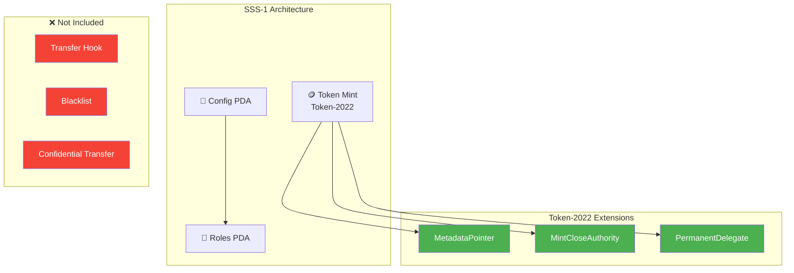
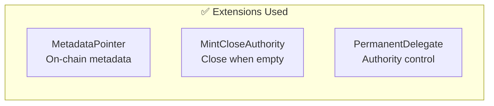
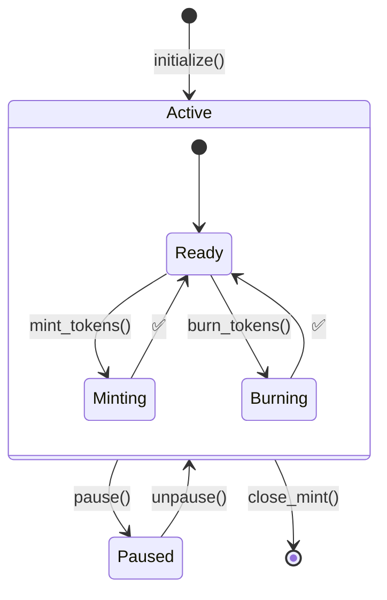
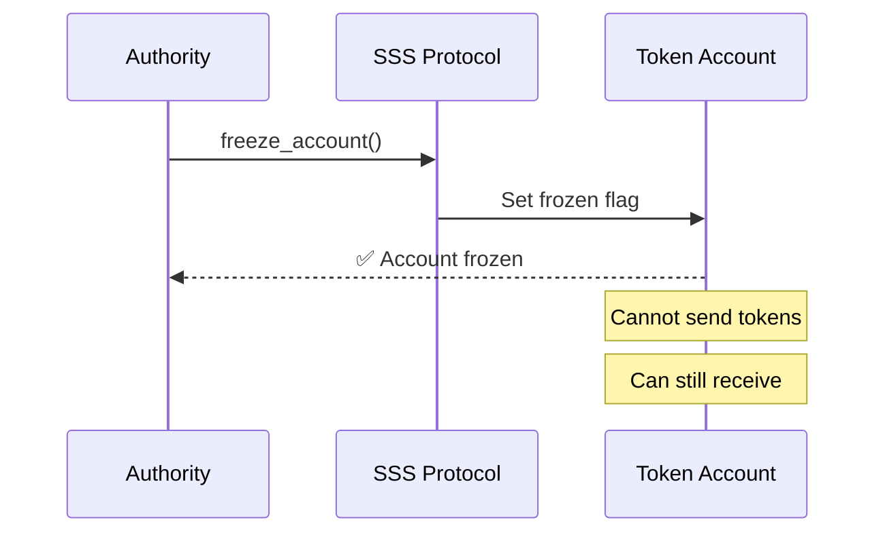
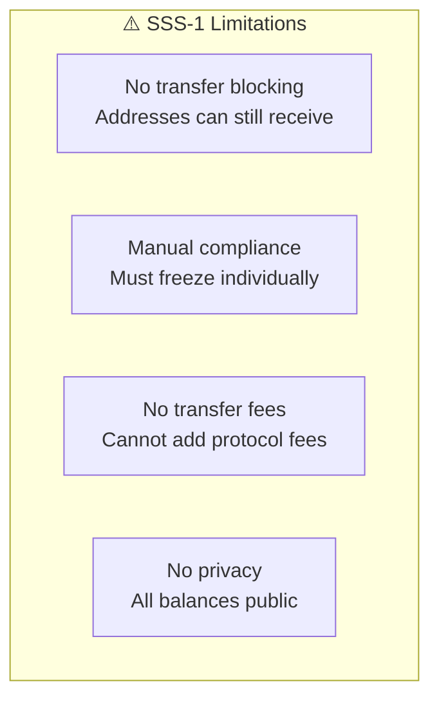

# SSS-1: Basic Preset

SSS-1 is the minimal stablecoin preset, providing essential compliance features without transfer hooks.

## Architecture



## Features

| Feature | Included |
|---------|:--------:|
| Mint/Burn | ✅ |
| Freeze/Thaw | ✅ |
| Pause/Unpause | ✅ |
| Metadata | ✅ |
| Permanent Delegate | ✅ |
| Supply Caps | ✅ |
| Transfer Hook | ❌ |
| Blacklist | ❌ |
| Seize | ❌ |
| Confidential Transfer | ❌ |

## Token-2022 Extensions



- **MetadataPointer** - On-chain token metadata
- **MintCloseAuthority** - Close mint when supply = 0
- **PermanentDelegate** - Authority can transfer from any account

## Use Cases

SSS-1 is ideal for:

- **Simple internal tokens** - Company-specific stablecoins
- **Testing and development** - Quick prototyping
- **Non-regulated markets** - Where blacklisting isn't required

## State Machine



## Initialization

```typescript
import { SSSClient, Preset, BackingType, BankingRail } from '@sss/sdk';

const { mint, configPda } = await client.initialize({
  name: 'Basic USD',
  symbol: 'BUSD',
  decimals: 6,
  preset: Preset.Sss1,
  supplyCap: 100_000_000_000_000n, // 100M tokens
  backingType: BackingType.Fiat,
  bankingRail: BankingRail.None,
  uri: 'https://example.com/metadata.json',
});
```

## Operations

### Minting

```typescript
await client.mintTokens({
  amount: 1_000_000n,
  recipient: userPubkey,
  config: configPda,
});
```

### Freezing



```typescript
// Freeze a suspicious account
await client.freezeAccount({
  address: suspiciousAccount,
  config: configPda,
});

// Thaw when cleared
await client.thawAccount({
  address: suspiciousAccount,
  config: configPda,
});
```

### Pausing

```typescript
// Emergency pause - stops all minting
await client.pause({ config: configPda });

// Resume operations
await client.unpause({ config: configPda });
```

## Limitations



- **No transfer blocking** - Blacklisted addresses can still receive transfers
- **Manual compliance** - Must freeze accounts individually
- **No transfer fees** - Cannot add protocol fees on transfers

## When to Upgrade

Consider SSS-2 if you need:
- Automatic transfer blocking
- Blacklist enforcement
- Seizure capabilities
- Transfer hooks for custom logic

---

Next: [SSS-2 Preset](./sss-2) - Full compliance with transfer hooks
