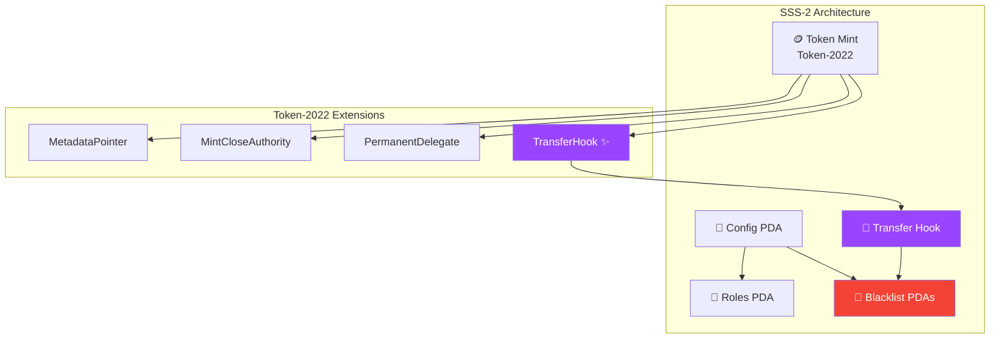
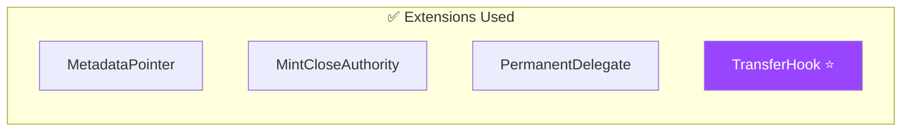
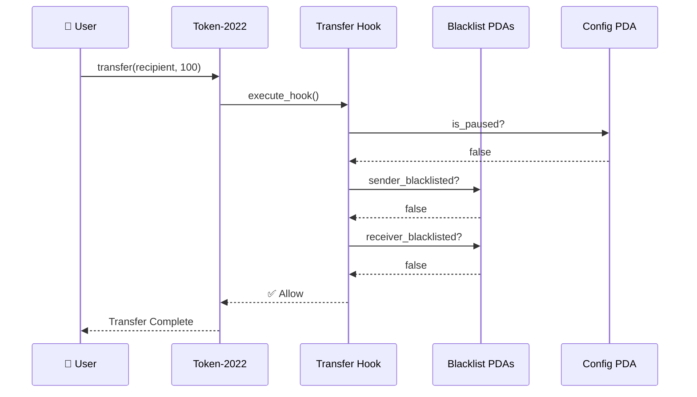
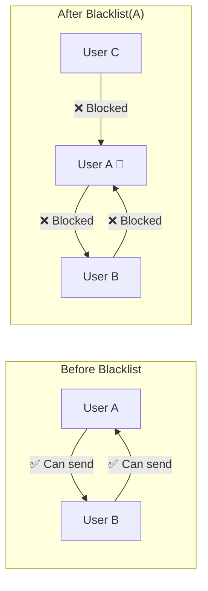
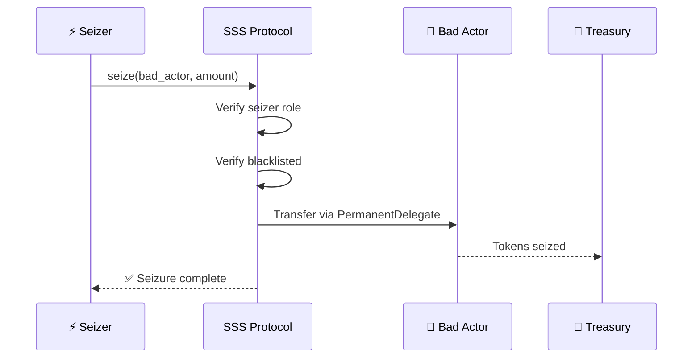
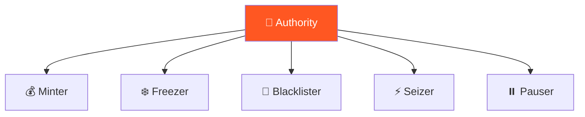
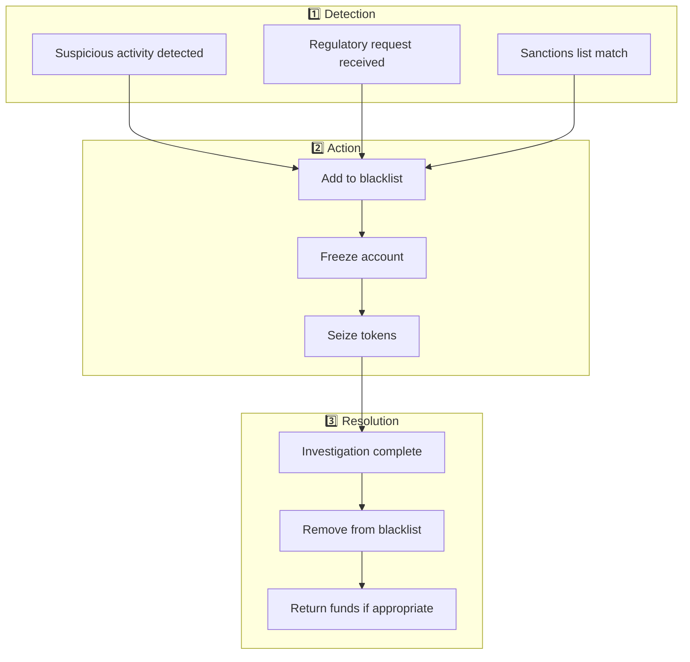

# SSS-2: Full Compliance Preset

SSS-2 is the recommended preset for production stablecoins, providing complete compliance features including transfer hooks for automatic blacklist enforcement.

## Architecture



## Features

| Feature | Included |
|---------|:--------:|
| Mint/Burn | ✅ |
| Freeze/Thaw | ✅ |
| Pause/Unpause | ✅ |
| Metadata | ✅ |
| Permanent Delegate | ✅ |
| Supply Caps | ✅ |
| Transfer Hook | ✅ |
| Blacklist | ✅ |
| Seize | ✅ |
| Confidential Transfer | ❌ |

## Token-2022 Extensions



- **MetadataPointer** - On-chain token metadata
- **MintCloseAuthority** - Close mint when supply = 0
- **PermanentDelegate** - Authority can seize tokens
- **TransferHook** - Custom transfer logic for compliance

## Use Cases

SSS-2 is ideal for:

- **Regulated stablecoins** - USDC/USDT-like compliance
- **Enterprise tokens** - B2B settlement tokens
- **RWA tokens** - Tokenized real-world assets

## Transfer Hook Flow



## Initialization

```typescript
import { SSSClient, Preset, BackingType, BankingRail } from '@sss/sdk';

const { mint, configPda } = await client.initialize({
  name: 'Compliant USD',
  symbol: 'CUSD',
  decimals: 6,
  preset: Preset.Sss2,
  supplyCap: 0n, // Unlimited
  backingType: BackingType.Fiat,
  bankingRail: BankingRail.Swift,
  uri: 'https://example.com/metadata.json',
  hookProgramId: TRANSFER_HOOK_PROGRAM_ID, // Required for SSS-2
});
```

## Operations

### Blacklisting

The key differentiator of SSS-2 is automatic transfer blocking:



```typescript
// Add to blacklist
await client.addToBlacklist({
  address: badActor,
  config: configPda,
});

// Now ANY transfer involving this address will fail automatically!

// Remove from blacklist
await client.removeFromBlacklist({
  address: clearedAddress,
  config: configPda,
});
```

### Seizure



```typescript
// Seize tokens from a blacklisted account
await client.seize({
  address: badActor,
  amount: 1_000_000_000n,
  config: configPda,
});
```

### Banking Rails

SSS-2 supports full banking integration:

```typescript
// Create a mint request (after receiving bank wire)
await client.createMintRequest({
  depositor: bankCustomer,
  recipient: tokenRecipient,
  amount: 10_000_000_000n,
  fiatAmount: 10000_00n, // $10,000.00 in cents
  fiatCurrency: FiatCurrency.Usd,
  referenceId: wireReference,
});

// Confirm and mint after bank verification
await client.confirmAndMint({
  requestPda: mintRequestPda,
});
```

## Roles Configuration



| Role | Permissions |
|------|-------------|
| **Minter** | `mint_tokens`, `burn_tokens` |
| **Freezer** | `freeze_account`, `thaw_account` |
| **Blacklister** | `add_to_blacklist`, `remove_from_blacklist` |
| **Seizer** | `seize` |
| **Pauser** | `pause`, `unpause` |

```typescript
// Grant compliance role
await client.updateRoles({
  target: complianceOfficer,
  role: Role.Blacklister,
  active: true,
  config: configPda,
});
```

## Compliance Workflow



## Minter Quotas

Limit how much each minter can mint per day:

```typescript
// Set a 1M daily quota
await client.updateMinterConfig({
  minter: minterPubkey,
  quota: 1_000_000_000_000n, // 1M tokens per 24-hour epoch
  config: configPda,
});
```

The quota resets every 24 hours automatically.

## Reserve Attestation

Provide proof of reserves:

```typescript
await client.submitAttestation({
  totalReserves: 100_000_000_000_000n, // $100M in reserves
  validForSeconds: 86400, // Valid for 24 hours
  ipfsHash: auditReportHash,
  config: configPda,
});
```

## Audit Trail

All SSS-2 operations maintain an audit trail:

```typescript
// BlacklistEntry stores:
{
  address: Pubkey,
  is_blacklisted: bool,
  reason: [u8; 32],
  blacklisted_by: Pubkey,
  blacklisted_at: i64,
  removed_by: Option<Pubkey>,
  removed_at: Option<i64>,
}

// RolesConfig stores:
{
  granted_by: Pubkey,
  granted_at: i64,
  last_action_at: i64,
  active: bool,
}
```

---

Next: [SSS-3 Preset](./sss-3.md) - Privacy-preserving with confidential transfers
