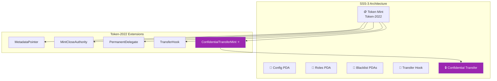
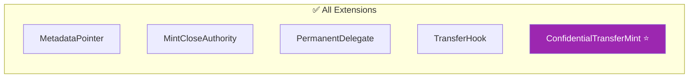
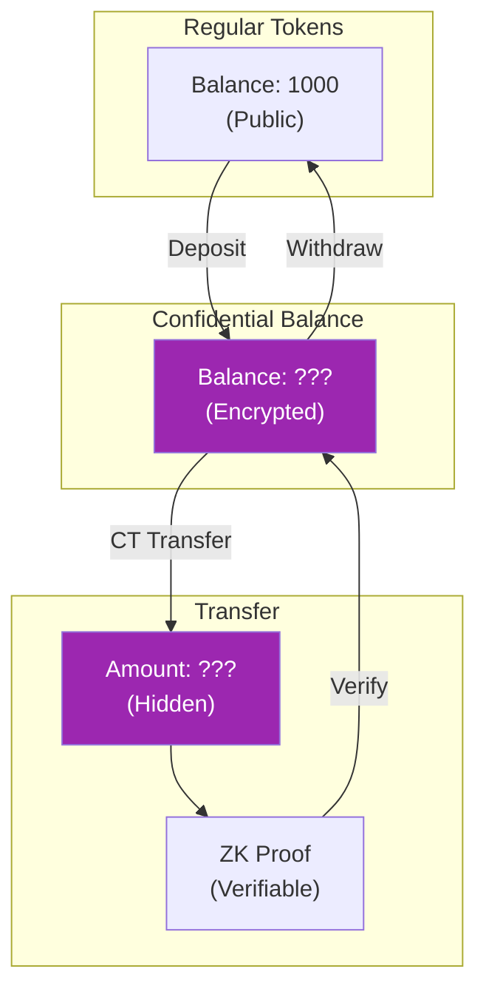
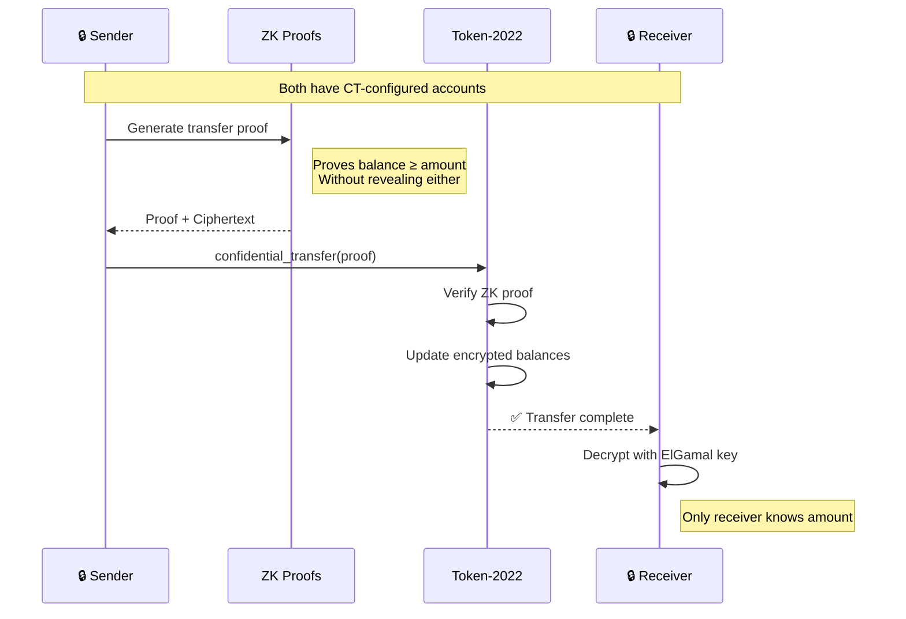
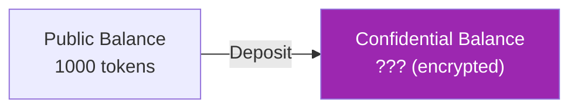
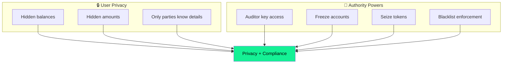
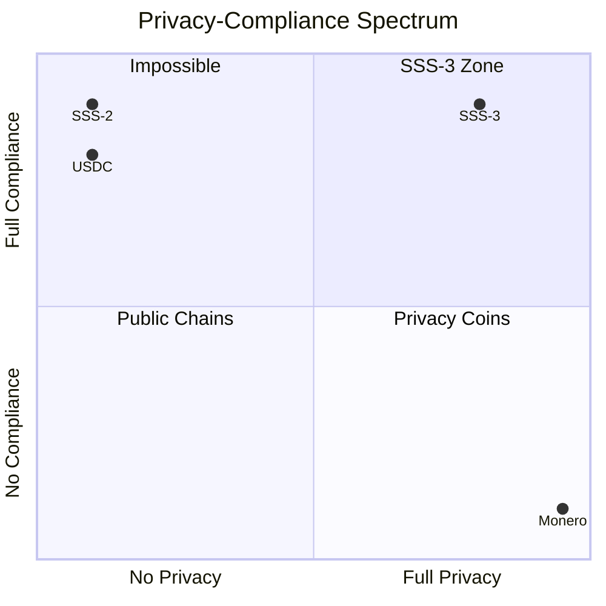

# SSS-3: Privacy Preset

SSS-3 extends SSS-2 with confidential transfers, enabling privacy-preserving transactions while maintaining compliance capabilities.

## Architecture



## Features

| Feature | Included |
|---------|:--------:|
| Mint/Burn | ✅ |
| Freeze/Thaw | ✅ |
| Pause/Unpause | ✅ |
| Metadata | ✅ |
| Permanent Delegate | ✅ |
| Supply Caps | ✅ |
| Transfer Hook | ✅ |
| Blacklist | ✅ |
| Seize | ✅ |
| **Confidential Transfer** | ✅ |

## Token-2022 Extensions



## Use Cases

SSS-3 is ideal for:

- **Privacy-focused stablecoins** - Balance privacy with compliance
- **Institutional trading** - Hide trade sizes from competitors
- **Payroll systems** - Private salary payments
- **Healthcare payments** - HIPAA-compliant transactions

## How Confidential Transfers Work



Confidential transfers use zero-knowledge proofs to:

1. **Hide amounts** - Transfer amounts are encrypted
2. **Prove validity** - ZK proofs ensure balance sufficiency
3. **Maintain compliance** - Authority can still freeze/seize

## Confidential Transfer Flow



## Initialization

```typescript
import { SSSClient, Preset, BackingType, BankingRail } from '@sss/sdk';

const { mint, configPda } = await client.initialize({
  name: 'Private USD',
  symbol: 'PUSD',
  decimals: 6,
  preset: Preset.Sss3,
  supplyCap: 0n,
  backingType: BackingType.Fiat,
  bankingRail: BankingRail.Swift,
  uri: 'https://example.com/metadata.json',
  hookProgramId: TRANSFER_HOOK_PROGRAM_ID,
  // Confidential transfer is enabled automatically
});
```

## Confidential Operations

### Account Setup Flow


### Configure Token Account

```typescript
// Configure account for confidential transfers
await client.configureConfidentialAccount({
  tokenAccount: userAta,
  decryptionKey: userDecryptionKey, // ElGamal key
});
```

### Confidential Deposit



```typescript
// Deposit 1000 tokens into confidential balance
await client.confidentialDeposit({
  amount: 1_000_000_000n,
  tokenAccount: userAta,
});
```

### Confidential Transfer

```typescript
// Transfer confidentially
await client.confidentialTransfer({
  source: senderAta,
  destination: receiverAta,
  amount: 500_000_000n, // Encrypted on-chain
  proof: transferProof,
});
```

### Confidential Withdraw

```typescript
// Withdraw from confidential balance
await client.confidentialWithdraw({
  amount: 200_000_000n,
  tokenAccount: userAta,
  proof: withdrawProof,
});
```

## Compliance with Privacy



### Auditor Access

The stablecoin authority can configure auditor keys:

```typescript
// Authority can view encrypted balances
const balance = await client.decryptBalance({
  tokenAccount: userAta,
  auditorKey: authorityAuditorKey,
});
```

### Blacklist Still Works

```typescript
// Blacklist enforcement works with CT
await client.addToBlacklist({
  address: badActor,
  config: configPda,
});
// CT transfers to/from this address will fail
```

## Performance Considerations

| Operation | Regular CUs | CT CUs | Notes |
|-----------|:-----------:|:------:|-------|
| Transfer | ~50K | ~200K | ZK proof verification |
| Deposit | ~30K | ~100K | Encryption |
| Withdraw | ~30K | ~150K | Proof + decryption |

## Privacy vs Compliance Balance



---

Previous: [SSS-2 Preset](./sss-2) - Full compliance without privacy
  address: badActor,
  config: configPda,
});

// Confidential transfers to/from badActor will fail!
```

### Audit Keys

The authority can configure audit keys:

```typescript
// Set up audit capability
await client.configureAudit({
  auditorKey: auditorElGamalKey,
  config: configPda,
});

// Auditor can now decrypt all balances
```

## Performance Considerations

Confidential transfers are more expensive:

| Operation | CU Cost | Notes |
|-----------|---------|-------|
| Regular transfer | ~50,000 | Standard Token-2022 |
| Confidential transfer | ~500,000+ | ZK proof verification |
| Deposit/Withdraw | ~200,000 | Conversion operations |

:::warning
Confidential transfers may require compute budget increases:
```typescript
const tx = new Transaction()
  .add(ComputeBudgetProgram.setComputeUnitLimit({ units: 1_000_000 }))
  .add(confidentialTransferIx);
```
:::

## Cryptographic Details

### ElGamal Encryption

Balances are encrypted using ElGamal:

```
E(balance) = (g^r, h^r * g^balance)
```

### ZK Proofs

Transfers include proofs for:

1. **Range proof** - Balance ≥ transfer amount
2. **Equality proof** - Debited amount = credited amount
3. **Balance proof** - New balances are valid

### Key Generation

```typescript
import { ElGamal } from '@sss/sdk/crypto';

// Generate encryption key pair
const { publicKey, secretKey } = ElGamal.generate();

// Use publicKey for account configuration
// Store secretKey securely for decryption
```

## Security Considerations

1. **Key management** - Protect ElGamal secret keys
2. **Proof generation** - Compute-intensive, handle errors
3. **Pending balances** - Must be applied before transfers
4. **Authority access** - Plan for auditor key rotation

## Comparison Table

| Aspect | SSS-2 | SSS-3 |
|--------|-------|-------|
| Amount visibility | Public | Encrypted |
| Balance visibility | Public | Encrypted |
| Compliance | Full | Full + Audit keys |
| Transaction cost | Lower | Higher |
| Complexity | Medium | High |

---

Next: [API Reference](../api-reference/instructions.md) - Complete instruction documentation
