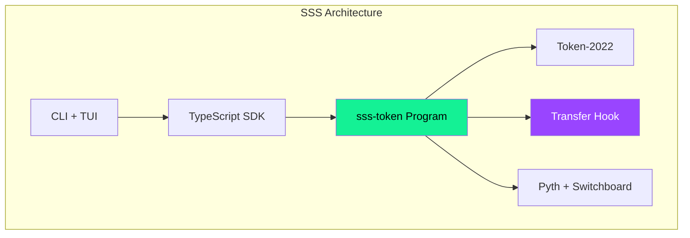
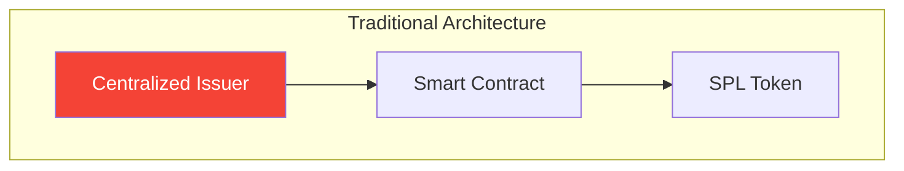
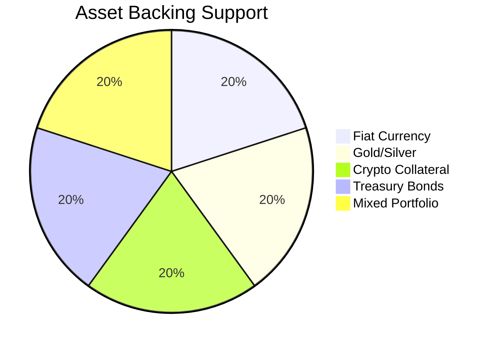
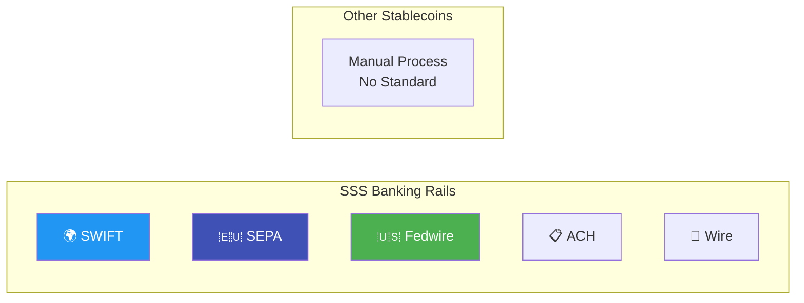
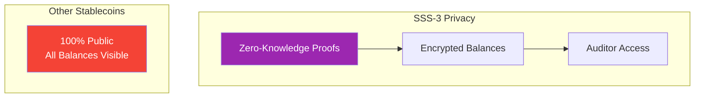
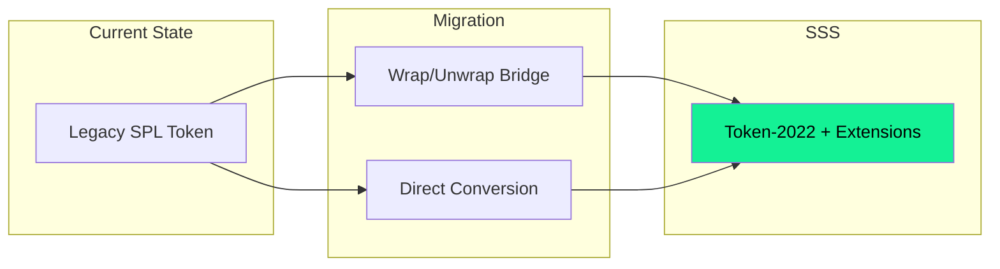
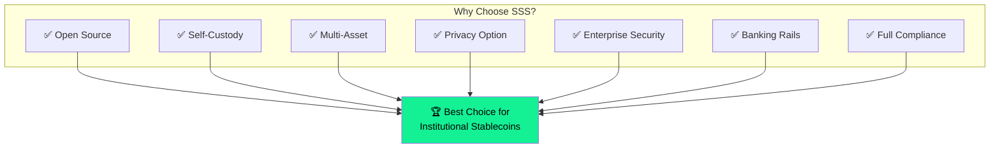

# Competitive Comparison

How does SSS compare to existing stablecoin solutions?

## Feature Comparison Matrix

## Comprehensive Feature Matrix

| Feature | SSS | USDC | USDT | PYUSD | DAI |
|---------|:---:|:----:|:----:|:-----:|:---:|
| **Open Source** | ✅ | ❌ | ❌ | ❌ | ✅ |
| **Self-Custody** | ✅ | ❌ | ❌ | ❌ | ✅ |
| **Token-2022** | ✅ | ⚠️ | ❌ | ⚠️ | ❌ |
| **Confidential Transfers** | ✅ | ❌ | ❌ | ❌ | ❌ |
| **Transfer Hooks** | ✅ | ⚠️ | ❌ | ⚠️ | ❌ |
| **Multi-Asset Backing** | ✅ | ❌ | ❌ | ❌ | ✅ |
| **On-Chain Attestations** | ✅ | ❌ | ❌ | ❌ | ❌ |
| **Custom Banking Rails** | ✅ | ❌ | ❌ | ❌ | ❌ |
| **security_txt!** | ✅ | ❌ | ❌ | ❌ | ❌ |
| **Two-Step Authority** | ✅ | ❓ | ❓ | ❓ | ✅ |
| **Minter Quotas** | ✅ | ❓ | ❓ | ❓ | ✅ |
| **Audit Trail (granted_by)** | ✅ | ❌ | ❌ | ❌ | ❌ |
| **Oracle Integration** | ✅ | ❌ | ❌ | ❌ | ✅ |
| **Oracle Fallback** | ✅ | ❌ | ❌ | ❌ | ⚠️ |

**Legend:** ✅ Full Support | ⚠️ Partial | ❌ Not Available | ❓ Unknown/Private

## Architecture Comparison

### SSS Architecture

### Traditional Stablecoin Architecture

## Unique SSS Features

### 1. Multi-Asset Backing

**Only SSS supports:**
- Gold-backed stablecoins (PAXG-style)
- Treasury bond yield tokens
- Mixed asset portfolios
- On-chain reserve attestations

### 2. Banking Rails Integration

### 3. Confidential Transfers (SSS-3)

### 4. Enterprise Security

| Security Feature | SSS | Others |
|-----------------|:---:|:------:|
| `security_txt!` on-chain | ✅ | ❌ |
| Two-step authority transfer | ✅ | ⚠️ |
| `granted_by` audit field | ✅ | ❌ |
| Epoch-based minter quotas | ✅ | ⚠️ |
| Transfer hook fallback | ✅ | ❌ |

## Use Case Comparison

### Regulated Stablecoin

| Requirement | SSS-2 | USDC |
|-------------|:-----:|:----:|
| Blacklist enforcement | ✅ Automatic via hook | ⚠️ Manual |
| Seizure capability | ✅ Permanent delegate | ⚠️ Admin-only |
| Audit trail | ✅ On-chain | ❌ Off-chain |
| Custom compliance | ✅ Configurable | ❌ Fixed |

### Privacy-Preserving

| Requirement | SSS-3 | All Others |
|-------------|:-----:|:----------:|
| Hidden balances | ✅ | ❌ |
| Hidden transfer amounts | ✅ | ❌ |
| Compliance compatible | ✅ | N/A |
| Auditor access | ✅ | N/A |

### Multi-Asset Backing

| Requirement | SSS | DAI | Others |
|-------------|:---:|:---:|:------:|
| Fiat backing | ✅ | ❌ | ✅ |
| Crypto collateral | ✅ | ✅ | ❌ |
| Gold backing | ✅ | ❌ | ❌ |
| Treasury bonds | ✅ | ❌ | ❌ |
| Mixed portfolio | ✅ | ⚠️ | ❌ |

## Technical Comparison

### Token Standard

| Aspect | SSS | USDC/USDT |
|--------|-----|-----------|
| **Standard** | Token-2022 | SPL Token (legacy) |
| **Extensions** | Full support | Limited |
| **Transfer Hooks** | Native | Not available |
| **Metadata** | On-chain | Off-chain |
| **Confidential** | Supported | Not possible |

### Program Architecture

| Aspect | SSS | Typical Stablecoin |
|--------|-----|-------------------|
| **Programs** | 2 (token + hook) | 1 |
| **Modularity** | High | Low |
| **Upgradability** | Configurable | Fixed |
| **Extensions** | Plugin system | Monolithic |

## Migration Path

### From USDC/USDT

### Benefits of Migration

1. **Enhanced Compliance** - Automatic blacklist enforcement
2. **Privacy Option** - Confidential transfers available
3. **Better Auditing** - On-chain audit trails
4. **Modern Standard** - Token-2022 extensions
5. **Custom Logic** - Transfer hooks for business rules

## Conclusion

SSS provides the most comprehensive stablecoin framework available:

## Next Steps

- [Getting Started](../getting-started/quickstart) - Build your first stablecoin
- [Presets](../presets/sss-1) - Choose the right configuration
- [Architecture](../core-concepts/architecture) - Deep dive into design
