# Visual Diagrams Library

This page contains all visual diagrams for the Solana Stablecoin Standard, providing a comprehensive reference for system architecture, flows, and state machines.

## 📐 System Architecture

### High-Level Overview

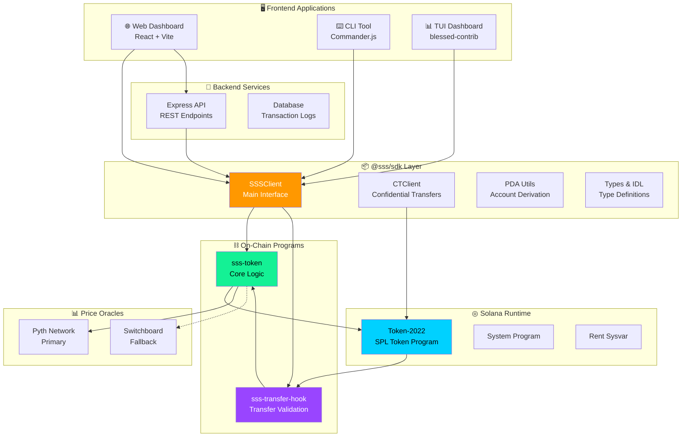
```mermaid
flowchart TB
    subgraph Frontend["🖥️ Frontend Applications"]
        WEB["🌐 Web Dashboard<br/>React + Vite"]
        CLI["⌨️ CLI Tool<br/>Commander.js"]
        TUI["📊 TUI Dashboard<br/>blessed-contrib"]
    end

    subgraph SDK["📦 @sss/sdk Layer"]
        CLIENT["SSSClient<br/>Main Interface"]
        CT["CTClient<br/>Confidential Transfers"]
        PDA["PDA Utils<br/>Account Derivation"]
        TYPES["Types & IDL<br/>Type Definitions"]
    end

    subgraph Backend["🔧 Backend Services"]
        API["Express API<br/>REST Endpoints"]
        DB["Database<br/>Transaction Logs"]
    end

    subgraph Programs["⛓️ On-Chain Programs"]
        TOKEN["sss-token<br/>Core Logic"]
        HOOK["sss-transfer-hook<br/>Transfer Validation"]
    end

    subgraph Solana["◎ Solana Runtime"]
        T22["Token-2022<br/>SPL Token Program"]
        SYS["System Program"]
        RENT["Rent Sysvar"]
    end

    subgraph Oracle["📊 Price Oracles"]
        PYTH["Pyth Network<br/>Primary"]
        SWITCH["Switchboard<br/>Fallback"]
    end

    WEB --> CLIENT
    CLI --> CLIENT
    TUI --> CLIENT
    WEB --> API
    API --> CLIENT
    CLIENT --> TOKEN
    CLIENT --> HOOK
    CT --> T22
    TOKEN --> T22
    TOKEN --> PYTH
    TOKEN -.-> SWITCH
    HOOK --> TOKEN
    T22 --> HOOK

    style TOKEN fill:#14F195,color:#000
    style HOOK fill:#9945FF,color:#fff
    style T22 fill:#00D1FF,color:#000
    style CLIENT fill:#FF9800,color:#fff
```

### Component Interaction

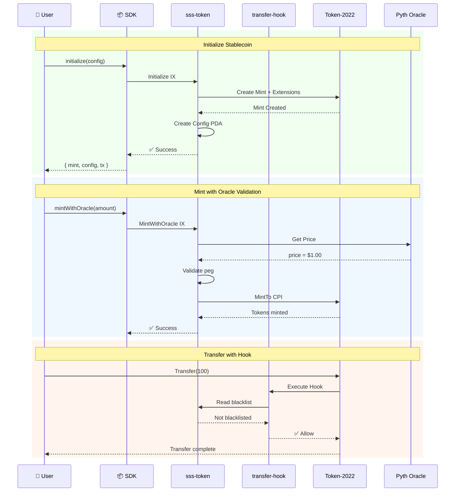
```mermaid
sequenceDiagram
    participant User as 👤 User
    participant SDK as 📦 SDK
    participant Token as sss-token
    participant Hook as transfer-hook
    participant T22 as Token-2022
    participant Pyth as Pyth Oracle

    rect rgb(240, 255, 240)
        Note over User,Pyth: Initialize Stablecoin
        User->>SDK: initialize(config)
        SDK->>Token: Initialize IX
        Token->>T22: Create Mint + Extensions
        T22-->>Token: Mint Created
        Token->>Token: Create Config PDA
        Token-->>SDK: ✅ Success
        SDK-->>User: { mint, config, tx }
    end

    rect rgb(240, 248, 255)
        Note over User,Pyth: Mint with Oracle Validation
        User->>SDK: mintWithOracle(amount)
        SDK->>Token: MintWithOracle IX
        Token->>Pyth: Get Price
        Pyth-->>Token: price = $1.00
        Token->>Token: Validate peg
        Token->>T22: MintTo CPI
        T22-->>Token: Tokens minted
        Token-->>SDK: ✅ Success
    end

    rect rgb(255, 245, 238)
        Note over User,Pyth: Transfer with Hook
        User->>T22: Transfer(100)
        T22->>Hook: Execute Hook
        Hook->>Token: Read blacklist
        Token-->>Hook: Not blacklisted
        Hook-->>T22: ✅ Allow
        T22-->>User: Transfer complete
    end
```

---

## 🔄 Token Lifecycle

### Complete State Machine

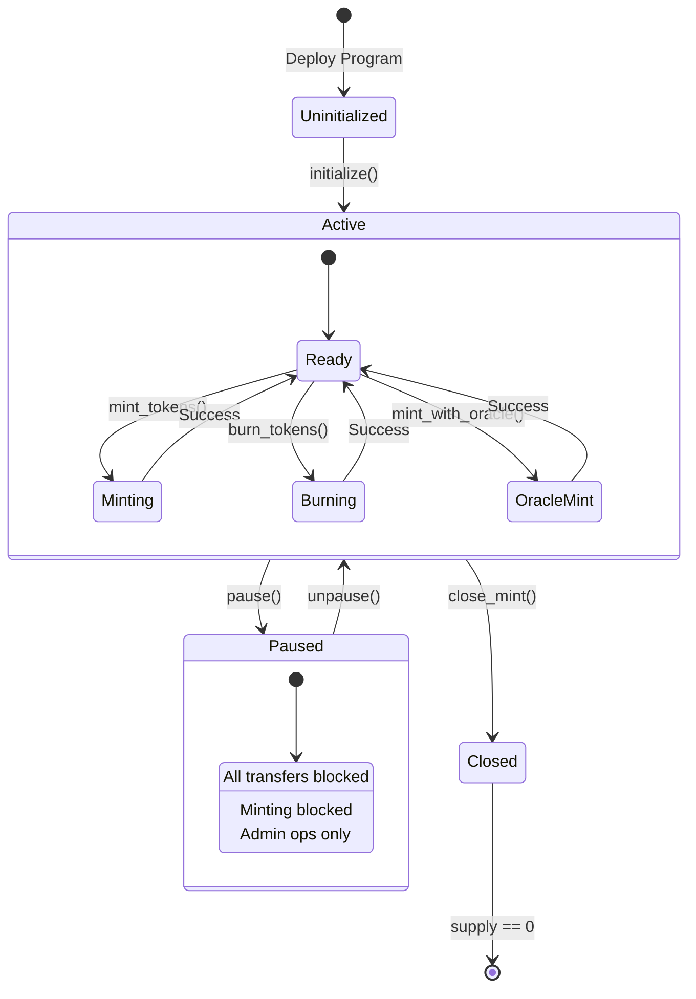
```mermaid
stateDiagram-v2
    [*] --> Uninitialized: Deploy Program
    
    Uninitialized --> Active: initialize()
    
    state Active {
        [*] --> Ready
        Ready --> Minting: mint_tokens()
        Minting --> Ready: Success
        Ready --> Burning: burn_tokens()
        Burning --> Ready: Success
        Ready --> OracleMint: mint_with_oracle()
        OracleMint --> Ready: Success
    }
    
    Active --> Paused: pause()
    Paused --> Active: unpause()
    
    state Paused {
        [*] --> Frozen
        Frozen: All transfers blocked
        Frozen: Minting blocked
        Frozen: Admin ops only
    }
    
    Active --> Closed: close_mint()
    Closed --> [*]: supply == 0
```

### Mint Flow

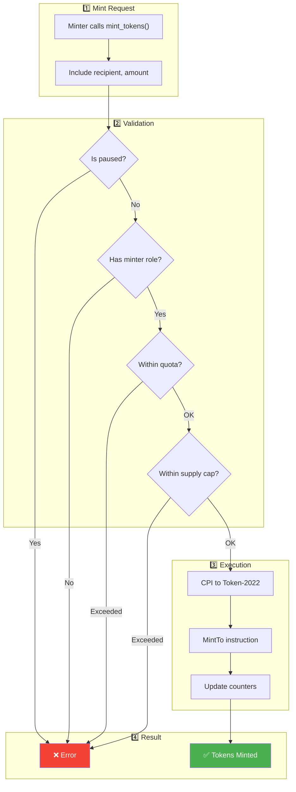
```mermaid
flowchart TB
    subgraph Request["1️⃣ Mint Request"]
        R1["Minter calls mint_tokens()"]
        R2["Include recipient, amount"]
    end

    subgraph Validation["2️⃣ Validation"]
        V1{"Is paused?"}
        V2{"Has minter role?"}
        V3{"Within quota?"}
        V4{"Within supply cap?"}
    end

    subgraph Execution["3️⃣ Execution"]
        E1["CPI to Token-2022"]
        E2["MintTo instruction"]
        E3["Update counters"]
    end

    subgraph Result["4️⃣ Result"]
        S["✅ Tokens Minted"]
        F["❌ Error"]
    end

    R1 --> R2 --> V1
    V1 -->|Yes| F
    V1 -->|No| V2
    V2 -->|No| F
    V2 -->|Yes| V3
    V3 -->|Exceeded| F
    V3 -->|OK| V4
    V4 -->|Exceeded| F
    V4 -->|OK| E1
    E1 --> E2 --> E3 --> S

    style S fill:#4CAF50,color:#fff
    style F fill:#f44336,color:#fff
```

### Burn Flow

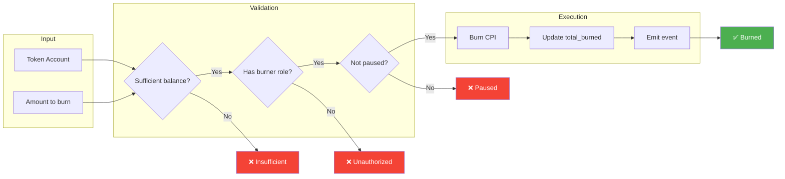
```mermaid
flowchart LR
    subgraph Input["Input"]
        I1["Token Account"]
        I2["Amount to burn"]
    end

    subgraph Checks["Validation"]
        C1{"Sufficient balance?"}
        C2{"Has burner role?"}
        C3{"Not paused?"}
    end

    subgraph Execute["Execution"]
        E1["Burn CPI"]
        E2["Update total_burned"]
        E3["Emit event"]
    end

    I1 --> C1
    I2 --> C1
    C1 -->|No| FAIL["❌ Insufficient"]
    C1 -->|Yes| C2
    C2 -->|No| FAIL2["❌ Unauthorized"]
    C2 -->|Yes| C3
    C3 -->|No| FAIL3["❌ Paused"]
    C3 -->|Yes| E1 --> E2 --> E3 --> OK["✅ Burned"]

    style OK fill:#4CAF50,color:#fff
    style FAIL fill:#f44336,color:#fff
    style FAIL2 fill:#f44336,color:#fff
    style FAIL3 fill:#f44336,color:#fff
```

---

## 👥 Role-Based Access Control

### Role Hierarchy

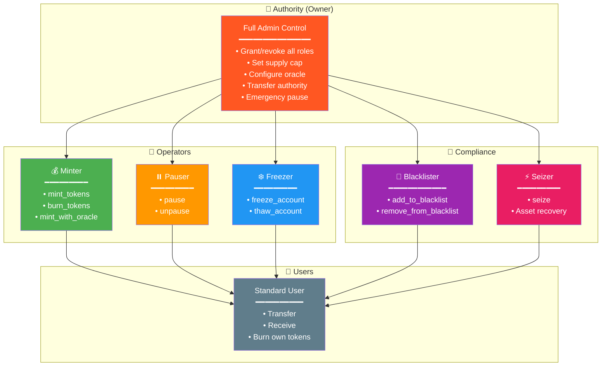
```mermaid
flowchart TB
    subgraph Authority["🔑 Authority (Owner)"]
        AUTH["Full Admin Control<br/>━━━━━━━━━━━━━━━<br/>• Grant/revoke all roles<br/>• Set supply cap<br/>• Configure oracle<br/>• Transfer authority<br/>• Emergency pause"]
    end

    subgraph Operators["👷 Operators"]
        MINTER["💰 Minter<br/>━━━━━━━━━<br/>• mint_tokens<br/>• burn_tokens<br/>• mint_with_oracle"]
        
        PAUSER["⏸️ Pauser<br/>━━━━━━━━━<br/>• pause<br/>• unpause"]
        
        FREEZER["❄️ Freezer<br/>━━━━━━━━━<br/>• freeze_account<br/>• thaw_account"]
    end

    subgraph Compliance["👮 Compliance"]
        BLACKLISTER["🚫 Blacklister<br/>━━━━━━━━━━━━<br/>• add_to_blacklist<br/>• remove_from_blacklist"]
        
        SEIZER["⚡ Seizer<br/>━━━━━━━━━<br/>• seize<br/>• Asset recovery"]
    end

    subgraph Users["👤 Users"]
        USER["Standard User<br/>━━━━━━━━━━<br/>• Transfer<br/>• Receive<br/>• Burn own tokens"]
    end

    AUTH --> MINTER
    AUTH --> PAUSER
    AUTH --> FREEZER
    AUTH --> BLACKLISTER
    AUTH --> SEIZER
    
    MINTER --> USER
    PAUSER --> USER
    FREEZER --> USER
    BLACKLISTER --> USER
    SEIZER --> USER

    style AUTH fill:#FF5722,color:#fff
    style MINTER fill:#4CAF50,color:#fff
    style PAUSER fill:#FF9800,color:#fff
    style FREEZER fill:#2196F3,color:#fff
    style BLACKLISTER fill:#9C27B0,color:#fff
    style SEIZER fill:#E91E63,color:#fff
    style USER fill:#607D8B,color:#fff
```

### Permission Matrix

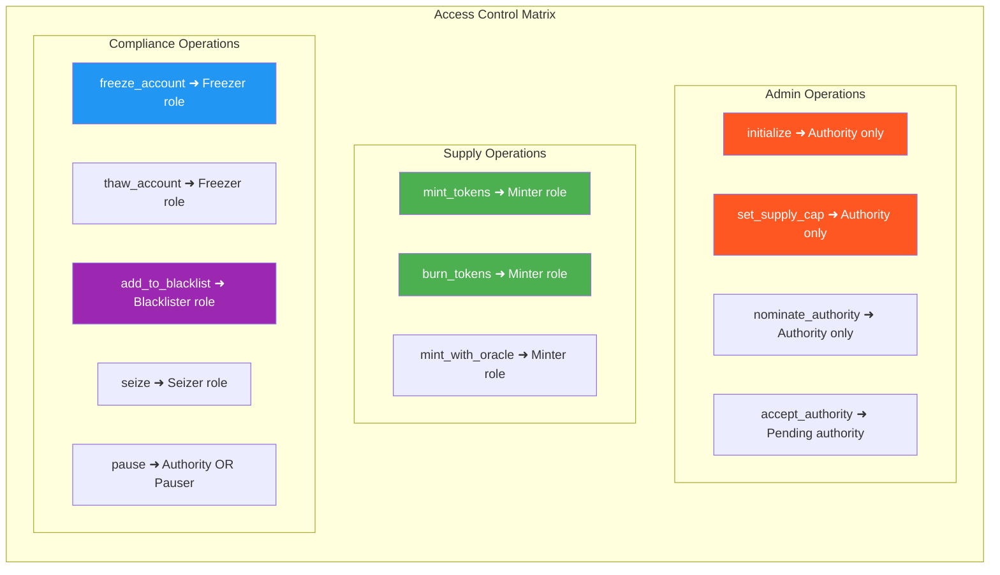
```mermaid
graph TD
    subgraph Matrix["Access Control Matrix"]
        direction TB
        
        subgraph Admin["Admin Operations"]
            A1["initialize ➜ Authority only"]
            A2["set_supply_cap ➜ Authority only"]
            A3["nominate_authority ➜ Authority only"]
            A4["accept_authority ➜ Pending authority"]
        end
        
        subgraph Supply["Supply Operations"]
            S1["mint_tokens ➜ Minter role"]
            S2["burn_tokens ➜ Minter role"]
            S3["mint_with_oracle ➜ Minter role"]
        end
        
        subgraph Compliance2["Compliance Operations"]
            C1["freeze_account ➜ Freezer role"]
            C2["thaw_account ➜ Freezer role"]
            C3["add_to_blacklist ➜ Blacklister role"]
            C4["seize ➜ Seizer role"]
            C5["pause ➜ Authority OR Pauser"]
        end
    end

    style A1 fill:#FF5722,color:#fff
    style A2 fill:#FF5722,color:#fff
    style S1 fill:#4CAF50,color:#fff
    style S2 fill:#4CAF50,color:#fff
    style C1 fill:#2196F3,color:#fff
    style C3 fill:#9C27B0,color:#fff
```

---

## 🔒 Transfer Hook Flow

### Complete Transfer Validation

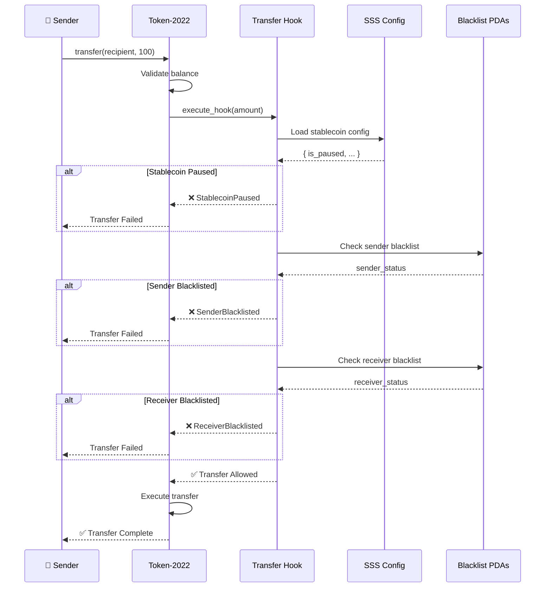
```mermaid
sequenceDiagram
    participant User as 👤 Sender
    participant T22 as Token-2022
    participant Hook as Transfer Hook
    participant Config as SSS Config
    participant BL as Blacklist PDAs

    User->>T22: transfer(recipient, 100)
    T22->>T22: Validate balance
    T22->>Hook: execute_hook(amount)
    
    Hook->>Config: Load stablecoin config
    Config-->>Hook: { is_paused, ... }
    
    alt Stablecoin Paused
        Hook-->>T22: ❌ StablecoinPaused
        T22-->>User: Transfer Failed
    end
    
    Hook->>BL: Check sender blacklist
    BL-->>Hook: sender_status
    
    alt Sender Blacklisted
        Hook-->>T22: ❌ SenderBlacklisted
        T22-->>User: Transfer Failed
    end
    
    Hook->>BL: Check receiver blacklist
    BL-->>Hook: receiver_status
    
    alt Receiver Blacklisted
        Hook-->>T22: ❌ ReceiverBlacklisted
        T22-->>User: Transfer Failed
    end
    
    Hook-->>T22: ✅ Transfer Allowed
    T22->>T22: Execute transfer
    T22-->>User: ✅ Transfer Complete
```

### Hook Decision Tree

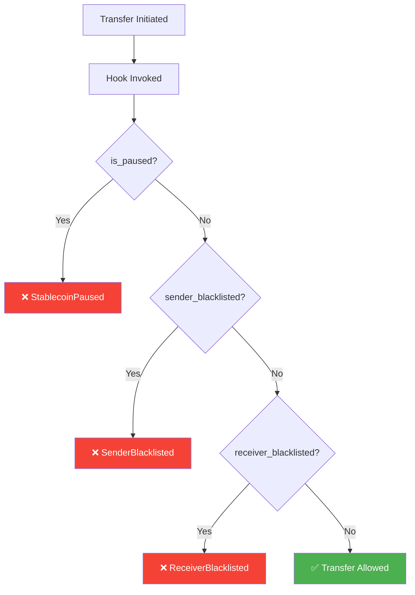
```mermaid
flowchart TB
    START["Transfer Initiated"] --> HOOK["Hook Invoked"]
    
    HOOK --> P{"is_paused?"}
    P -->|Yes| FAIL1["❌ StablecoinPaused"]
    P -->|No| S{"sender_blacklisted?"}
    
    S -->|Yes| FAIL2["❌ SenderBlacklisted"]
    S -->|No| R{"receiver_blacklisted?"}
    
    R -->|Yes| FAIL3["❌ ReceiverBlacklisted"]
    R -->|No| OK["✅ Transfer Allowed"]

    style OK fill:#4CAF50,color:#fff
    style FAIL1 fill:#f44336,color:#fff
    style FAIL2 fill:#f44336,color:#fff
    style FAIL3 fill:#f44336,color:#fff
```

---

## 🏦 Banking Rails Flow

### Mint Request Workflow

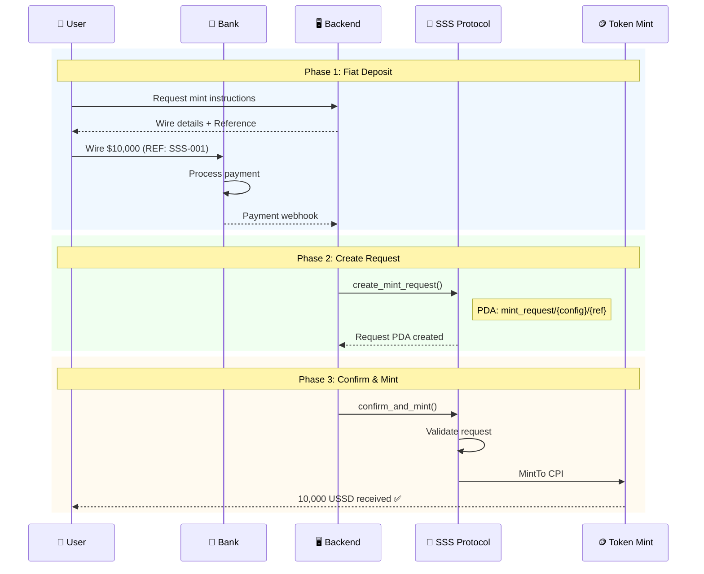
```mermaid
sequenceDiagram
    participant User as 👤 User
    participant Bank as 🏦 Bank
    participant Backend as 🖥️ Backend
    participant SSS as 📜 SSS Protocol
    participant Mint as 🪙 Token Mint

    rect rgb(240, 248, 255)
        Note over User,Mint: Phase 1: Fiat Deposit
        User->>Backend: Request mint instructions
        Backend-->>User: Wire details + Reference
        User->>Bank: Wire $10,000 (REF: SSS-001)
        Bank->>Bank: Process payment
        Bank-->>Backend: Payment webhook
    end

    rect rgb(240, 255, 240)
        Note over User,Mint: Phase 2: Create Request
        Backend->>SSS: create_mint_request()
        Note right of SSS: PDA: mint_request/{config}/{ref}
        SSS-->>Backend: Request PDA created
    end

    rect rgb(255, 250, 240)
        Note over User,Mint: Phase 3: Confirm & Mint
        Backend->>SSS: confirm_and_mint()
        SSS->>SSS: Validate request
        SSS->>Mint: MintTo CPI
        Mint-->>User: 10,000 USSD received ✅
    end
```

### Redemption Workflow

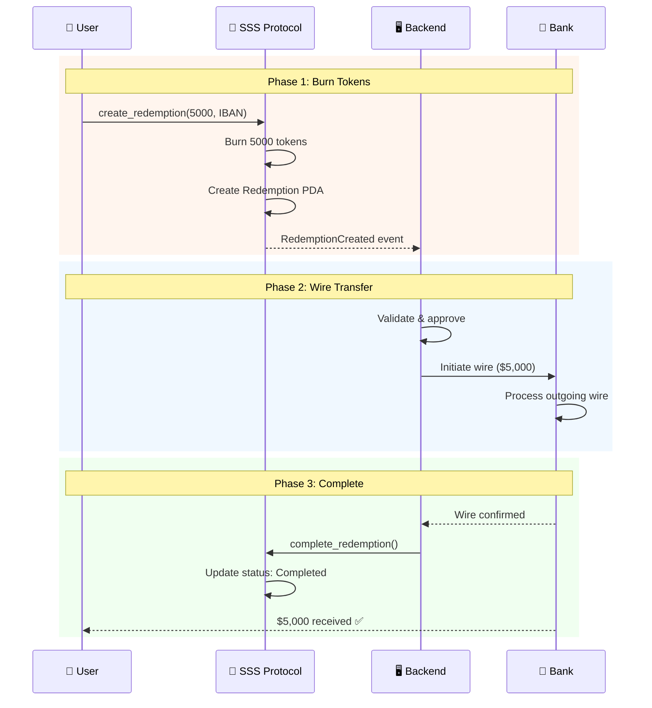
```mermaid
sequenceDiagram
    participant User as 👤 User
    participant SSS as 📜 SSS Protocol
    participant Backend as 🖥️ Backend
    participant Bank as 🏦 Bank

    rect rgb(255, 245, 238)
        Note over User,Bank: Phase 1: Burn Tokens
        User->>SSS: create_redemption(5000, IBAN)
        SSS->>SSS: Burn 5000 tokens
        SSS->>SSS: Create Redemption PDA
        SSS-->>Backend: RedemptionCreated event
    end

    rect rgb(240, 248, 255)
        Note over User,Bank: Phase 2: Wire Transfer
        Backend->>Backend: Validate & approve
        Backend->>Bank: Initiate wire ($5,000)
        Bank->>Bank: Process outgoing wire
    end

    rect rgb(240, 255, 240)
        Note over User,Bank: Phase 3: Complete
        Bank-->>Backend: Wire confirmed
        Backend->>SSS: complete_redemption()
        SSS->>SSS: Update status: Completed
        Bank-->>User: $5,000 received ✅
    end
```

---

## 🔐 Confidential Transfer Flow

### SSS-3 Privacy Flow

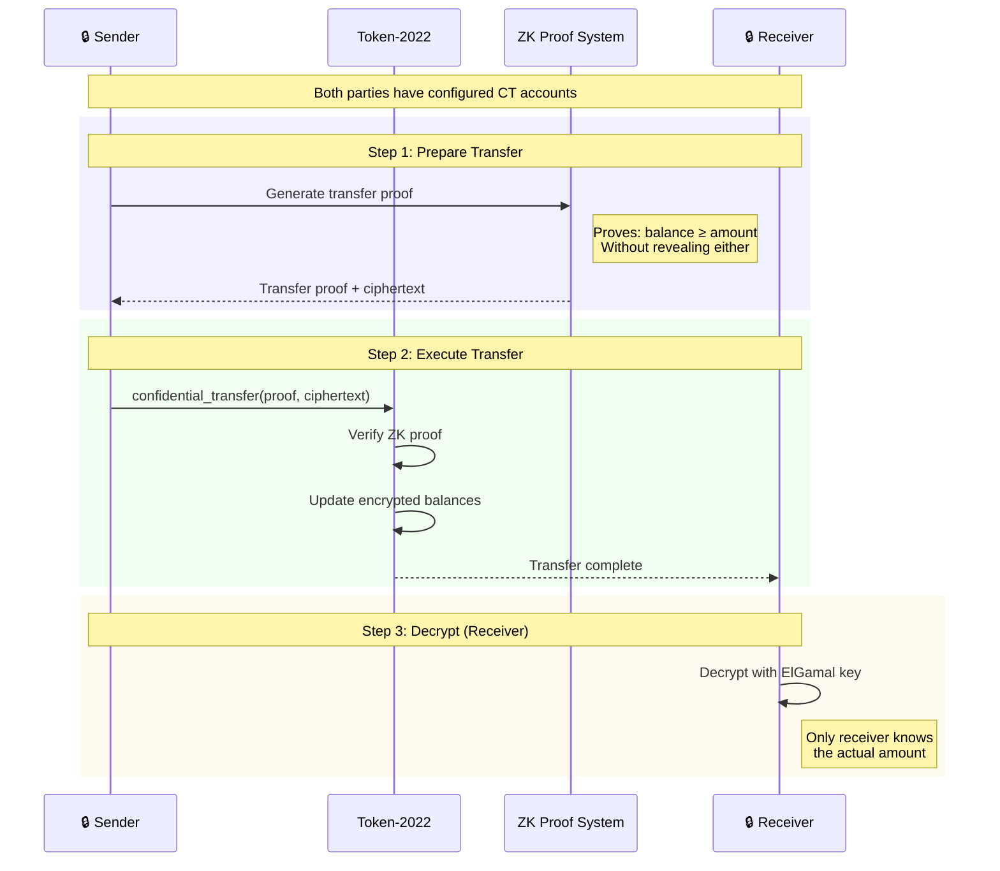
```mermaid
sequenceDiagram
    participant Sender as 🔒 Sender
    participant T22 as Token-2022
    participant ZK as ZK Proof System
    participant Receiver as 🔒 Receiver

    Note over Sender,Receiver: Both parties have configured CT accounts

    rect rgb(240, 240, 255)
        Note over Sender,Receiver: Step 1: Prepare Transfer
        Sender->>ZK: Generate transfer proof
        Note right of ZK: Proves: balance ≥ amount<br/>Without revealing either
        ZK-->>Sender: Transfer proof + ciphertext
    end

    rect rgb(240, 255, 240)
        Note over Sender,Receiver: Step 2: Execute Transfer
        Sender->>T22: confidential_transfer(proof, ciphertext)
        T22->>T22: Verify ZK proof
        T22->>T22: Update encrypted balances
        T22-->>Receiver: Transfer complete
    end

    rect rgb(255, 250, 240)
        Note over Sender,Receiver: Step 3: Decrypt (Receiver)
        Receiver->>Receiver: Decrypt with ElGamal key
        Note right of Receiver: Only receiver knows<br/>the actual amount
    end
```

### CT Account Setup

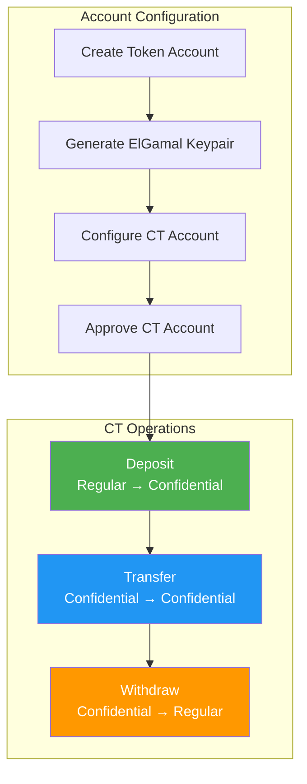
```mermaid
flowchart TB
    subgraph Setup["Account Configuration"]
        A1["Create Token Account"]
        A2["Generate ElGamal Keypair"]
        A3["Configure CT Account"]
        A4["Approve CT Account"]
    end

    subgraph Operations["CT Operations"]
        D["Deposit<br/>Regular → Confidential"]
        T["Transfer<br/>Confidential → Confidential"]
        W["Withdraw<br/>Confidential → Regular"]
    end

    A1 --> A2 --> A3 --> A4
    A4 --> D
    D --> T
    T --> W

    style D fill:#4CAF50,color:#fff
    style T fill:#2196F3,color:#fff
    style W fill:#FF9800,color:#fff
```

---

## 📊 PDA Structure

### Account Derivation Map

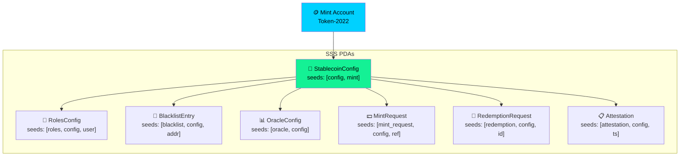
```mermaid
flowchart TB
    MINT["🪙 Mint Account<br/>Token-2022"]
    
    subgraph PDAs["SSS PDAs"]
        CONFIG["📄 StablecoinConfig<br/>seeds: [config, mint]"]
        ROLES["👤 RolesConfig<br/>seeds: [roles, config, user]"]
        BL["🚫 BlacklistEntry<br/>seeds: [blacklist, config, addr]"]
        ORACLE["📊 OracleConfig<br/>seeds: [oracle, config]"]
        MINTREQ["💵 MintRequest<br/>seeds: [mint_request, config, ref]"]
        REDEEM["💸 RedemptionRequest<br/>seeds: [redemption, config, id]"]
        ATTEST["📋 Attestation<br/>seeds: [attestation, config, ts]"]
    end

    MINT --> CONFIG
    CONFIG --> ROLES
    CONFIG --> BL
    CONFIG --> ORACLE
    CONFIG --> MINTREQ
    CONFIG --> REDEEM
    CONFIG --> ATTEST

    style CONFIG fill:#14F195,color:#000
    style MINT fill:#00D1FF,color:#000
```

### Data Flow

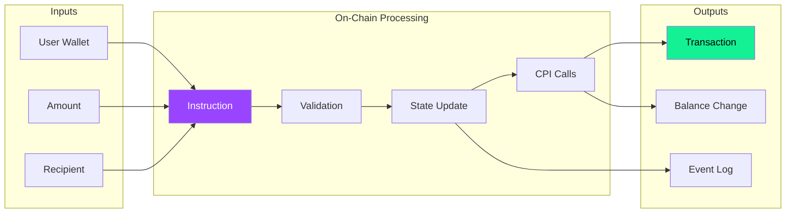
```mermaid
flowchart LR
    subgraph Inputs["Inputs"]
        USER["User Wallet"]
        AMOUNT["Amount"]
        RECIPIENT["Recipient"]
    end

    subgraph Processing["On-Chain Processing"]
        IX["Instruction"]
        VAL["Validation"]
        STATE["State Update"]
        CPI["CPI Calls"]
    end

    subgraph Outputs["Outputs"]
        TX["Transaction"]
        EVENT["Event Log"]
        BALANCE["Balance Change"]
    end

    USER --> IX
    AMOUNT --> IX
    RECIPIENT --> IX
    IX --> VAL --> STATE --> CPI
    CPI --> TX
    STATE --> EVENT
    CPI --> BALANCE

    style IX fill:#9945FF,color:#fff
    style TX fill:#14F195,color:#000
```

---

## 🔄 Two-Step Authority Transfer

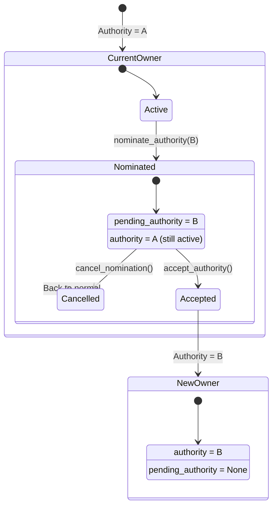
```mermaid
stateDiagram-v2
    [*] --> CurrentOwner: Authority = A

    state CurrentOwner {
        [*] --> Active
        Active --> Nominated: nominate_authority(B)
    }

    state Nominated {
        [*] --> Pending
        Pending: pending_authority = B
        Pending: authority = A (still active)
        Pending --> Cancelled: cancel_nomination()
        Pending --> Accepted: accept_authority()
    }

    Cancelled --> CurrentOwner: Back to normal
    Accepted --> NewOwner: Authority = B

    state NewOwner {
        [*] --> TransferComplete
        TransferComplete: authority = B
        TransferComplete: pending_authority = None
    }
```

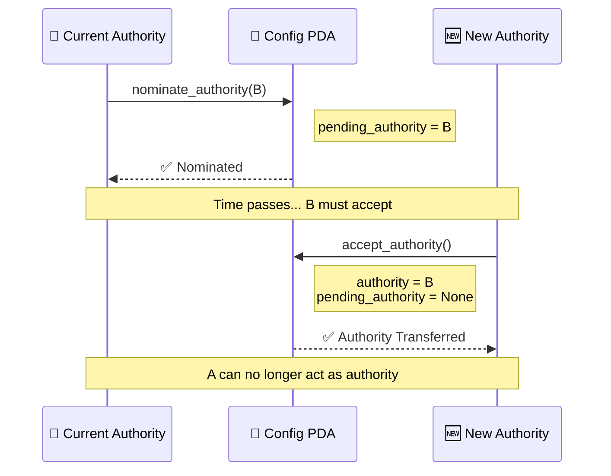
```mermaid
sequenceDiagram
    participant A as 🔑 Current Authority
    participant Config as 📄 Config PDA
    participant B as 🆕 New Authority

    A->>Config: nominate_authority(B)
    Note right of Config: pending_authority = B
    Config-->>A: ✅ Nominated

    Note over A,B: Time passes... B must accept

    B->>Config: accept_authority()
    Note right of Config: authority = B<br/>pending_authority = None
    Config-->>B: ✅ Authority Transferred

    Note over A,B: A can no longer act as authority
```

---

## 📈 Oracle Integration

### Price Validation Flow

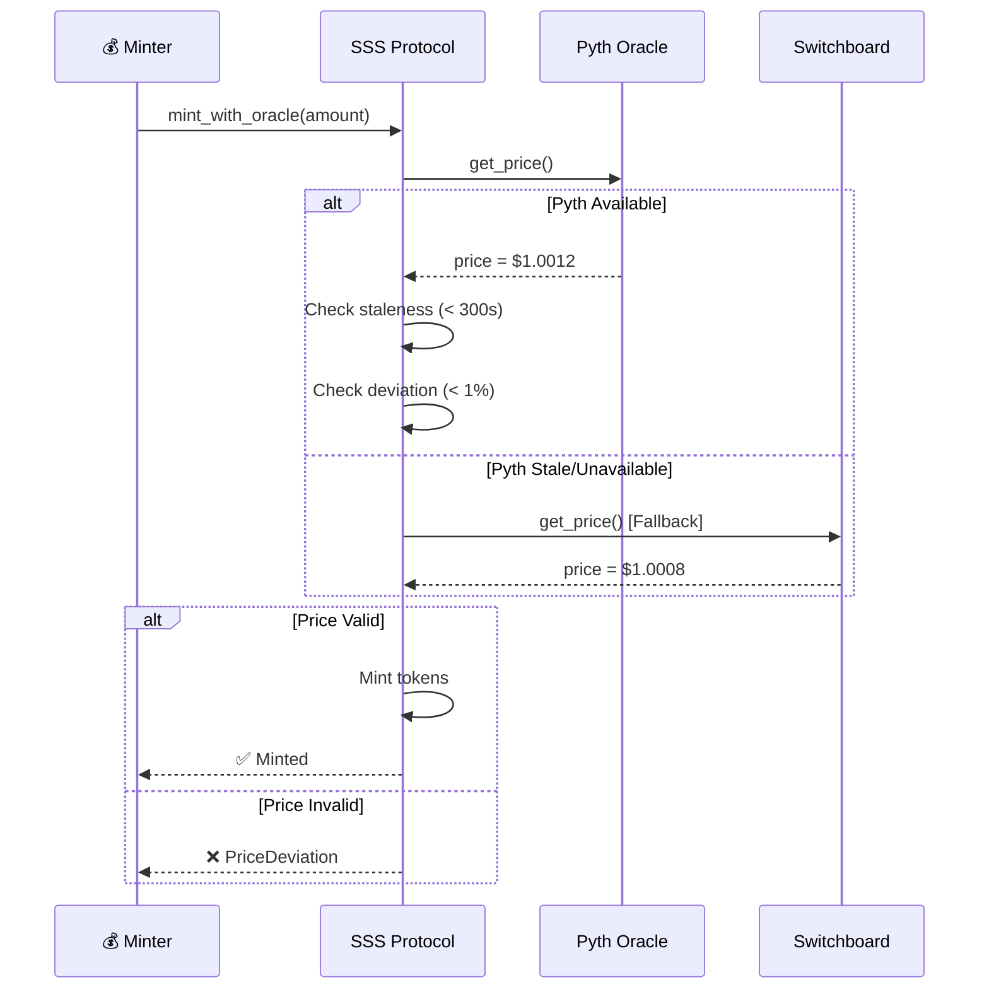
```mermaid
sequenceDiagram
    participant Minter as 💰 Minter
    participant SSS as SSS Protocol
    participant Pyth as Pyth Oracle
    participant Switch as Switchboard

    Minter->>SSS: mint_with_oracle(amount)
    
    SSS->>Pyth: get_price()
    
    alt Pyth Available
        Pyth-->>SSS: price = $1.0012
        SSS->>SSS: Check staleness (< 300s)
        SSS->>SSS: Check deviation (< 1%)
    else Pyth Stale/Unavailable
        SSS->>Switch: get_price() [Fallback]
        Switch-->>SSS: price = $1.0008
    end
    
    alt Price Valid
        SSS->>SSS: Mint tokens
        SSS-->>Minter: ✅ Minted
    else Price Invalid
        SSS-->>Minter: ❌ PriceDeviation
    end
```

### Oracle Configuration

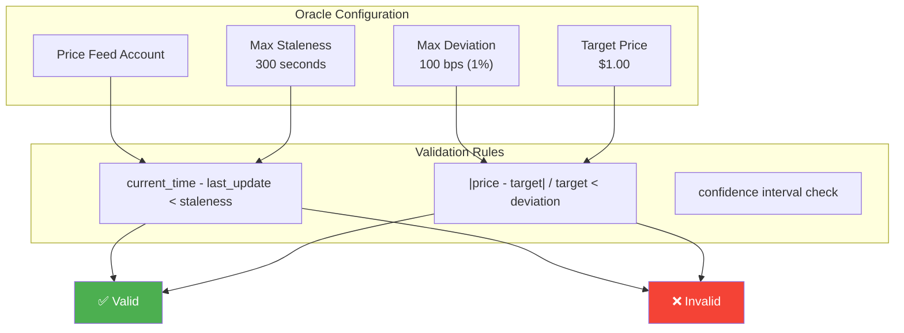
```mermaid
flowchart TB
    subgraph OracleSetup["Oracle Configuration"]
        FEED["Price Feed Account"]
        STALE["Max Staleness<br/>300 seconds"]
        DEV["Max Deviation<br/>100 bps (1%)"]
        TARGET["Target Price<br/>$1.00"]
    end

    subgraph Validation["Validation Rules"]
        R1["current_time - last_update < staleness"]
        R2["|price - target| / target < deviation"]
        R3["confidence interval check"]
    end

    FEED --> R1
    STALE --> R1
    DEV --> R2
    TARGET --> R2
    
    R1 --> VALID["✅ Valid"]
    R2 --> VALID
    R1 --> INVALID["❌ Invalid"]
    R2 --> INVALID

    style VALID fill:#4CAF50,color:#fff
    style INVALID fill:#f44336,color:#fff
```

---

## Next Steps

- [Architecture](../core-concepts/architecture) - Detailed system design
- [SDK Guide](../api-reference/sdk-guide) - Implementation examples
- [Presets](../presets/sss-1) - Configuration options
