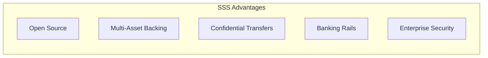
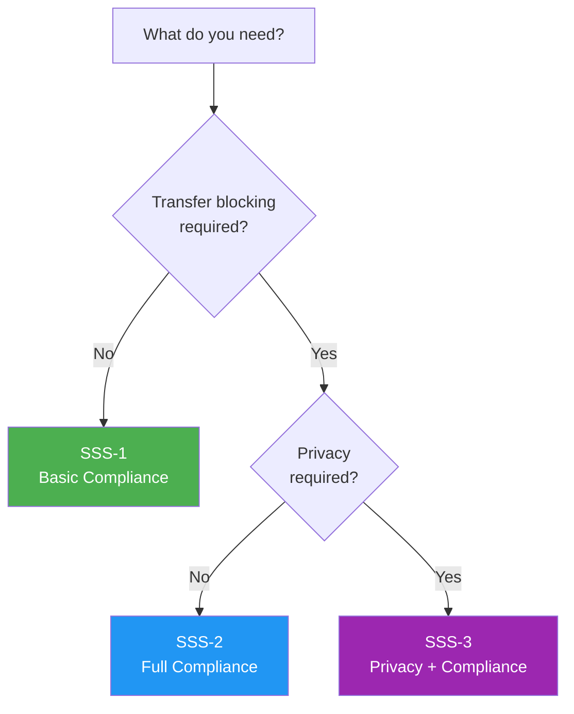
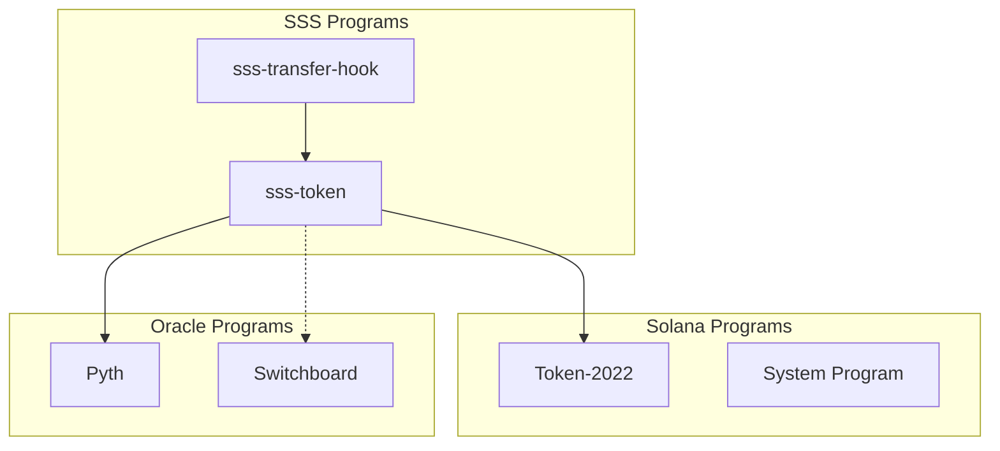
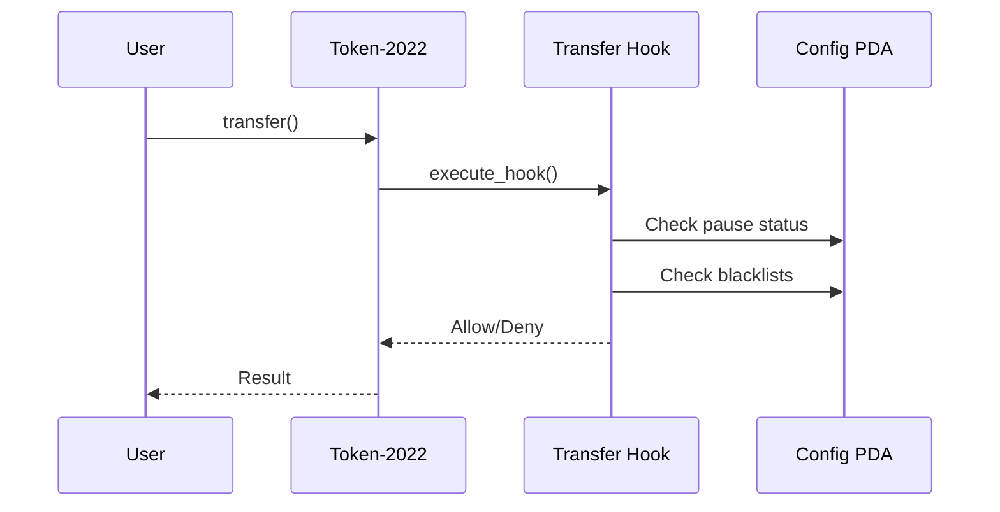
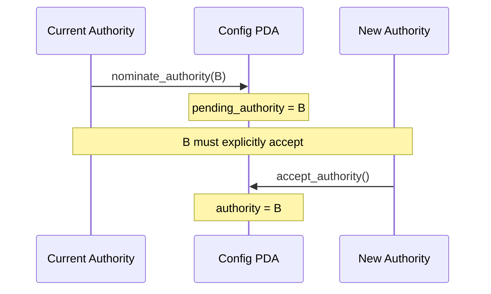
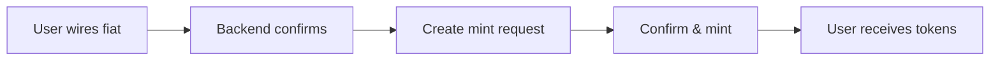
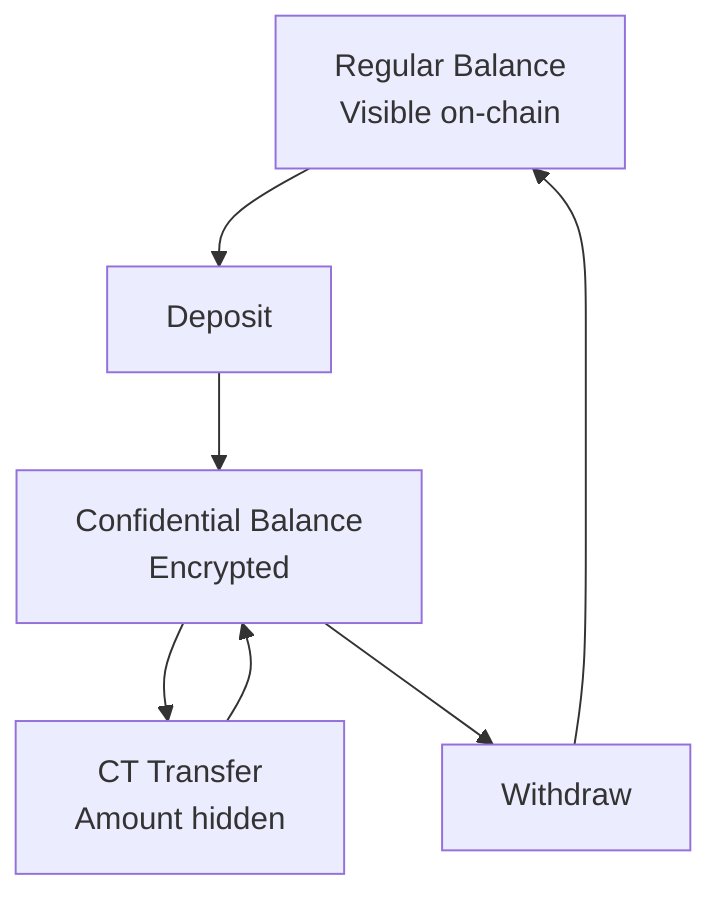

# Frequently Asked Questions

Common questions about the Solana Stablecoin Standard.

## General

### What is SSS?

SSS (Solana Stablecoin Standard) is an open-source framework for building regulated, institutional-grade stablecoins on Solana using Token-2022.

### Why use SSS instead of existing stablecoins?

SSS provides capabilities not available in existing stablecoins:



- **Open Source**: Full code transparency and auditability
- **Self-Custody**: You control your stablecoin, not a third party
- **Multi-Asset**: Support for gold, silver, bonds, not just fiat
- **Privacy**: Optional confidential transfers (SSS-3)
- **Compliance**: Built-in regulatory features

### Is SSS production-ready?

Yes! SSS includes:
- 332+ test cases
- Comprehensive documentation
- Devnet deployment
- Multiple auditable presets

## Presets

### Which preset should I choose?



| Use Case | Recommended Preset |
|----------|-------------------|
| Internal tokens | SSS-1 |
| Regulated stablecoin | SSS-2 |
| Private payments | SSS-3 |
| Commodity-backed | SSS-2 |
| Institutional trading | SSS-3 |

### Can I upgrade from SSS-1 to SSS-2?

No, presets are set at initialization and cannot be changed. This is because:
- Token-2022 extensions are immutable after creation
- Transfer hooks must be configured at mint creation
- Security model depends on preset choice

If you need to upgrade, create a new stablecoin and migrate balances.

### What's the difference between freeze and blacklist?

| Feature | Freeze | Blacklist |
|---------|--------|-----------|
| **Scope** | Single account | Address globally |
| **Sends** | ❌ Blocked | ❌ Blocked |
| **Receives** | ✅ Allowed | ❌ Blocked |
| **Preset** | All presets | SSS-2, SSS-3 |
| **Mechanism** | Token-2022 | Transfer hook |

## Technical

### What Solana programs does SSS use?



### How are PDAs derived?

| PDA | Seeds |
|-----|-------|
| Config | `["config", mint]` |
| Roles | `["roles", config, user]` |
| Blacklist | `["blacklist", config, address]` |
| Oracle | `["oracle", config]` |

### What Token-2022 extensions are used?

| Extension | SSS-1 | SSS-2 | SSS-3 |
|-----------|:-----:|:-----:|:-----:|
| MetadataPointer | ✅ | ✅ | ✅ |
| MintCloseAuthority | ✅ | ✅ | ✅ |
| PermanentDelegate | ✅ | ✅ | ✅ |
| TransferHook | ❌ | ✅ | ✅ |
| ConfidentialTransferMint | ❌ | ❌ | ✅ |

### How does the transfer hook work?



## Security

### What is `security_txt!`?

A Rust macro that embeds security contact information directly on-chain:

```rust
security_txt! {
    name: "SSS",
    contacts: "email:security@example.com",
    policy: "https://example.com/security"
}
```

This helps security researchers report vulnerabilities responsibly.

### How does two-step authority transfer work?



This prevents accidental or malicious authority transfers.

### What are minter quotas?

Daily limits on how much each minter can mint:

```typescript
await client.updateMinterConfig({
  minter: minterPubkey,
  quota: 1_000_000_000000n,  // 1M tokens per day
  epochDuration: 86400,       // 24 hours
});
```

Quotas automatically reset each epoch.

## Operations

### How do I pause the stablecoin?

```typescript
// Emergency pause
await client.pause({ config: configPda });

// Resume when safe
await client.unpause({ config: configPda });
```

Only Authority or Pauser role can pause.

### How do I add someone to the blacklist?

```typescript
await client.addToBlacklist({
  address: badActorPubkey,
  reason: 'Sanctions violation',
  config: configPda,
});
```

### How do I seize tokens?

First blacklist the address, then seize:

```typescript
// 1. Blacklist
await client.addToBlacklist({
  address: targetAddress,
  config: configPda,
});

// 2. Seize
await client.seize({
  address: targetAddress,
  amount: 1_000_000_000n,
  config: configPda,
});
```

## Banking

### What banking rails are supported?

| Rail | Network | Settlement |
|------|---------|------------|
| SWIFT | Global | 1-5 days |
| SEPA | Europe | 1-2 days |
| Fedwire | USA | Same day |
| Wire | Regional | 1-3 days |
| ACH | USA | 2-3 days |

### How do mint requests work?



## Privacy (SSS-3)

### How do confidential transfers work?

Amounts are encrypted using ElGamal encryption and verified via zero-knowledge proofs:



### Can authority see confidential balances?

Yes, the stablecoin authority can configure auditor keys to view encrypted balances for compliance purposes.

### What's the performance impact of CT?

Confidential transfers require more compute units due to ZK proof verification:

| Operation | Regular CUs | CT CUs |
|-----------|-------------|--------|
| Transfer | ~50,000 | ~200,000 |
| Deposit | ~30,000 | ~100,000 |
| Withdraw | ~30,000 | ~150,000 |

## Troubleshooting

### Transaction failed with "QuotaExceeded"

The minter has reached their daily quota. Either:
1. Wait for epoch reset
2. Have authority increase quota

### Transaction failed with "SupplyCapExceeded"

Total supply would exceed the configured cap. Either:
1. Burn tokens to make room
2. Have authority increase supply cap

### Transfer hook failing with "AccountNotFound"

Ensure all required accounts are included:
1. Sender blacklist PDA
2. Receiver blacklist PDA  
3. Config PDA
4. Extra accounts PDAs

## More Questions?

- [GitHub Issues](https://github.com/solanabr/solana-stablecoin-standard/issues)
- [Discord Community](https://discord.gg/solana)
- [Documentation](/)
