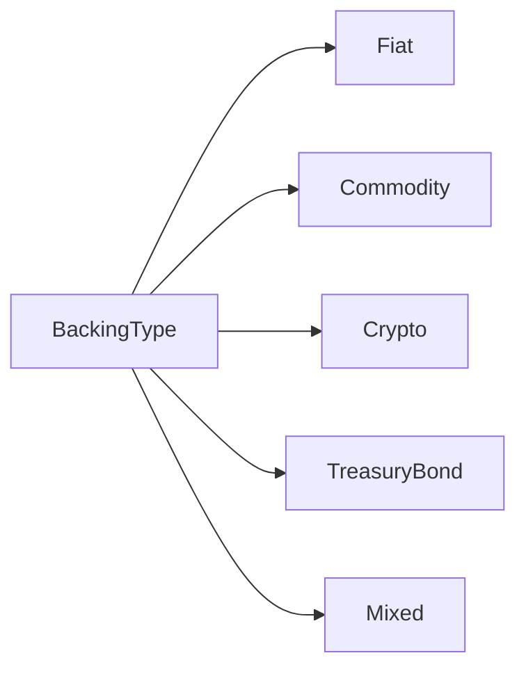
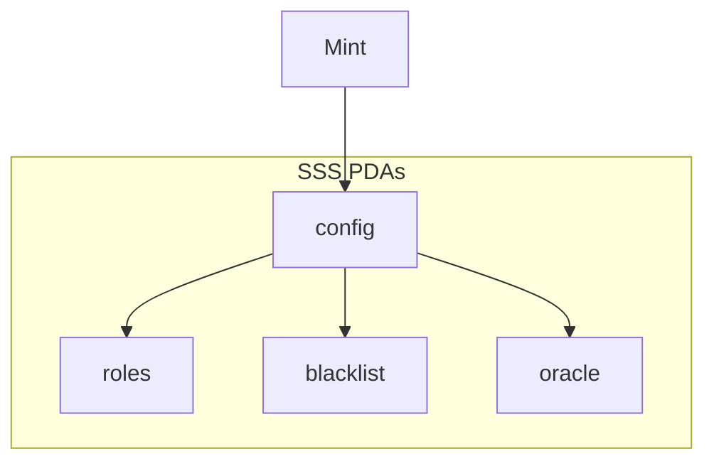

# Glossary

A comprehensive glossary of terms used in the Solana Stablecoin Standard.

## A

### ACH (Automated Clearing House)
A US-based electronic network for financial transactions. Used for batch processing of payments with 2-3 day settlement.

### ATA (Associated Token Account)
A deterministically derived token account for a specific wallet and mint combination. Standard way to hold tokens on Solana.

### Attestation
A signed statement proving the existence and amount of reserve assets backing the stablecoin. Stored on-chain via `submit_attestation`.

### Authority
The primary administrator of a stablecoin with full control over configuration, roles, and emergency functions.

## B

### Backing Type
The type of asset backing a stablecoin. Options: `Fiat`, `Commodity`, `Crypto`, `TreasuryBond`, `Mixed`.

### Banking Rail
The payment network used for fiat on/off ramps. Options: `Swift`, `Sepa`, `Fedwire`, `Wire`, `Ach`, `None`.

### Blacklist
A list of addresses prohibited from sending or receiving tokens. Enforced via transfer hook in SSS-2/SSS-3.

### Burner
A role that can destroy tokens, reducing total supply.

## C

### Confidential Transfer (CT)
A Token-2022 extension enabling encrypted balances and transfer amounts using zero-knowledge proofs. Available in SSS-3.

### CPI (Cross-Program Invocation)
A mechanism for one Solana program to call another. SSS uses CPI to interact with Token-2022.

## D

### Decimals
The number of decimal places for a token. Standard stablecoins use 6 decimals (1 token = 1,000,000 base units).

## E

### ElGamal
A public-key encryption system used for confidential transfers. Users generate ElGamal keypairs for CT accounts.

### Epoch
A time period for minter quota resets. Typically 24 hours.

## F

### Fedwire
The Federal Reserve's real-time gross settlement system for high-value USD transfers within the United States.

### Freeze
The ability to prevent a specific account from transferring tokens. Different from blacklist (which prevents receiving too).

### Freezer
A role that can freeze and thaw individual token accounts.

## G

### `granted_by`
An audit field in RolesConfig that records which authority granted a role. Unique to SSS.

### `granted_at`
An audit field recording the timestamp when a role was granted.

## H

### Hook (Transfer Hook)
Custom logic executed during token transfers. SSS uses hooks for blacklist enforcement and pause checking.

## I

### IDL (Interface Definition Language)
A JSON schema describing an Anchor program's instructions, accounts, and types. Used by the SDK.

## M

### Metadata
On-chain token information including name, symbol, and URI. Stored via MetadataPointer extension.

### Mint
The token mint account that controls token supply and configuration.

### MintCloseAuthority
A Token-2022 extension allowing the mint to be closed when supply reaches zero.

### Minter
A role that can create new tokens up to their quota limit.

### Minter Quota
The maximum amount a minter can mint within a single epoch. Resets automatically.

## O

### Oracle
An external price feed used to validate stablecoin peg. SSS supports Pyth (primary) and Switchboard (fallback).

## P

### Pause
A global emergency stop that prevents all transfers and minting. Can be triggered by Authority or Pauser role.

### Pauser
A role that can pause and unpause the stablecoin.

### PDA (Program Derived Address)
A deterministically generated address owned by a program. SSS uses PDAs for config, roles, blacklist, etc.

### Permanent Delegate
A Token-2022 extension giving authority the ability to transfer or burn tokens from any account. Used for seizure.

### Preset
A predefined configuration for stablecoin features. Options: SSS-1 (basic), SSS-2 (compliant), SSS-3 (private).

### Pyth
A decentralized oracle network providing real-time price feeds. Primary oracle for SSS.

## R

### RBAC (Role-Based Access Control)
The permission system in SSS where users are assigned specific roles with defined capabilities.

### Redemption
The process of burning tokens to receive fiat currency via banking rails.

### Reserve Attestation
See [Attestation](#attestation).

### RolesConfig
The PDA storing role assignments and permissions for a user.

## S

### `security_txt!`
A Rust macro embedding security contact information on-chain. Follows the security.txt standard.

### Seize
The ability to forcibly transfer tokens from a blacklisted account. Used for legal compliance.

### Seizer
A role that can seize tokens from blacklisted accounts.

### SEPA (Single Euro Payments Area)
A European payment network enabling fast, low-cost EUR transfers.

### SSS-1
Basic preset with freeze, pause, and mint/burn. No transfer hooks.

### SSS-2
Full compliance preset with transfer hooks, blacklist, and seizure capabilities.

### SSS-3
Privacy preset extending SSS-2 with confidential transfers.

### Stablecoin
A cryptocurrency designed to maintain a stable value, typically pegged to a fiat currency or asset.

### StablecoinConfig
The main PDA storing all configuration for a stablecoin instance.

### Supply Cap
Maximum total supply that can be minted. 0 = unlimited.

### SWIFT
The global banking network for international wire transfers.

### Switchboard
A decentralized oracle network. Used as fallback when Pyth is unavailable.

## T

### Token-2022
Solana's modern token program with advanced features like transfer hooks, metadata, and confidential transfers.

### Transfer Hook
See [Hook](#hook-transfer-hook).

### Two-Step Authority Transfer
A security pattern requiring nomination and acceptance for authority changes. Prevents accidental transfers.

## Z

### Zero-Knowledge Proof (ZKP)
A cryptographic method to prove a statement is true without revealing underlying data. Used in confidential transfers.

---

## Quick Reference

### Account Types

| Account | Seeds | Purpose |
|---------|-------|---------|
| StablecoinConfig | `[config, mint]` | Main configuration |
| RolesConfig | `[roles, config, user]` | User permissions |
| BlacklistEntry | `[blacklist, config, addr]` | Blocked addresses |
| OracleConfig | `[oracle, config]` | Price feed settings |
| MintRequest | `[mint_request, config, ref]` | Pending mints |
| RedemptionRequest | `[redemption, config, id]` | Pending redemptions |

### Roles

| Role | Permissions |
|------|-------------|
| Authority | All operations |
| Minter | mint, burn |
| Pauser | pause, unpause |
| Freezer | freeze, thaw |
| Blacklister | add/remove blacklist |
| Seizer | seize tokens |

### Presets

| Preset | Hook | Blacklist | CT |
|--------|:----:|:---------:|:--:|
| SSS-1 | ❌ | ❌ | ❌ |
| SSS-2 | ✅ | ✅ | ❌ |
| SSS-3 | ✅ | ✅ | ✅ |
